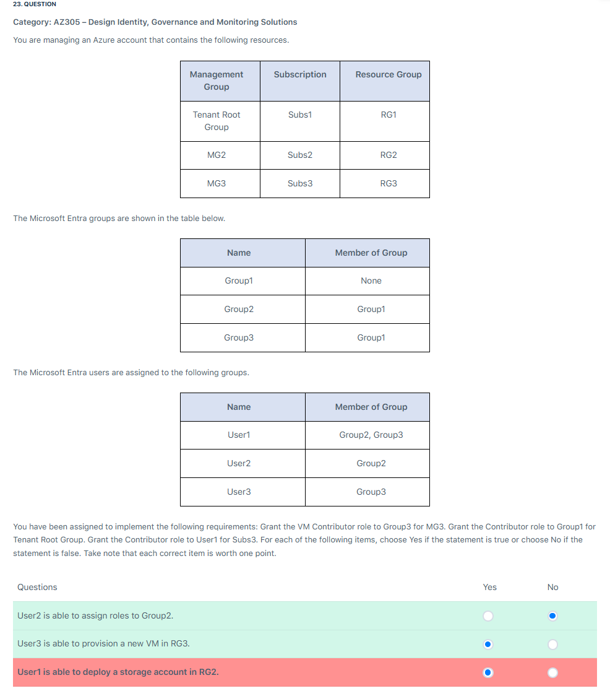

# 📋 Review Mode Set 1

## ⁉️ Q6

  

---

> 👉🏻 **Explanation**
>
> **✅ The Answer:**
>
> - **Provision a standard general-purpose v2 storage account and set the default access tier to cool. Create a blob container, upload the files, and create a lifecycle management policy that will transition the files to the archive tier after one day.**
> - **Provision a standard general-purpose v2 storage account and set the default access tier to hot. Create a blob container and upload the files using AzCopy with the –block-blob-tier set to archive.**
>
> ---
>
> **❌ Why Other Options Are Wrong:**
>
> - **Provision a standard general-purpose v2 storage account and set the default access tier to archive. Create a blob container and upload the files** is incorrect.
>   - You can’t set the default access tier to archive. When creating a storage account, **you can only set the default access tier to `hot` and `cool` tier**.

---

## ⁉️ Q9

  

---

> 👉🏻 **Explanation**
>
> **✅ The Answer:**
>
> - RSA 3072
>
> ---
>
> 📚 **References:**
>
> - <https://learn.microsoft.com/en-us/azure/azure-sql/database/transparent-data-encryption-byok-overview>

---

## ⁉️ Q10

  

---

> 👉🏻 **Explanation**
>
> **✅ The Answer:**
>
> - Azure Service : **Azure SQL Database**
> - Service Tier : **Hyperscale**
>
> ---
>
> **📖 Explanation:**
>
> Let’s discuss the requirements of the scenario:
>
> - Database storage: 84 TB
>
>   - Only Azure SQL Database Hyperscale can support database storage up to 100 TB
>
> - Data retention for at least 10 years
>
>   - The three Azure services satisfy this requirement.
>
> - Data must be backed up to a secondary region
>
>   - The three Azure services satisfy this requirement.
>
> - Minimize database administration effort
>   - Only Azure SQL database and Azure SQL Managed Instance offers fully managed database services provided by Microsoft Azure. This means that Microsoft handles infrastructure management, including patching, backups, high availability, and automated management tasks.

---

## ⁉️ Q15

  

---

> 👉🏻 **Explanation**
>
> **✅ The Answer:**
>
> - **Table Storage with Geo-Redundant Storage (GRS)**

---

## ⁉️ Q16

  

---

> 👉🏻 **Explanation**
>
> **✅ The Answer:**
>
> - **Set up Microsoft Entra entitlement management.**
>
> ---
>
> **📖 Explanation:**
>
> Let’s discuss the requirements of the scenario:
>
> - When developing apps, you can choose whether to make the app single-tenant or multi-tenant during app registration in the Azure portal.
>
>   1. Single-tenant – apps are only available in the tenant in which they were registered, also known their primary tenant.
>
>   2. Multi-tenant – apps are available to users in both the home tenant and other tenants.
>
> - **Microsoft Entra entitlement management** leverages Microsoft Entra business-to-business (B2B) functionality to facilitate access sharing and collaboration with external individuals who are not part of your organization. By utilizing Microsoft Entra B2B, external users can authenticate through their home directory while also having a presence within your directory. This representation in your directory enables you to assign access permissions to these external users, granting them the ability to access your organization’s resources.
>
> ---
>
> 

>   
> 

---

## ⁉️ Q19

  

---

> 👉🏻 **Explanation**
>
> **✅ The Answer:**
>
> - **Enterprise Applications**
> - **Conditional Access**
>
> ---
>
> **📖 Explanation:**
>
> - The Microsoft Entra Enterprise Applications allow you to integrate your on-premises financial application with Microsoft Entra for SAML-based single sign-on (SSO). By configuring your application as an enterprise application in Microsoft Entra, you can enable SAML-based authentication, allowing users to sign in once and access the application without re-entering credentials.
>
> - While Conditional Access policies in Microsoft Entra enable you to define access controls based on specific conditions. You can create a conditional access policy to require multi-factor authentication (MFA) when users attempt to access the application from a different location. This policy enhances security by verifying the user’s identity through multiple factors before granting access.
>
> ---
>
> 

>   
> 

>
> ---
>
> **❌ Why Other Options Are Wrong:**
>
> - **Identity Protection** is incorrect because it is used to detect and respond to identity-based risks. While it can provide additional security measures, it is not specifically focused on implementing SAML-based sign-on or enforcing multi-factor authentication (MFA) for user access to the financial application.
> - **Devices** is incorrect because this is primarily used for device registration and management within Microsoft Entra.
> - **Privileged Identity Management** is incorrect because this is just for managing and monitoring privileged access to Azure resources and Microsoft Entra roles. You cannot use this service to implement SSO or MFA in your application.

---

## ⁉️ Q23

  

---

## ⁉️ Q24

  

---

> 👉🏻 **Explanation**
>
> **✅ The Answer:**
>
> - Authorization Level: **Anonymous**
> - HTTP Methods : **GET**
>
> ---
>
> **📖 Explanation:**
>
> - There are three levels that you can choose from:
>
>   - **anonymous** – no API key is required.
>   - **function** – a function-specific API key is required. This is the default value when a level isn’t specifically set.
>   - **admin** – the master key is required.
>
> - For read-only APIs, the anonymous authorization level is a good choice. This allows anyone to access the API without providing any credentials. The only HTTP method allowed for read-only operations is GET, which is used to retrieve data from the API.

---
