# 📋 Review Mode Set 3

## ⁉️ Q6

  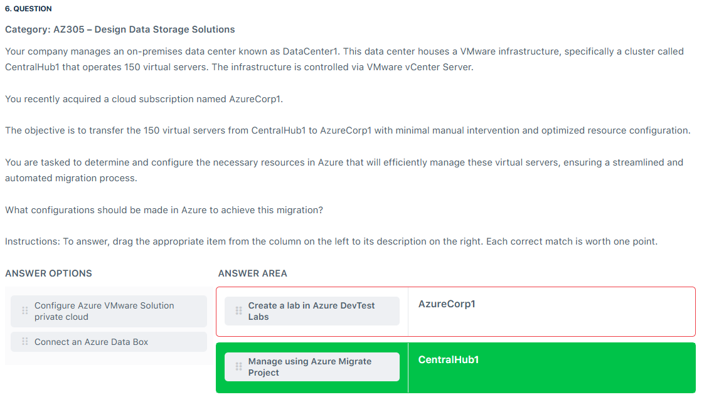

---

> 👉🏻 **Explanation**  
> In the given scenario, where the objective is to transfer 150 virtual servers from an on-premises VMware environment (CentralHub1) to Azure (AzureCorp1) with minimal manual intervention, two key services are essential. Azure VMware Solution Private Cloud allows for a seamless migration of VMware workloads to Azure while maintaining the same environment and management tools. This reduces the need for rearchitecting applications and ensures continuity in operations. On the other hand, Azure Migrate Project helps plan and assess the migration process, providing tools for evaluating workload readiness and creating detailed migration plans. Together, these services streamline migration, reduce risks, and optimize resource configuration, ensuring an efficient transition from CentralHub1 to AzureCorp1.
>
> 

>   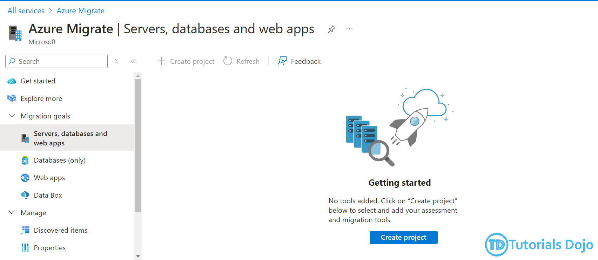
> 

---

## ⁉️ Q14

  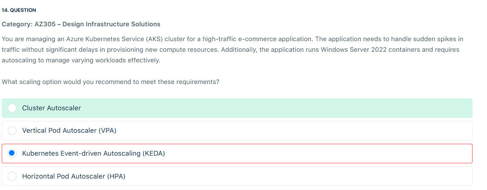

---

> 👉🏻 **Explanation**
>
> **✅ The Answer:**
>
> - **Cluster Autoscaler**
>
> ---
>
> **📖 Explanation:**
>
> - Cluster Autoscaler in Azure Kubernetes Service (AKS) is a feature that automatically adjusts the number of nodes in your AKS cluster based on the current demands of your workloads. When the application experiences increased traffic or workload spikes, the Cluster Autoscaler adds nodes to ensure enough compute resources are available to handle the additional load. Conversely, unnecessary nodes are removed when the demand decreases to optimize resource usage and reduce costs. This dynamic scaling capability makes the Cluster Autoscaler ideal for high-traffic applications that need to respond quickly to changing workloads without manual intervention.
> - In addition to its core functionality, the Cluster Autoscaler is particularly well-suited for environments where workloads are unpredictable and may experience sudden surges in traffic. The service works seamlessly with Linux and Windows Server containers, including Windows Server 2022, ensuring compatibility with various applications. By automating the scaling of nodes based on actual usage patterns, the Cluster Autoscaler helps maintain application performance and availability while optimizing resource utilization, making it a critical component in effectively managing AKS clusters.
>
> ---
>
> **❌ Why Other Options Are Wrong:**
>
> - **Kubernetes Event-driven Autoscaling (KEDA)** is incorrect because this scaling technique is designed just for event-driven workloads. It allows you to scale Kubernetes deployments based on the number of events in your system. While KEDA is powerful for event-driven scenarios, it is not specifically designed to handle sudden traffic spikes or manage the scaling of underlying compute resources (nodes) in an AKS cluster.
> - **Horizontal Pod Autoscaler (HPA)** is incorrect because this simply scales the number of pods based on CPU or memory utilization metrics. While HPA is effective in managing the scaling of individual pods, it does not address the need to scale the underlying nodes that those pods run on automatically. In high-traffic scenarios where additional compute resources (nodes) are required to handle the increased workload, HPA alone would be insufficient.

---

## ⁉️ Q19

  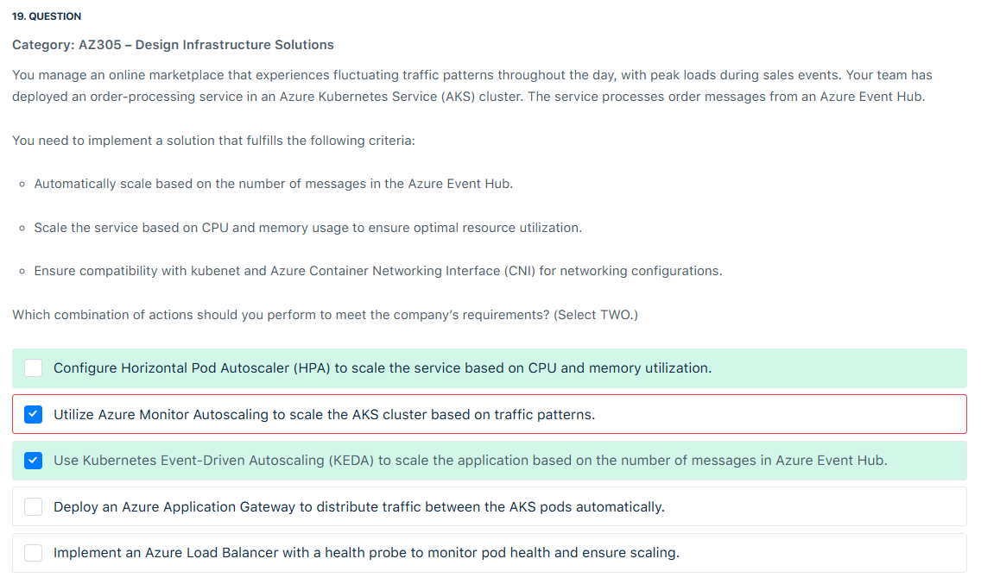

---

> 👉🏻 **Explanation**
>
> **✅ The Answer:**
>
> - **Configure Horizontal Pod Autoscaler (HPA) to scale the service based on CPU and memory utilization.**
> - **Use Kubernetes Event-Driven Autoscaling (KEDA) to scale the application based on the number of messages in Azure Event Hub.**
>
> ---
>
> **📖 Explanation:**
>
> - **Kubernetes Event-Driven Autoscaling (KEDA)** is a powerful tool that enables Kubernetes applications to scale based on external events, such as the number of messages in Azure Event Hubs, Kafka, or other data sources. KEDA works by creating event-driven triggers that adjust the number of pods in a Kubernetes deployment according to the volume of incoming events. This makes it ideal for applications that experience sudden spikes in traffic, as it can dynamically respond to handle the load by increasing the number of pods and scaling down when the traffic decreases.
> - The Horizontal Pod Autoscaler (HPA) is a built-in feature of Kubernetes that automatically adjusts the number of pods in a deployment based on metrics such as CPU and memory usage. HPA continuously monitors these resource utilization metrics to ensure efficient resource usage by the application. It scales up the number of pods when resource consumption is high and scales down when resource usage decreases, maintaining an optimal balance between performance and cost. HPA is crucial for preventing the overuse of resources during periods of low traffic while providing sufficient capacity during high-traffic events.
>
> - Kubernetes Event-Driven Autoscaling (KEDA) and Horizontal Pod Autoscaler (HPA) work together to create a responsive, cost-effective scaling solution for AKS workloads. KEDA ensures that the application dynamically scales based on external events, such as the number of messages in Azure Event Hub.At the same time, HPA optimizes resource utilization by monitoring internal metrics like CPU and memory. This combination provides a robust autoscaling solution that can handle traffic spikes and efficiently use resources, making it ideal for applications with fluctuating workloads.
>
> ---
>
> 

>   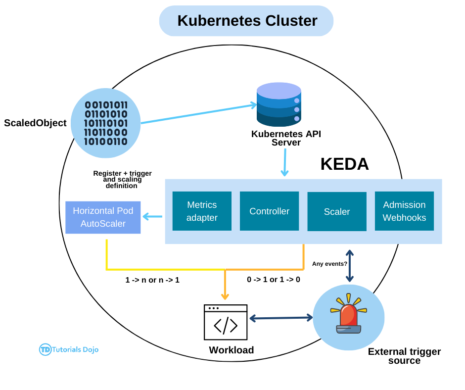
> 

---

## ⁉️ Q20

  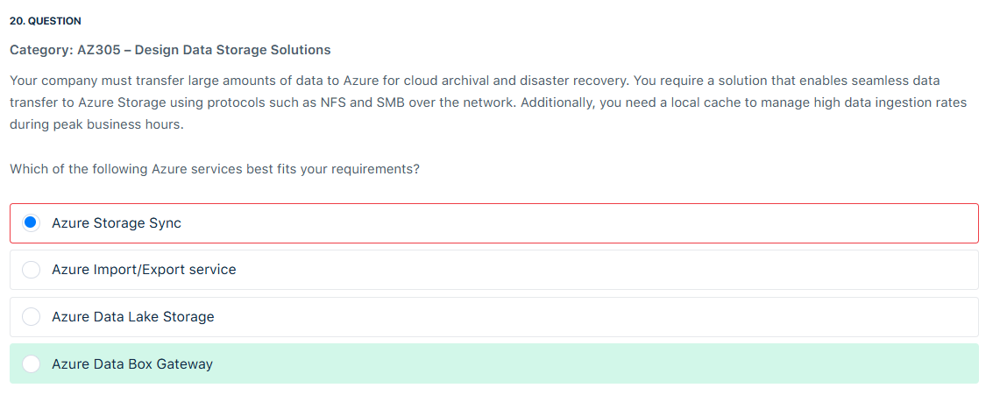

---

> 👉🏻 **Explanation**
>
> **✅ The Answer:**
>
> - **Azure Data Box Gateway**
>
> ---
>
> **📖 Explanation:**
>
> - **Azure Data Box Gateway** is a virtual device that facilitates the transfer of data to Azure Storage using protocols like NFS and SMB over the network. It can be used for tasks such as cloud archival, disaster recovery, or processing data at a cloud scale.
> - **Data Box Gateway** comes with a local cache whose size is defined by you when you provision the virtual device. The data disk size should meet the minimum requirements for the virtual device. The local cache offers the following advantages:
>   - Data can be ingested at a high rate, and during peak business hours, the cache can store the data and upload it to the cloud.
>   - Fast-read access is available from the local cache until the device reaches a certain threshold. Up to 50-60% capacity, all reads from the device are accessed from the cache, making them faster. Once the device’s used space goes beyond this threshold, local files will start to be removed.

---

## ⁉️ Q26

  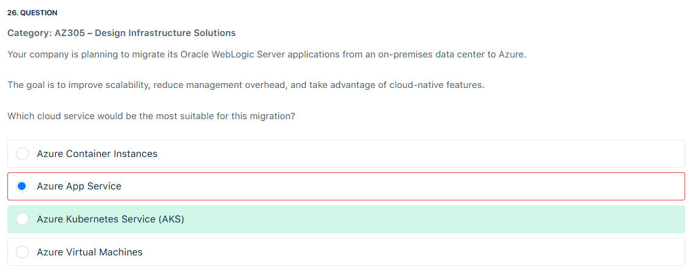

---

## ⁉️ Q28

  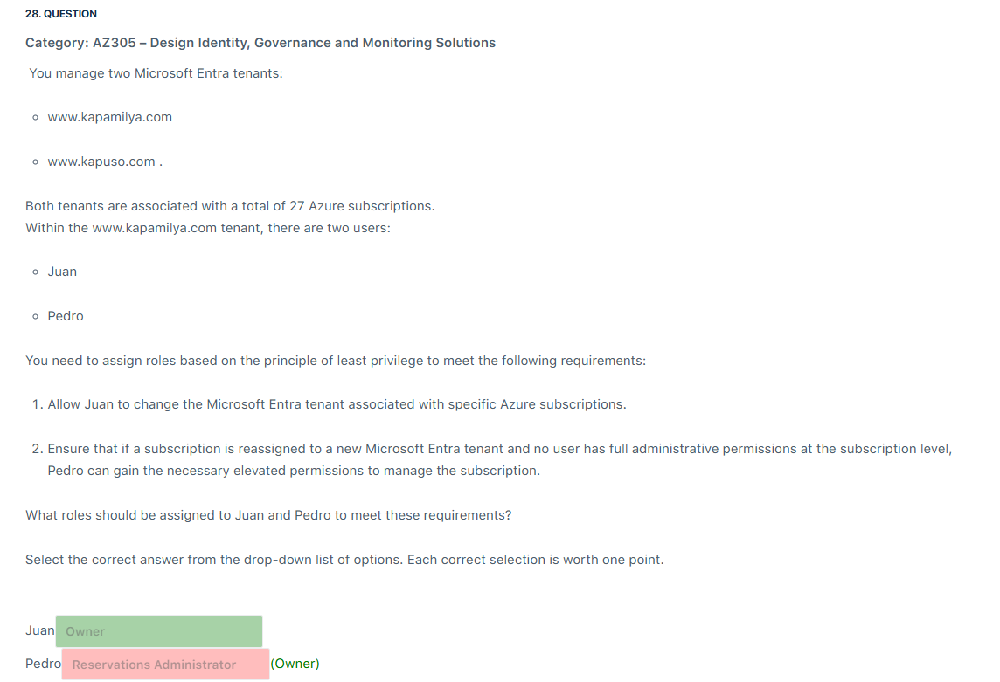

---

## ⁉️ Q29

  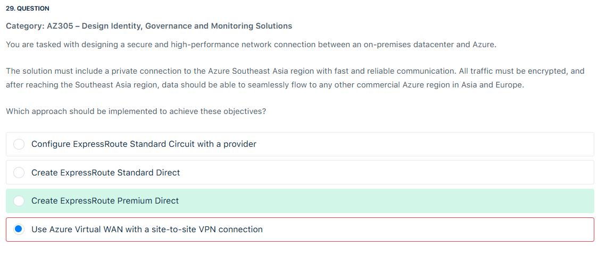

---

## ⁉️ Q30

  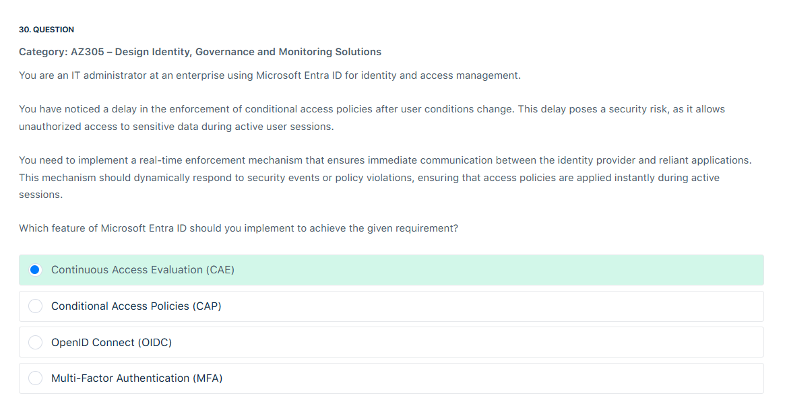

---

## ⁉️ Q33

  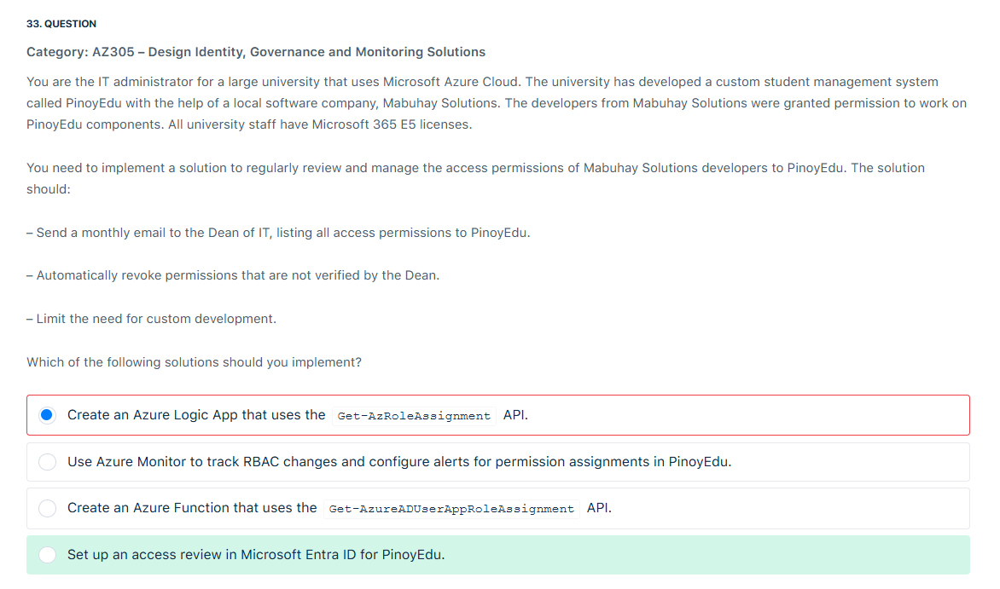

---
