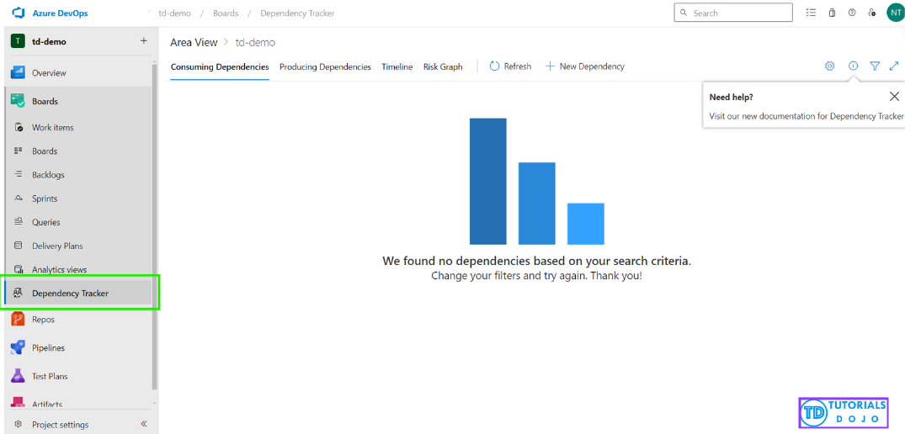
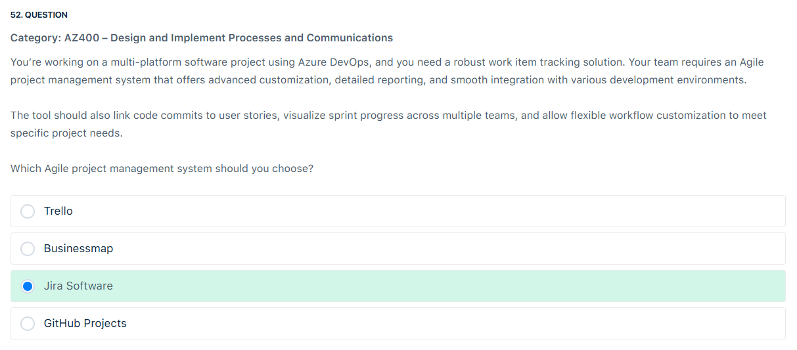

# 📋 Review Mode Set 1

## ⁉️ Q7

<div align="left">
  
</div>

---

> 👉🏻 **Explanation**  
> To monitor the performance of the Azure Kubernetes Service (AKS) cluster, it is crucial to set up alerts in Azure Monitor. For this specific requirement, configuring the alert rule with an aggregation granularity of 1 minute ensures frequent evaluation of CPU usage, providing timely and accurate monitoring. This high frequency of data collection is essential for detecting short-term spikes in CPU usage that might be missed with longer aggregation periods.
>
> Using a static threshold type is appropriate in this context because the requirement specifies monitoring a fixed threshold of 80%. Static thresholds are straightforward and effective when you need to monitor specific values. The operator should be set to “greater than” to ensure the alert activates only when the CPU usage surpasses the defined threshold of 80%, providing a clear and unambiguous trigger point for the alert. This configuration ensures that any excessive CPU usage is promptly flagged, allowing for quick action to maintain the performance and reliability of the AKS cluster.
>
> This configuration ensures effective monitoring of the AKS cluster’s performance, allowing you to take necessary actions when the CPU usage exceeds acceptable limits, thereby maintaining the application’s efficiency and reliability.
>
> Hence, the correct answers are:
>
> - Period: 1 minute.
>
> - Threshold Type: Static.
>
> - Operator: Greater than.
>
> The option that says: 5 minutes is incorrect. Setting the aggregation granularity to 5 minutes would mean that the CPU usage is evaluated less frequently. This could delay the detection of high CPU usage, making the alert less responsive and potentially missing short spikes in CPU usage that last less than 5 minutes.
>
> The option that says: Dynamic is incorrect because a dynamic threshold adjusts based on historical data and trends, which might be useful for identifying unusual patterns. However, it does not suit scenarios where a specific threshold value (like 80 percent CPU usage) needs to be monitored consistently.

---

## ⁉️ Q8

<div align="left">
  
</div>

---

> 👉🏻 **Explanation**
>
> <div align="left">
>   
> </div>
> Dependency Tracker extension in Azure DevOps is a powerful tool designed to visualize and manage project dependencies. This extension allows project managers to see a comprehensive overview of all interdependencies between various projects, highlighting the connections between consumers and producers. A visual representation of these dependencies helps identify potential bottlenecks, ensuring that any issues can be addressed promptly to maintain smooth integration and timely delivery. The tool seamlessly integrates with Azure DevOps, allowing easy incorporation into existing workflows without requiring significant changes or additional development effort.
>
> With the Dependency Tracker extension, project managers can effectively plan and manage project timelines. This helps ensure that all teams are aligned and dependencies are well-coordinated, reducing the risk of delays caused by overlooked dependencies or team miscommunications. The extension provides real-time updates and detailed insights into the status of dependencies, making it an invaluable asset for large software development companies with multiple teams and projects. This ensures that projects are delivered on time and integration issues are minimized, leading to more efficient and successful project outcomes.

---

## ⁉️ Q9

<div align="left">
  
</div>

---

> 👉🏻 **Explanation**
> Azure DevOps pipelines are essential for automating the build and deployment processes of applications. However, when issues arise, especially intermittent ones, diagnosing the root cause can be challenging with default logging levels. Enabling detailed logging in Azure DevOps can significantly improve the visibility into the pipeline’s execution, capturing comprehensive information that is crucial for troubleshooting.
>
> To enable detailed logging, the predefined variable `System.Debug` must be set to `true`. This variable controls the verbosity of the logs generated during the pipeline runs. When System.Debug is set to true, Azure DevOps produces more granular logs, including detailed information about each task, command outputs, and potential error messages. This enhanced level of detail is invaluable when diagnosing complex issues that are not apparent with standard logging levels.
>
> <div align="left">
>   
> </div>
>
> In practice, you can enable detailed logging by setting the System.Debug variable in your pipeline definition. For YAML pipelines, this involves adding System.Debug: true under the variables section. For pipelines configured through the Classic UI, you can add the variable in the pipeline settings under the variables section with Name: System.Debug and Value: true. Once this configuration is applied and the pipeline is run, the logs will include detailed information, providing greater insights into the execution flow and helping to identify and resolve issues more effectively.

---

## ⁉️ Q11

<div align="left">
  
</div>

---

> 👉🏻 **Explanation**  
> Microsoft-hosted Agents: Microsoft-hosted agents are virtual machines managed by Microsoft and used to run your build and release jobs in Azure Pipelines. These agents are shared resources, meaning multiple users and projects can utilize them simultaneously. Microsoft-hosted agents come with pre-installed software and tools, making them convenient for quick setup and use.
>
> They have time limits (timeouts) for job execution to ensure fair usage of shared resources.
>
> Public project: 10 free Microsoft-hosted parallel jobs that can run for up to 360 minutes (6 hours) each time, with no overall time limit per month.
>
> Private project: One free parallel job that can run for up to 60 minutes each time, until you’ve used 1,800 minutes (30 hours) per month. You can pay for additional capacity per parallel job. Paid parallel jobs remove the monthly time limit and allow you to run each job for up to 360 minutes (6 hours).
>
> If your build job exceeds the timeout threshold, it will be canceled, leading to failures.
>
> Self-hosted Agents: Self-hosted agents are virtual machines or physical machines that you provision and maintain yourself. These agents are dedicated to your organization or project and are not shared with other users. Self-hosted agents give you more control over the environment, allowing you to install specific software, tools, and dependencies required for your build and release processes.
>
> These agents can be physical or virtual machines, either on-premises or in the cloud (e.g., Azure Virtual Machines).
>
> Self-hosted agents do not have the same timeout restrictions as Microsoft-hosted agents, allowing your build job to run for as long as necessary.
>
> You have full control over the machine’s resources and can customize the environment to meet your specific build requirements.
>
> By using a self-hosted agent, you can customize the build environment, allocate sufficient resources, and eliminate the timeout restrictions imposed by Microsoft-hosted agents. This approach provides more control and flexibility over the build process, increasing the likelihood of successful builds for the TutorialsWebApp application.

---

## ⁉️ Q14

<div align="left">
  
</div>

---

> 👉🏻 **Explanation**  
> Yeoman is a robust scaffolding tool that simplifies the creation of Terraform modules. It helps by generating standardized templates, which reduces manual effort and ensures consistency across your infrastructure code. Using Yeoman, you can quickly set up Terraform modules with the necessary structure and files, making it easier to manage and deploy infrastructure on Azure.
>
> Terratest provides a robust framework for testing infrastructure. It includes helper functions for common tasks like making HTTP requests and using SSH, which help verify the real infrastructure in its environment. Key advantages include:
>
> - Convenient Helpers: This function is useful for verifying your actual infrastructure in a real-world scenario.
>
> - Organized Folder Structure: Ensures clarity and follows standard Terraform module structure.
>
> - Written in Go: Many Terraform users are Go developers, allowing seamless integration without needing another language.
>
> - Extensible: Allows adding functions, including Azure-specific features.

---

## ⁉️ Q17

<div align="left">
  
</div>

---

> 👉🏻 **Explanation**  
> **Test Impact Analysis (TIA)** in Azure Pipelines reduces test execution time by selectively running only the tests affected by recent code changes. This targeted approach is particularly beneficial in continuous integration (CI) environments, where minimizing testing duration is essential. TIA ensures that only the necessary tests are run, allowing for quicker feedback loops while still maintaining code coverage.
> References:
>
> <https://learn.microsoft.com/en-us/azure/devops/pipelines/test/test-impact-analysis?view=azure-devops>
>
> <https://learn.microsoft.com/en-us/azure/devops/pipelines/test/parallel-testing-vstest?view=azure-devops>
>
> Check out these Microsoft Azure Cheat Sheets:
>
> <https://tutorialsdojo.com/microsoft-azure-cheat-sheets/>

---

## ⁉️ Q21

<div align="left">
  
</div>

---

> 👉🏻 **Explanation**  
> The `.artifactignore` file in Azure DevOps is used to specify which files should be included or excluded when publishing build artifacts. This is particularly useful in scenarios where you want to optimize the build process by only including necessary files and excluding others that are not needed for deployment.
>
> <div align="left">
>   
> </div>

---

## ⁉️ Q26

<div align="left">
  
</div>

---

> 👉🏻 **Explanation**
>
> 📌 **Why this is correct**
>
> 1. **Deployment gates** in Azure DevOps are designed for **quality checks before promotion** (pre-deployment approvals, compliance checks, policy validation, etc.).
> 2. Azure DevOps provides a built-in **Security & Compliance Assessment extension/task** that integrates with **Azure Policy**, ensuring the resources about to be deployed are compliant.
> 3. If non-compliant, the gate **blocks promotion** to the next stage → exactly what the requirement asked.
>
> So this solution is **native, automated, and policy-driven**.
>
> ---
>
> ❌ **Why the other options are wrong**
>
> 1. **Azure Logic App** →
>
>    - Logic Apps can monitor resources, but this is an **external workflow**.
>    - Exam wants you to use **built-in DevOps gates** rather than bolting on extra services.
>
> 2. **Custom script** →
>
>    - Possible, but not recommended because it’s **manual & error-prone**.
>    - Azure DevOps already provides a first-class task for policy compliance.
>
> 3. **Azure Automation with What-If deployment** →
>
>    - The What-If operation validates **template changes** (what resources will be created/modified), but it does **not enforce Azure Policy compliance**.
>    - So, it solves drift detection, not compliance enforcement.

---

## ⁉️ Q28

<div align="left">
  
</div>

---

> 👉🏻 **Explanation**  
> Microsoft Playwright Testing Preview is a fully managed end-to-end testing service built on the Playwright framework. It allows you to automate tests to ensure your web applications perform as expected across various web browsers and operating systems. The service simplifies the complexity of running Playwright tests and handling results and artifacts. With high parallelization, it runs tests efficiently and stores results and artifacts, enabling faster feature delivery and easier troubleshooting.
>
> By using Microsoft Playwright Testing Preview, you can continuously validate your web app’s performance across different browsers and operating systems with each code commit, and troubleshoot tests with ease using the service dashboard. Additionally, you can integrate your Playwright tests into a continuous integration (CI) workflow, such as GitHub Actions, Azure Pipelines, or other CI platforms.

---

## ⁉️ Q30

<div align="left">
  
</div>

---

> 👉🏻 **Explanation**  
> Azure PowerShell refers to the collection of official Microsoft PowerShell modules for managing Azure resources. It leverages PowerShell, which is both a command-line shell and a scripting language. You can use Azure PowerShell interactively by running individual commands in the PowerShell environment or by creating and executing scripts composed of multiple commands.

---

## ⁉️ Q31

<div align="left">
  
</div>

---

> 👉🏻 **Explanation**
>
> 📝 **Scenario**
>
> - Pipeline has tests.
> - Some tests depend on 3rd party services (can be <ins title="بشكل متقطع" style="cursor:help">**intermittently</ins> down**) → false negatives.
> - Requirement → Pipeline should **still succeed** even if these flaky tests fail.
>
> ---
>
> ✅ **Correct Exam Answer**
>
> 👉 **Set up flaky tests.**
>
> Why?
>
> - Azure Pipelines has **built-in flaky test management**.
> - A flaky test = a test that fails intermittently but passes on retry.
> - Azure DevOps can **auto-detect flaky tests** and mark them as such, so they **don’t fail the pipeline**.
> - This is the **official feature** designed for this scenario.
>
> ---
>
> 🤔 **Why not `always()` condition?**
>
> You’re right — you **could** wrap test steps like this:
>
> ```yaml
> - task: VSTest@2
>   condition: always()
> ```
>
> But here’s the subtle difference:
>
> - `always()` just means → this step will **run regardless of previous failures**.
> - If the tests fail, the **job/pipeline can still fail** unless you also suppress errors (`continueOnError: true`).
>
> Example:
>
> ```yaml
> - task: VSTest@2
>   inputs:
>     testSelector: "testAssemblies"
>   continueOnError: true
> ```
>
> This would indeed allow the pipeline to pass despite test failures.
>
> ⚠️ Problem: That means **all test failures are ignored**, not just flaky ones.
>
> - You lose visibility into **real bugs** vs. **flaky issues**.
> - Dangerous in practice → may ship broken code.
>
> ---
>
> 🔄 **Difference Between Approaches**
>
> | Approach                           | Behavior                                                                                  | Best For                                                                |
> | ---------------------------------- | ----------------------------------------------------------------------------------------- | ----------------------------------------------------------------------- |
> | **Flaky test setup**               | Auto-detects intermittent failures, retries test, marks it as flaky if it passes on retry | Handling unreliable external dependencies without masking real failures |
> | **`always()` + `continueOnError`** | Ignores failures entirely (or still reports but doesn’t break build)                      | Non-critical steps (e.g., publishing test coverage, uploading logs)     |
> | **Lowering pass threshold**        | Accepts failures if % is “good enough”                                                    | Rarely used, risky in enterprise                                        |
> | **Concurrent jobs**                | Runs tests in parallel                                                                    | Performance optimization, not reliability                               |

---

## ⁉️ Q33

<div align="left">
  
</div>

---

> 👉🏻 **Explanation**
>
> ❓ The Question
>
> You need to:
>
> - Take commits from a **feature branch**
> - Update the **main branch**
> - Keep commit history **clean and organized** (no messy merge commits)
>
> ---
>
> ✅ Correct Answer: **`git rebase`**
>
> 👉 `git rebase` takes the commits from your feature branch and **re-applies them** on top of the target branch (main).
>
> - This makes it look like your work was done **after the latest main branch commit**, even if main moved forward.
> - Result: a **linear history** → no unnecessary merge bubbles.
>
> Example:
>
> ```bash
> # Switch to your feature branch
> git checkout feature
>
> # Rebase onto main
> git rebase main
> ```
>
> This rewrites history → feature commits now look like they came **after main’s latest commit**.
>
> ---
>
> ❌ Why Not the Others?
>
> 1. **Cherry-pick**
>
>    - Applies a **single commit** from one branch to another.
>    - Good for hotfixes or one-off commits.
>    - ❌ Not for updating whole feature branch history → would be painful to cherry-pick many commits.
>
> 2. **Fetch**
>
>    - Just downloads objects/refs from a remote.
>    - ❌ Doesn’t update history or apply commits → only syncs metadata.
>
> ---
>
> 🎯 Exam Keyword Trick
>
> When you see:
>
> - "Override history"
> - "Keep commit log clean and organized"
> - "Linear history"
>
> 👉 Always think **`git rebase`**.
>
> ---
>
> ⚡ So:
>
> - Cherry-pick = one commit
> - Rebase = clean, linear branch history
> - Merge = keeps both histories (can be messy)
> - Fetch = update refs only

---

## ⁉️ Q36

<div align="left">
  
</div>

---

> 👉🏻 **Explanation**
>
> ❓ The question
>
> You want to **minimize manual effort** for user and license management in Azure DevOps.
> Which task **requires manual intervention**?
>
> ---
>
> 🔍 The options:
>
> 1. **Assigning licenses to new users based on their roles**
>
>    - ✅ Can be automated using **Azure AD groups** + **group-based licensing**.
>    - Example: Add a new user to an AD group → they automatically get the right DevOps license.
>
> 2. **Adding and removing users from Azure DevOps projects**
>
>    - ✅ Can also be automated using **Azure AD group-based access**.
>    - Example: If a user is removed from an AD group, they automatically lose DevOps project access.
>
> 3. **Generating reports on license usage and user activity**
>
>    - ✅ Automated via **Azure DevOps REST API** or **built-in Analytics/Reporting**.
>    - Example: Schedule Power BI reports from DevOps usage data.
>
> 4. **Procuring new licenses to accommodate the growing team size**
>
>    - ❌ This cannot be automated.
>    - Someone must **go into Azure portal / Microsoft 365 Admin Center** and **buy additional licenses** (Basic, Basic+TestPlans, etc).
>    - It involves billing, purchase approval, payment — this **always requires manual intervention**.
>
> ---
>
> ⚡ Pro tip for AZ-400 exam:  
> Whenever you see **“minimize manual effort”** and licensing is involved → remember:  
> 👉 Everything **inside DevOps** = automatable.  
> 👉 Buying more licenses = **manual**.

---

## ⁉️ Q38

<div align="left">
  
</div>

---

> 👉🏻 **Explanation**
> GitHub is a web-based hosting service for version control using Git. It is a platform that provides a centralized location for software developers to store, manage, and collaborate on their code repositories. GitHub is widely used by individuals, teams, and organizations for various software development projects, ranging from open-source projects to proprietary applications.
>
> `Auto-assignment` is a feature in GitHub that allows you to automatically assign pull requests to specific team members or teams based on predefined rules or algorithms. Enabling auto-assignment is a prerequisite for configuring the routing algorithms and other settings related to code review assignments.
>
> `The Load balance routing algorithm` is another option for auto-assigning pull requests in GitHub. It assigns pull requests to team members with fewer outstanding reviews, taking into account their availability and the number of outstanding reviews they have. This helps prevent team members from being overloaded with reviews in a short timeframe, addressing the second requirement.
>
> `The Never assign certain team members` setting allows the exclusion of team members who are temporarily unavailable, which aligns with the team lead’s need to prevent unavailable members from receiving assignments.
>
> <div align="left">
>   
> </div>
>
> References:
>
> <https://docs.github.com/en/organizations/organizing-members-into-teams/managing-code-review-settings-for-your-team#routing-algorithms>
>
> <https://docs.github.com/en/organizations/organizing-members-into-teams/managing-code-review-settings-for-your-team>
>
> Check out this Azure DevOps Cheat Sheet:
>
> <https://tutorialsdojo.com/azure-devops/>

---

## ⁉️ Q44

<div align="left">
  
</div>

---

> 👉🏻 **Explanation**
>
> **✅ the answer:**
>
> 1. **Set up a service principal in Microsoft Entra ID for access control**
> 2. **Set up Azure Container Registry (ACR) integration in Azure DevOps** (build & push the image)
> 3. **Deploy a Helm package as part of the deployment pipeline task** _(a Kubernetes manifest apply would also be valid here, but pick one — Helm is fine)_
>
> **🤔 Why This Is the Best Answer:**
>
> - **Auth first:** the pipeline needs a **service principal/MI** to authenticate to AKS (and ACR).
> - **Images next:** AKS deploys containers, so you must **build and push** images to a registry; in Azure that’s **ACR** and you wire it to the pipeline.
> - **Deploy last:** use a **Kubernetes-native deploy method** — **Helm** (chart) **or** `kubectl apply` (YAML). Either is correct; Helm is commonly tested in AZ-400.
>
> **❌ Why Other Options Are Wrong:**
>
> - **Incorporate a Docker Compose task**: Docker Compose orchestrates containers **outside Kubernetes** (great for local/dev), not for AKS deployment. It doesn’t produce Kubernetes resources.
> - **Integrate an Azure Function App for Container tasks**: unrelated to deploying to **AKS**; Function Apps are a different compute service.
> - **“Add a Kubernetes deployment YAML file to the pipeline”**: conceptually fine, but you still need the **ACR step** to supply images. If the question forces exactly three actions, prefer **SP → ACR → Helm/YAML**. If Helm is chosen for deploy, you don’t need to also select the YAML option.

---

## ⁉️ Q45

<div align="left">
  
</div>

---

> 👉🏻 **Explanation**  
> A deployment group is used to define a collection of virtual machines (VMs) that will receive application updates. In this case, you would create two deployment groups: one for the twelve Azure virtual machines and another for the twelve on-premises virtual machines. Both deployment groups allow for easy management and consistent updates across different environments.
>
> <div align="left">
>   
> </div>
>
> A deployment group allows you to manage and deploy applications consistently across different environments, including both Azure and on-premises VMs, by installing the Azure Pipelines agent on each machine. The deployment group ensures that the application updates are applied to all selected machines in a controlled manner.

---

## ⁉️ Q46

<div align="left">
  
</div>

---

> 👉🏻 **Explanation**
>
> 🚦 Correct Answers (from real-world + exam perspective)
>
> 1. Feature flags → **Yes**
> 2. Progressive exposure → **Yes**
> 3. Blue/Green deployment → **Yes**
>
> ---
>
> 1️⃣ **Feature flags can enable functionality available in later releases without requiring new deployments.**
>
> ✅ **True**
>
> - Feature flags (aka toggles) let you deploy code **dark** (hidden) and flip it **on/off** later without redeploying.
> - Matches your goal: “Enable features for future releases without requiring immediate redeployment.”
>
> ---
>
> 2️⃣ **Progressive exposure can be used to release features to specific groups of users based on their tolerance for software faults.**
>
> ✅ **True**
>
> - Progressive exposure (canary, rings, phased rollout) = gradually rolling out a change to a subset of users, then expanding.
> - Example: Ring 0 = internal testers, Ring 1 = friendly users, Ring 2 = general public.
> - The course marked it **False**, but that’s misleading. This is exactly what **progressive exposure** means.
>
> ---
>
> 3️⃣ **A blue/green deployment strategy ensures zero downtime for all users during deployment.**
>
> ✅ **True**
>
> - Blue/Green = run **two identical environments**.
> - All users stay on _Blue_ while you deploy _Green_.
> - Then you switch traffic instantly → **zero downtime**.
> - Rollback is quick: switch traffic back.
>
> ---
>
> ⚠️ Why Udemy’s answer marked 3 wrong?
>
> - For **#3**, they argue Blue/Green _can_ have a tiny DNS/traffic switch delay. But in exam wording, **Blue/Green = zero downtime**.
>
> - **Blue/green → zero-downtime + fast rollback** (exam simplification).
> - If a question explicitly says “guaranteed zero impact to _all active sessions_” or mentions **stateful session swaps**, that’s when you’d reconsider—but with generic wording, pick **Yes**.
>
> 👉 In official **Microsoft docs**:
>
> - [Progressive exposure](https://learn.microsoft.com/en-us/devops/deliver/what-is-progressive-exposure) → “Release to a small group of users, then expand.”
> - [Blue/Green deployment](https://learn.microsoft.com/en-us/devops/deploy/blue-green-deployment) → “Minimizes downtime by routing traffic between two identical environments.”

---

## ⁉️ Q49

<div align="left">
  
</div>

---

> 👉🏻 **Explanation**  
> Microsoft Defender for Containers is a comprehensive security solution that protects Kubernetes environments and containerized workloads hosted in Azure. This service is part of Microsoft Defender for Cloud and offers advanced threat detection and vulnerability management specifically tailored for containers. By integrating with Azure Kubernetes Service (AKS) and Azure DevOps, Microsoft Defender for Containers enables real-time monitoring, providing insights into potential vulnerabilities within container images during the build and runtime phases. It scans container images stored in Azure Container Registry (ACR) as well as those deployed in AKS clusters, helping identify and mitigate security issues before they can impact the production environment.

---

## ⁉️ Q51

<div align="left">
  
</div>

---

> 👉🏻 **Explanation**  
> Azure Automation is a cloud service that helps you automate manual processes using runbooks, which are sets of PowerShell or Python scripts. An Azure Automation account is a container for storing and managing these runbooks, along with other automation resources like credentials, schedules, and modules.
>
> <div align="left">
>   
> </div>
> In the Azure Automation environment, configuring source control integration is crucial for maintaining up-to-date runbooks that reflect changes made in code repositories like Azure DevOps or GitHub. By utilizing the Source Control settings within the Azure Automation account, administrators can create a configuration that allows runbooks to automatically sync with their corresponding scripts in the repository. This setup ensures that any new commits trigger an update in the automation environment, enabling seamless application infrastructure management.
>
> This automated synchronization process significantly enhances operational efficiency and reduces the risk of discrepancies between the development and production environments, fulfilling the requirement for continuous deployment and integration.
>
> References:
>
> <https://learn.microsoft.com/en-us/azure/automation/source-control-integration>
>
> <https://learn.microsoft.com/en-us/azure/automation/>

---

## ⁉️ Q52

<div align="left">
  
</div>

---

> 👉🏻 **Explanation**  
> Jira Software is a powerful Agile project management tool known for its flexibility and advanced customization. It is well-suited for multi-platform development teams. When integrated with Azure DevOps, it enhances project management capabilities by providing real-time synchronization of work items. This enables teams to connect Jira issues with Azure DevOps work items, commits, and deployment data. The integration allows Agile teams to link code commits to user stories and visualize sprint progress across different teams, promoting effective collaboration and increasing project visibility. By utilizing the synchronization features, teams can monitor their workflows and stay aligned, regardless of the platform they prefer for development or task management.
>
> <div align="left">
>   
> </div>
>
> Jira offers customization capabilities that allow teams to create workflows tailored to specific project needs. This is beneficial for adapting to unique business requirements or multiple development environments. Teams can set up detailed reporting and dashboards to track project progress. Jira’s marketplace provides a wide range of add-ons and extensions for additional functionality, such as enhanced reporting tools and workflow automation features. When integrated with Azure DevOps, Jira Software becomes a comprehensive solution that supports the entire lifecycle of Agile project management, aligning development activities with project goals efficiently and seamlessly.
>
> References:
>
> <https://support.atlassian.com/jira-cloud-administration/docs/integrate-azure-devops-with-jira/>
>
> <https://devblogs.microsoft.com/devops/azure-pipelines-integration-with-jira-software/>

---

## ⁉️ Q53

<div align="left">
  
</div>

---

> 👉🏻 **Explanation**
>
> The Azure Log Integration (AzLog) tool allows you to consolidate logs from various Azure resources into a format suitable for SIEM tools like LogRhythm. Although AzLog initially supported multiple formats, JSON has become the preferred format due to its compatibility and ease of use with modern log analysis platforms. JSON provides a structured way to represent log data, enabling seamless integration with tools that can easily parse and analyze nested data. JSON logs from AzLog are stored in Azure Storage, following a predefined schema that is well-suited for auditing and security analysis tasks across large Azure environments.
>
> <div align="left">
>   
> </div>
>
> Using JSON for Azure logs facilitates integration with SIEM tools and enhances data retention and accessibility. Azure Monitor, which often works alongside AzLog, allows you to export these JSON-formatted logs to Event Hubs or storage accounts for additional analysis. JSON’s lightweight nature means it is ideal for handling the detailed log data generated by Azure services, making it straightforward to extract relevant information for compliance and operational needs.
> References:
>
> <https://azure.microsoft.com/en-us/blog/use-azure-monitor-to-integrate-with-siem-tools/>
>
> <https://learn.microsoft.com/en-us/azure/azure-monitor/logs/tutorial-logs-ingestion-portal>

---
