# 📋 Review Mode Set 2

## ⁉️ Q3

<div align="left">
  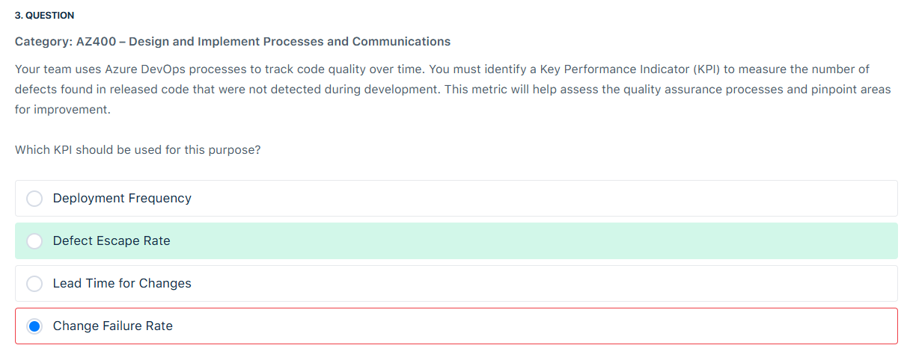
</div>

---

> 👉🏻 **Explanation**  
> The Defect Escape Rate is a key performance indicator (KPI) used in Azure DevOps to measure the number of missed defects during development and only detected after the code has been released to production. This metric is essential for assessing the effectiveness of your development and testing processes. A high defect escape rate may indicate areas where quality assurance practices could be improved, reflecting a trend of bugs slipping through initial stages and reaching production. This KPI helps teams refine their testing methods, adjust resources, and ultimately strive for higher quality in future releases, reducing the need for post-release fixes.
>
> In continuous delivery and agile practices, monitoring defect escape rates over time provides insights into the team’s ability to identify issues early. It aligns closely with other DevOps quality metrics, such as active bug counts and unplanned work. By regularly analyzing defect escape rates, DevOps teams can implement corrective actions to enhance test coverage and validation processes during development, resulting in a more reliable and robust software deployment pipeline.
>
> References:
>
> <https://learn.microsoft.com/en-us/azure/cloud-adoption-framework/ready/considerations/devops-principles-and-practices>
>
> <https://learn.microsoft.com/en-us/azure/devops/boards/backlogs/manage-bugs?view=azure-devops>
>
> ---
>
> 🔑 KPIs You Need to Learn
>
> 1. **Deployment Frequency (DORA metric)**
>
>    - _What it measures_: How often you deploy code to production.
>    - _Why it matters_: High-performing teams deploy small, frequent changes → less risk, faster value delivery.
>
> 2. **Defect Escape Rate (QA metric)** ✅ _(Correct Answer in your screenshot)_
>
>    - _What it measures_: % of defects found in **production** compared to total defects (prod + pre-prod).
>    - _Formula_:
>
>      ```ini
>      Defect Escape Rate = (Prod Defects / Total Defects) * 100
>      ```
>
>    - _Why it matters_: Indicates how well your testing caught issues **before release**.
>
> 3. **Lead Time for Changes (DORA metric)**
>
>    - _What it measures_: Time from code committed → successfully running in production.
>    - _Why it matters_: Short lead time = fast feedback + agility.
>
> 4. **Change Failure Rate (DORA metric)**
>
>    - _What it measures_: % of deployments that cause failures in production (requiring rollback, patch, hotfix).
>    - _Formula_:
>
>      ```ini
>      Change Failure Rate = (Failed Deployments / Total Deployments) * 100
>      ```
>
>    - _Why it matters_: Lower rate = more reliable delivery.
>
> ---
>
> 📘 What to Study for AZ-400
>
> 👉 Learn **DORA Metrics** (these are exam favorites):
>
> 1. Deployment Frequency
> 2. Lead Time for Changes
> 3. Change Failure Rate
> 4. Mean Time to Restore (MTTR)
>
> 👉 Learn **QA/Testing Metrics** (like in your question):
>
> - Defect Escape Rate
> - Test Pass Rate
> - Code Coverage
>
> 👉 Learn **DevOps Process Metrics**:
>
> - Cycle Time vs Lead Time (difference!)
> - Build Success Rate
> - Release Downtime

---

## ⁉️ Q6

<div align="left">
  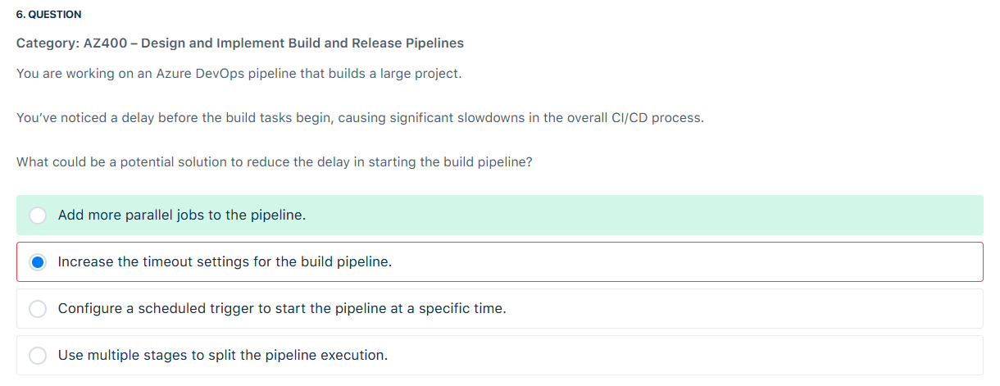
</div>

---

> 👉🏻 **Explanation**  
> this question is a bit tricky because it’s asking about the delay before the build tasks even begin, not about slow execution during the build.
>
> ❌ Wrong options explained
>
> - **Increase the timeout settings for the build pipeline**
>   → Timeout controls _maximum run time_, not _start delay_. Doesn’t help.
>
> - **Configure a scheduled trigger to start the pipeline at a specific time**
>   → Just changes _when_ it runs, not how fast it starts once triggered.
>
> - **Use multiple stages to split the pipeline execution**
>   → Helps organize work or parallelize logically, but won’t fix the “waiting to start” problem.
>
> ---
>
> ✅ Correct approach: **Add more parallel jobs to the pipeline**
>
> In Azure DevOps, when you notice **delays before build tasks begin**, it usually means:
>
> - Your jobs are waiting for **available agents** (Microsoft-hosted or self-hosted).
> - Each pipeline is constrained by the number of **parallel jobs** your organization is licensed for.
> - If all your jobs are queued, your pipeline waits.
>
> By **adding more parallel jobs** (through Azure DevOps parallelism settings, paid/concurrent jobs, or scaling your self-hosted agent pool), you reduce the queue time, which directly fixes the “slow start” issue.
>
> When the number of queued builds and releases exceeds your available parallel jobs, the queues for builds and releases can become longer. If you notice that the delays in the queue are becoming too long, you have the option to purchase additional parallel jobs as needed.
>
> Adding parallel jobs will help distribute the workload more efficiently, reducing the overall build time and the delay before starting the build tasks.
>
> ---
>
> ⚡ Quick memory tip:
>
> - **Slow start (waiting to begin)** → Increase parallel jobs / agent capacity.
> - **Slow execution (tasks taking long)** → Optimize tasks, caching, splitting stages.

---

## ⁉️ Q7

<div align="left">
  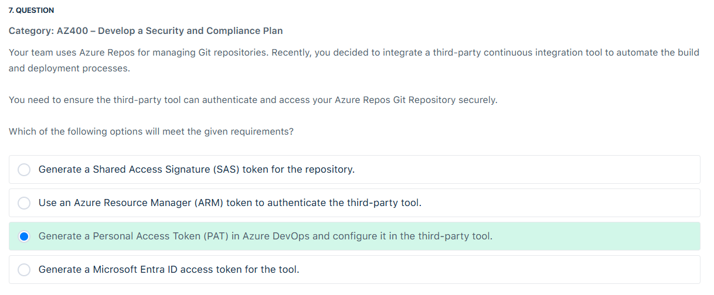
</div>

---

> 👉🏻 **Explanation**  
> When using Microsoft tools, your Microsoft account (MSA) or Microsoft Entra ID is a recognized and supported option. However, if you are using non-Microsoft tools that do not support these accounts, or if you prefer not to share your primary credentials with such tools, Personal Access Tokens (PATs) serve as a viable alternative.

---

## ⁉️ Q11

<div align="left">
  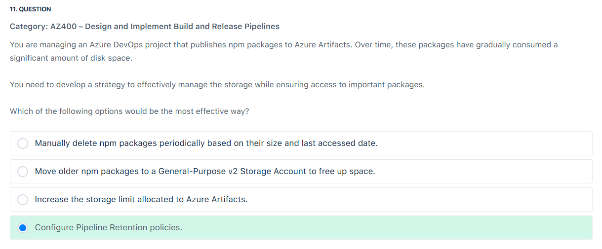
</div>

---

> 👉🏻 **Explanation**
>
> 🔹 Pipeline Retention Policies
>
> - These control **how long pipeline runs, logs, and build artifacts** (e.g., published drop artifacts from a build) are kept.
> - They **do not** directly affect **Azure Artifacts feeds** (npm, NuGet, Maven, Python packages).
> - Example: keep only the last 10 runs, delete old builds after 30 days.
>
> 👉 Useful for pipeline history storage cleanup, **but not for package feeds**.
>
> ---
>
> 🔹 Azure Artifacts Retention Policies
>
> - These specifically control how long **package versions** (npm, NuGet, etc.) are retained in the feed.
> - You can configure **feed-level retention rules**:
>
>   - Keep the latest `n` versions.
>   - Delete older versions after `x` days.
>   - Exclude versions marked as “promoted” (important releases).
>
> 👉 This is the **correct approach** for the given scenario about npm packages consuming disk space.
>
> ---
>
> ✅ Correct answer for the exam:
>
> **Configure Azure Artifacts Retention Policies**, not Pipeline retention.
>
> ---
>
> ⚡ Quick memory hack:
>
> - **Pipeline retention** = builds + artifacts + logs.
> - **Artifacts retention** = package feeds (npm, NuGet, Python).

---

## ⁉️ Q15

<div align="left">
  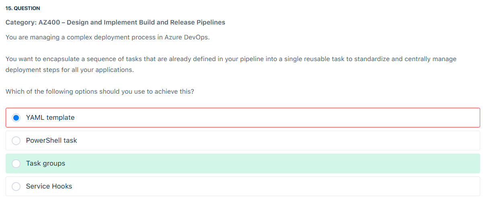
</div>

---

> 👉🏻 **Explanation**
>
> 🔹 Options Breakdown
>
> 1. **YAML template**
>
>    - Used in YAML pipelines.
>    - Lets you define reusable pipeline logic (jobs, stages, steps).
>    - But the question specifically says: _“encapsulate a sequence of tasks into a single reusable task.”_
>    - Templates reuse **pipeline definitions**, not tasks as a unit.
>
> 2. **PowerShell task**
>
>    - Just one type of task.
>    - Doesn’t encapsulate multiple tasks, only lets you run scripts.
>
> 3. **✅ Task groups**
>
>    - Feature of **Classic Pipelines (GUI-based)**.
>    - You can select multiple tasks, group them into a **Task Group**, and reuse that group across pipelines.
>    - Updates to the Task Group propagate everywhere it’s used → **central management**.
>    - This matches the requirement exactly.
>
> 4. **Service Hooks**
>
>    - Used to integrate Azure DevOps with external services (Slack, GitHub, Jira, etc.).
>    - Not related to reusing pipeline tasks.
>
> ---
>
> 💡 Exam tip:
>
> - If the question mentions **classic pipelines (UI)** → **Task Groups**.
> - If it’s about **YAML pipelines** → **YAML templates**.

---

## ⁉️ Q16

<div align="left">
  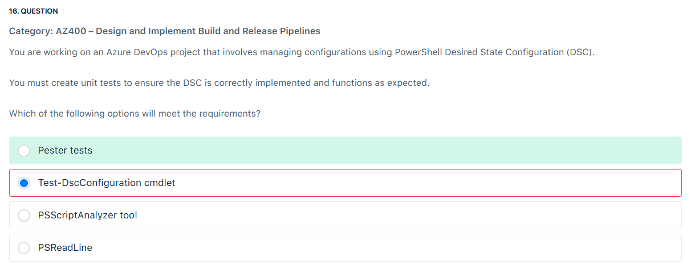
</div>

---

> 👉🏻 **Explanation**
>
> PowerShell Desired State Configuration (DSC) is a management platform in PowerShell that allows you to configure and maintain the desired state of your environment. Unit testing DSC configurations is essential to ensure correctness and reliability.
>
> Pester is a unit testing framework for PowerShell that is widely used for testing PowerShell scripts and configurations, including DSC. It allows you to create mock scenarios and validate the behavior of DSC configurations. Pester supports defining tests that verify the functionality of DSC resources and ensure that the configuration scripts are working as intended.
>
> <div align="left">
>   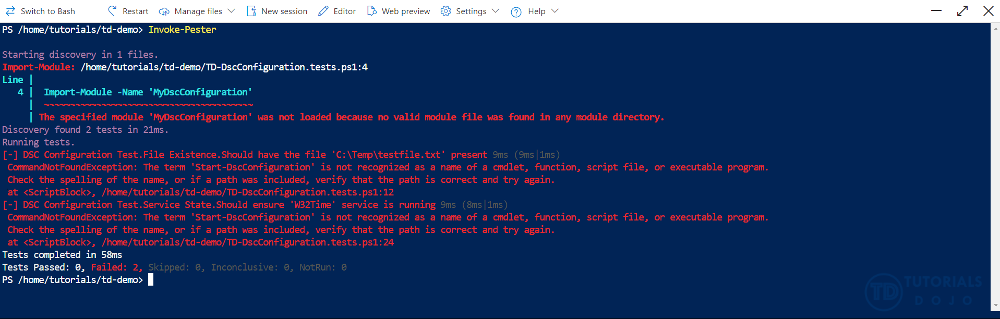
> </div>
>
> References:
>
> <https://learn.microsoft.com/en-us/powershell/scripting/dsc/overview?view=powershell-7.4>
>
> <https://marketplace.visualstudio.com/items?itemName=pspester.pester-test>
>
> <https://devblogs.microsoft.com/scripting/what-is-pester-and-why-should-i-care/>

---

## ⁉️ Q26

<div align="left">
  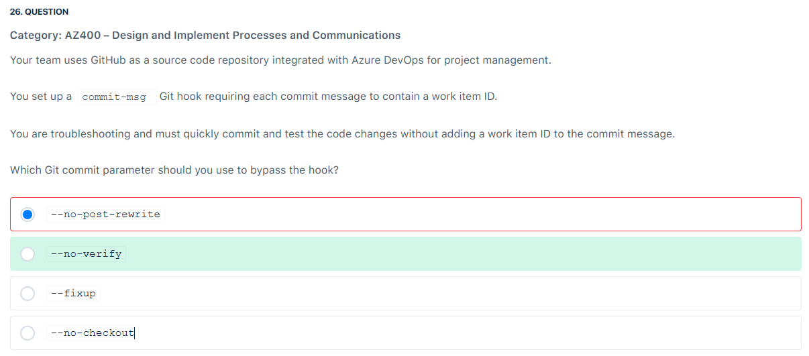
</div>

---

> 👉🏻 **Explanation**  
> Git hooks are scripts that Git executes before or after events such as commit, push, and receive. The commit-msg hook is a client-side hook that runs after the commit message is created but before the commit is completed.
>
> The `--no-verifyis` specifically designed to bypass the pre-commit and commit-msg hooks. When you use git commit --no-verify, Git will create the commit without running these hooks, allowing you to commit without adhering to the rules set in the hooks.
>
> References:
>
> <https://learn.microsoft.com/en-us/azure/devops/repos/git/?view=azure-devops>
>
> <https://git-scm.com/docs/githooks#_commit_msg>

---

## ⁉️ Q30

<div align="left">
  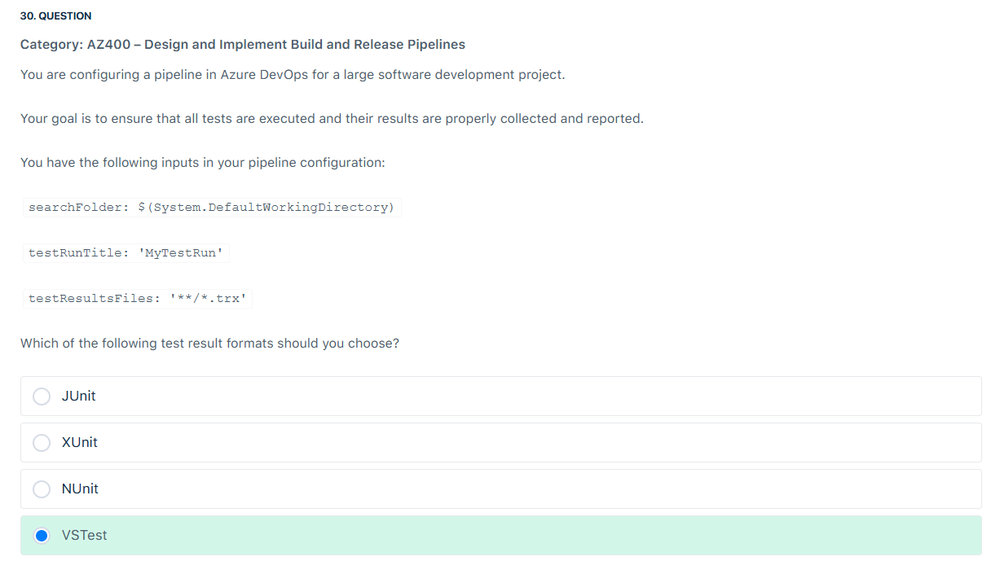
</div>

---

> 👉🏻 **Explanation**  
> The VSTest task in Azure DevOps is specifically designed to work with .trx files. When you run tests using VSTest in your build or release pipeline, the results are automatically outputted in .trx format. The Publish Test Results task in Azure DevOps then consumes these .trx files to generate test reports.
>
> <div align="left">
>   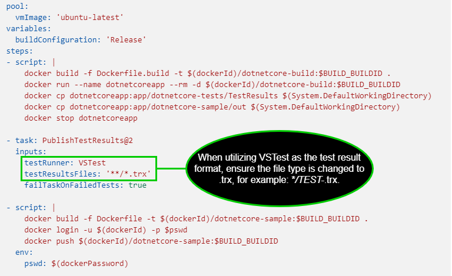
> </div>
>
> References:
>
> <https://learn.microsoft.com/en-us/azure/devops/pipelines/tasks/reference/publish-test-results-v2?view=azure-pipelines&tabs=trx%2Ctrxattachments%2Cyaml>
>
> <https://learn.microsoft.com/en-us/azure/devops/pipelines/tasks/reference/vstest-v2?view=azure-pipelines>

---

## ⁉️ Q30

<div align="left">
  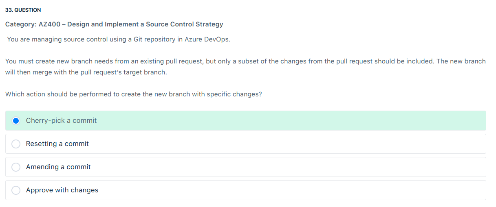
</div>

---

> 👉🏻 **Explanation**  
> Cherry-picking in Git is selecting a specific commit from one branch and applying it to another. This allows developers to choose and apply individual changes from one branch to another, rather than merging entire branches, giving them fine-grained control over which modifications are incorporated into different parts of their codebase.
>
> 📌 Scenario Recap
>
> - You have an **open Pull Request (PR)**.
> - You don’t want to take all the changes from that PR into a new branch.
> - Instead, you want to **pick only a subset of the changes** and create a new branch that will later merge into the PR’s target branch.
>
> ---
>
> 🛠 Options Analysis
>
> 1. **Cherry-pick a commit ✅ (Correct)**
>
>    - Cherry-pick lets you take **specific commits** (not the whole PR) and apply them to a new branch.
>    - Perfect when you want **partial changes** only.
>    - Example:
>
>      ```bash
>      git checkout target-branch
>      git checkout -b new-feature-branch
>      git cherry-pick <commit-id1> <commit-id2>
>      ```
>
> 2. **Resetting a commit ❌**
>
>    - `git reset` moves the branch pointer backward or changes history.
>    - This rewrites commit history — not suitable when you just want a **subset of changes**.
>
> 3. **Amending a commit ❌**
>
>    - `git commit --amend` modifies the **last commit** (like editing message or adding forgotten changes).
>    - Not useful for extracting a subset of changes from a PR.
>
> 4. **Approve with changes ❌**
>
>    - This is just a **review action** in Azure DevOps PR.
>    - Doesn’t create new branches or commits.
>
> ---
>
> ✅ Correct Answer:
>
> **Cherry-pick a commit**
>
> ---
>
> 🔍 Visual Example
>
> ```bash
> Before:
> target-branch: A --- B
> feature-branch:       C --- D --- E   (Pull Request)
>
> You want a new branch with only commit C and E.
> ```
>
> ```bash
> git checkout target-branch
> git checkout -b selective-branch
> git cherry-pick C E
> ```
>
> ```bash
> After:
> target-branch: A --- B
> selective-branch:     C --- E
> ```
>
> 👉 Now `selective-branch` contains **only the commits you want**, and you can merge it separately.

---

## ⁉️ Q34

<div align="left">
  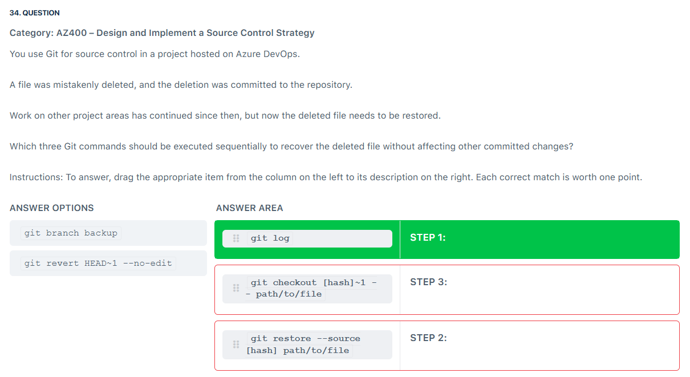
</div>

---

> 👉🏻 **Explanation**
>
> 🔑 Key Difference Between `checkout` and `restore`
>
> - **`git checkout [hash] -- path/to/file`** → the **classic way** (works in all Git versions). It copies the file from a specific commit into your working directory.
> - **`git restore --source [hash] path/to/file`** → the **newer command** (Git 2.23+), does the same thing but is clearer and avoids confusion with `checkout` (which also switches branches).
>
> 👉 In real life, you’d use **one or the other**, not both.
>
> ---
>
> ✅ What the exam expects
>
> They want you to show:
>
> 1. **Find commit** → `git log`
> 2. **Recover file (old style)** → `git checkout [hash]~1 -- path/to/file`
>
>    - (pulls it from the parent commit before deletion)
>
> 3. **Recover file (new style)** → `git restore --source [hash] path/to/file`
>
>    - (same outcome, just modern syntax)
>
> ---
>
> 🧠 So why both in the exam answer?
>
> Because the exam is testing your knowledge of:
>
> - **Identifying the commit (log)**
> - **Old-school method (`checkout`)**
> - **Modern method (`restore`)**
>
> It’s redundant in practice but useful for **theory**.
>
> ---
>
> 💡 My recommendation for the exam
>
> If you see both options available:
>
> - Choose **log → checkout → restore**, because that matches the official “sequential” answer key.
>   If you only see one recovery option:
> - Use either `checkout` OR `restore`, both are correct.

---

## ⁉️ Q36

<div align="left">
  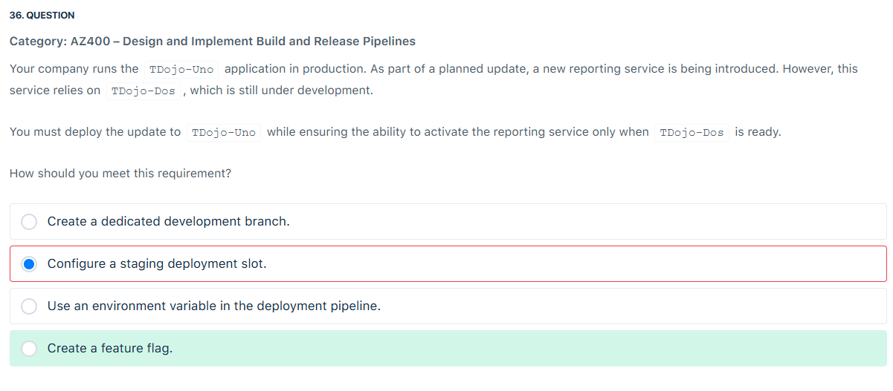
</div>

---

> 👉🏻 **Explanation**  
> The most appropriate solution for this scenario is to create a feature flag. This aligns with the requirement to deploy the update now while maintaining flexibility to activate the reporting service later when TDojo-Dos becomes available. Feature flags provide a runtime mechanism to toggle features on or off without requiring code changes or redeployments, which is ideal for this situation.

---

## ⁉️ Q37

<div align="left">
  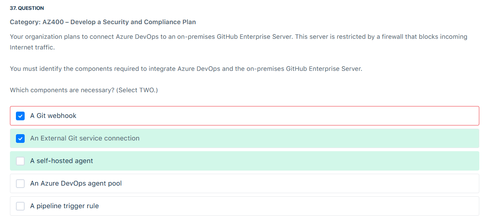
</div>

---

> 👉🏻 **Explanation**
>
> 🔎 Situation
>
> - You have **Azure DevOps (cloud)**.
> - You have **GitHub Enterprise Server (on-prem)**.
> - The server is **behind a firewall** (no inbound internet traffic allowed).
> - You need to integrate the two so that Azure DevOps can:
>
>   - Pull code from the repo
>   - Trigger pipelines when changes happen
>
> ---
>
> 🧩 Let’s evaluate each option:
>
> 1. **A Git webhook** ✅
>
>    - Webhooks are required so that GitHub Enterprise Server can notify Azure DevOps when code changes (push, PR, etc).
>    - Even though the server is behind a firewall, you’d configure **outbound connectivity** from GitHub → Azure DevOps (since inbound is blocked).
>    - This is essential for triggering pipelines automatically.
>
> 2. **An External Git service connection** ✅
>
>    - In Azure DevOps, you need a **service connection** to authenticate and securely pull from GitHub Enterprise Server.
>    - Since this is not Azure Repos, it requires an **External Git service connection**.
>
> 3. **A self-hosted agent** ❌
>
>    - Not required here. Self-hosted agents are used to run jobs locally, but integration between Azure DevOps and GitHub doesn’t require jobs to run on-prem.
>
> 4. **An Azure DevOps agent pool** ❌
>
>    - Agent pools are for pipeline execution, not for source integration.
>
> 5. **A pipeline trigger rule** ❌
>
>    - Triggers define _when_ pipelines run, but they still depend on webhooks/events from GitHub. Without a webhook + service connection, a trigger alone won’t work.
>
> ---
>
> ✅ Correct Answer:
>
> - **A Git webhook**
> - **An External Git service connection**
>
> ---
>
> 📌 **Exam tip:** If you see “GitHub Enterprise (on-premises) integration,” always think:
>
> 1. **Service connection** (to allow authentication/secure repo access).
> 2. **Webhook** (to notify Azure DevOps of changes).

---

## ⁉️ Q39

<div align="left">
  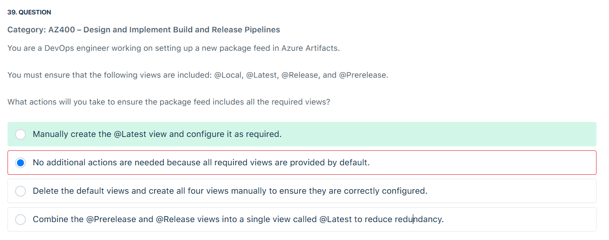
</div>

---

> 👉🏻 **Explanation**
>
> Feed views enable users to manage package visibility by sharing some packages while keeping others private. Each view filters the feed to display a specific subset of packages based on criteria defined for that view.
>
> By default, Azure Artifacts provides three views: @Local, @Prerelease, and @Release. The @Local view is the default option and contains all published packages along with those saved from upstream sources. All views support various package types, including NuGet, npm, Maven, Python, Cargo, and Universal Packages.
>
> Hence, the correct answer is: Manually create the @Latest view and configure it as required. The @Latest view is not included by default and must be created manually to ensure it meets your project’s needs.
>
> <div align="left">
>   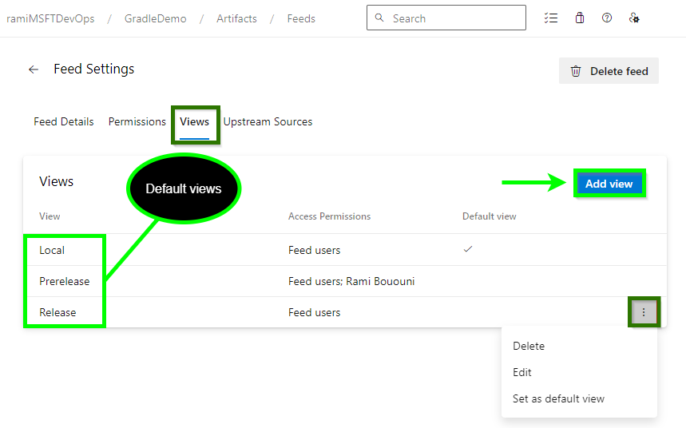
> </div>
>
> References:
>
> <https://learn.microsoft.com/en-us/azure/devops/artifacts/concepts/views?view=azure-devops>
>
> <https://learn.microsoft.com/en-us/azure/devops/artifacts/feeds/views?view=azure-devops&tabs=nuget%2Ccurl>

---

## ⁉️ Q41

<div align="left">
  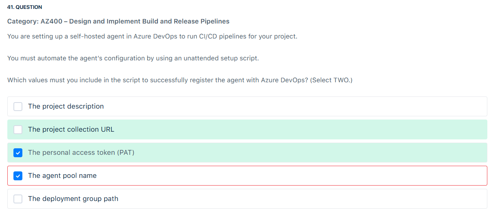
</div>

---

> 👉🏻 **Explanation**  
> Personal Access Token (PAT) is a secure alternative to using passwords for authentication to Azure DevOps. It’s an OAuth access token that you can use as an alternate password to authenticate into Azure DevOps.
>
> Project Collection URL is the URL that points to your specific Azure DevOps organization and collection. It typically looks like <https://dev.azure.com/{your-organization}>.
>
> <div align="left">
>   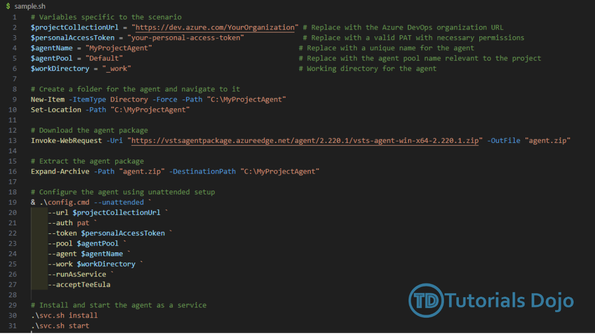
> </div>

---

## ⁉️ Q42

<div align="left">
  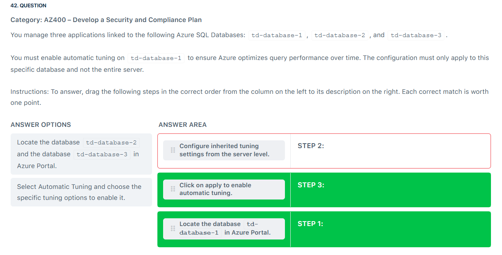
</div>

---

> 👉🏻 **Explanation**  
> Azure SQL Database is a fully managed Platform as a Service (PaaS) database engine that handles most of the database management functions such as upgrading, patching, backups, and monitoring without user involvement. It’s always running on the latest stable version of the SQL Server database engine and patched OS with 99.99% availability. Azure SQL Database allows you to process both relational data and non-relational structures, such as graphs, JSON, spatial, and XML.
>
> <div align="left">
>   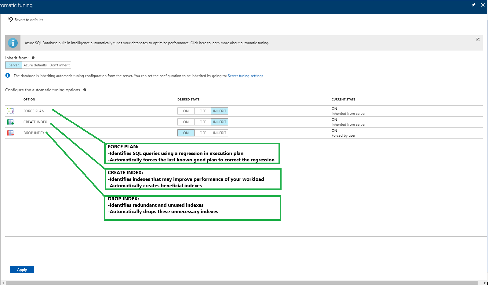
> </div>
>
> Automatic tuning is a fully managed intelligent performance service that uses built-in intelligence to continuously monitor queries executed on a database and automatically improve their performance. This is achieved through dynamically adapting a database to changing workloads and applying tuning recommendations. Automatic tuning learns horizontally from all databases on Azure through AI, and dynamically improves its tuning actions. The longer a database runs with automatic tuning on, the better it performs.
>
> References:
>
> <https://learn.microsoft.com/en-us/azure/azure-sql/database/automatic-tuning-enable?view=azuresql>
>
> <https://learn.microsoft.com/en-us/azure/azure-sql/database/automatic-tuning-overview?view=azuresql>

---

## ⁉️ Q43

<div align="left">
  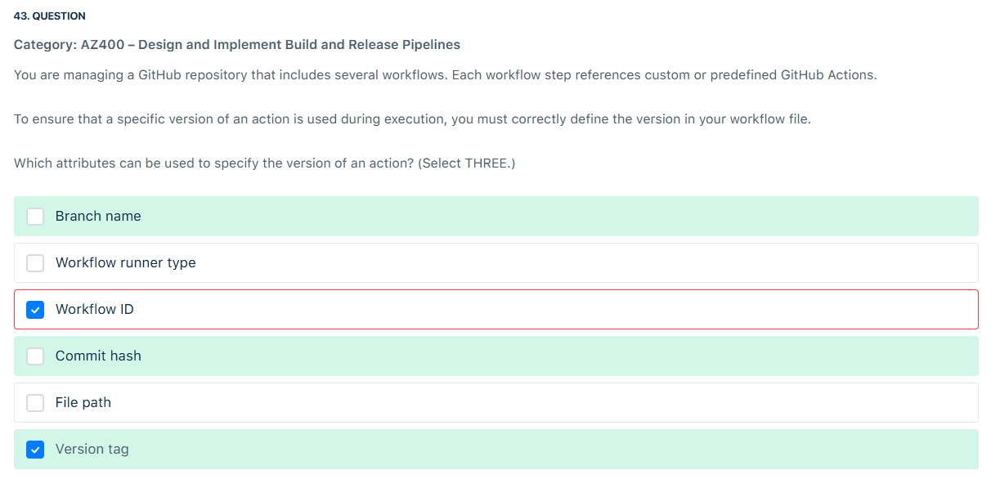
</div>

---

> 👉🏻 **Explanation**  
> **GitHub Workflows** – These are automated processes that you can set up in your GitHub repository to build, test, package, release, or deploy any project on GitHub.
>
> **GitHub Actions** – These are individual tasks that you can combine to create jobs and customize your workflow. Actions are the smallest portable building block of a workflow.
>
> **Workflow File** is a YAML file that defines your GitHub Actions workflow. It specifies what should happen when certain events occur in your repository.
>
>  <div align="left">
>    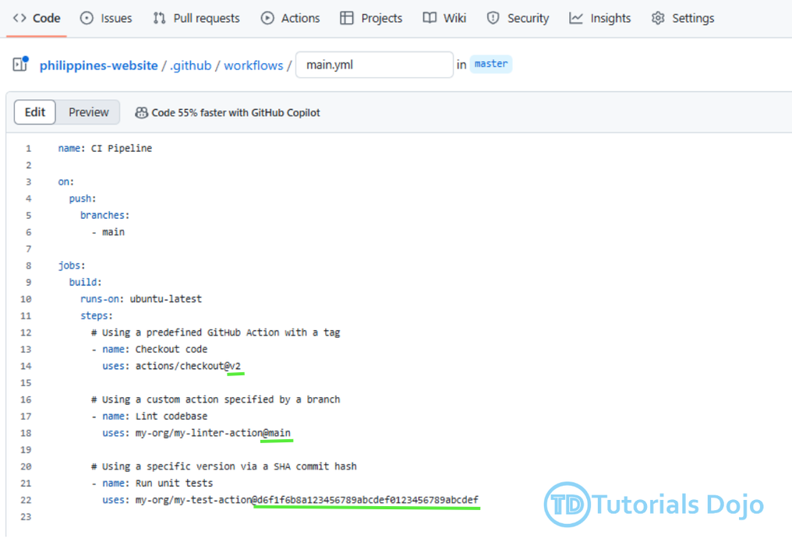
>  </div>
>
> References:
>
> <https://docs.github.com/en/actions/sharing-automations/creating-actions/about-custom-actions#good-practices-for-release-management>
>
> <https://docs.github.com/en/actions/writing-workflows/workflow-syntax-for-github-actions>

---
