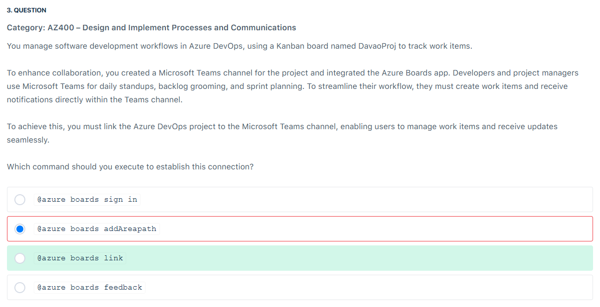
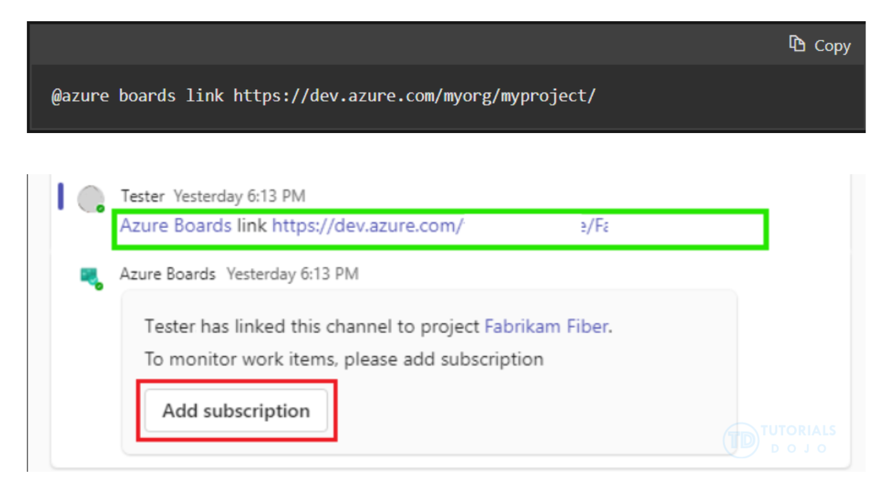
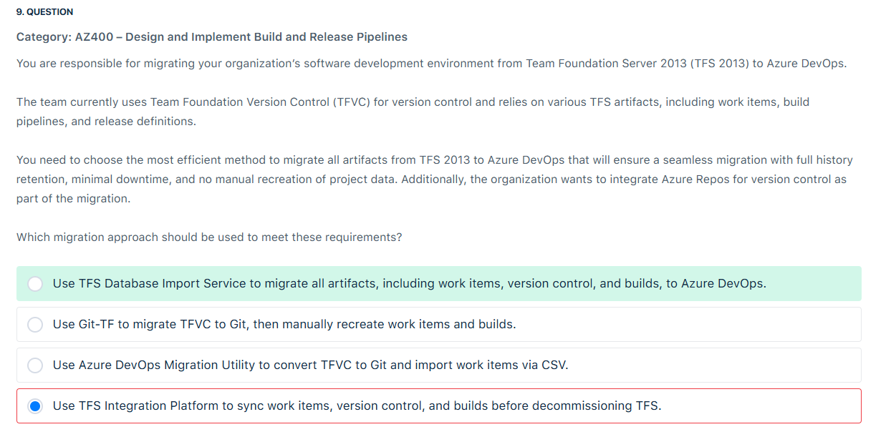
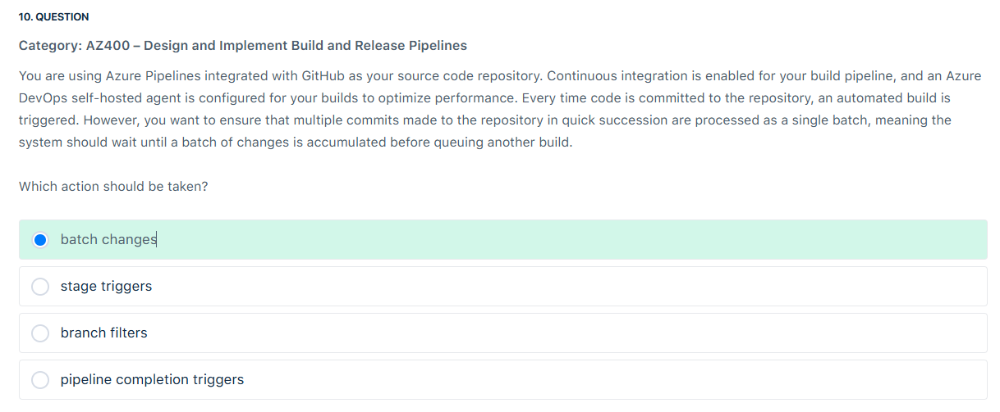
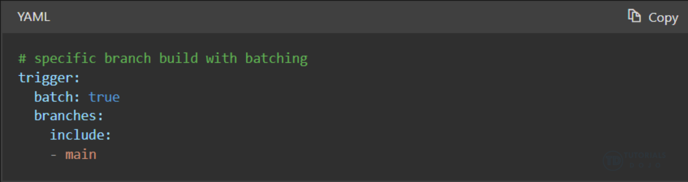
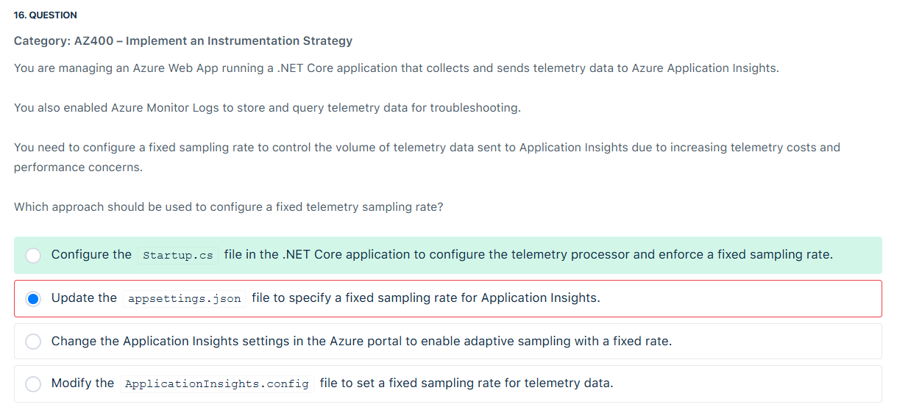
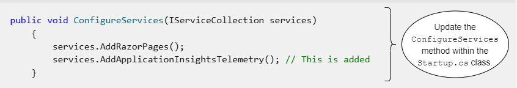
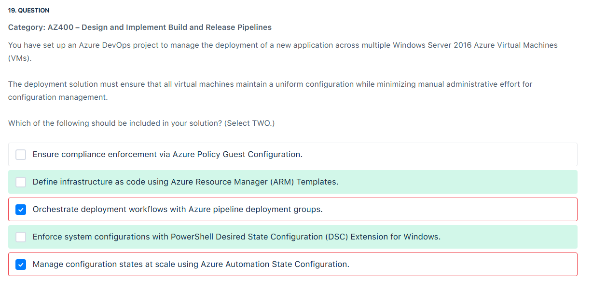

# 📋 Review Mode Set 3

## ⁉️ Q3

<div align="left">
  
</div>

---

> 👉🏻 **Explanation**
>
> <div align="left">
>   
> </div>
>
> The @azure boards link command connects your Azure DevOps project to a Microsoft Teams channel, enabling seamless integration between Azure Boards and Teams. By executing this command, users can link their Azure DevOps project to the Teams channel, allowing team members to manage work items, view updates, and receive notifications directly within Teams. This integration simplifies the workflow for developers and project managers by providing a unified platform for collaboration, making it easier to track progress, assign tasks, and stay informed about important project updates.
>
> With the Azure Boards app integrated into Microsoft Teams, the the @azure boards link command allows teams to interact with their Kanban boards and work items without switching contexts between applications. Once linked, users can create new work items, update existing ones, and receive real-time notifications about work item changes, all within the Teams interface. This reduces the need for manual updates and ensures that teams can act on new information quickly and efficiently. By leveraging this integration, teams can streamline workflow and enhance collaboration during daily standups, backlog grooming, and sprint planning sessions.
>
> References:
>
> <https://learn.microsoft.com/en-us/azure/devops/boards/integrations/boards-teams?view=azure-devops>
>
> <https://learn.microsoft.com/en-us/azure/devops/boards/get-started/what-is-azure-boards?view=azure-devops>

---

## ⁉️ Q9

<div align="left">
  
</div>

---

> 👉🏻 **Explanation**
>
> ---
>
> 🏛 What is TFS?
>
> - **TFS (Team Foundation Server)** = the **on-premises predecessor** of **Azure DevOps**.
> - Microsoft’s evolution looks like this:
>
>   ```ini
>   TFS → VSTS (Visual Studio Team Services, cloud) → Azure DevOps (cloud + on-prem Azure DevOps Server)
>   ```
>
> - TFS provided:
>
>   - **Source control** → TFVC (Team Foundation Version Control, centralized VCS like SVN).
>   - **Work item tracking** → requirements, bugs, tasks.
>   - **Build/release pipelines** → early CI/CD system.
>   - **Test case management**.
>
> So **Azure DevOps** is basically the modern version of TFS with more features and cloud-first architecture.
>
> ---
>
> 🚚 Why migrate?
>
> The question describes an organization **still using TFS 2013** (very old).
> They want to move to **Azure DevOps** because:
>
> - Cloud integration.
> - Git-based source control (instead of TFVC).
> - Modern CI/CD pipelines.
> - Better DevOps features like artifacts, dashboards, service connections.
>
> ---
>
> 🔑 The Exam Options:
>
> 1. **TFS Database Import Service** ✅
>
>    - Best choice.
>    - Allows **direct import of all TFS collections** into Azure DevOps **with full history (work items, builds, repos, pipelines)**.
>    - Ensures minimal downtime and no manual recreation.
>
> 2. **Git-TF** ❌
>
>    - Old tool to migrate **only source code from TFVC to Git**.
>    - Doesn’t migrate work items, builds, or pipelines.
>    - Requires manual recreation = not efficient.
>
> 3. **Azure DevOps Migration Utility + CSV** ❌
>
>    - Copies TFVC → Git, then imports work items via CSV.
>    - Manual, incomplete, error-prone.
>
> 4. **TFS Integration Platform** ❌
>
>    - Very old sync tool.
>    - Doesn’t support modern Azure DevOps migration properly.
>    - Obsolete.
>
> ---
>
> 🎯 Correct Answer
>
> 👉 **Use TFS Database Import Service to migrate all artifacts, including work items, version control, and builds, to Azure DevOps.**
>
> ---
>
> 🧠 How to remember in exam
>
> - If you see **“migrate everything with full history, minimal downtime”** → **Database Import Service**.
> - If you see **“only migrate source code TFVC → Git”** → Git-TF or Migration Utility.
> - If you see **“sync tool”** → that’s the old TFS Integration Platform (bad choice).
>
> References:
>
> - <https://devblogs.microsoft.com/devops/import-your-tfs-database-into-visual-studio-team-services/>
> - <https://learn.microsoft.com/en-us/azure/devops/migrate/migration-overview?view=azure-devops>
> - <https://learn.microsoft.com/en-us/previous-versions/azure/devops/server/install-tfs/backup-and-restore-data?view=tfs-2013>

---

## ⁉️ Q10

<div align="left">
  
</div>

---

> 👉🏻 **Explanation**  
> In Azure Pipelines, the batch changes feature helps optimize the build process by reducing unnecessary builds when multiple commits are made in quick succession. When developers push several commits to a repository, this feature ensures that the system waits until a batch of changes is accumulated, triggering a build only once for the entire set of commits rather than triggering separate builds for each individual change. This helps prevent the system from being overwhelmed with multiple build requests, reducing build times and conserving computational resources.
>
> <div align="left">
>   
> </div>
>
> References:
>
> <https://learn.microsoft.com/en-us/azure/devops/pipelines/repos/github?view=azure-devops&viewFallbackFrom=azure-pipelines&tabs=yaml>
>
> <https://learn.microsoft.com/en-us/azure/devops/pipelines/get-started/key-pipelines-concepts?view=azure-devops>

---

## ⁉️ Q16

<div align="left">
  
</div>

---

> 👉🏻 **Explanation**  
> In a .NET Core application, configuring a fixed sampling rate must be done programmatically in the Startup.cs file.
>
> <div align="left">
>   
> </div>
>
> Application Insights transmits telemetry data from your web application to the Azure portal, allowing you to analyze your application’s performance and usage. The telemetry model is standardized, enabling platform- and language-independent monitoring.
>
> Azure Application Insights utilizes fixed-rate and adaptive sampling to control the amount of telemetry data sent to Azure Monitor. Fixed-rate sampling guarantees that only a defined percentage of requests and dependencies are transmitted, which helps reduce costs and enhance performance.
>
> You have the flexibility to customize the Application Insights SDK for ASP.NET Core and change the default configuration. You can modify the settings using the `ApplicationInsights.config` file or by adjusting `TelemetryConfiguration.Active`. For ASP.NET Core, most configuration changes should be made in the `ConfigureServices()` method of your `Startup.cs` class, unless advised otherwise.
>
> References:
>
> <https://learn.microsoft.com/en-us/azure/azure-monitor/app/data-model-complete>
>
> <https://learn.microsoft.com/en-us/azure/azure-monitor/app/telemetry-channels>
>
> <https://learn.microsoft.com/en-us/azure/azure-monitor/app/asp-net-core>

---

## ⁉️ Q19

<div align="left">
  
</div>

---

> 👉🏻 **Explanation**  
> Azure Resource Manager (ARM) Templates allow for declarative provisioning of Azure resources, ensuring that virtual machines and related configurations remain consistent across deployments. Using ARM templates, you can define VM settings, networking, and storage in a structured infrastructure as code (IaC) format. This significantly reduces manual effort and ensures uniform configurations across all Azure Virtual Machines (VMs).
>
> The PowerShell DSC Extension ensures that Windows Server 2016 VMs remain consistent and compliant by automatically applying and maintaining predefined configurations. DSC helps in managing software installations, security settings, and system policies, reducing the administrative overhead needed to configure each VM manually.
