# 📋 Practice Test 1

## ⁉️ Q5

  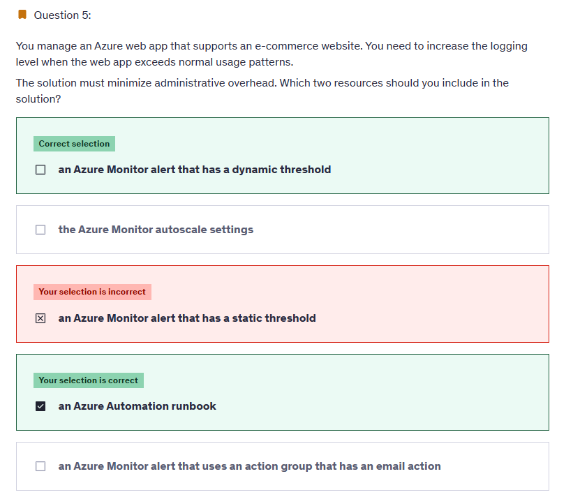

---

> 👉🏻 **Explanation**  
> Metric Alert with Dynamic Thresholds detection leverages advanced machine learning (ML) to learn metrics' historical behavior, identify patterns and anomalies that indicate possible service issues. It provides support of both a simple UI and operations at scale by allowing users to configure alert rules through the Azure Resource Manager API, in a fully automated manner. A: You can use Azure Monitor to monitor base-level metrics and logs for most services in Azure. You can call Azure Automation runbooks by using action groups or by using classic alerts to automate tasks based on alerts.
>
> Reference:
>
> - <https://docs.microsoft.com/en-us/azure/azure-monitor/platform/alerts-dynamicthresholds>
> - <https://docs.microsoft.com/en-us/azure/automation/automation-createalert-triggered-runbook>

---

## ⁉️ Q10

  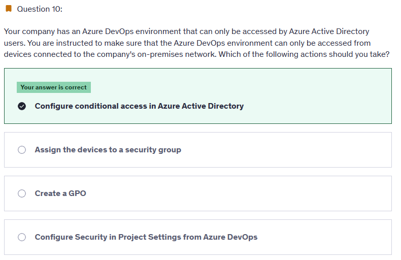

---

> 👉🏻 **Explanation**  
> MConditional Access is a capability of Azure Active Directory. With Conditional Access, you can implement automated access control decisions for accessing your cloud apps that are based on conditions. Conditional Access policies are enforced after the first-factor authentication has been completed..
>
> Reference:
>
> - <https://learn.microsoft.com/en-us/entra/identity/conditional-access/overview>

---

## ⁉️ Q12

  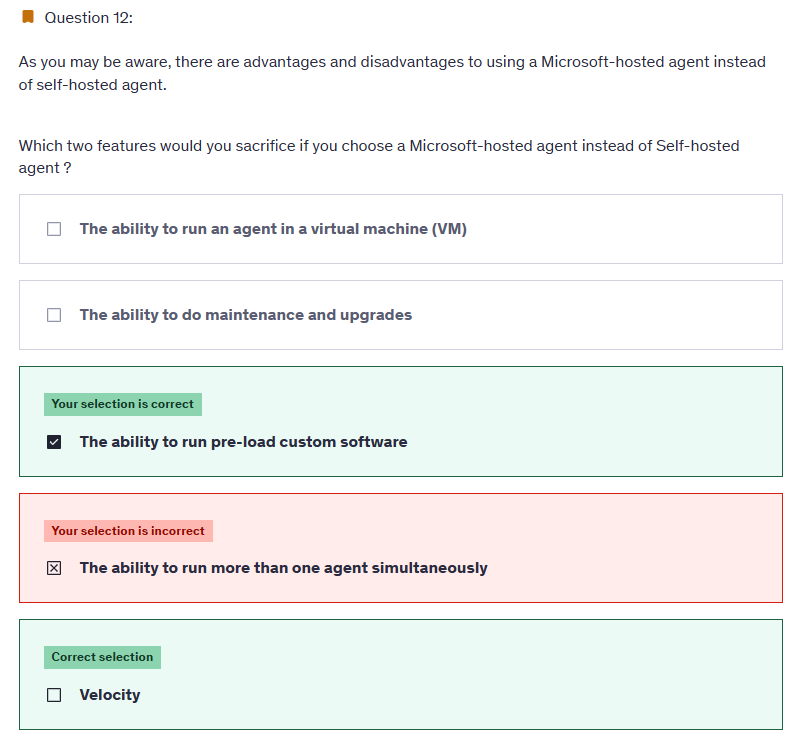

---

> 👉🏻 **Explanation**
>
> - Microsoft-hosted agents lack the same level of flexibility as self-hosted agents when it comes to pre-loading custom software.
> - Microsoft-hosted agents initiate a new virtual machine (VM) for each run, resulting in the absence of caching and the inability to save configurations. Consequently, Microsoft-hosted agents may exhibit slower performance when compared to self-hosted agents.
> - Opting for a Microsoft-hosted agent does not require you to sacrifice the capability of performing maintenance and upgrades, as these tasks are automated.
> - Microsoft-hosted agents provision a new VM for each build run, which means that you do not compromise this feature when selecting a Microsoft-hosted agent over a self-hosted agent.
> - Microsoft-hosted agents do not impose limitations on running multiple builds with more than one agent concurrently, preserving this feature when choosing a Microsoft-hosted agent over a self-hosted agent.

---

## ⁉️ Q19

  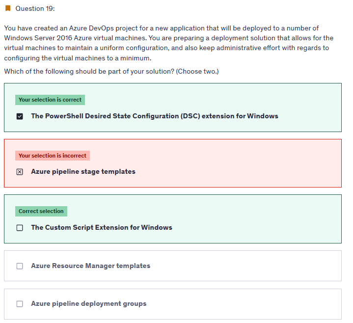

---

> 👉🏻 **Explanation**
>
> **✅ the answer:**
>
> - **The PowerShell Desired State Configuration (DSC) extension for Windows**
> - **The Custom Script Extension for Windows**
>
> **🤔 Why This Is the Best Answer:**
> The question is about keeping multiple Windows Server 2016 Azure VMs in a **uniform configuration** with **minimal admin effort**.
>
> - **DSC extension** enforces configuration consistency across VMs (roles, features, registry, packages). It continuously ensures compliance with the declared state.
> - **Custom Script Extension** lets you automate repetitive administrative actions (like installing custom apps, running setup commands, or post-deployment configuration). Combined with DSC, this reduces ongoing manual work and keeps environments aligned.
>
> **❌ Why Other Options Are Wrong:**
>
> - **Azure pipeline stage templates**: These help DevOps teams reuse pipeline logic (YAML snippets), but they don’t enforce VM configuration or uniform state. Wrong scope.
>
> - **Azure Resource Manager templates**: ARM templates provision resources (like creating VMs, networks, storage). They don’t handle **in-VM configuration management** after deployment. That’s DSC’s job.
>
> - **Azure pipeline deployment groups**: These organize target machines for pipeline deployments, but they don’t solve **uniform state/configuration compliance**. They’re about pipeline targeting, not ongoing config enforcement.

---

## ⁉️ Q20

  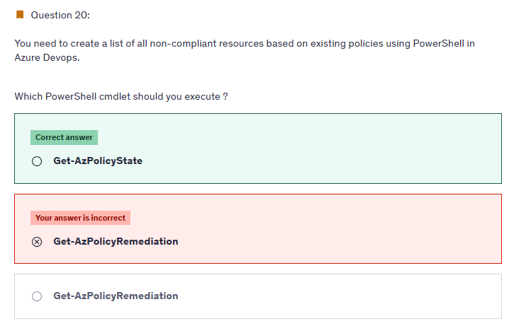

---

> 👉🏻 **Explanation**
>
> <https://learn.microsoft.com/en-us/azure/governance/policy/assign-policy-powershell>

## ⁉️ Q23

  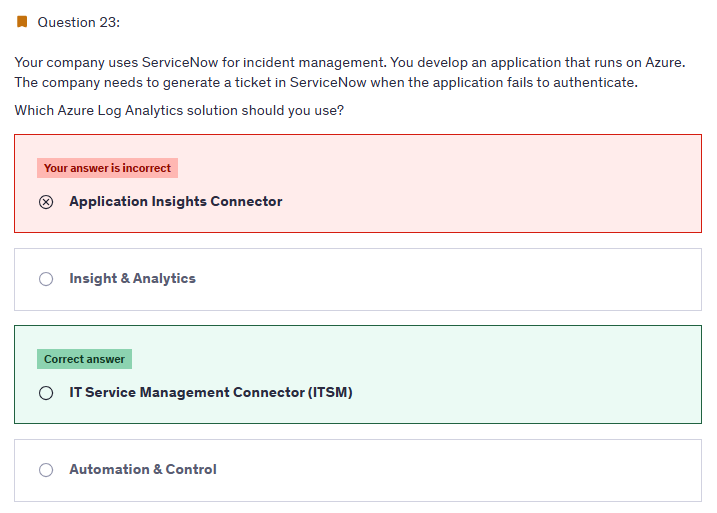

---

> 👉🏻 **Explanation**
>
> The IT Service Management Connector (ITSMC) allows you to connect Azure and a supported IT Service Management (ITSM) product/service. ITSMC supports connections with the following ITSM tools:
>
> ServiceNow
>
> System Center Service Manager
>
> Provance
>
> Cherwell
>
> With ITSMC, you can - Create work items in ITSM tool, based on your Azure alerts (metric alerts, Activity Log alerts and Log Analytics alerts). Optionally, you can sync your incident and change request data from your ITSM tool to an Azure Log Analytics workspace.
>
> Reference:
>
> <https://learn.microsoft.com/en-us/azure/azure-monitor/alerts/itsmc-overview>

---

## ⁉️ Q26

  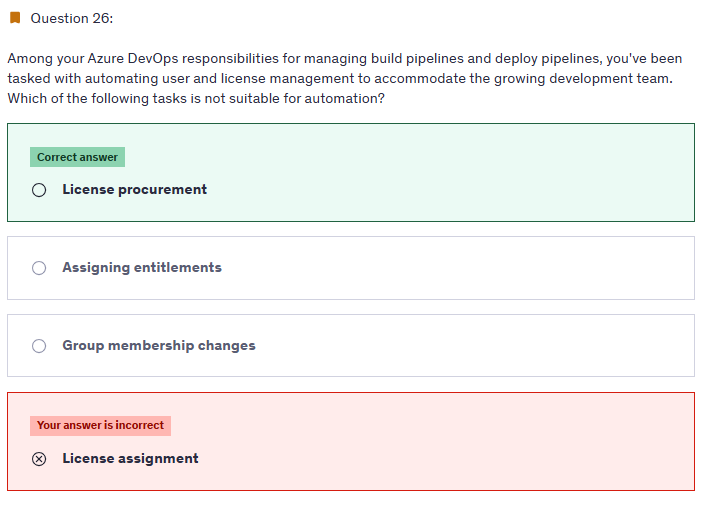

---

### 📝 The Question (rephrased)

You are managing **Azure DevOps** responsibilities, specifically around **user and license management**.
The question asks: _Which task is **NOT suitable for automation**?_

### ✅ the answer:

**License procurement!**

### 🤔 Why This Is the Best Answer:

- **License procurement** means **buying new licenses** (e.g., purchasing more Azure DevOps Basic licenses, Test Plans, or Visual Studio subscriptions).
- This requires **financial approval and manual purchase** through billing systems (Azure Portal / Microsoft Admin Center).
- Since it involves money, contracts, and billing, it is **not automatable** in Azure DevOps.

### ❌ Why Other Options Are Wrong:

- **Assigning entitlements**:

  - Entitlements = what access level a user has (e.g., Basic, Stakeholder, VS Subscriber).
  - You can automate entitlement assignment using **Azure DevOps REST API** or **Azure CLI**.
  - Example: When a new dev joins, a script can auto-assign them a “Basic” license.

- **Group membership changes**:

  - Group memberships control permissions (e.g., adding a user to “Contributors” or “Project Administrators”).
  - These can also be automated using REST APIs or scripts.
  - Example: New hire automation → Add user to “Dev Team” group.

- **License assignment**:

  - This is **different from procurement**.
  - Procurement = buy the license.
  - Assignment = give an already purchased license to a user.
  - Assignments **can be automated** using APIs.

### 🎯 Mini Memory Hook

- **Procurement = \$\$\$ → manual**
- **Assignment = automation possible**
- **Entitlements = automation possible**
- **Groups = automation possible**

---

## ⁉️ Q27

  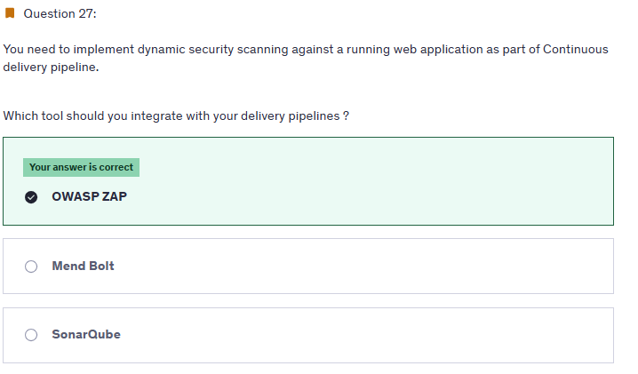

---

> 👉🏻 **Explanation**
>
> **🤔 Why This Is the Best Answer:**
>
> - The requirement is **dynamic security scanning** → which means scanning a **running web application** for vulnerabilities (SQL injection, XSS, misconfigurations, etc.).
> - **OWASP ZAP (Zed Attack Proxy)** is an **open-source DAST (Dynamic Application Security Testing)** tool.
> - It integrates with CI/CD pipelines to automatically test deployed apps, simulate attacks, and detect vulnerabilities at runtime.
> - Perfect match for "dynamic security scanning against a running app."
>
> ---
>
> **❌ Why Other Options Are Wrong:**
>
> - **Mend Bolt**:
>
>   - A tool for **SCA (Software Composition Analysis)** → scans dependencies and open-source libraries for known vulnerabilities.
>   - This is **static dependency scanning**, not dynamic runtime testing.
>
> - **SonarQube**:
>
>   - A tool for **SAST (Static Application Security Testing)** + code quality.
>   - Scans **source code** for bugs, code smells, and security vulnerabilities **before build**.
>   - Not used for scanning **live running applications**.

---

## ⁉️ Q29

  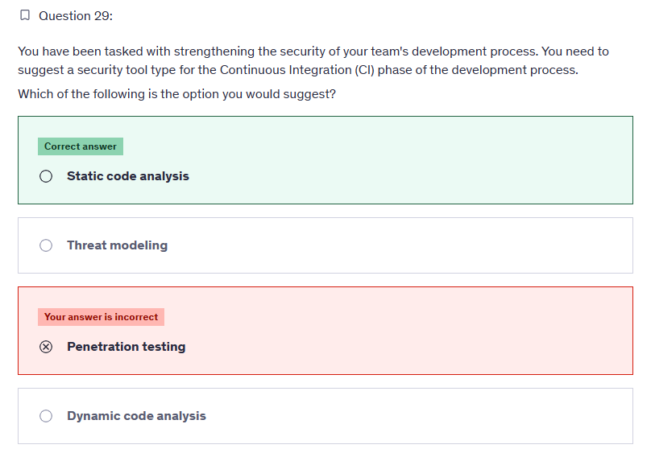

---

> 👉🏻 **Explanation**  
> In the CI/CD process, validation initiates prior to developers committing their code. The initial layer of defense is offered by static code analysis tools integrated into the IDE, which aids in preventing the introduction of security vulnerabilities into the CI/CD pipeline.
>
> <https://learn.microsoft.com/en-us/azure/devops/pipelines/security/overview?view=azure-devops&viewFallbackFrom=vsts>

---

## ⁉️ Q30

  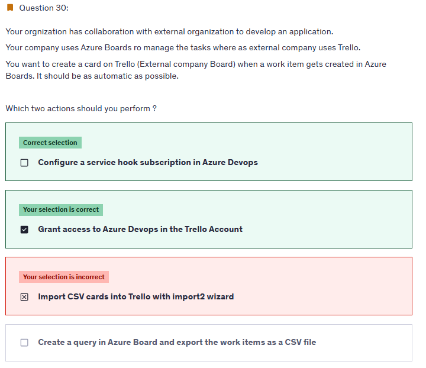

---

> 👉🏻 **Explanation**
>
> <https://learn.microsoft.com/en-us/azure/devops/service-hooks/overview?view=azure-devops>

---

## ⁉️ Q32

  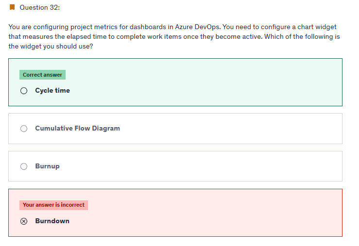

---

> 👉🏻 **Explanation**  
> Cycle time measures the time it takes for your team to complete work items once they begin actively working on them.
>
> Reference:
>
> <https://learn.microsoft.com/en-us/azure/devops/report/dashboards/cycle-time-and-lead-time?view=azure-devops&viewFallbackFrom=vsts>

---

## ⁉️ Q33

  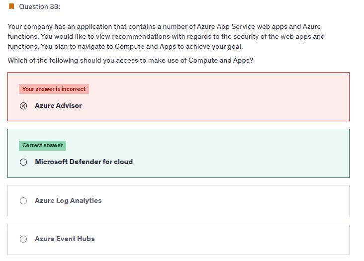

---

> 👉🏻 **Explanation**  
> Reference:
>
> <https://learn.microsoft.com/en-us/azure/defender-for-cloud/defender-for-cloud-introduction>

## ⁉️ Q35

  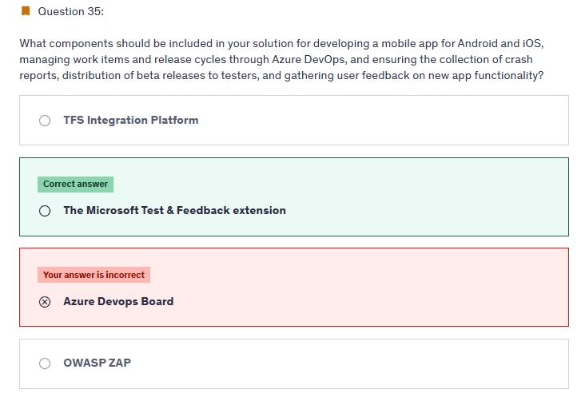

---

> 👉🏻 **Explanation**  
> The "Exploratory Testing" extension is now "Test & Feedback" and is now Generally Available.Anyone can now test web apps and give feedback, all directly from the browser on any platform: Windows, Mac, or Linux. Available for Google Chrome and Mozilla Firefox (required version 50.0 or above) currently. Support for Microsoft Edge is in the pipeline and will be enabled once Edge moves to a Chromium- compatible web platform.
>
> Reference:
>
> <https://marketplace.visualstudio.com/items?itemName=ms.vss-exploratorytesting-web>

---

## ⁉️ Q36

  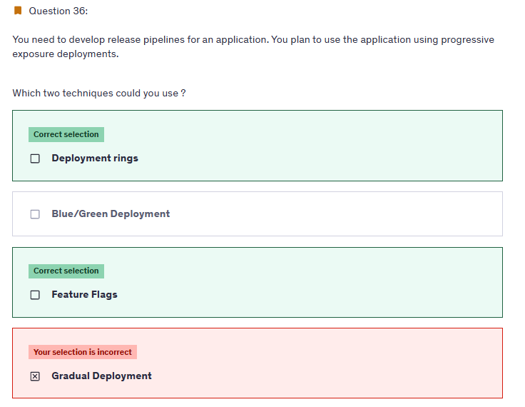

---

> 👉🏻 **Explanation**  
> You could use deployment rings. This technique, also known as canary deployment, allows you to gradually expose the new version of the application only to some users. This exposure can be controlled at the load balancing layer, using application settings or during application runtime.
>
> You could use feature flags. Feature flags are used to turn application features on or off. They are either flags controlled via application configuration or as an opt-in feature individually by users. They are generally used to test experimental features with a limited number of users or to disable application features without a new deployment.

---

## ⁉️ Q39

  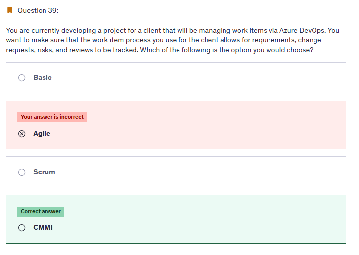

---

> 👉🏻 **Explanation**  
> Choose CMMI when your team follows more formal project methods that require a framework for process improvement and an auditable record of decisions. With this process, you can track requirements, change requests, risks, and reviews. Incorrect Answers: A. Choose Basic when your team wants the simplest model that uses Issues, Tasks, and Epics to track work. B. This process works great if you want to track user stories and (optionally) bugs on the Kanban board, or track bugs and tasks on the taskboard. C. This process works great if you want to track product backlog items (PBIs) and bugs on the Kanban board, or break PBIs and bugs down into tasks on the taskboard.
>
> Reference:
>
> <https://learn.microsoft.com/en-us/azure/devops/boards/work-items/guidance/choose-process?view=azure-devops&tabs=agile-process>

---

## 📒 **Notes Questions**

- Review logs query
