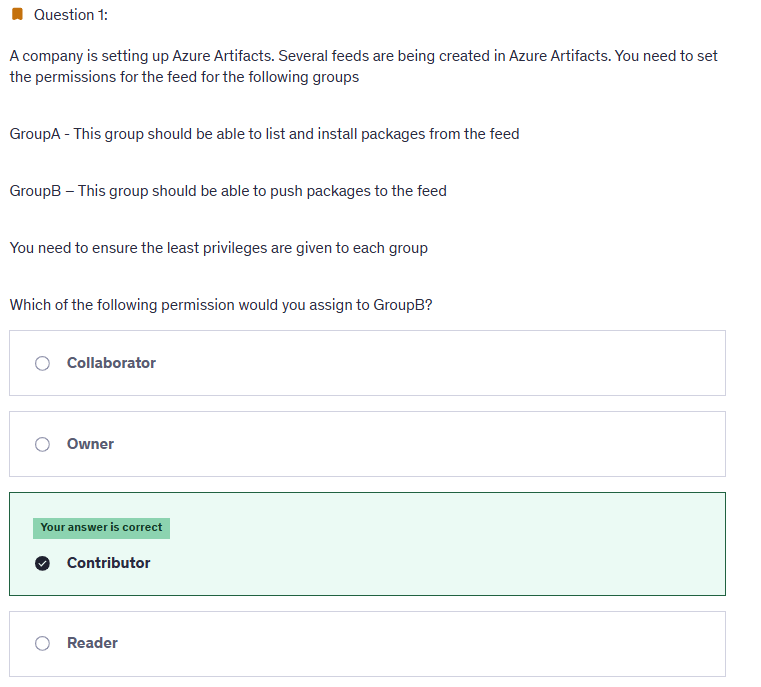
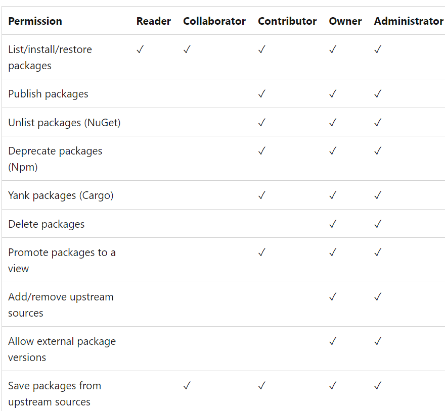
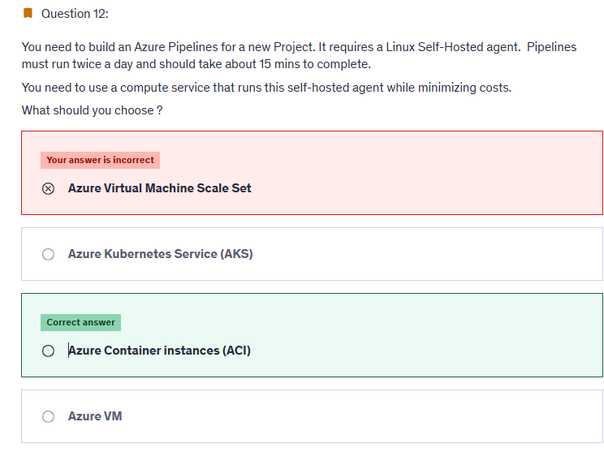
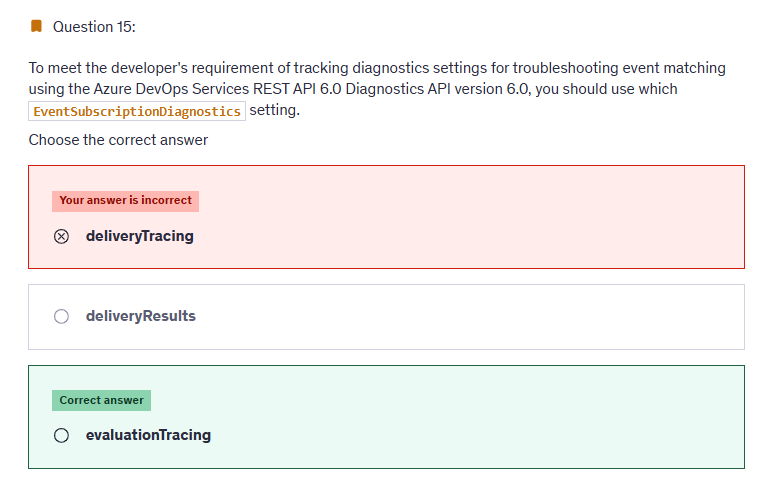

# 📋 Practice Test 2

## ⁉️ Q1

<div align="left">
  
</div>

---

> 👉🏻 **Explanation**  
> 🧩 **Azure Artifacts Feed Roles**
>
> When working with **feeds in Azure Artifacts**, permissions are controlled by **feed roles**, not the general project roles (like Project Administrators or Contributors).
>
> Here are the feed-specific roles:
>
> | **Role**         | **What they can do**                                                                 |
> | ---------------- | ------------------------------------------------------------------------------------ |
> | **Reader**       | Can **view** packages and **install** them (no publishing).                          |
> | **Contributor**  | Can **push (publish)** new package versions, and also install/view packages.         |
> | **Collaborator** | Can **deprecate/unlist/delete** packages and manage views (but not the feed itself). |
> | **Owner**        | Full control over the feed: manage permissions, delete feed, etc.                    |
>
> <div align="left">
>   
> </div>
>
> 🎯 In the Question
>
> - **GroupA** = should **list & install packages** → **Reader** is enough.
> - **GroupB** = should **push packages** → requires **Contributor** (least privilege for publishing).
>
> That’s why the correct answer = **Contributor** ✅
>
> ---
>
> 🔑 **Why you don’t see “Collaborator” or “Owner” elsewhere**
>
> - Those roles are **specific to Azure Artifacts feeds**.
> - In the general Azure DevOps **project-level security groups**, you’ll see things like **Project Administrators, Contributors, Readers**.
> - But in **Artifacts**, you get an extra set of **feed roles** (Reader, Contributor, Collaborator, Owner).
>
> Think of it like this:
>
> ```mermaid
> flowchart TD
>     A[User License 🎟️ Access Level] --> B[Azure DevOps Features Visible]
>     A --> C[Security Group 🔑 Project-level Permissions]
>     A --> D[Feed Role 📦 Artifacts-specific Permissions]
> ```
>
> - Access Level = license (Basic, Stakeholder, Test Plans).
> - Security Group = general project permissions (Repos, Pipelines, Boards).
> - Feed Role = package feed permissions (Reader, Contributor, Collaborator, Owner).

---

## ⁉️ Q12

<div align="left">
  
</div>

---

> 👉🏻 **Explanation**  
> You should choose Azure Container Instances (ACI). You can run a Linux self-hosted agent as a Docker container running in ACI. This is the most cost-effective solution because you will be charged only for the container execution in ACI.
>
> You should not choose Azure Kubernetes Service (AKS). Deploying an AKS cluster requires greater administrative efforts and it is more expensive because you need to maintain worker nodes running even if the pipeline is not running, which increases the solution costs.
>
> You should not choose Azure Virtual Machine (VM). Using an Azure VM as a self-hosted agent will incur costs during the idle periods that the pipeline is not running.
>
> You should not choose Azure VM scale set. You could use an Azure VM scale set to scale self-hosted agents into multiple compute nodes. However, this will incur extra costs during idle time.

---

## ⁉️ Q15

<div align="left">
  
</div>

---

> 👉🏻 **Explanation**
>
> - The question is about **tracking diagnostics for troubleshooting event matching** in **Azure DevOps Services REST API (Diagnostics API v6.0)**.
>
> - When dealing with **Service Hooks / Event Subscriptions**, there are **two key steps**:
>
>   1. **Evaluation** → Matching the event against the subscription filter (Did the event qualify?).
>   2. **Delivery** → Sending the event to the consumer (Did the event get delivered?).
>
> - **evaluationTracing** enables tracing at the **event matching stage** → which is exactly what the question asks.
>
> - It helps identify **why an event did or did not match** the subscription criteria.
>
> ---
>
> **❌ Why Other Options Are Wrong:**
>
> - **deliveryTracing**:
>
>   - Used for diagnosing the **delivery phase**, e.g., was the event sent successfully, did it fail, was there an HTTP error?
>   - Not useful if the problem is about **event matching** (the event never triggered).
>
> - **deliveryResults**:
>
>   - Provides a summary of the **results of delivery attempts** (success/failure, retry info).
>   - Again, related to delivery, not to matching.
>
> ---
>
> **🧠 Mini Memory Hook:**
>
> - **evaluationTracing** = “Did the event match?”
> - **deliveryTracing** = “Was it delivered successfully?”
> - **deliveryResults** = “Show me the outcomes of delivery attempts.”

## 📒 **Notes Questions**

- Review logs query
