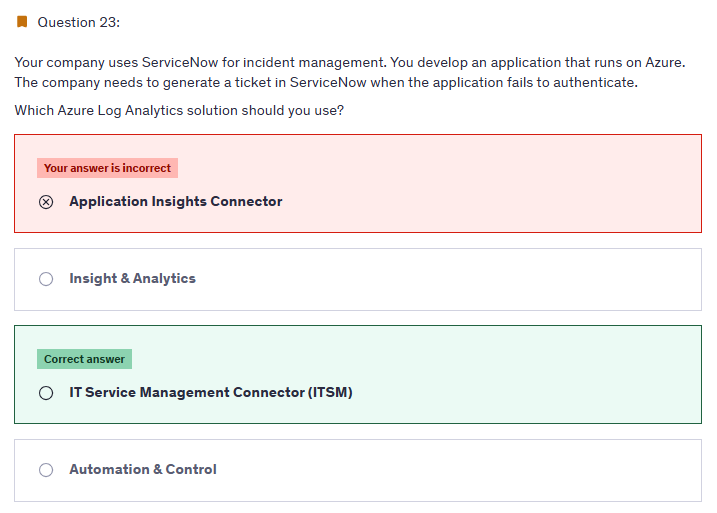

# Practice Test 1

## ⁉️ Q5

  

---

> 👉🏻 **Explanation**  
> Metric Alert with Dynamic Thresholds detection leverages advanced machine learning (ML) to learn metrics' historical behavior, identify patterns and anomalies that indicate possible service issues. It provides support of both a simple UI and operations at scale by allowing users to configure alert rules through the Azure Resource Manager API, in a fully automated manner. A: You can use Azure Monitor to monitor base-level metrics and logs for most services in Azure. You can call Azure Automation runbooks by using action groups or by using classic alerts to automate tasks based on alerts.
>
> Reference:
>
> - <https://docs.microsoft.com/en-us/azure/azure-monitor/platform/alerts-dynamicthresholds>
> - <https://docs.microsoft.com/en-us/azure/automation/automation-createalert-triggered-runbook>

---

## ⁉️ Q10

  

---

> 👉🏻 **Explanation**  
> MConditional Access is a capability of Azure Active Directory. With Conditional Access, you can implement automated access control decisions for accessing your cloud apps that are based on conditions. Conditional Access policies are enforced after the first-factor authentication has been completed..
>
> Reference:
>
> - <https://learn.microsoft.com/en-us/entra/identity/conditional-access/overview>

---

## ⁉️ Q12

  

---

> 👉🏻 **Explanation**
>
> - Microsoft-hosted agents lack the same level of flexibility as self-hosted agents when it comes to pre-loading custom software.
> - Microsoft-hosted agents initiate a new virtual machine (VM) for each run, resulting in the absence of caching and the inability to save configurations. Consequently, Microsoft-hosted agents may exhibit slower performance when compared to self-hosted agents.
> - Opting for a Microsoft-hosted agent does not require you to sacrifice the capability of performing maintenance and upgrades, as these tasks are automated.
> - Microsoft-hosted agents provision a new VM for each build run, which means that you do not compromise this feature when selecting a Microsoft-hosted agent over a self-hosted agent.
> - Microsoft-hosted agents do not impose limitations on running multiple builds with more than one agent concurrently, preserving this feature when choosing a Microsoft-hosted agent over a self-hosted agent.

---

## ⁉️ Q19

  

---

> 👉🏻 **Explanation**
>
> **✅ the answer:**
>
> - **The PowerShell Desired State Configuration (DSC) extension for Windows**
> - **The Custom Script Extension for Windows**
>
> **🤔 Why This Is the Best Answer:**
> The question is about keeping multiple Windows Server 2016 Azure VMs in a **uniform configuration** with **minimal admin effort**.
>
> - **DSC extension** enforces configuration consistency across VMs (roles, features, registry, packages). It continuously ensures compliance with the declared state.
> - **Custom Script Extension** lets you automate repetitive administrative actions (like installing custom apps, running setup commands, or post-deployment configuration). Combined with DSC, this reduces ongoing manual work and keeps environments aligned.
>
> **❌ Why Other Options Are Wrong:**
>
> - **Azure pipeline stage templates**: These help DevOps teams reuse pipeline logic (YAML snippets), but they don’t enforce VM configuration or uniform state. Wrong scope.
>
> - **Azure Resource Manager templates**: ARM templates provision resources (like creating VMs, networks, storage). They don’t handle **in-VM configuration management** after deployment. That’s DSC’s job.
>
> - **Azure pipeline deployment groups**: These organize target machines for pipeline deployments, but they don’t solve **uniform state/configuration compliance**. They’re about pipeline targeting, not ongoing config enforcement.

---

## ⁉️ Q20

  

---

> 👉🏻 **Explanation**
>
> <https://learn.microsoft.com/en-us/azure/governance/policy/assign-policy-powershell>

## ⁉️ Q23

  

---

> 👉🏻 **Explanation**
>
> The IT Service Management Connector (ITSMC) allows you to connect Azure and a supported IT Service Management (ITSM) product/service. ITSMC supports connections with the following ITSM tools:
>
> ServiceNow
>
> System Center Service Manager
>
> Provance
>
> Cherwell
>
> With ITSMC, you can - Create work items in ITSM tool, based on your Azure alerts (metric alerts, Activity Log alerts and Log Analytics alerts). Optionally, you can sync your incident and change request data from your ITSM tool to an Azure Log Analytics workspace.
>
> Reference:
>
> <https://learn.microsoft.com/en-us/azure/azure-monitor/alerts/itsmc-overview>

## 📒 **Notes Questions**

- Review logs query
