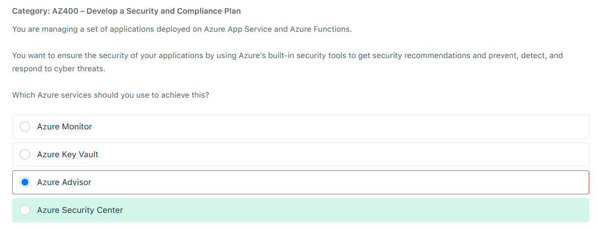
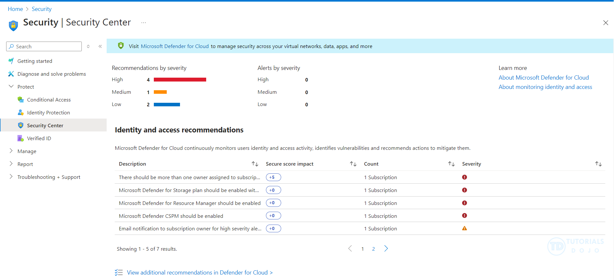
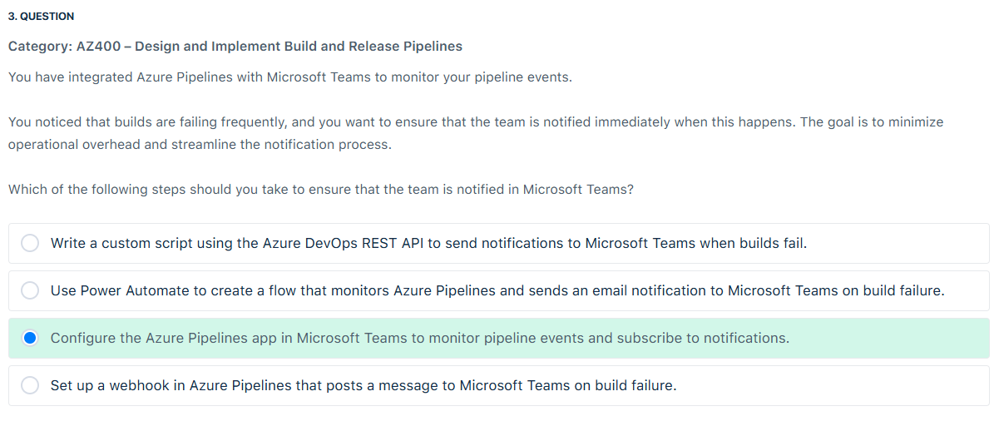
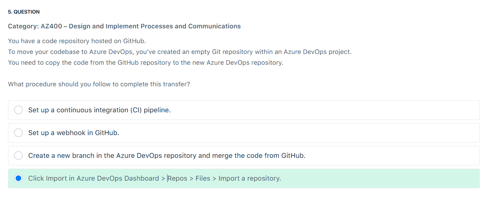
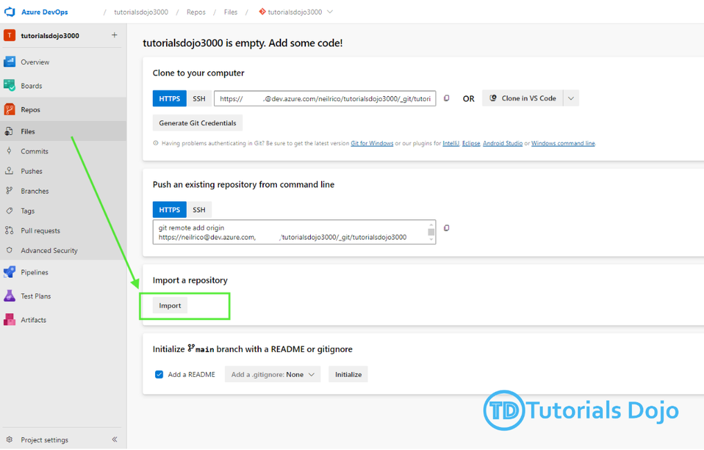
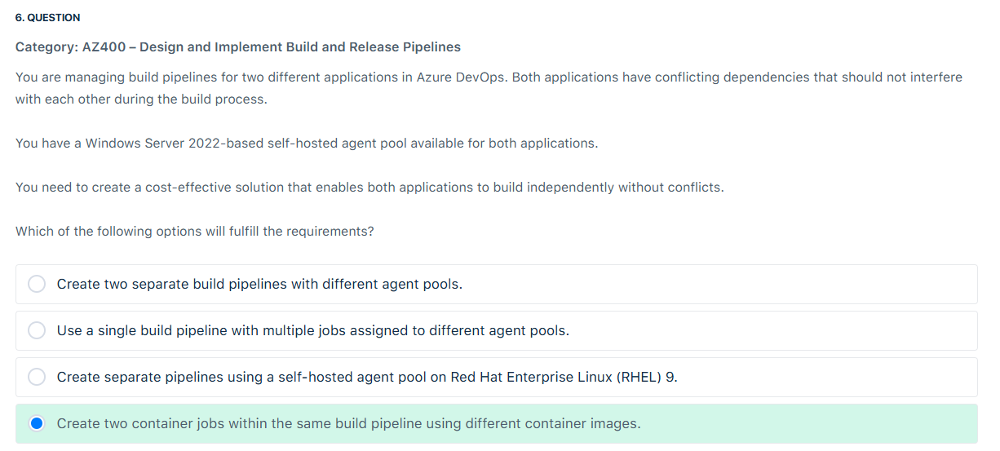
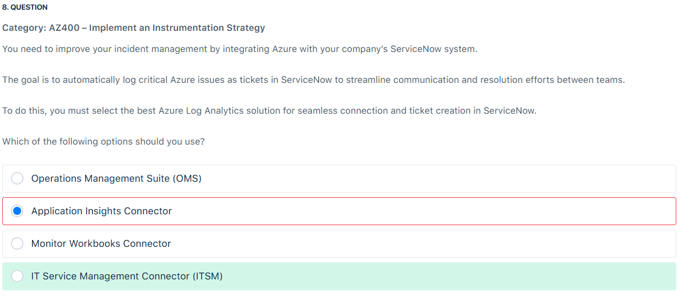

# 📋 Review Mode Diagnostic Test

## ⁉️ Q1

<div align="left">
  
</div>

---

> 👉🏻 **Explanation**  
> The Security Center offers several controls to help minimize exposure to attacks. For example, Adaptive Application Controls use machine learning to recommend whitelisted applications, thereby blocking malware and other unwanted applications from running. Additionally, Just-in-Time VM Access helps protect against threats like brute force attacks by limiting access to virtual machine management ports only when necessary.
>
> It provides comprehensive security management and threat protection for all your Azure resources, including Azure App Service and Azure Functions. The Security Center continually monitors your resources, offers security recommendations, and helps detect, prevent, and respond to cyber threats.
>
> <div align="left">
>   
> </div>
> Hence, the correct answer is: Azure Security Center.
>
> - The option that says: `Azure Advisor` is incorrect. While it provides recommendations to help you optimize your Azure resources for high availability, security, performance, and cost, it does not specialize in real-time threat detection and response.
>
> - The option that says: `Azure Monitor` is incorrect because this service is primarily focused on collecting, analyzing, and acting on telemetry data from your applications and infrastructure. It’s great for monitoring and diagnostics but not specifically for security threat management.
>
> - The option that says: `Azure Key Vault` is incorrect because this service is mainly designed to securely store and manage sensitive information such as keys, secrets, and certificates. It’s vital for securing access to your applications and protecting sensitive data, but it does not provide comprehensive security recommendations or threat detection.
>
> References:
>
> <https://azuremarketplace.microsoft.com/en-us/marketplace/apps/microsoft.azuresecuritycenter>
>
> <https://learn.microsoft.com/en-us/azure/defender-for-cloud/>
>
> Check out these Azure Security Services Cheat Sheets:
>
> <https://tutorialsdojo.com/azure-cheat-sheets-security-services/>

---

## ⁉️ Q3

<div align="left">
  
</div>

---

> 👉🏻 **Explanation**
>
> References:
>
> <https://learn.microsoft.com/en-us/azure/devops/pipelines/integrations/microsoft-teams?view=azure-devops>
>
> <https://appsource.microsoft.com/en-us/product/office/wa200000055>
>
> Check out this Azure DevOps Cheat Sheet:
>
> <https://tutorialsdojo.com/azure-devops/>

---

## ⁉️ Q5

<div align="left">
  
</div>

---

> 👉🏻 **Explanation**
>
> <div align="left">
>   
> </div>

---

## ⁉️ Q6

<div align="left">
  
</div>

---

> 👉🏻 **Explanation**
>
> **✅ Correct Answer:** > **Create two container jobs within the same build pipeline using different container images.**
>
> ---
>
> 🤔 Why This Is the Best Answer:
>
> - You only have **one self-hosted agent pool** (Windows Server 2022).
> - The problem: **both applications have conflicting dependencies** (e.g., one needs Node.js 18, the other needs Python 3.11). If you install both on the same agent machine, you’ll get dependency hell.
> - **Container jobs solve this**:
>
>   - Each job runs inside its **own container image**.
>   - Containers isolate the dependencies (one image can have Node.js, the other Python).
>   - They still run **on the same underlying self-hosted agent**, but the agent just pulls and runs the container image → no conflict.
>
> - Cost-effective: you don’t need **separate agent pools or new VMs** → just reuse the same self-hosted pool and let containers handle isolation.
>
> ---
>
> 🧩 Key Concept: Container Jobs in Azure Pipelines
>
> - A **container job** runs each job in a container defined by a Docker image.
> - It **does not mean Azure Container Instances (ACI)** or a separate Azure service.
> - Instead, your **self-hosted agent** (or Microsoft-hosted agent) pulls the container image and executes steps inside that isolated environment.
> - Example YAML:
>
> ```yaml
> jobs:
>   - job: App1
>     container: mcr.microsoft.com/dotnet/sdk:7.0
>     steps:
>       - script: dotnet build MyApp.sln
>
>   - job: App2
>     container: node:18
>     steps:
>       - script: npm install && npm run build
> ```
>
> 👉 Both jobs run on the same agent pool, but **no dependency conflicts** because each job lives inside its own container.

---

## ⁉️ Q8

<div align="left">
  
</div>

---

> 👉🏻 **Explanation**
>
> - **ITIL** = The official “best practices” framework for ITSM.
> - **ITSM** = Managing IT services in an organized way.
> - **ITSM Tools** = Software like ServiceNow, Remedy, Jira Service Desk (they create and track tickets).
> - **Azure’s role** = Sends its alerts/incidents into ITSM tools via **ITSM Connector**.
