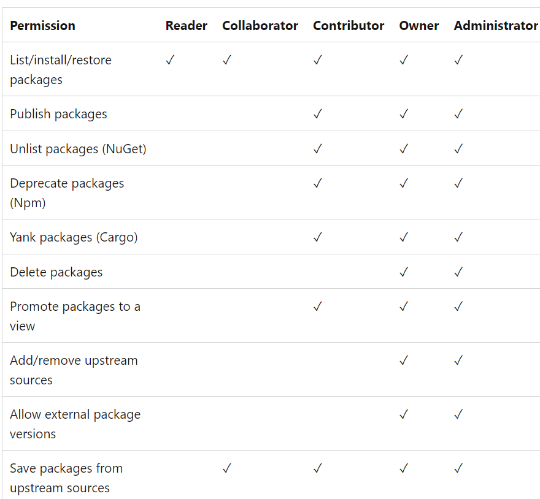
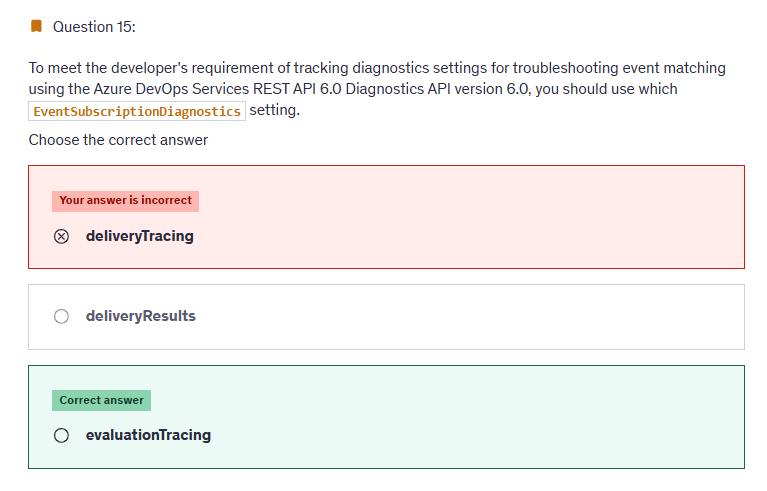
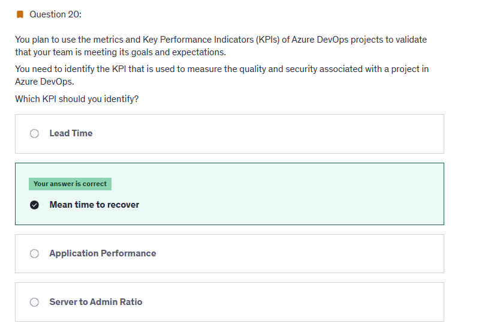
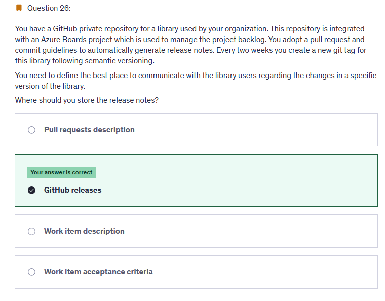
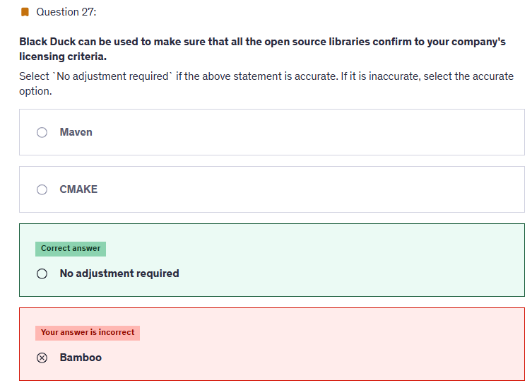
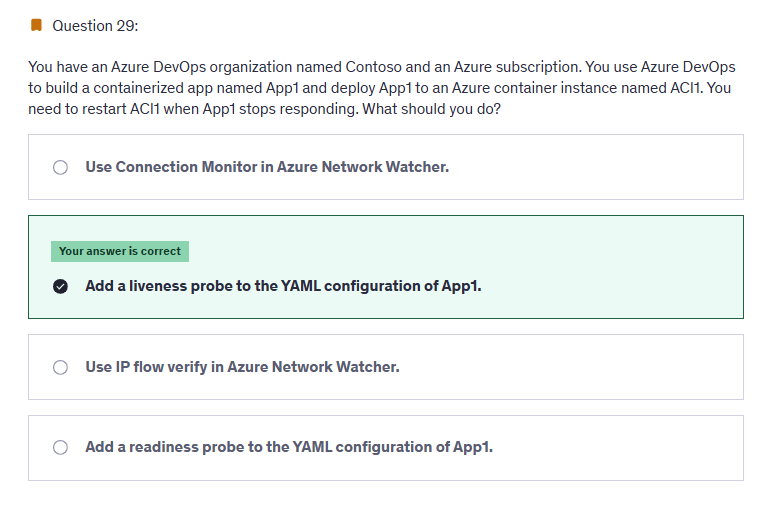
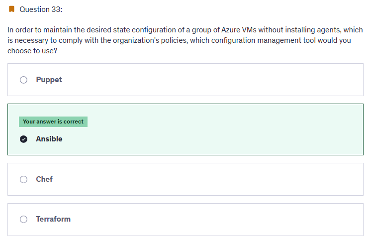
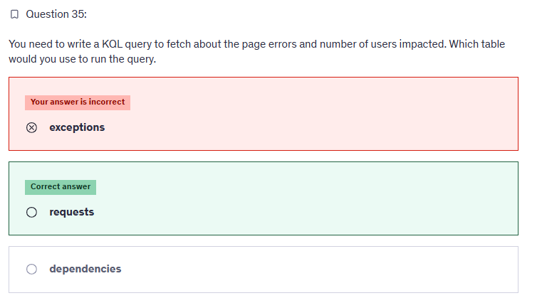
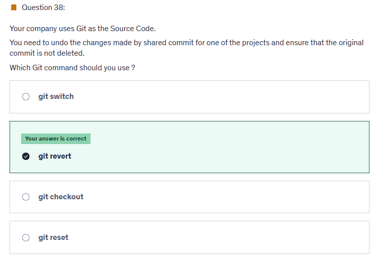
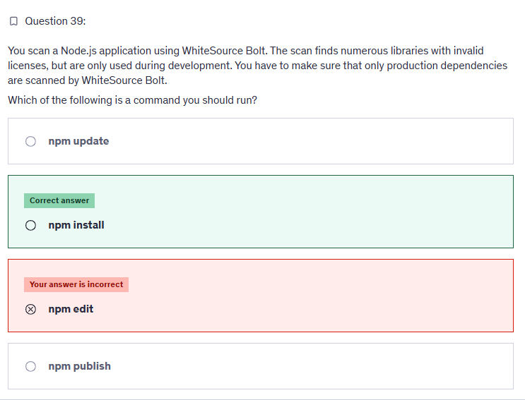

# 📋 Practice Test 2

## ⁉️ Q1

<div align="left">
  
</div>

---

> 👉🏻 **Explanation**  
> 🧩 **Azure Artifacts Feed Roles**
>
> When working with **feeds in Azure Artifacts**, permissions are controlled by **feed roles**, not the general project roles (like Project Administrators or Contributors).
>
> Here are the feed-specific roles:
>
> | **Role**         | **What they can do**                                                                 |
> | ---------------- | ------------------------------------------------------------------------------------ |
> | **Reader**       | Can **view** packages and **install** them (no publishing).                          |
> | **Contributor**  | Can **push (publish)** new package versions, and also install/view packages.         |
> | **Collaborator** | Can **deprecate/unlist/delete** packages and manage views (but not the feed itself). |
> | **Owner**        | Full control over the feed: manage permissions, delete feed, etc.                    |
>
> <div align="left">
>   
> </div>
>
> 🎯 In the Question
>
> - **GroupA** = should **list & install packages** → **Reader** is enough.
> - **GroupB** = should **push packages** → requires **Contributor** (least privilege for publishing).
>
> That’s why the correct answer = **Contributor** ✅
>
> ---
>
> 🔑 **Why you don’t see “Collaborator” or “Owner” elsewhere**
>
> - Those roles are **specific to Azure Artifacts feeds**.
> - In the general Azure DevOps **project-level security groups**, you’ll see things like **Project Administrators, Contributors, Readers**.
> - But in **Artifacts**, you get an extra set of **feed roles** (Reader, Contributor, Collaborator, Owner).
>
> Think of it like this:
>
> ```mermaid
> flowchart TD
>     A[User License 🎟️ Access Level] --> B[Azure DevOps Features Visible]
>     A --> C[Security Group 🔑 Project-level Permissions]
>     A --> D[Feed Role 📦 Artifacts-specific Permissions]
> ```
>
> - Access Level = license (Basic, Stakeholder, Test Plans).
> - Security Group = general project permissions (Repos, Pipelines, Boards).
> - Feed Role = package feed permissions (Reader, Contributor, Collaborator, Owner).

---

## ⁉️ Q12

<div align="left">
  
</div>

---

> 👉🏻 **Explanation**  
> You should choose Azure Container Instances (ACI). You can run a Linux self-hosted agent as a Docker container running in ACI. This is the most cost-effective solution because you will be charged only for the container execution in ACI.
>
> You should not choose Azure Kubernetes Service (AKS). Deploying an AKS cluster requires greater administrative efforts and it is more expensive because you need to maintain worker nodes running even if the pipeline is not running, which increases the solution costs.
>
> You should not choose Azure Virtual Machine (VM). Using an Azure VM as a self-hosted agent will incur costs during the idle periods that the pipeline is not running.
>
> You should not choose Azure VM scale set. You could use an Azure VM scale set to scale self-hosted agents into multiple compute nodes. However, this will incur extra costs during idle time.

---

## ⁉️ Q15

<div align="left">
  
</div>

---

> 👉🏻 **Explanation**
>
> - The question is about **tracking diagnostics for troubleshooting event matching** in **Azure DevOps Services REST API (Diagnostics API v6.0)**.
>
> - When dealing with **Service Hooks / Event Subscriptions**, there are **two key steps**:
>
>   1. **Evaluation** → Matching the event against the subscription filter (Did the event qualify?).
>   2. **Delivery** → Sending the event to the consumer (Did the event get delivered?).
>
> - **evaluationTracing** enables tracing at the **event matching stage** → which is exactly what the question asks.
>
> - It helps identify **why an event did or did not match** the subscription criteria.
>
> ---
>
> **❌ Why Other Options Are Wrong:**
>
> - **deliveryTracing**:
>
>   - Used for diagnosing the **delivery phase**, e.g., was the event sent successfully, did it fail, was there an HTTP error?
>   - Not useful if the problem is about **event matching** (the event never triggered).
>
> - **deliveryResults**:
>
>   - Provides a summary of the **results of delivery attempts** (success/failure, retry info).
>   - Again, related to delivery, not to matching.
>
> ---
>
> **🧠 Mini Memory Hook:**
>
> - **evaluationTracing** = “Did the event match?”
> - **deliveryTracing** = “Was it delivered successfully?”
> - **deliveryResults** = “Show me the outcomes of delivery attempts.”

---

## ⁉️ Q20

<div align="left">
  
</div>

---

> 👉🏻 **Explanation**  
> Mean time to recover is an example of a quality and security metric. Server to Admin Ratio and Application Performance are examples of efficiency metrics. Lead Time is an example of a faster outcome metric.

---

## ⁉️ Q21

<div align="left">
  
</div>

---

> 👉🏻 **Explanation**  
> With deployment rings, you can gradually deploy and validate changes to your extension in production, while limiting the affect on your users.
> It is not recommend deploying to all production environments at the same time, which exposes all users to the changes. A gradual rollout exposes users to the changes over time, validating the changes in production with fewer users.
>
> With feature flags, a team can choose whether a given set of features is visible in the user experience and/or invoked within the functionality. New features can be built and deployed as part of the ordinary development process without having those features available for broad access.
>
> <https://learn.microsoft.com/en-us/azure/devops/migrate/phase-rollout-with-rings?view=azure-devops>
>
> <https://learn.microsoft.com/en-us/devops/operate/progressive-experimentation-feature-flags>

---

## ⁉️ Q26

<div align="left">
  
</div>

---

## ⁉️ Q27

<div align="left">
  
</div>

---

> 👉🏻 **Explanation**
> Secure and Manage Open Source Software Black Duck helps organizations identify and mitigate open source security, license compliance and code-quality risks across application and container portfolios. Black Duck Hub and its plugin for Team Foundation Server (TFS) allows you to automatically find and fix open source security vulnerabilities during the build process, so you can proactively manage risk. The integration allows you to receive alerts and fail builds when any Black Duck Hub policy violations are met.
>
> Reference:
>
> <https://marketplace.visualstudio.com/items?itemName=black-duck-software.hub-tfs>

---

## ⁉️ Q28

<div align="left">
  
</div>

---

> 👉🏻 **Explanation**  
> <https://learn.microsoft.com/en-us/azure/devops/repos/git/branch-policies?view=azure-devops&tabs=browser>
>
> 📖 **Exam Tip (Memorize This Rule):**
>
> 👉 In **Branch Policies** under Repos → Branches → `main`:
>
> - **Require a minimum number of reviewers** → ON
> - **Set number = 3**
> - **Allow requestors to approve their own changes** → ON (since author must be part of the 3)
> - **Optional extras** (not asked here, but appear in exams):
>
>   - Reset votes on push (forces re-review)
>   - Check for linked work items
>   - Check for comment resolution
>   - Build validation policies

---

## ⁉️ Q29

<div align="left">
  
</div>

---

> 👉🏻 **Explanation**  
> A liveness probe is a diagnostic tool used to check the health of a container and determine if it is running properly. By adding a liveness probe to the YAML configuration of App1, you can periodically check if the application is responsive. If the liveness probe fails, indicating that the application is not responding, Azure DevOps can automatically restart ACI1.
>
> <https://learn.microsoft.com/en-us/azure/container-instances/container-instances-liveness-probe>

---

## ⁉️ Q33

<div align="left">
  
</div>

---

> 👉🏻 **Explanation**  
> **You can choose Ansible since it does not require any agent running on the target machine.**
>
> Chef and puppet are also configuration management tools but they require an agent to be installed on target machines.
>
> You should not choose terraform since it is Infrastructure as Code (IaC) tool used to provision virtual machines and other resources.

---

## ⁉️ Q34

<div align="left">
  
</div>

---

> 👉🏻 **Explanation**  
> you can use requests table
>
> requests | where success == 'False' | summarize sum(itemCount) by bin(timestamp, 5m) | render barchart
>
> <https://learn.microsoft.com/en-us/azure/azure-monitor/essentials/app-insights-metrics>

---

## ⁉️ Q38

<div align="left">
  
</div>

---

> 👉🏻 **Explanation**  
> <https://stackoverflow.com/questions/58003030/what-is-the-git-restore-command-and-what-is-the-difference-between-git-restor>

---

## ⁉️ Q39

<div align="left">
  
</div>

---

> 👉🏻 **Explanation**
>
> ❓ Question Recap
>
> - You’re scanning a **Node.js app** with **WhiteSource Bolt** (an open-source security & license scanner).
> - The scan finds libraries with **invalid licenses**.
> - These libraries are **dev-only dependencies** (not part of production).
> - Goal: ensure only **production dependencies** are scanned.
>
> ---
>
> 🟢 Correct Answer → `npm install`
>
> 👉 Why?
>
> - In **Node.js**, when you run:
>
> ```bash
> npm install --production
> ```
>
> …it installs **only production dependencies** (ignores `devDependencies` from `package.json`).
>
> - WhiteSource Bolt scans what’s installed.
> - So if you install only production packages, Bolt will **only scan production dependencies**, ignoring dev libs.
>
> ---
>
> ❌ Why Not the Others?
>
> - `npm update` → Updates all packages to latest compatible versions. Doesn’t filter dev vs prod.
> - `npm edit` → Opens the package folder in an editor. Nothing to do with scanning.
> - `npm publish` → Publishes your package to npm registry. Again, irrelevant.
>
> ---
>
> 📖 Exam Tip
>
> In **npm** world:
>
> - `dependencies` → production libs (shipped to prod).
> - `devDependencies` → dev-only libs (test runners, linters, build tools).
>
> ⚡ To install **only prod dependencies**:
>
> ```bash
> npm install --production
> # OR (newer syntax)
> npm ci --only=production
> ```
>
> 👉 WhiteSource (or Black Duck, Snyk, etc.) will then **only see prod libs**, not dev/test ones.

---

## 📒 **Notes Questions**

- Review logs query
