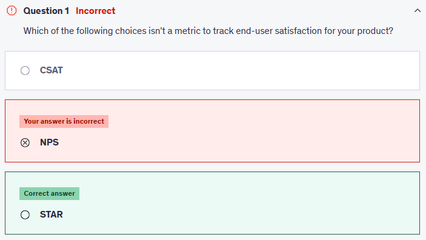
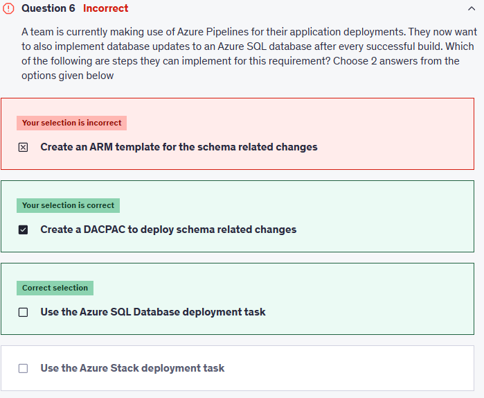

# 📋 Practice Test 3

## ⁉️ Q1

  

---

> 👉🏻 **Explanation**  
> 📊 The Real Metrics
>
> 1. **CSAT (Customer Satisfaction Score)**
>
>    - Measures **short-term user happiness**.
>    - Typical question: _“How satisfied were you with your recent experience?”_
>    - Scale: 1–5 or 1–10.
>    - ✅ A real satisfaction metric.
>
> 2. **NPS (Net Promoter Score)**
>
>    - Measures **long-term loyalty**.
>    - Typical question: _“How likely are you to recommend us to a friend?”_
>    - Scale: 0–10.
>    - ✅ A real satisfaction metric.
>
> 3. **STAR**
>
>    - Not a user satisfaction metric.
>    - STAR is a **behavioral interview answering framework** (_Situation, Task, Action, Result_).
>    - ❌ Nothing to do with product satisfaction.

---

## ⁉️ Q6

  

---

> 👉🏻 **Explanation**
>
> - **DACPAC (Data-tier Application Component package):**
>
>   - A `.dacpac` file is a compiled package of your database schema (tables, views, procedures, etc).
>   - It allows **incremental updates** → only differences are applied to the target DB.
>   - Best practice for **continuous integration/continuous deployment (CI/CD)** of SQL databases.
>
> - **Azure SQL Database deployment task (in Azure Pipelines):**
>
>   - A built-in task to automate deploying `.dacpac` or SQL scripts directly to an Azure SQL Database.
>   - Can also run inline SQL scripts if needed.
>   - This is the pipeline-friendly way to apply schema updates.
>
> Together, these two provide a **reliable, automated schema deployment pipeline**.
>
> ---
>
> 👉 Always separate in your head:
>
> - **ARM templates / Bicep / Terraform** = **infrastructure (create DB instance, firewall, size, location)**.
> - **DACPAC + SQL Deployment Task** = **schema + data changes** inside the database.
>
> <https://learn.microsoft.com/en-us/azure/devops/pipelines/targets/azure-sqldb?view=azure-devops&tabs=yaml>

---

## ⁉️ Q10

  

  

---

> 👉🏻 **Explanation**  
> **🤔 Why This Is the Best Answer:**
>
> - **Automatic reviewers (Team Leads group):**
>
>   - Ensures **every pull request targeting master requires approval** from at least one Team Lead.
>   - Prevents unreviewed code from getting merged.
>   - Enforced at the branch policy level.
>
> - **Build validation policy:**
>
>   - Requires the PR to **pass a CI build pipeline** (unit tests, linting, compile checks, etc.) before it can be merged.
>   - Guarantees code quality **in addition to review**.
>   - Prevents broken builds being merged into master.
>
> These two together enforce both **human review** and **automated validation**.
>
> ---
>
> **❌ Why Other Options Are Wrong:**
>
> - **Lock the master branch:**
>
>   - Locks the branch completely (nobody can commit or PR merge).
>   - Too restrictive, not practical for an active development team.
>
> - **Change the branch permissions in the master branch:**
>   F
>   - Could prevent developers from pushing, but it doesn’t enforce review/validation automatically.
>   - Branch policies are the correct mechanism, not manual permission tweaking.

---

## ⁉️ Q19 (Instructor Answer is not Correct, HW is Correct)

  

---

> 👉🏻 **Explanation**  
> **✅ the answer:** > **Basic merge (no fast-forward)**
>
> ---
>
> **🤔 Why This Is the Best Answer:**
>
> - A **basic merge commit** (sometimes called “merge commit” or “no fast-forward”) creates a **new merge commit** every time you merge a feature branch into master/main.
> - This preserves:
>
>   - The **entire branch history** (all commits stay visible).
>   - A **clear separation** between feature branches.
>   - A **tree-like commit history** (good for auditing, rollback, and traceability).
>
> - Most enterprises and exam questions favor this because it ensures **desired commit history is maintained without rewriting**.
>
> ---
>
> **❌ Why Other Options Are Wrong:**
>
> - **Rebase with merge commit**
>
>   - Rebases the feature branch commits onto master, then creates a merge commit.
>   - This rewrites commit history → cleaner but **not preserving the original branch history**.
>
> - **Squash merge**
>
>   - Combines all feature branch commits into **one commit** before merging.
>   - Simplifies history, but **loses individual commit granularity** (undesired in audit-heavy environments).
>
> - **Rebase and fast-forward**
>
>   - Rewrites commits onto master, then moves the branch pointer (no merge commit).
>   - Produces a **linear history**, but loses the explicit record of feature branch merges.

---

🎯 Quick Memory Hook

- **Basic merge (no-ff)** → ✅ keeps everything, safest for history.
- **Squash** → compress commits into 1, good for tidiness.
- **Rebase** → rewrites commits, cleaner but changes history.
- **Fast-forward** → moves pointer, no merge commit, not good for preserving history.

---
