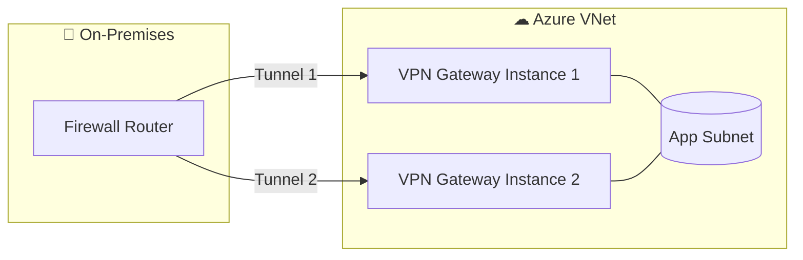

# 🏆 Azure VPN Gateway — High Availability, BGP & AWS Comparison

## 1️⃣ High Availability Architecture

Azure VPN Gateway is **managed** and **built-in redundant** by design — Microsoft deploys the gateway as **two or more instances in an active-standby or active-active configuration** inside the **GatewaySubnet**.

### Modes:

| Mode                         | Description                                                               | When to Use                                             |
| ---------------------------- | ------------------------------------------------------------------------- | ------------------------------------------------------- |
| **Active-Standby (Default)** | One instance handles traffic; the other is a hot standby.                 | Standard S2S VPN where a single tunnel is enough.       |
| **Active-Active**            | Two instances handle traffic simultaneously, each with its own public IP. | Multi-tunnel redundancy, high throughput, load sharing. |

📌 **Failover behavior:**
If the active instance fails, Azure reroutes traffic to the standby. Failover usually takes **30–90 seconds**.

---

### HA Diagram



💡 **AWS comparison**:

- Azure’s **Active-Active** is like AWS **Site-to-Site VPN with two tunnels** on different VGW endpoints.
- Both allow BGP per tunnel for redundancy.

---

## 2️⃣ Border Gateway Protocol (BGP) in Azure VPN Gateway

BGP allows **dynamic route exchange** between Azure VNets and on-premises networks.
Instead of manually updating routes, BGP **advertises prefixes automatically**.

### Key Points:

- **ASN (Autonomous System Number)**:

  - Azure default ASN → `65515` (can be changed when creating the VPN Gateway).
  - Your on-prem device must have a different ASN.

- **BGP Peering IP**:

  - Azure assigns a private IP from the GatewaySubnet for BGP.

- **Supports transit routing**:

  - If multiple sites connect to Azure with BGP, Azure can route traffic between them without extra configs.

---

#### Example — Multi-Site VPN with BGP

```plaintext
Azure ASN: 65515
On-prem HQ ASN: 65010
On-prem Branch ASN: 65020
```

With BGP:

- HQ advertises `10.1.0.0/16` to Azure.
- Branch advertises `10.2.0.0/16` to Azure.
- Azure advertises both prefixes back to each site.
- HQ can reach Branch via Azure without direct VPN between them.

📌 **AWS comparison**:

- Works the same as **AWS VGW BGP routing** but Azure supports BGP with **VNet-to-VNet VPN** as well, not just on-prem connections.

---

## 3️⃣ Throughput & Scaling Considerations

- Throughput **depends on SKU**:

  - **VpnGw1** → \~650 Mbps aggregate
  - **VpnGw5** → up to 10 Gbps aggregate

- **Multiple connections** are possible — e.g., S2S + P2S + VNet-to-VNet on the same gateway.
- **Route-based VPN** recommended for dynamic routing and multiple tunnels.

---

## 4️⃣ Testing HA Failover

💡 Best practice is to simulate a failover during non-production hours.

**Test Steps:**

1. Deploy VPN Gateway in **Active-Active** mode.
2. Configure both tunnels on on-premises device.
3. Disable one tunnel on the firewall to simulate outage.
4. Measure downtime (should be <90s).
5. Re-enable tunnel and check BGP convergence.

---

## 5️⃣ AWS vs Azure VPN Gateway — Quick Comparison

| Feature          | Azure VPN Gateway              | AWS VGW + Site-to-Site VPN |
| ---------------- | ------------------------------ | -------------------------- |
| Max Tunnels      | SKU dependent (up to 30+)      | 2 per VPN connection       |
| HA Mode          | Active-Standby & Active-Active | Always Active-Active       |
| BGP Support      | Yes (S2S, VNet-to-VNet)        | Yes (S2S only)             |
| Gateway Location | Inside VNet `GatewaySubnet`    | AWS-managed in Region      |
| Pricing Model    | Per hour + egress              | Per hour + egress          |
| Max Throughput   | Up to 10 Gbps (VpnGw5)         | \~1.25 Gbps per tunnel     |

---

## 6️⃣ Security Enhancements for HA VPN Gateway

- Use **Azure DDoS Protection Standard** for public IPs of the gateway.
- For **P2S**, integrate Azure AD + MFA for identity verification.
- Enforce **AES256 / SHA256** in IPSec/IKE policy.
