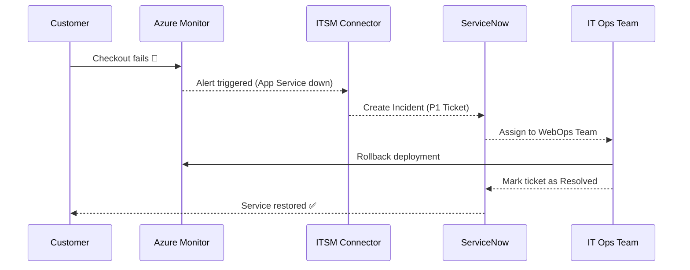

# 📚 What is ITIL?

👉 **ITIL (Information Technology Infrastructure Library)** = the **rulebook/framework** for ITSM.

- It’s like **Agile for software development** but for **managing IT services**.
- ITIL defines **best practices** for how IT should deliver services.

## ⚙️ Core ITIL processes (super high level):

1. **Incident Management** → fix outages fast.
2. **Problem Management** → find and eliminate root causes.
3. **Change Management** → safely introduce changes without chaos.
4. **Service Request Management** → handle new requests (accounts, software).
5. **Knowledge Management** → document fixes for future use.

💡 ITSM tools (like ServiceNow) **implement ITIL processes** in real life.

---

## 🧑‍💻 What is ITSM?

👉 **IT Service Management (ITSM)** = **the way companies manage their IT services** (like computers, apps, servers, cloud, networks).

Think of ITSM as the **Helpdesk + Playbook + Traffic Control** for IT:

- If something **breaks** → ITSM manages the **incident**.
- If something keeps **breaking repeatedly** → ITSM manages the **problem** (finds root cause).
- If you need a **new laptop/account/app** → ITSM manages the **service request**.
- If IT needs to **upgrade a system** → ITSM manages the **change** (safely roll out updates).

📌 ITSM isn’t a single software — it’s a **framework and process**.
To apply it, companies use **ITSM tools** (like ServiceNow, Remedy, Jira Service Management).

---

## 🛠️ What do ITSM Tools Do?

Imagine you’re in a big company with **thousands of employees**.

- Employees keep asking for new accounts, fixing emails, or reporting broken apps.
- IT teams keep deploying changes, patching systems, and resolving outages.
  Without order, it’s chaos.

👉 ITSM tools **organize and automate** all that.

### Example: ServiceNow (the most common ITSM tool)

- **Employee reports a bug** → A ticket is automatically created in ServiceNow.
- **ServiceNow assigns ticket** → Goes to the right IT/DevOps engineer.
- **ServiceNow tracks SLA** → If not fixed in time, escalates.
- **Incident resolved** → Ticket is closed, knowledge base updated.

So an ITSM tool = **Ticketing + Workflow system for IT + DevOps**.

---

## 🏢 Real-World Analogy

Think of **ITSM** like an **airport control system**:

- **Incidents** = A plane engine warning goes off → handle emergency.
- **Problems** = Investigate why certain engines keep failing.
- **Changes** = Plan a runway upgrade without disrupting flights.
- **Requests** = A pilot requests more fuel or a maintenance check.

Without ITSM, the airport (company) would be **chaotic**.

---

## 🔐 Azure + ITSM

Now you get why ITSM matters → big companies can’t survive without structured IT support.

👉 Azure fits in by **integrating cloud alerts into ITSM tools** (like ServiceNow):

- Azure VM crashes → Azure Monitor alert → ITSM Connector → auto-ticket in ServiceNow.
- DevOps pipeline fails → ServiceNow ticket → team notified + SLA tracked.

---

Perfect 🙌 let’s build a **step-by-step, real-world example** of **Azure + ITSM (ServiceNow)** so you can see exactly how it works.

---

## 🛠️ Step-by-Step ITSM Flow with Azure

**🌨️ Scenario: E-commerce Website in Azure:**

- Your company runs an online store (VMs, App Service, SQL DB).
- You must ensure **incidents are tracked + resolved quickly** using ITSM (ServiceNow).

---

### 1️⃣ Incident Happens

- The **App Service hosting checkout** crashes at midnight.
- Customers can’t buy → outage = 🚨 **Incident**.

---

### 2️⃣ Azure Detects It

- **Azure Monitor Alert** fires:

  - Condition = “App Service availability < 90% in 5 mins.”
  - Severity = Critical.

---

### 3️⃣ ITSM Connector Kicks In

- The **ITSM Connector** is set up in Azure Monitor (linked to ServiceNow).
- Alert is sent to ServiceNow via REST API.

---

### 4️⃣ ServiceNow Creates Ticket

- ServiceNow auto-creates a **P1 Incident Ticket**:

```ini
Incident ID: INC123456
Title: Azure App Service Checkout Down
Severity: Critical
Source: Azure Monitor
Time: 00:05 UTC
Assigned to: WebOps Team
```

- SLA Timer starts ⏱️ (must be fixed in 2 hours).

---

### 5️⃣ IT Team Works on It

- WebOps gets the ticket in ServiceNow.
- Engineer restarts the App Service + checks logs.
- Root cause = bad deployment → rolled back using Azure DevOps pipeline.

---

### 6️⃣ Ticket Updated

- ServiceNow updates incident:

  - Status: Resolved.
  - Resolution: Rolled back bad deployment.
  - Downtime: 15 minutes.

---

### 7️⃣ Problem Management (Optional)

- Since this is the **3rd time this month**, a **Problem ticket** is created in ServiceNow.
- Root cause analysis planned to prevent future checkout crashes.

---

### 8️⃣ Change Management (Future Fix)

- Team creates a **Change Request** in ServiceNow:

  - Plan: Add canary deployment in Azure DevOps pipeline.
  - Approved by CAB (Change Advisory Board).
  - Scheduled for next sprint.

---

## 🔄 Visual Flow



---

## ✅ TL;DR for You

- **ITSM** = Managing IT services in an organized way.
- **ITSM Tools** = Software like ServiceNow, Remedy, Jira Service Desk (they create and track tickets).
- **ITIL** = The official “best practices” framework for ITSM.
- **Azure’s role** = Sends its alerts/incidents into ITSM tools via **ITSM Connector**.

---

## 📝 Key Takeaways

- **Incident Management** = handled via ServiceNow auto-ticket.
- **Problem Management** = track recurring issues.
- **Change Management** = plan safer deployments.
- **Azure’s Role** = Detect issue → Forward to ITSM → Auto-ticket.

---

⚡ **Exam Hack**:

- If asked: _“Azure to ServiceNow ticket automation”_ → **ITSM Connector**.
- If asked: _“Which framework guides ITSM processes”_ → **ITIL**.

-
