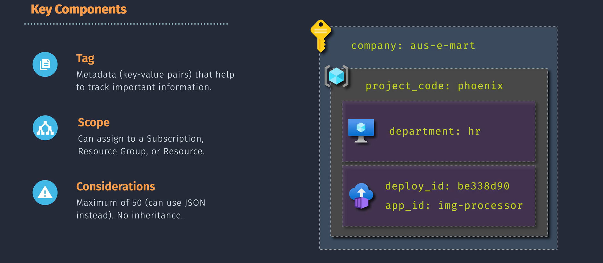

# 🏷️ **Resource Tagging in Azure**

> 📖 Tagging in Azure means attaching **metadata (key–value pairs)** to your resources.
> These tags act like **labels or sticky notes** that help you **organize, govern, track, and optimize** your cloud.

---

<div align="center">
  
</div>

---

## 💡 **Why Tag?**

1. **💰 Cost Management** → Track spending per project, team, or environment.
2. **🧭 Governance** → Enforce compliance (e.g., GDPR, HIPAA workloads tagged separately).
3. **🛠️ Operations** → Identify ownership, lifecycle stage, or purpose.
4. **📊 Reporting** → Slice and dice resources by tag filters in **Cost Explorer** or **Azure Monitor**.
5. **🤝 Collaboration** → Align infra with org structure: departments, teams, or projects.

---

## 🔧 **Practical Example**

You want to **track environments**:

| Key         | Value      |
| ----------- | ---------- |
| Environment | Production |
| Department  | Finance    |
| Owner       | Hady.Wafa  |
| CostCenter  | CC-1023    |

> ➡️ Instantly filter: “Show me all **Production resources owned by Finance**.”  
> ➡️ Useful for **chargeback/showback models** in FinOps.

---

## ⚠️ **Important Considerations**

1. **🚫 No Inheritance by Default**

   - Tags at **Resource Group** level are NOT automatically applied to child resources.
   - You must apply individually or enforce via **Azure Policy**.

2. **🔢 Tag Limits**

   - Max **50 tags** per resource, resource group, or subscription.
   - Workaround → Use a **JSON string** as value (to pack multiple logical values).

     ```json
     { "Environment": "Production", "Tier": "Premium", "Project": "Apollo" }
     ```

3. **📂 Management Groups**

   - You can tag **resources**, **resource groups**, and **subscriptions**.
   - ❌ Management Groups do not support tags.

4. **🛡️ Azure Policy Enforcement**

   - Example: Policy that enforces `"Environment"` tag → resource creation fails if missing.
   - Applies only to **new/updated resources** after policy assignment.

5. **🔠 Case Sensitivity**

   - **Names:** Case-insensitive (`Environment` = `environment`).
   - **Values:** Case-sensitive (`Prod` ≠ `prod`).

6. **🙈 Sensitive Data**

   - Never put PII, passwords, or secrets in tags — stored as **plain text** and visible via APIs, billing, and logs.

7. **🔒 Resource Type Support**

   - Most services support tagging (VMs, storage, databases), but some legacy or special resources don’t.
   - Always check docs before enforcing org-wide policies.

---

## 📜 **Hands-On Tagging**

### 1. **Azure Portal**

- Navigate → Resource → **Tags** blade → Add key/value.

### 2. **Azure CLI**

```bash
az tag create --resource-id /subscriptions/{id}/resourceGroups/MyRG/providers/Microsoft.Compute/virtualMachines/MyVM \
  --tags Environment=Production Department=Finance
```

### 3. **Azure PowerShell**

```powershell
New-AzTag -ResourceId "/subscriptions/{id}/resourceGroups/MyRG/providers/Microsoft.Storage/storageAccounts/mystorage" `
  -Tag @{ Environment="Production"; Owner="Hady" }
```

### 4. **ARM/Bicep** (Infra as Code)

```bicep
resource storage 'Microsoft.Storage/storageAccounts@2021-04-01' = {
  name: 'mystorageacct'
  location: 'eastus'
  tags: {
    Environment: 'Production'
    Department: 'Finance'
  }
}
```

---

## ✅ **Best Practices** (Recommendations)

1. **📝 Define a Clear Tagging Strategy**

   - Standardize **keys & values** → e.g., `Environment: Dev/Test/Prod`.
   - Document and socialize with teams.

2. **🤖 Automate Tagging**

   - Use **Azure Policy** (`EnforceTag`, `AppendTagAndValue`) to auto-apply.
   - Integrate tagging into CI/CD pipelines.

3. **🧹 Regular Review & Cleanup**

   - Remove outdated tags (`ProjectX` that ended).
   - Audit with **Azure Resource Graph queries**.

4. **📊 FinOps Focus**

   - Always tag with **CostCenter** / **Project** for showback/chargeback.

5. **🔁 Consistency**

   - Enforce naming & casing → avoid `Env: Prod` vs `Environment: Production`.

---

## ⚡ **Common Mistakes**

- ❌ Forgetting dependencies (VM disks, NICs need separate tags).
- ❌ Using inconsistent naming (`Owner`, `CreatedBy`, `Created_By`).
- ❌ Applying tags manually → drift happens fast.
- ❌ Storing secrets/PII in tags.
- ❌ Assuming Resource Group tags automatically apply (they don’t).

---

## 📌 **Summary**

Tagging = **simple metadata, powerful governance**.

- Helps with **cost tracking, compliance, operations, reporting**.
- Apply via Portal, CLI, PowerShell, or Templates.
- Enforce via **Azure Policy**.
- Plan your **tagging taxonomy**, automate, and review regularly.

> 👉 Treat tags like **cloud passports** → they tell you **who owns it, what it does, where it belongs, and how much it costs**.
