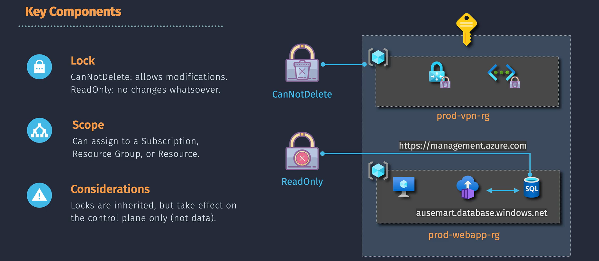

# 🔒 **Azure Resource Locks**

> 📖 Resource Locks in **Microsoft Azure** are like putting a protective glass case around your most valuable resources. They **prevent accidental deletion or modification**, regardless of how high someone’s permissions are.

Think of it as a _"Are you **really** sure?"_ safety switch that overrides normal RBAC permissions.

---

<div align="center">
  
</div>

---

## 🛡️ **What Are Resource Locks?**

- A **management feature** in Azure that protects critical assets from accidental or unwanted changes.
- Can be applied at multiple scopes:

  - **Subscription** → affects everything inside
  - **Resource Group** → affects all resources in the group
  - **Individual Resource** → affects only the selected resource

👉 If a lock is set at a parent level, it **inherits down** to all child resources.

---

## 🔑 **Types of Locks**

Azure gives you two lock modes:

1. **`CanNotDelete`**

   - Users can **read & modify** a resource.
   - **Deletion is blocked**.
   - Example: Developers can update a VM’s configuration, but they can’t delete it.

2. **`ReadOnly`**

   - Users can only **read** the resource.
   - No **delete** and no **modify** allowed.
   - Example: Apply this on a **Storage Account** holding compliance data to freeze its configuration.

📌 In short:

- `CanNotDelete` = _Hands off the delete button!_
- `ReadOnly` = _Look, but don’t touch._

---

## ✍🏻 **Practical Example**

Imagine you run a **Storage Account** with sensitive financial data.

- If someone accidentally runs `az storage account delete ...` → 💥 your business is in trouble.
- Apply a **`ReadOnly` lock**, and now:

  - The storage account’s configuration is safe.
  - Even global administrators can’t delete or change it (unless they remove the lock first).

---

## ⚙️ **How Locks Work**

- **Control Plane only**: Locks protect _management actions_ (create, update, delete)

  - Example: You can’t delete a locked VM.

- **Data Plane unaffected**: Locks don’t restrict reading/writing inside the resource.

  - Example: You can still upload blobs into a locked Storage Account.

---

## 📌 **Key Features**

1. **Scope Inheritance**

   - A lock at **subscription level** cascades down to _all_ resource groups and resources.

2. **Overrides RBAC**

   - Even if a user has `Owner` or `Contributor` role, the lock wins.

3. **Removing Locks**

   - You need the right permissions (`Microsoft.Authorization/locks/delete`).
   - Locks can only be removed intentionally before changes are made.

4. **Impact on Deletions**

   - If a resource group has locked resources, you **cannot delete the group** until the locks are removed.

---

## 🛠️ **Applying Resource Locks**

You can create and manage locks using multiple tools:

- **Azure Portal**

  - Go to the resource → `Locks` → Add Lock → Choose type (`ReadOnly` / `CanNotDelete`)

- **Azure CLI**

  ```bash
  az lock create \
    --name ProtectVM \
    --lock-type CanNotDelete \
    --resource-group MyResourceGroup \
    --resource MyVM \
    --resource-type "Microsoft.Compute/virtualMachines"
  ```

- **PowerShell**

  ```powershell
  New-AzResourceLock `
    -LockName "ProtectVM" `
    -LockLevel CanNotDelete `
    -ResourceName "MyVM" `
    -ResourceGroupName "MyResourceGroup" `
    -ResourceType "Microsoft.Compute/virtualMachines"
  ```

---

🔒 If the **subscription has a lock**, everything under it inherits protection unless explicitly removed.

---

## ⚠️ **Important Considerations**

- Locks are **not security features** (they don’t stop hackers if they already have access). They’re for **accidental change prevention**.
- If a lock prevents your deployment, you’ll need to **temporarily remove it**.
- Best practice:

  - Apply locks to **production resources** that should never be touched casually.
  - Keep documentation of why the lock exists, so your team doesn’t panic.
