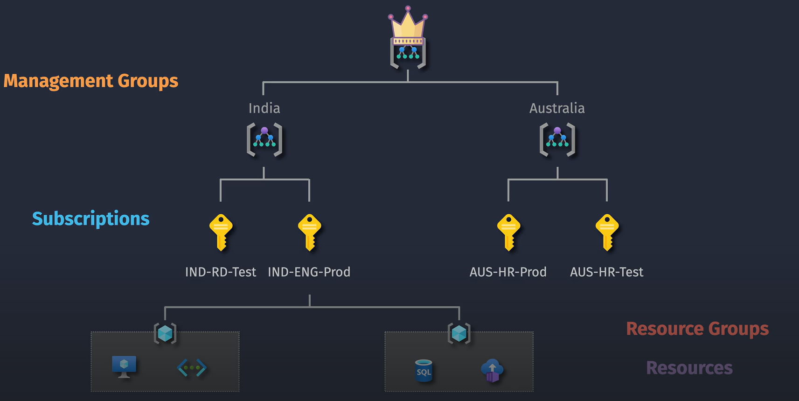
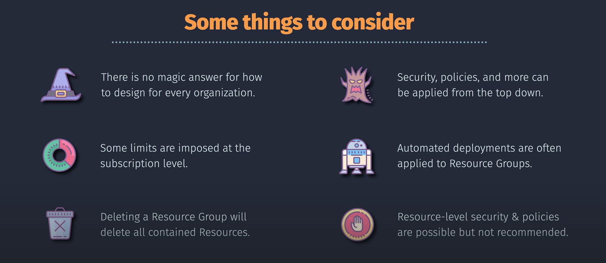

# 🏗️ Azure Hierarchy

<div align="center">
  
</div>

---

## 📚 Table of Contents

1. [🏢 Tenant (Microsoft Entra ID)](#tenant)
2. [👤 Azure Account](#account)
3. [👑 Management Groups](#mg)
4. [💳 Subscriptions](#subscription)
5. [📁 Resource Groups](#rg)
6. [🛠️ Resources](#res)
7. [🔄 Full Hierarchy Diagram](#diagram)
8. [🔐 Access and Governance](#governance)
9. [💡 Best Practices & Tips](#tips)
10. [📌 Summary](#summary)

---

## 🏢 1. Tenant (Microsoft Entra ID) <a id="tenant"></a>

> 📘 **Official Definition:** A tenant is a dedicated and trusted instance of Microsoft Entra ID that represents an organization and manages identities like users, groups, and apps.

### 🧠 Think of a tenant as:

- Your **organization’s identity domain**
- The **authentication and security root**
- The top of the Azure hierarchy

### 🆚 AWS Comparison:

| Azure                 | AWS                                                                                     |
| --------------------- | --------------------------------------------------------------------------------------- |
| **Tenant (Entra ID)** | **AWS Organization Root + Directory Service (if using AWS SSO or IAM Identity Center)** |

---

🧠 **Hierarchy Structure**:

```ini
Azure Account
└── Tenant
    └── Management Groups
        └── Subscriptions
            └── Resource Groups
                └── Resources
```

---

## 👤 2. Azure Account <a id="account"></a>

Your **Azure Account** is your **sign-in identity** (Microsoft/Work/School email).
It can access multiple **tenants**, giving you flexibility in large orgs or consulting work.

| ✅ Example                                                                        |
| --------------------------------------------------------------------------------- |
| `alex@company.com` → accesses **Tenant A** (Client 1) and **Tenant B** (Client 2) |

🧠 **Important**: Your account is _not_ the same as a subscription.

---

## 👑 3. Management Groups <a id="mg"></a>

**Management Groups** let you apply **governance** (policies, role-based access) to many subscriptions at once.

- Up to **6 levels** deep
- Ideal for **departments, regions, or environments**

### 🆚 AWS Comparison:

| Azure            | AWS                             |
| ---------------- | ------------------------------- |
| Management Group | Organizational Unit (OU)        |
| Azure Policy     | Service Control Policies (SCPs) |

---

## 💳 4. Subscriptions <a id="subscription"></a>

A **Subscription** is a **billing and quota container** for your Azure services.

- You **deploy resources** inside subscriptions
- Each has **isolated billing**, **resource limits**, and **RBAC**

### 🆚 AWS Comparison:

| Azure Subscription       | AWS Account                    |
| ------------------------ | ------------------------------ |
| Billing unit             | Billing unit                   |
| Resource quota container | Resource quota container       |
| Isolated for security    | Fully isolated AWS environment |

---

## 📁 5. Resource Groups <a id="rg"></a>

**Resource Groups** are **logical containers** for related Azure resources.

- Help manage **lifecycle** (create, update, delete)
- Ideal for grouping all parts of a single app

🧠 Deleting a resource group deletes **everything inside** it. Be careful.

### 🆚 AWS Comparison:

| Azure Resource Group         | AWS Tags + Resource Groups  |
| ---------------------------- | --------------------------- |
| Native grouping by lifecycle | Manual grouping via tagging |

---

## 🛠️ 6. Resources <a id="res"></a>

Resources are the **actual Azure services** like:

| Service         | Example                  |
| --------------- | ------------------------ |
| Virtual Machine | App server               |
| Azure SQL DB    | App database             |
| Blob Storage    | Store unstructured files |
| App Service     | Host your website        |

---

## 🔄 Putting It All Together: Azure Hierarchy <a id='diagram'></a>

```plaintext
Azure Account (e.g., alice@contoso.com)
│
├── Tenant A (Contoso Organization)
│   │
│   ├── 👑 Corporate Management Group
│   │   ├── 👑 IT Management Group
│   │   │   ├── 🔑 IT Subscription 1
│   │   │   │   ├── 📁 DevOps Resource Group
│   │   │   │   │   ├── 🛠️ Dev VM
│   │   │   │   │   └── 🛠️ Dev SQL Database
│   │   │   │   └── 📁 ProdOps Resource Group
│   │   │   │       ├── 🛠️ Prod VM
│   │   │   │       └── 🛠️ Prod Storage Account
│   │   │   └── 🔑 IT Subscription 2
│   │   │       └── 📁 Network Resource Group
│   │   │           ├── 🛠️ Virtual Network
│   │   │           └── 🛠️ Firewall
│   │   └── 👑 Finance Management Group
│   │       ├── 🔑 Finance Subscription 1
│   │       │   └── 📁 Accounting Resource Group
│   │       │       ├── 🛠️ Accounting App
│   │       │       └── 🛠️ SQL Database
│   │       └── 🔑 Finance Subscription 2
│   │           └── 📁 Reporting Resource Group
│   │               ├── 🛠️ BI Tools
│   │               └── 🛠️ Data Lake
│   │
└── Tenant B (Fabrikam Organization)
    │
    ├── 👑 HR Management Group
    │   ├── 🔑 HR Subscription 1
    │   │   ├── 📁 HR Resource Group
    │   │   │   ├── 🛠️ HR VM
    │   │   │   └── 🛠️ Payroll Database
    │   │   └── 📁 Training Resource Group
    │   │       ├── 🛠️ Training Portal
    │   │       └── 🛠️ Learning Management System
    │   ├── 🔑 HR Subscription 2
    │   │   └── 📁 Recruitment Resource Group
    │   │       ├── 🛠️ Candidate Database
    │   │       └── 🛠️ Interview Scheduling App
    │   └── 🔑 HR Subscription 3
    │       └── 📁 Benefits Resource Group
    │           ├── 🛠️ Benefits Portal
    │           └── 🛠️ Wellness App
```

In this diagram:

- **Tenant A** (Contoso Organization) has nested management groups under the Corporate Management Group.
- **Tenant B** (Fabrikam Organization) does not have nested management groups, and its subscriptions are directly under the HR Management Group.

---

## 🔐 8. Access and Governance <a id="governance"></a>

### 🔑 Role-Based Access Control (RBAC)

> Assign permissions at any level (MG, Subscription, RG, or Resource)

🧠 RBAC is **inherited downward**. Assign at the top unless you need fine-grain control.

### 📏 Azure Policy

> Enforce rules like "Only deploy VMs in East US"

| Azure                     | AWS                     |
| ------------------------- | ----------------------- |
| Role-Based Access Control | IAM Roles & Policies    |
| Azure Policy              | SCPs + AWS Config Rules |

---

## 💡 9. Best Practices & Tips <a id="tips"></a>

<div align="center">

</div>

✅ **Top Recommendations**:

| Tip                             | Why it Matters                             |
| ------------------------------- | ------------------------------------------ |
| Plan your tenant and subs early | Avoid moving resources later               |
| Use naming conventions          | Easier automation and billing analysis     |
| Group by app or environment     | Dev vs Prod vs Test clarity                |
| Tag resources                   | Enable cost analysis and filtering         |
| Assign RBAC at MG/Sub level     | Inheritance saves time and avoids mistakes |
| Use Azure Policy                | Enforce security and compliance at scale   |

---

## 📌 10. Summary <a id="summary"></a>

| Level              | Description                                           | AWS Equivalent                     |
| ------------------ | ----------------------------------------------------- | ---------------------------------- |
| **Tenant**         | Identity + directory root (Microsoft Entra ID)        | AWS Org Root + IAM Identity Center |
| **Azure Account**  | Your sign-in identity                                 | IAM User / Federated Login         |
| **MG**             | Policy and access grouping for multiple subscriptions | AWS Organizational Unit            |
| **Subscription**   | Billing + isolation container                         | AWS Account                        |
| **Resource Group** | Lifecycle group for related services                  | Tag-based group (optional)         |
| **Resource**       | Actual service (VM, DB, etc.)                         | Actual AWS service                 |
