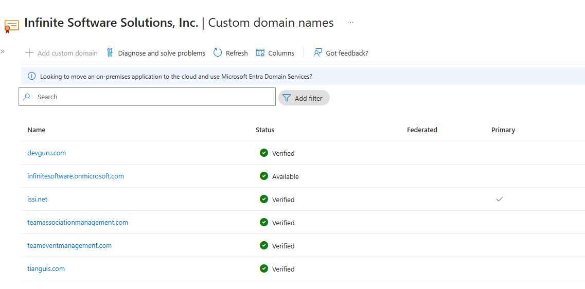
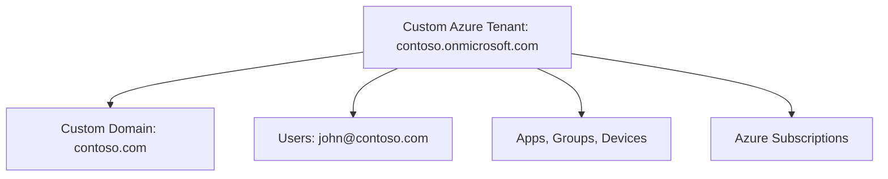

# 🏢 Custom Tenants with Custom Domain Names in Azure

<div align="center">
  
</div>

---

## 📘 What is a Custom Tenant?

A **Custom Tenant** is simply a **dedicated Azure Entra ID tenant** that you or your organization created manually — separate from any default Microsoft-created one.

> A tenant = an **identity boundary** in Azure.
> You can create multiple tenants to represent **different organizations**, **clients**, or **environments** (like prod/dev/test).

---

## 🌐 What is a Custom Domain Name?

By default, when you create a tenant, it comes with a generic domain like:

```ini
contoso.onmicrosoft.com
```

> This is your **initial domain**, and it's **not changeable** — it stays forever, but you don’t need to use it.

To make the tenant match your organization, you can add a **custom domain** like:

```ini
contoso.com
```

### Why add a custom domain?

| 🔍 Reason                         | 💬 Benefit                                                             |
| --------------------------------- | ---------------------------------------------------------------------- |
| **Professional identity**         | Users log in as `user@contoso.com`, not `user@contoso.onmicrosoft.com` |
| **Brand consistency**             | Custom domain is used for email, app login, etc.                       |
| **Custom branding + SSO**         | Better experience for employees and clients                            |
| **Access control & verification** | Microsoft verifies domain ownership                                    |

---

## 🏗️ How It All Fits Together



---

## 🛠️ How to Create a Custom Tenant

### 📍 Step 1: Create a new Tenant

1. Go to Azure Portal → **Microsoft Entra ID**
2. Click **Manage Tenants** → **+ Create**
3. Choose:

   - Type: **Microsoft Entra ID**
   - Initial domain: `yourcompany.onmicrosoft.com`
   - Region: Where your directory will reside

4. Done! You now have a new isolated tenant.

> 🔐 You’ll be the **Global Administrator** by default in the new tenant.

---

### 📍 Step 2: Add a Custom Domain Name

1. In the new tenant, go to **Microsoft Entra ID → Custom domain names**
2. Click **+ Add custom domain**
3. Enter your domain name: `contoso.com`
4. Microsoft gives you a **TXT record** to add to your domain’s DNS (to prove ownership)
5. Once DNS is validated, the domain becomes **active**

---

### 📍 Step 3: Make It Primary (Optional)

You can set the custom domain as the **primary domain**, so new users get `@contoso.com` instead of `@contoso.onmicrosoft.com`.

---

## 👨‍💼 User Experience After Custom Domain Setup

- **Login Page Branding**: You can customize the login page with your logo and colors.
- **Usernames**: Users get modern, brand-aligned identities like `alice@contoso.com`.
- **SSO Friendly**: Integrate with Azure apps, M365, and custom apps easily.

---

## 🔄 AWS Comparison

| Concept                   | Azure                               | AWS                                               |
| ------------------------- | ----------------------------------- | ------------------------------------------------- |
| **Tenant creation**       | Create new Entra tenants manually   | Create new AWS Organizations or accounts          |
| **Custom domain**         | Link & verify domain via TXT record | Use in IAM Identity Center (SSO) only             |
| **Default domain suffix** | `xyz.onmicrosoft.com`               | Not applicable — IAM users use console login URLs |
| **Login branding**        | Full branding available             | Partial branding in AWS IAM                       |

---

## 🧠 Pro Tips

| ✅ Tip                                  | 💡 Why It Matters                              |
| --------------------------------------- | ---------------------------------------------- |
| Keep the `.onmicrosoft.com` domain      | It's required and can't be removed             |
| Use descriptive domain names            | For clarity when switching tenants             |
| Don’t mix prod/dev in the same tenant   | Use separate tenants or clearly scoped domains |
| Verify domain DNS early                 | TXT record propagation can take hours          |
| Add SPF/DKIM/DMARC later for M365/email | Ensures trusted email delivery                 |

---

## 📌 Summary

| Component           | Meaning                                            |
| ------------------- | -------------------------------------------------- |
| **Custom Tenant**   | A manually created Azure Entra ID instance         |
| **Default Domain**  | The system-generated `xyz.onmicrosoft.com` name    |
| **Custom Domain**   | Your verified business domain (e.g. `contoso.com`) |
| **Purpose**         | Improve identity branding and trust                |
| **Where it's used** | Azure login, Microsoft 365, app access             |

---

## 🚀 Quick Use Case Example

You're an IT consultant building Azure environments for 3 clients:

| Client Name | Tenant Name              | Custom Domain |
| ----------- | ------------------------ | ------------- |
| RetailX     | retailx.onmicrosoft.com  | retailx.com   |
| BankCorp    | bankcorp.onmicrosoft.com | bankcorp.net  |
| StartupZ    | startupz.onmicrosoft.com | startupz.io   |

Each tenant has:

- Its own Entra ID instance
- Its own custom domain
- Its own subscriptions, RBAC, and policies

And **you**, as `you@consultant.com`, can be:

- A **Guest** in each
- Or a **Global Admin** if granted by the client
