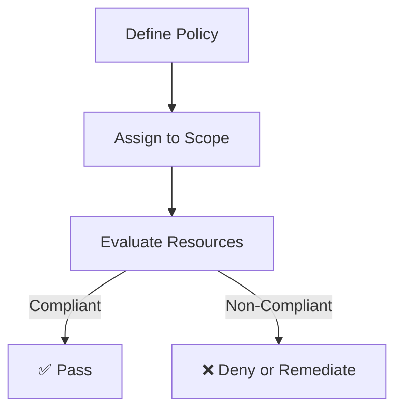
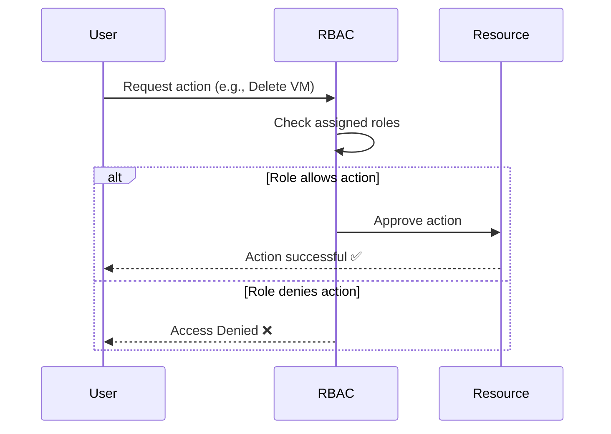
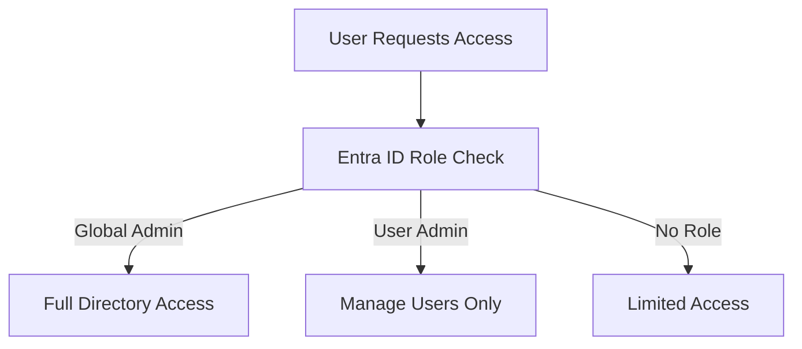
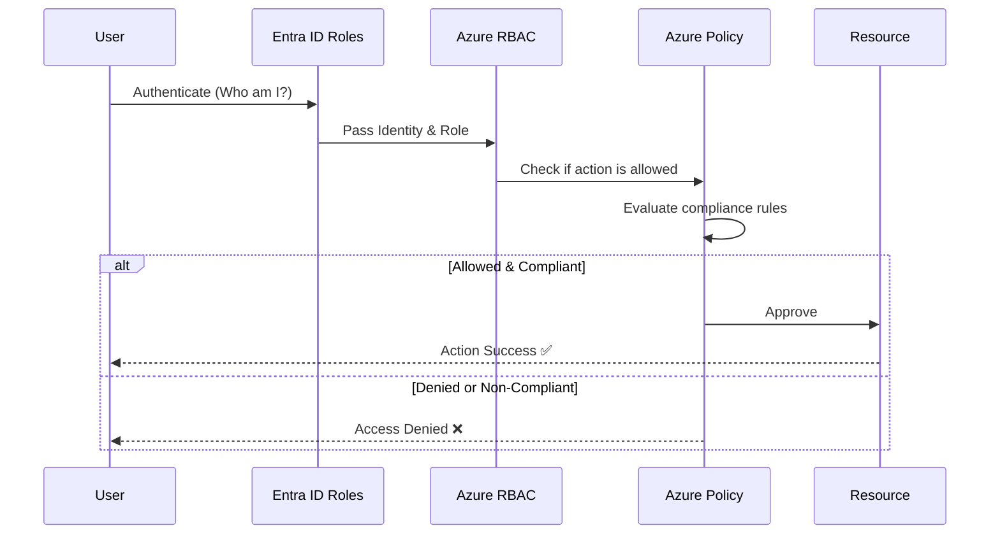

# 🎯 **Azure Policy** vs. **Azure RBAC** vs. **Entra ID Roles**

Azure governance has **three big guardians**:

- 🎨 **Azure Policy** → the rules (what must be true).
- 🛡️ **Azure RBAC** → the permissions (who can do what).
- 👥 **Entra ID Roles** → the identity managers (who the people are).

Think of Azure like a **giant school**. These three decide how the school runs.

---

## 🎨 **Azure Policy** – The School Rules

### 📖 Official Definition

Azure Policy is a service in Azure that you use to **create, assign, and manage policies**. These policies enforce **rules and effects** over your resources, ensuring they stay compliant with corporate standards and SLAs.

### 🧑‍🏫 Human Analogy

Azure Policy = **school rules**. Everyone must follow them. No excuses.

- Rule in school: _“All students must wear uniforms.”_
- Rule in Azure: _“All VMs must have antivirus installed.”_

### 🔑 What It Does

- Enforces standards (like uniforms).
- Audits compliance (like hall monitors).
- Can auto-fix things (like telling a student to tuck their shirt in).

### 🛠 Example

- Policy: “All storage accounts must use HTTPS.”
- Effect: If someone creates one without HTTPS, Policy blocks it.

### 📊 Diagram (Policy Flow)

> 👉 AWS Equivalent: **SCP + Config Rules combined**.

---

## 🛡️ **Azure RBAC** (Role-Based Access Control) – The Classroom Permissions

### 📖 Official Definition

Azure RBAC is an authorization system that provides **fine-grained access management** of Azure resources. It lets you **assign roles to users, groups, and service principals** at different scopes.

### 🧑‍🏫 Human Analogy

Azure RBAC = **who can do what in the classroom**.

- Teacher: can grade papers, use teacher’s lounge.
- Student: can attend class, but can’t touch grades.

### 🔑 What It Does

- Controls **who can take which actions** on which resources.
- Ensures wrong people can’t mess up production.

### 🛠 Example

- Contributor Role: Create/manage VMs.
- Reader Role: Can only look at VMs.
- Owner Role: Full control (teacher + principal combo).

### 📊 Diagram (RBAC Flow)

> 👉 AWS Equivalent: **IAM roles + IAM policies (resource-level)**.

---

## 👥 **Entra ID Roles** – The School Office Staff

### 📖 Official Definition

Entra ID Roles (formerly Azure AD Roles) are **directory roles** that let you manage access to **Azure Active Directory resources** like users, groups, and applications.

### 🧑‍🏫 Human Analogy

Entra ID Roles = **school office staff**. They don’t control the classrooms, but they decide who gets enrolled, who’s a teacher, and who can see student records.

- Principal: Full control of the school.
- Office Staff: Manages student records, but can’t fire teachers.

### 🔑 What It Does

- Manages **identities** (users, groups, apps).
- Assigns admin privileges inside the directory.

### 🛠 Example

- Global Administrator: Can do anything in Entra ID.
- User Administrator: Can create/delete users, reset passwords.

### 📊 Diagram (Entra Role Flow)

> 👉 AWS Equivalent: **root account + IAM identity management** (not resource perms).

---

## 🌟 **Key Differences**

| **Thing**       | 🎨 **Azure Policy** (Rules) | 🛡️ **Azure RBAC** (Permissions) | 👥 **Entra ID Roles** (Identities) |
| --------------- | --------------------------- | ------------------------------- | ---------------------------------- |
| **Focus**       | What must be true           | Who can do what                 | Who the people are                 |
| **Analogy**     | School rules                | Teacher vs Student              | Principal vs Office Staff          |
| **Scope**       | Resources & configs         | Resource access at all scopes   | Directory-level identities         |
| **Effect**      | Audit / enforce / fix       | Allow / deny actions            | Manage users & accounts            |
| **AWS Compare** | SCP + Config                | IAM roles & policies            | Root/IAM identity management       |

---

## 🧩 **How They Work Together**

Imagine this real-world flow:

---

## ⚡ **Common Mistakes**

- ❌ Mixing up RBAC vs Entra Roles (different worlds).
- ❌ Overly strict policies → slow down developers.
- ❌ Not auditing role assignments → everyone becomes admin forever.
- ❌ Ignoring compliance reports → “silent failures” pile up.

---

## ✅ **Best Practices**

1. **Start simple** – Don’t go policy-crazy.
2. **Use built-in stuff** – Save time, customize later.
3. **Group policies with Initiatives** – Easier management.
4. **Least privilege always** – No “god-mode” accounts unless needed.
5. **Review regularly** – Rules and access change over time.
6. **Tag everything** – Helps filter & enforce policies.
7. **Automate compliance** – Integrate checks into CI/CD.
8. **Educate your team** – Rules are useless if no one understands them.

---

## 📚 **Recap**

- 🎨 **Azure Policy** = School Rules (standards & compliance).
- 🛡️ **Azure RBAC** = Classroom Permissions (who can do what).
- 👥 **Entra ID Roles** = School Office Staff (identity management).
