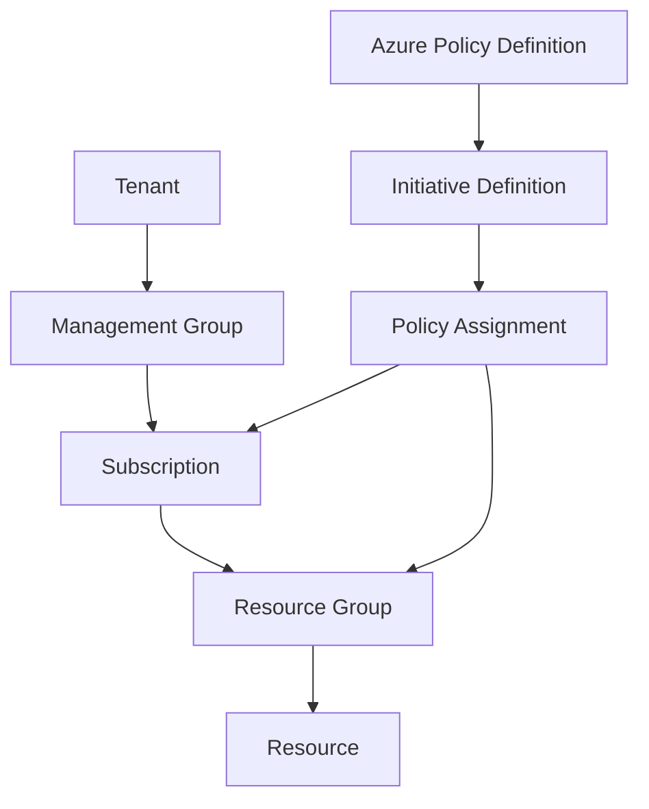

# 🛡️ Azure Policy – Enforcing Cloud Rules Like a Boss

## 📘 What is Azure Policy?

> **Official Definition**:
> _Azure Policy is a service in Azure that allows you to create, assign, and manage policies that enforce specific rules or effects over your resources._

In simple terms:
**Azure Policy = “Cloud Governance Cop”** 👮
It ensures that every deployment follows your organization’s standards, no matter who clicks what.

---

## 🧩 Why Do We Need Azure Policy?

| Without Policy 😱                    | With Azure Policy 🧘‍♂️                                        |
| ------------------------------------ | ----------------------------------------------------------- |
| Devs create VMs in random regions 🌍 | Restrict VM regions to `East US` & `West Europe` only ✅    |
| Someone forgets to tag resources 🏷️  | Enforce mandatory tags like `Department` & `Environment` ✅ |
| Unapproved SKUs cause \$\$\$ 💸      | Block expensive SKUs like `Standard_D32s_v5` ✅             |

---

## 🧱 Azure Policy Components (Core Concepts)

### 1. 📜 **Policy Definition**

- A rule. Describes **what** is allowed or disallowed.
- JSON document with conditions and effects.
- Example: `"effect": "deny"` if region ≠ `eastus`

### 2. 🧩 **Initiative Definition**

- A **group** of policy definitions (like a bundle).
- Example: “PCI Compliance” initiative has 30+ rules.

### 3. 🧭 **Assignment**

- Apply a policy/initiative to a **scope** (like a subscription or resource group).

---

## 🔁 Mermaid Diagram: Azure Policy in Action



---

## 📌 Common Azure Policy Effects

| Effect              | What It Does                                                |
| ------------------- | ----------------------------------------------------------- |
| `Deny`              | Blocks the action (e.g., deploying a VM in wrong region) ❌ |
| `Audit`             | Just logs non-compliance (no enforcement) 🧐                |
| `Append`            | Adds extra settings (e.g., force `httpsOnly=true`)          |
| `DeployIfNotExists` | Triggers a deployment if something’s missing 🛠️             |
| `Modify`            | Adjusts the request (like auto-tagging) 🧩                  |

---

## 🤖 Easy JSON Example – Deny VMs outside East US

```json
{
  "properties": {
    "displayName": "Allowed locations",
    "policyRule": {
      "if": {
        "not": {
          "field": "location",
          "in": ["eastus"]
        }
      },
      "then": {
        "effect": "deny"
      }
    }
  }
}
```

✅ This policy **prevents** creating resources in any region **except East US**.

---

## 📦 Example: Initiative for Compliance

```json
{
  "properties": {
    "displayName": "Secure VM Standards",
    "policyDefinitions": [
      { "policyDefinitionId": "/providers/Microsoft.Authorization/policyDefinitions/noPublicIP" },
      { "policyDefinitionId": "/providers/Microsoft.Authorization/policyDefinitions/allowedLocations" },
      { "policyDefinitionId": "/providers/Microsoft.Authorization/policyDefinitions/auditVMEcryption" }
    ]
  }
}
```

🎯 Bundle multiple rules into a reusable “compliance package”.

---

## 🧠 Where Can I Assign Policies?

| Scope Type          | ✅ Assign Policies? |
| ------------------- | ------------------- |
| Tenant (Org-wide)   | ✅                  |
| Management Group    | ✅                  |
| Subscription        | ✅                  |
| Resource Group      | ✅                  |
| Individual Resource | ❌ (Too granular)   |

---

## 🟨 Azure Policy vs AWS SCP (for AWS folks)

| Concept            | Azure Policy                             | AWS Equivalent                    |
| ------------------ | ---------------------------------------- | --------------------------------- |
| Identity control   | ❌ (use RBAC/Entra for that)             | IAM Policies                      |
| Org control        | ✅ (Audit, Deny, DeployIfNotExists, etc) | Service Control Policies (SCP)    |
| Logging violations | ✅ in Azure Activity + Policy compliance | SCPs don’t log, CloudTrail needed |

---

## 🔍 View Compliance

You can monitor **compliance state** from the Azure Portal:

- Azure Policy → “Compliance”
- See which resources are **Non-Compliant** and why
- Drill into each violation, export reports

---

## 📘 Built-in vs Custom Policies

| Type            | Description                                       |
| --------------- | ------------------------------------------------- |
| **Built-in**    | Provided by Microsoft (e.g., “Allowed Locations”) |
| **Custom**      | Your own JSON policy tailored to your needs       |
| **Marketplace** | Some policies shared by partners or the community |

---

## 💡 Best Practices for Azure Policy

| 💡 Tip                                     | Why It’s Smart                                     |
| ------------------------------------------ | -------------------------------------------------- |
| Use **Initiatives**                        | Group policies by goal (e.g., security baseline)   |
| Test with `Audit` first                    | Avoid breaking deployments accidentally            |
| Combine with **RBAC & Tags**               | Get layered governance                             |
| Enforce on Dev, Audit in Prod              | Start strict in Dev, soft in Prod                  |
| Version & track changes                    | Use Git + Azure Policy as Code (with Bicep or ARM) |
| Use **“DeployIfNotExists”** for auto-fixes | Auto-deploy NSGs, Logs, etc. where missing         |

---

## 🧾 Quick Real-Life Examples

### ❌ Block public IP on VMs

- Policy: Deny if `networkInterface.ipConfigurations[*].publicIpAddress.id` exists

### ✅ Auto-deploy Log Analytics agent

- Effect: `DeployIfNotExists` with ARM template payload

### 🏷️ Require “Environment” Tag

- Deny if tag `Environment` is missing

---

## 🧠 Summary

| 🧩 Azure Policy Component | 💬 Purpose                              |
| ------------------------- | --------------------------------------- |
| **Definition**            | A single rule (e.g., deny certain SKUs) |
| **Initiative**            | A bundle of definitions                 |
| **Assignment**            | Targets a scope (sub, RG, MG)           |
| **Effect**                | What happens: Deny, Audit, Deploy       |
| **Compliance**            | Tracks real-time compliance             |

---

## 🔁 Final Flow

```plaintext
1. Write a policy definition (or use built-in)
2. (Optional) Bundle into an initiative
3. Assign to a scope (e.g., Dev subscription)
4. Monitor compliance in Azure Portal
```
