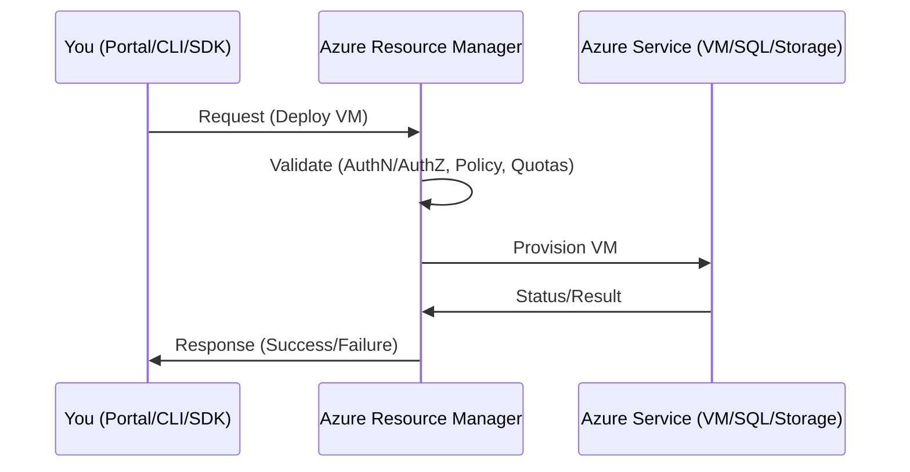

# 🧠 **Azure Resource Manager (ARM)** – The Brain of Azure

> 📖 **Azure Resource Manager (ARM)**  
> ARM is the **deployment and management service** for Azure.
> It acts as the **control plane** — the **central brain** that receives all requests (via Portal, CLI, PowerShell, SDKs, or REST APIs) and ensures your resources are created, updated, or deleted in a consistent way.

Think of it like a **traffic controller**:

- You (the developer) submit requests.
- ARM authenticates, checks policies, applies RBAC, runs templates, and calls the right underlying service.
- Resources get deployed/managed reliably.

---

<div align="center">
  
</div>

---

## 🧩 **Key Concepts**

### 1. **Resources**

- The basic building blocks: VMs, Storage Accounts, Databases, VNets, etc.

### 2. **Resource Groups**

- Logical containers to hold related resources.
- Everything in a resource group shares the same lifecycle (deploy, update, delete).

### 3. **ARM Templates**

- JSON (or Bicep) files that define your infrastructure as code.
- Declarative: you say _what_ you want, ARM figures out _how_.
- Example: Deploy a VM, VNet, and Storage all in one go.

### 4. **Deployment Model**

- ARM ensures deployments are **idempotent** (safe to run again).
- Supports incremental and complete deployments.

### 5. **Security & Governance**

- Integrates with **Azure RBAC** (who can do what).
- Works with **Azure Policy** (what can/can’t be deployed).
- Supports **tags** for cost tracking and management.

---

## 🔄 **How ARM Works**



ARM is always **in the middle** — you never talk directly to Azure services.

---

## ✍🏻 **Real Example:**

Here’s a tiny example that deploys a storage account:

```json
{
  "$schema": "https://schema.management.azure.com/schemas/2019-04-01/deploymentTemplate.json#",
  "contentVersion": "1.0.0.0",
  "resources": [
    {
      "type": "Microsoft.Storage/storageAccounts",
      "apiVersion": "2021-04-01",
      "name": "mystorageaccount123",
      "location": "eastus",
      "sku": { "name": "Standard_LRS" },
      "kind": "StorageV2",
      "properties": {}
    }
  ]
}
```

Deploy this, and boom 💥 — ARM makes sure a storage account is created in East US with your desired config.

---

## ✅ **Benefits of ARM**

1. **Consistency** → same deployment behavior across Portal, CLI, SDK, API.
2. **Infrastructure as Code** → ARM Templates & Bicep make infra repeatable.
3. **RBAC & Policy** → Secure and govern deployments.
4. **Idempotency** → Safe to redeploy.
5. **Tagging & Cost Management** → Easier ops and tracking.

---

## 🔄 **ARM vs Direct Service Access** (Why It Matters)

- Without ARM: You’d call each service API separately → messy, inconsistent.
- With ARM: You get a **unified layer** for deployment, management, monitoring, and governance.

---

## ⚖️ **ARM vs Bicep**

- **ARM Template** = JSON, verbose, harder to read.
- **Bicep** = abstraction over ARM, cleaner syntax, compiles into ARM JSON.
  👉 In real world: people write **Bicep**, Azure still deploys **ARM JSON** behind the scenes.

---

## 💡 **Interview Tip**

If asked: _“What is Azure Resource Manager?”_
Say:

> “ARM is the control plane for Azure. It provides a consistent way to deploy, manage, and govern resources through resource groups, templates, policies, and RBAC. Whether I use Portal, CLI, or SDKs — it all goes through ARM.”
