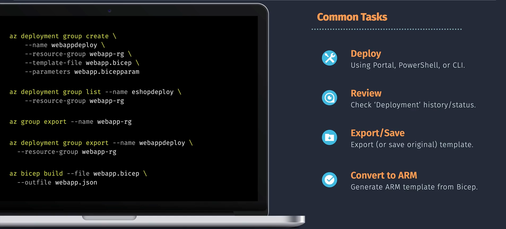

# 📘 **Bicep Templates in Azure**

> 📖 **Bicep** is a **Domain-Specific Language (DSL)** for deploying Azure resources.

- It’s a more **human-friendly, concise, and modular** way to write what ARM templates do in JSON.
- Bicep compiles down to **ARM JSON templates** – so it’s not replacing ARM, but rather making it easier to write.

Think of Bicep as **Terraform-like syntax**, but **native to Azure** and fully supported by Microsoft.

---

<div align="center">
  
</div>

---

## ⁉️ **Why Bicep instead of ARM JSON?**

| Aspect            | ARM Templates (JSON)               | Bicep Templates (DSL)                       |
| ----------------- | ---------------------------------- | ------------------------------------------- |
| Syntax            | Verbose, hard to read/write        | Concise, easy to read                       |
| Tooling           | JSON editing, limited IntelliSense | Rich tooling in VS Code, IntelliSense       |
| Modularity        | Linked templates (complex)         | Native modules & reusability                |
| Learning Curve    | Steep                              | Easier, declarative & clean                 |
| Deployment Output | Native                             | Compiles into ARM JSON (so 100% compatible) |

---

## 🏭 **Structure of a Bicep Template**

A **Bicep file (.bicep)** contains declarations for resources, parameters, variables, outputs, and modules.

<div align="center">
  
</div>

---

---

### 1. **Parameters**

Input values for the template.

```bicep
param location string = resourceGroup().location
param storageName string
```

### 2. **Variables**

Computed or reusable values.

```bicep
var storageSku = 'Standard_LRS'
```

### 3. **Resources**

Define actual Azure resources.

```bicep
resource storageAccount 'Microsoft.Storage/storageAccounts@2022-09-01' = {
  name: storageName
  location: location
  sku: {
    name: storageSku
  }
  kind: 'StorageV2'
}
```

### 4. **Outputs**

Return values from the deployment.

```bicep
output storageEndpoint string = storageAccount.properties.primaryEndpoints.blob
```

### 5. **Modules**

Reuse other Bicep files (similar to Terraform modules).

```bicep
module vnet 'vnet.bicep' = {
  name: 'deployVnet'
  params: {
    location: location
    vnetName: 'myVnet'
  }
}
```

---

## ✍🏻 **Example:** Simple Bicep Template

```bicep
param location string = resourceGroup().location
param storageName string

resource storageAccount 'Microsoft.Storage/storageAccounts@2022-09-01' = {
  name: storageName
  location: location
  sku: {
    name: 'Standard_LRS'
  }
  kind: 'StorageV2'
}

output blobEndpoint string = storageAccount.properties.primaryEndpoints.blob
```

👉 This simple template deploys a **Storage Account** and outputs its blob endpoint.

---

## ⚙️ **How Bicep Works** (Compilation)

1. Write your template in `.bicep`.
2. Compile with Bicep CLI → Generates JSON ARM template.

   ```bash
   bicep build main.bicep
   ```

3. Deploy directly with Azure CLI/PowerShell:

   ```bash
   az deployment group create --resource-group myRG --template-file main.bicep --parameters storageName=mystorage123
   ```

---

## 💫 **Key Features of Bicep**

- **Modules** → Break down large deployments into smaller files.
- **Loops** → Deploy multiple resources dynamically.
- **Conditions (`if`)** → Deploy resources conditionally.
- **Decorators** → Add metadata (e.g., `@description`).
- **Type safety** → IntelliSense validation for parameters, properties.
- **No state file** → Azure manages state (unlike Terraform).

---

## ✍🏻 **Example:** Using Loops in Bicep

```bicep
param location string = resourceGroup().location
param vmCount int = 2

resource vms 'Microsoft.Compute/virtualMachines@2022-11-01' = [for i in range(0, vmCount): {
  name: 'vm-${i}'
  location: location
  properties: {
    hardwareProfile: {
      vmSize: 'Standard_B1s'
    }
  }
}]
```

👉 This deploys **multiple VMs** based on the loop count.

---

## 🚀 **Deployment Scopes in Bicep**

Bicep supports deployments at **different scopes**:

- **Resource Group** → `az deployment group create`
- **Subscription** → `az deployment sub create`
- **Management Group** → `az deployment mg create`
- **Tenant** → `az deployment tenant create`

Each scope allows different resource types (e.g., policies at mgmt group, RBAC at tenant, etc.).

---

## 🧑🏻‍💻 **Bicep Commands**

<div align="center">

</div>

---

### 1️⃣ **Deploy**

Command:

```bash
az deployment group create \
  --name webappdeploy \
  --resource-group webapp-rg \
  --template-file webapp.bicep \
  --parameters webapp.bicepparam
```

- **What it does**: Deploys resources defined in the `webapp.bicep` template into the resource group `webapp-rg`.
- **Parameters**: Passes values from `webapp.bicepparam`.
- **When to use**: When you want to create or update resources in a **specific Resource Group**.

---

### 3️⃣ **Review Deployment**

Command:

```bash
az deployment group list --name eshopdeploy \
  --resource-group webapp-rg
```

- **What it does**: Lists deployments named `eshopdeploy` in `webapp-rg`.
- **Purpose**: Helps you **check the deployment history**, status, and troubleshoot issues.
- **When to use**: After deployment, to verify success/failure and review logs.

---

### 3️⃣ **Export Existing Resources**

#### Export resource group as ARM template:

```bash
az group export --name webapp-rg
```

- **What it does**: Exports the entire **resource group configuration** into an ARM template (JSON).
- **Purpose**: Useful for **reverse-engineering** deployed resources into IaC templates.

#### Export a specific deployment:

```bash
az deployment group export --name webappdeploy \
  --resource-group webapp-rg
```

- **What it does**: Exports a specific **deployment definition**.
- **When to use**: If you want the exact template of a previous deployment.

---

### 4️⃣ **Convert Bicep to ARM JSON**

Command:

```bash
az bicep build --file webapp.bicep \
  --outfile webapp.json
```

- **What it does**: Converts a **Bicep template** into its equivalent **ARM JSON template**.
- **Why**: ARM JSON is the underlying engine Azure understands. Conversion helps when:

  - Debugging
  - Using features not yet supported in Bicep
  - Integrating with legacy systems/tools

---

## ✅ **Advantages of Bicep**

- ✅ **Readable syntax** (much less JSON clutter).
- ✅ **Rich tooling** (IntelliSense, linting, VS Code plugin).
- ✅ **Reusability** with **modules**.
- ✅ **Full parity with ARM** (everything ARM can do, Bicep can).
- ✅ **Open-source and Microsoft-supported**.
- ✅ **Future-proof** (ARM JSON will still work, but Bicep is the future).

---

## 🏁 Summary

- **Bicep = Easier ARM templates** → human-friendly, modular, and concise.
- It **compiles to ARM JSON**, ensuring full compatibility.
- Supports **parameters, variables, resources, outputs, modules, loops, and conditions**.
- Deployed using **Azure CLI/PowerShell**, just like ARM.
- **Best choice** for Infrastructure-as-Code (IaC) in Azure if you want native support.
