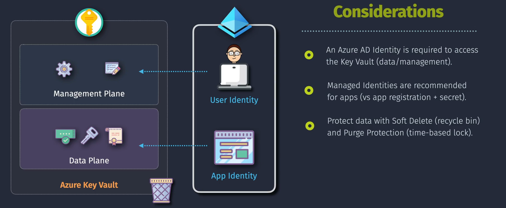

# 🔐 **Azure Key Vault (AKV)**

Azure Key Vault is a **cloud-based service** that helps you **securely store and manage sensitive information**, such as **keys, secrets, and certificates**. It’s a central place for managing cryptographic keys and secrets that applications and services use, without hardcoding them.

---

<div align="center">

</div>

---

## 🌟 **Why Use Azure Key Vault?**

- **Centralized Management** → Manage all your secrets, keys, and certificates in one place.
- **Enhanced Security** → Hardware Security Module (HSM)-backed protection.
- **Access Control** → Fine-grained access using **Azure Role-Based Access Control (RBAC)** or **Entra ID (Azure AD)**.
- **Logging & Compliance** → Integration with **Azure Monitor**, **Event Hub**, **Sentinel** for audit.
- **Automatic Rotation** → Certificates and secrets can be rotated automatically.

---

## 👮🏻‍♀️ **Authentication vs Authorization**

<div align="center"  >

</div>

---

- **Authentication (Who are you?)**

  - Managed by **Entra ID (Azure AD)**.
  - Apps/users authenticate using **Managed Identity, Service Principal, or User credentials**.

- **Authorization (What can you do?)**

  - Managed by **Key Vault RBAC** or **Access Policies**.
  - Defines whether the identity can read, write, or manage secrets/keys.

---

## 🏗️ **Types of Azure Key Vault Data**

<div align="center"  >

</div>

---

### 1️⃣ **Secrets**

- Secure storage of sensitive data:

  - Connection strings
  - Passwords
  - API keys

- Example: Store a SQL DB password instead of writing it in app config.

```bash
# Store a secret
az keyvault secret set --vault-name MyKeyVault --name "DBPassword" --value "P@ssw0rd123"

# Retrieve secret
az keyvault secret show --vault-name MyKeyVault --name "DBPassword"
```

### 2️⃣ **Keys**

- Cryptographic keys for **encryption, decryption, signing, and key exchange**.
- Supports software-protected or **HSM-protected** keys.
- Use cases:

  - Data encryption at rest
  - Signing JWT tokens
  - TLS/SSL offloading

```bash
# Create RSA key
az keyvault key create --vault-name MyKeyVault --name "encryptionKey" --protection software --kty RSA
```

### 3️⃣ **Certificates**

- Manage **X.509 certificates** for TLS/SSL.
- Automatic integration with **Certificate Authorities (CA)**.
- Auto-renewal supported.

```bash
# Import certificate
az keyvault certificate import --vault-name MyKeyVault --name "mycert" --file cert.pfx
```

---

## 🔗 **Integration Scenarios**

1. **Applications**

   - Apps fetch secrets (e.g., DB connection strings) dynamically instead of storing them in configs.
   - Use **Managed Identity** → no need to handle credentials.

   Example (C# app snippet):

   ```csharp
   var client = new SecretClient(new Uri("https://mykeyvault.vault.azure.net/"), new DefaultAzureCredential());
   KeyVaultSecret secret = client.GetSecret("DBPassword");
   string dbPassword = secret.Value;
   ```

2. **Azure Services**

   - Integrates with:

     - **Azure SQL** → TDE keys in Key Vault.
     - **Azure Functions** → fetch secrets at runtime.
     - **VMs/VMSS** → disks encrypted using Key Vault keys.

3. **DevOps**

   - Pipelines fetch secrets at build/deploy time.
   - Example: GitHub Actions or Azure DevOps pipeline uses Key Vault secrets.

---

## 🛡️ **Security & Best Practices**

- Use **Private Endpoints** → block public access.
- Always use **RBAC**, avoid legacy Access Policies.
- Enable **soft-delete + purge protection** → prevent accidental deletion.
- Rotate secrets & certificates automatically.
- Monitor access using **Azure Monitor / Sentinel**.
- Restrict export of HSM keys unless required.

---

## 📊 **Backup & Recovery**

- Export and backup (keys, secrets, and certificates).

  ```bash
  # Backup a key
  az keyvault key backup --vault-name MyKeyVault --name encryptionKey --file encryptionKey.backup

  # Restore a key
  az keyvault key restore --vault-name MyKeyVault --file encryptionKey.backup
  ```

- Recovery features:

  - **Soft Delete** → Items recoverable even after deletion (default 90 days).
  - **Purge Protection** → Prevents permanent deletion.

---

## ✅ **Benefits of Azure Key Vault**

- Centralized security for sensitive info.
- Reduced risk of credential leaks.
- Easy integration with Azure & external apps.
- Supports compliance (HIPAA, PCI-DSS, FedRAMP).

---

## ⚡ **In short:**

Azure Key Vault is the **go-to secure vault** for secrets, keys, and certificates in Azure. It integrates seamlessly with services, supports **HSM-based encryption**, provides **fine-grained RBAC**, and enables **compliance & monitoring**.
