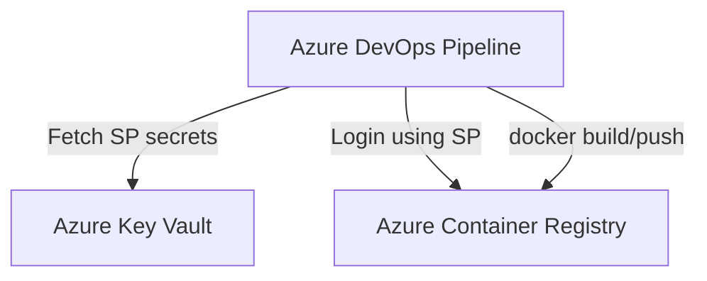

# 🐳 **Project: Push Container to ACR using Key Vault Secrets**

## 📌 **1) Scenario**

You have a Dockerized app. You want CI/CD to:

1. Build the image
2. Pull **credentials from Key Vault** (not from YAML)
3. Login to **ACR**
4. **Push** the image

We’ll use a **Service Principal (SP)** with `AcrPush` permissions and store its **Client ID** + **Secret** in **Key Vault**. In Azure Pipelines we’ll fetch those secrets at runtime and push the image.

---

## 🧩 **2) Architecture**

<div align="center">



</div>

---

- **AKV** holds: `sp-client-id`, `sp-client-secret`, and `tenant-id` (optional)
- **Pipeline** reads secrets securely → logs in to ACR → pushes

---

## 🏗️ **3) Provisioning (CLI — one time)**

> Replace names as you like. Keep registry unique.

### 🔹 Create Resource Group

```bash
az group create -n rg-acr-kv-demo -l eastus
```

### 🔹 Create ACR

```bash
az acr create \
  -n acrkvpushdemo \
  -g rg-acr-kv-demo \
  --sku Standard
```

### 🔹 Create Key Vault (RBAC-enabled)

```bash
az keyvault create \
  -n kv-acr-demo-123 \
  -g rg-acr-kv-demo \
  -l eastus \
  --enable-rbac-authorization true
```

### 🔹 Create Service Principal with ACR Push Role

```bash
ACR_ID=$(az acr show -n acrkvpushdemo -g rg-acr-kv-demo --query id -o tsv)

SP=$(az ad sp create-for-rbac \
  --name "sp-acr-kv-demo" \
  --role acrpush \
  --scopes $ACR_ID \
  --query "{appId:appId, password:password, tenant:tenant}" -o json)

APP_ID=$(echo $SP | jq -r .appId)
APP_SECRET=$(echo $SP | jq -r .password)
TENANT_ID=$(echo $SP | jq -r .tenant)

echo "APP_ID=$APP_ID"
echo "TENANT_ID=$TENANT_ID"
```

### 🔹 Store SP creds in Key Vault

```bash
az keyvault secret set --vault-name kv-acr-demo-123 --name sp-client-id     --value "$APP_ID"
az keyvault secret set --vault-name kv-acr-demo-123 --name sp-client-secret --value "$APP_SECRET"
az keyvault secret set --vault-name kv-acr-demo-123 --name tenant-id        --value "$TENANT_ID"
```

> ✅ You now have ACR + AKV with the SP credentials saved securely.

---

## 🗂️ **4) Repo Layout**

```ini
/app
  Dockerfile
  (your app files)
azure-pipelines.yml
```

**Example Dockerfile:**

```dockerfile
FROM mcr.microsoft.com/dotnet/runtime:8.0
WORKDIR /app
COPY . .
CMD ["bash","-lc","echo Hello from container && sleep 5"]
```

---

## 🚀 **5) Azure Pipelines (YAML) — Build & Push via AKV**

> Requirements:
> • Azure DevOps **Service Connection** to your subscription (for AKV task) — e.g., `sc-azure`
> • Pipeline must be granted **Get** secret permission for the vault (through RBAC or the task below)

```yaml
trigger:
  - main

variables:
  azureServiceConnection: "sc-azure" # ARM service connection name
  kvName: "kv-acr-demo-123" # Key Vault name
  acrName: "acrkvtpushdemo" # ACR name (must match created)
  imageName: "hello-kv" # repo name in ACR
  tag: "$(Build.BuildId)" # image tag
  fullImage: "$(acrName).azurecr.io/$(imageName):$(tag)"

pool:
  vmImage: "ubuntu-latest"

stages:
  - stage: BuildAndPush
    displayName: Build & Push Image using AKV secrets
    jobs:
      - job: buildpush
        displayName: Build & Push
        steps:
          - checkout: self

          # 1) Pull SP secrets from Key Vault securely
          - task: AzureKeyVault@2
            displayName: "Fetch ACR SP secrets from Key Vault"
            inputs:
              azureSubscription: $(azureServiceConnection)
              KeyVaultName: $(kvName)
              SecretsFilter: |
                sp-client-id
                sp-client-secret
                tenant-id
              RunAsPreJob: true

          # 2) Login to ACR using the SP from AKV
          - script: |
              echo "Logging into ACR using Service Principal from Key Vault..."
              echo "$(sp-client-secret)" | docker login $(acrName).azurecr.io \
                --username "$(sp-client-id)" --password-stdin

              echo "Building image: $(fullImage)"
              docker build -t $(fullImage) ./app

              echo "Pushing image..."
              docker push $(fullImage)

              echo "Done. Image: $(fullImage)"
            displayName: "Docker login+build+push"
```

### ℹ️ Notes

- `AzureKeyVault@2` injects secrets into environment variables matching the secret names (`sp-client-id`, `sp-client-secret`, `tenant-id`).
- We pipe `sp-client-secret` to `docker login` via **stdin** (safer than inline).
- The push target is `$(acrName).azurecr.io/<repo>:<tag>`.

---

## 🔁 **6) Alternative: Use Azure CLI instead of docker login**

If you prefer `az acr login` with the SP explicitly:

```yaml
- task: AzureCLI@2
  displayName: "ACR login (az cli) with SP from AKV"
  inputs:
    azureSubscription: $(azureServiceConnection)
    scriptType: bash
    scriptLocation: inlineScript
    inlineScript: |
      az login --service-principal \
        -u "$(sp-client-id)" \
        -p "$(sp-client-secret)" \
        --tenant "$(tenant-id)"

      az acr login -n $(acrName)  # configures docker credential helper

      docker build -t $(fullImage) ./app
      docker push $(fullImage)
```

---

## 🔒 **7) Security Best Practices**

1. **Never** put SP secrets in YAML/repo—store in **Key Vault**.
2. Grant the pipeline only **Get** on those secrets.
3. Prefer **RBAC-enabled Key Vault** with Data Plane permissions via Azure AD.
4. Consider **Managed Identity** for the pipeline (if using self-hosted agents or deployment jobs) to avoid SP at all.
5. Rotate SP credentials periodically (AKV makes it easy).

---

## 🧪 **8) Quick Test Checklist**

- First run: pipeline fetches secrets → docker login succeeds → image pushed.
- Validate image exists:

  ```bash
  az acr repository show -n acrkvpushdemo --image hello-kv:<yourBuildId>
  ```

- Pull locally to test:

  ```bash
  az acr login -n acrkvpushdemo
  docker pull acrkvpushdemo.azurecr.io/hello-kv:<yourBuildId>
  ```

---

## 🧰 **9) Bonus: Using ACR Admin (not recommended for prod)**

If you enabled ACR admin user:

```bash
# (not recommended in production)
USER=$(az acr credential show -n acrkvpushdemo --query username -o tsv)
PASS=$(az acr credential show -n acrkvpushdemo --query passwords[0].value -o tsv)

# Store in AKV as 'acr-admin-user' & 'acr-admin-pass', then:
echo "$(acr-admin-pass)" | docker login acrkvpushdemo.azurecr.io \
  --username "$(acr-admin-user)" --password-stdin
```

Use only for quick demos; prefer **Service Principal + AcrPush** in real systems.

---

## 🏁 **TL;DR**

- Create **ACR** + **Key Vault** + **Service Principal (AcrPush)**
- Store SP **Client ID/Secret/Tenant** in **AKV**
- Pipeline uses **AzureKeyVault\@2** to fetch secrets
- `docker login` → `docker build` → `docker push` to **ACR**
- No secrets in YAML, fully CI/CD-friendly ✅
