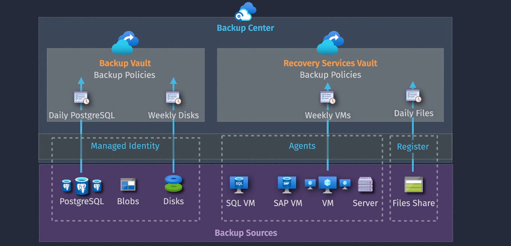

# 💾 **Azure Backup**

**Azure Backup** is a **cloud-based backup service** by Microsoft that gives you a **simple, secure, and cost-effective** way to protect your data. Think of it as your **magical safety net 🕸️** that catches your files, apps, and systems if something bad happens.


---

## ✨ Key Features

Azure Backup = your **always-on save button 🎮**.


- **App Consistent Backups 🧩**
  Ensures apps are in a clean, transaction-safe state when backed up. That means if you restore, your app starts properly without you fixing broken databases or corrupted states.

- **Short → Long-term Retention 🕰️**
  Keep your data for **days, months, or even years**. Whether you need a backup from last night or 7 years ago for compliance, Azure’s got you covered.

- **Comprehensive Compatibility 🦸**
  Windows? ✅ Linux? ✅ Databases? ✅ SAP HANA? ✅
  It’s basically a **superhero backup tool** that doesn’t discriminate.

---

## 🗝️ Key Components


Azure Backup works like a **team of heroes**, each with a job:

### 🏰 1. Vault

Your **Vault** = your **treasure chest in the cloud** 💎.
This is where backups & restore points live, along with your backup policies.

**Types of Vaults:**

1. **Recovery Services Vault** (modern, recommended ✅)

   - Based on **ARM model**.
   - Supports monitoring, soft delete, cross-region restore, and Azure RBAC.
   - Protects:

     - Azure VMs (Linux/Windows)
     - SQL in Azure VMs
     - Azure Files
     - SAP HANA in VMs
     - Azure Backup Server / DPM

2. **Backup Vault** (legacy, ASM ❌ new use)

   - Limited capabilities.
   - Used for: Azure disks, blobs, PostgreSQL servers.

---

### ⏰ 2. Backup Policy

Your **Backup Policy** = your **game save schedule** 🎮.

- Defines **how often** to back up (daily, weekly).
- Defines **how long** to keep them (30 days, 1 year, forever).

---

### 📂 3. Backup Item

The actual thing you’re saving:

- File
- Folder
- VM
- Database
- Application

Each one is a **backup item** and gets managed individually.

---

## 🛠️ Implementation Overview

Azure Backup setup = like building a **LEGO fortress 🧱**. Follow the steps and you’ll have a rock-solid shield for your data.



---

### 🚀 Steps to Implement Azure Backup

1. **Create a Recovery Services Vault 🏰**

   ```bash
   az backup vault create \
     --resource-group myResourceGroup \
     --name myRecoveryVault \
     --location eastus
   ```

2. **Define Backup Policies ⏰**
   Example: Backup every day at 2 AM, keep for 30 days.

   ```bash
   az backup policy create \
     --resource-group myResourceGroup \
     --vault-name myRecoveryVault \
     --name myBackupPolicy \
     --backup-management-type AzureIaasVM \
     --policy @"policy.json"
   ```

   **policy.json**:

   ```json
   {
     "schedulePolicy": {
       "scheduleRunFrequency": "Daily",
       "scheduleRunTimes": ["2024-05-01T02:00:00Z"]
     },
     "retentionPolicy": {
       "retentionPolicyType": "LongTermRetentionPolicy",
       "dailyRetention": {
         "count": 30
       }
     }
   }
   ```

3. **Select Backup Items 🎮**

   ```bash
   az backup protection enable-for-vm \
     --resource-group myResourceGroup \
     --vault-name myRecoveryVault \
     --vm myVirtualMachine \
     --policy-name myBackupPolicy
   ```

4. **Start Backup Now 🔄**

   ```bash
   az backup protection backup-now \
     --resource-group myResourceGroup \
     --vault-name myRecoveryVault \
     --container-name myVMContainer \
     --item-name myVirtualMachine
   ```

---

## 📊 Visualizing It

```mermaid
flowchart TD
   A[Create Vault 🏰] --> B[Define Backup Policy ⏰]
   B --> C[Select Items 🎮]
   C --> D[Run Backup 🔄]
   D --> E[Restore when needed 🔑]
```

---

## 📌 Summary

- **Azure Backup = Safety Net** 🕸️
- **Vault** = Treasure chest 🏰
- **Backup Policy** = Save schedule ⏰
- **Backup Item** = What you’re saving 🎮
- Works with everything from **files** → **apps** → **VMs** → **databases**.

👉 Combine **Azure Backup** (data safety) + **Azure Site Recovery** (business continuity) = a **bulletproof disaster recovery plan 🦾**.
