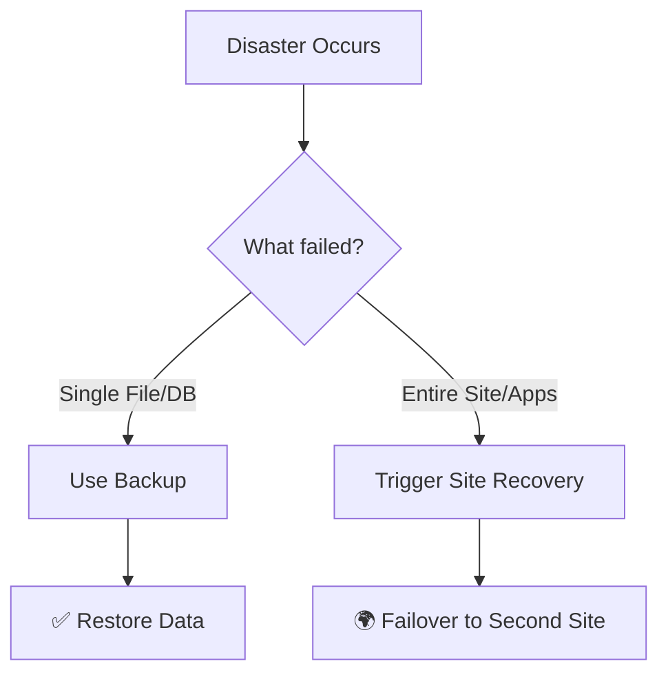

# 🛡️ **Backup** vs 🌍 **Site Recovery**

Both **Backup** and **Site Recovery** are key players in your **disaster recovery (DR) strategy**. But they don’t do the same job

👉 **Backup = Protect the data itself.**  
👉 **Site Recovery = Keep the entire business running.**

---

## 💾 **Backup** – Data’s Safety Net

### 📖 Purpose

- Protects your **data** from corruption, accidental deletion, or hardware failure.

### ⚙️ How It Works

- Takes **snapshots/copies** of your data.
- Stores them in a **safe place** (cloud, on-prem, hybrid).
- Lets you roll back to a “clean” state when disaster strikes.

### 🌟 Key Features

- **Frequency**: Scheduled (hourly, daily, weekly).
- **Retention**: Multiple versions kept as per policy.
- **Recovery**: Files, databases, or even whole VMs.

### 🎯 Use Cases

- Accidental file deletion 🗑️
- Ransomware attack 🕵️‍♂️
- Database corruption 💔
- Compliance data retention laws ⚖️

### 🧑‍🏫 Human Analogy

- Backup = **Google Drive for your IT**. You save versions so you can pull back yesterday’s homework if today’s file got corrupted.

---

## 🌍 **Site Recovery** – The Business Lifeline

### 📖 Purpose

- Ensures **business continuity** by replicating _entire systems + apps_ to a **secondary site**.

### ⚙️ How It Works

- **Continuously replicates** systems and apps.
- Keeps a **hot spare site** ready.
- Enables **failover** to the secondary site when the main one dies.

### 🌟 Key Features

- **Replication**: Continuous/near real-time.
- **Failover**: Quick switch to backup site.
- **Failback**: Switch back once primary is healthy.

### 🎯 Use Cases

- Natural disasters 🌪️
- Power outage ⚡
- Full data center failure 🔌
- Keeping critical apps running with minimal downtime.

### 🧑‍🏫 Human Analogy

- Site Recovery = **having a backup office across town**. If your main office floods, employees can just drive to the other one and keep working.

---

## 📊 Visualizing the Difference

---

## ✅ Best Practice: Use Both Together

- **Backup only** → You can get your data back, but it may take hours/days.
- **Site Recovery only** → Apps keep running, but corrupted data gets replicated too (ouch!).
- **Both** → Business stays online _and_ you can restore clean data.

---

## 🏁 Summary

| Feature           | 💾 **Backup**                    | 🌍 **Site Recovery**        |
| ----------------- | -------------------------------- | --------------------------- |
| **Focus**         | Data safety                      | Business continuity         |
| **Method**        | Copies/snapshots                 | Continuous replication      |
| **Granularity**   | File, DB, VM                     | Entire apps & sites         |
| **Recovery Goal** | Get data back                    | Keep business running       |
| **Best For**      | Deletion, corruption, ransomware | Disasters, outages, DC loss |
| **Analogy**       | Google Drive versions            | Backup office building      |
