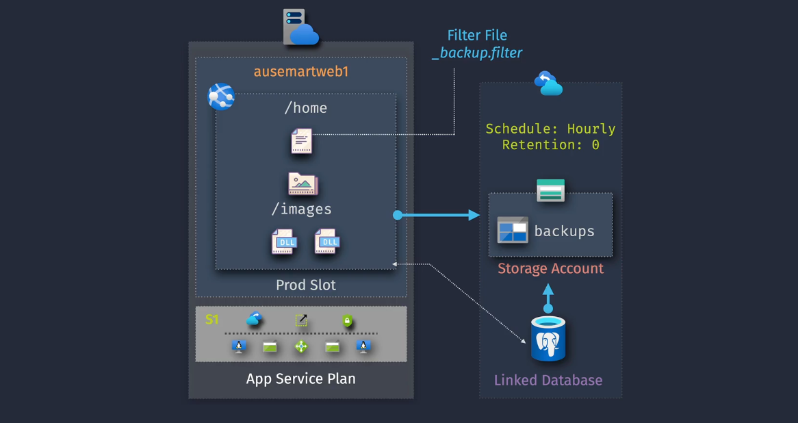
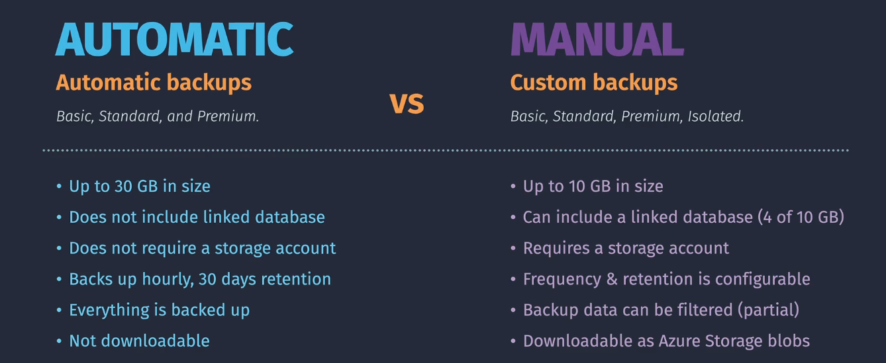

# 🌐 _Backup_ - **Azure App Service** _(for Web Apps hosted on App Service)_

> 📖 It is a built-in feature to back up and restore your **App Service–hosted web apps** with just a few clicks.

---

> 🤔 When you host a website or API using **Azure App Service**, you don’t want to lose your code, configurations, or linked databases because of a failed deployment, human error, or corruption.
> This is where **App Service Backup** comes in.  
> **Azure App Service Backup** lets you protect your web apps (and linked databases) with **automatic** or **manual** backups, giving you restore points against bugs, corruption, or "oops-I-deleted-it" moments.

<div align="center">
  
</div>

---

## 🔑 Key Features

1. **Automated Backups** – Azure schedules backups (daily, weekly).
2. **On-Demand Backups** – Trigger backups anytime before risky deployments.
3. **Backup Scope** – App config + file system + connected DBs (SQL, MySQL, PostgreSQL).
4. **Retention Policies** – Keep backups only as long as needed → save storage 💰.
5. **Encrypted by Default** – Secure at rest and in transit 🔐.
6. **Flexible Restores** – Overwrite existing app or restore to a new app/slot.

---

## 💡 Use Cases

- **🛡️ Data Protection** → accidental deletes, corruption, or ransomware.
- **🧪 Dev/Test** → create restore points before deploying risky updates.
- **🚨 Disaster Recovery** → fast rollback in case prod burns 🔥.

---

## ⚖️ Automatic vs Manual Backups

<div align="center">
  

---

| Feature              | 🤖 Automatic Backups | 👨🏻‍💻 Manual Backups           |
| -------------------- | -------------------- | --------------------------- |
| **Initiation**       | Azure scheduled      | User initiated              |
| **Frequency**        | Regular (e.g. daily) | On-demand                   |
| **Retention Policy** | Predefined           | User-defined                |
| **Backup Size**      | 30 GB                | 10 GB (4 GB for DBs)        |
| **Linked Database**  | ❌ Not included      | ✅ SQL, MySQL, PostgreSQL   |
| **Storage Account**  | ❌ Not required      | ✅ Required                 |
| **Downloadable**     | ❌ No                | ✅ Yes (blobs)              |
| **Partial Backups**  | ❌ No                | ✅ Yes via `_backup.filter` |
| **VNet Support**     | ❌ No                | ✅ Yes                      |

</div>

> 👉 **Translation:**  
> **🤖 Automatic = set-and-forget**.  
> **👨🏻‍💻 Manual = flexible + powerful (with storage + filters).**

---

## ⚙️ How It Works

1. **Configure Backups (Portal)**

   - App Service → _Backups_ → Configure.
   - Select **Storage Account** + **Container**.
   - Include linked DBs if needed.

2. **Run Backups**

   - Automatic (Azure schedule)
   - Manual (_Backup Now_ button).

3. **Restore Backups**

   - Restore to existing app, new app, or staging slot.
   - Validate functionality → swap slots if needed.

---

## 🎯 Using `_backup.filter` for Selective Backups

The `_backup.filter` file = your "exclude list" during **manual** backups.
It helps skip logs, temp files, or other junk to keep backups lean.

### Steps:

1. Create a text file → name it `_backup.filter`.
2. Add exclusions (one per line).
3. Place it in your app root (`wwwroot`).
4. Run **manual backup** → Azure excludes listed items.

### Example `_backup.filter`

```text
# Exclude temp folder
/temp

# Exclude all logs
/logs/*

# Exclude secrets file
/secrets.txt
```

---

## 🚀 Hands-On (CLI + PowerShell)

### 🔹 Configure Manual Backup (Azure CLI)

```bash
# Set variables
RESOURCE_GROUP="MyRG"
WEBAPP_NAME="MyApp"
STORAGE_ACCOUNT="mystorageacct"
CONTAINER_NAME="appbackups"

# Configure backup
az webapp config backup create \
  --resource-group $RESOURCE_GROUP \
  --webapp-name $WEBAPP_NAME \
  --storage-account-url https://$STORAGE_ACCOUNT.blob.core.windows.net/$CONTAINER_NAME \
  --frequency 1d \
  --retention 7d \
  --db-type SQLAzure \
  --db-connection-string "Server=tcp:mydb.database.windows.net;Database=mydb;User Id=user;Password=secret!;"
```

### 🔹 Trigger Manual Backup

```bash
az webapp config backup create \
  --resource-group $RESOURCE_GROUP \
  --webapp-name $WEBAPP_NAME \
  --storage-account-url https://$STORAGE_ACCOUNT.blob.core.windows.net/$CONTAINER_NAME
```

### 🔹 Restore App from Backup

```bash
az webapp config backup restore \
  --resource-group $RESOURCE_GROUP \
  --webapp-name $WEBAPP_NAME \
  --backup-name MyAppBackup \
  --container-url https://$STORAGE_ACCOUNT.blob.core.windows.net/$CONTAINER_NAME \
  --overwrite
```

### 🔹 PowerShell Example

```powershell
# Trigger backup
New-AzWebAppBackup `
   -ResourceGroupName "MyRG" `
   -Name "MyApp" `
   -StorageAccountUrl "https://mystorageacct.blob.core.windows.net/appbackups" `
   -FrequencyInterval 1 `
   -FrequencyUnit Day `
   -RetentionPeriodInDays 7 `
   -Databases @(@{ConnectionString="Server=tcp:mydb.database.windows.net;Database=mydb;User Id=user;Password=secret!"; Name="MyDb"; Type="SQLAzure"})
```

---

## 🔗 Integration with Other Azure Services

- **Azure Site Recovery (ASR)** → full workload replication for DR.
- **Azure Monitor** → alerts when backups fail.
- **Key Vault** → securely store DB connection strings used in backups.

---

## 📝 Summary

- **Automatic** → easy, but limited.
- **Manual** → more control (filters, DBs, storage).
- **\_backup.filter** → exclude junk.
- **CLI/PowerShell** → automate everything.

> 👉 Best practice: Use **Automatic** for daily safety + **Manual (with filters)** before major deployments.
