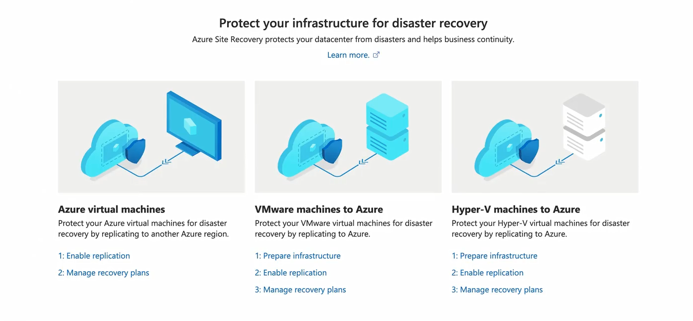
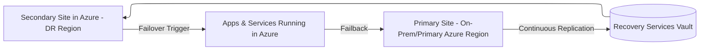
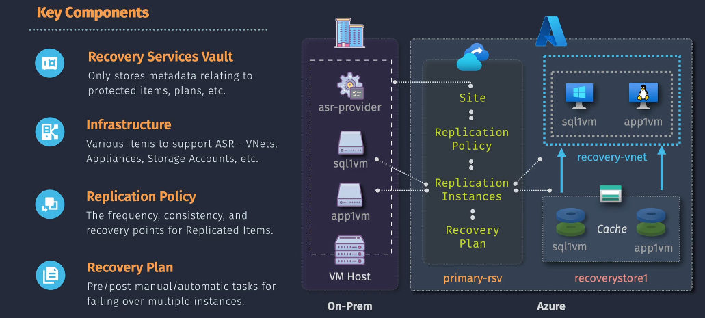

# 🌍 **Azure Site Recovery (ASR)** – Disaster Recovery as a Service

> 📖 **Official Definition:**  
> _Azure Site Recovery is a Disaster Recovery as a Service (DRaaS) that keeps your business apps and workloads online by replicating them from a primary site to a secondary site (Azure or another datacenter)._

---

**🧩 In simple words:**

- **Replication**: Your VM/app/server is constantly mirrored into Azure.
- **Failover**: If your primary site dies (fire, power loss, ransomware), you can spin up the replica instantly in Azure.
- **Failback**: When the main site is fixed, move workloads back safely.

---

<div align="center">
  
</div>

---

## 🛠️ **How ASR Works** (The Flow)



---

1. **Replication** → Continuous sync of workloads (VMs, physical servers, Azure VMs).
2. **Recovery Services Vault** → Stores replication metadata, recovery points, and policies.
3. **Failover** → Trigger DR plan → workloads spin up in Azure (near-zero downtime).
4. **Failback** → Sync back to the primary site once it’s healthy again.

---

<div align="center">
  
</div>

---

## ⚡ **RPO & RTO** (Key DR Metrics)

- **RPO (Recovery Point Objective)** → _How much data you can afford to lose._

  - With ASR: **as low as 30 seconds** for supported workloads.

- **RTO (Recovery Time Objective)** → _How quickly you can bring workloads back._

  - With ASR: **minutes** instead of hours/days.

👉 This is why ASR is chosen for **mission-critical apps**.

---

## 🖥️ **Supported Workloads**

✅ **Azure VMs** – Replicate across regions (e.g., East US → Central US).  
✅ **VMware VMs** – On-prem VMware replicated to Azure.  
✅ **Hyper-V VMs** – Native Hyper-V integration.  
✅ **Physical Servers** – Windows/Linux servers on-prem.

❌ **Not for backups** – That’s Azure Backup’s job.  
❌ **Not for dev snapshots** – It’s designed for DR continuity, not short-term testing.

---

## ✨ **Key Features of ASR**

1. **Multi-platform Replication** → VMware, Hyper-V, Azure, physical servers.
2. **Recovery Plans** → Orchestrate failovers (e.g., start SQL first, then Web App, then Load Balancer).
3. **Test Failovers** → Run DR drills without downtime.
4. **App-consistent Snapshots** → Ensure DBs (SQL, MySQL, Oracle) are usable after recovery.
5. **Integration** → Azure Monitor (alerts), Azure Automation (runbooks), ITSM tools.
6. **Security** → Encrypted replication (in-transit + at rest).
7. **Cost Efficient** → You only pay for storage until you failover (compute billed only when running in Azure).

---

## 💭 **Use Cases**

- **🛡️ Disaster Recovery (Primary Use)**

  - Protect against **natural disasters, hardware failure, power outage, ransomware**.

- **🔄 Migration**

  - Move workloads from **on-prem → Azure** seamlessly.

- **🧪 Testing / DevOps**

  - Run failover drills before production releases.

- **🌐 Compliance**

  - Achieve RPO/RTO regulatory requirements (financial, healthcare, government).

---

## ⚖️ **Azure Backup** vs **Azure Site Recovery**

| Feature      | **Azure Backup** 🗄️                 | **Azure Site Recovery** 🌍            |
| ------------ | ----------------------------------- | ------------------------------------- |
| **Purpose**  | Protect data (files, VMs, DBs)      | Keep apps running (full workloads)    |
| **Scenario** | Data recovery (long-term retention) | Disaster recovery (continuity)        |
| **Recovery** | Restore after outage                | Continue running during outage        |
| **RPO/RTO**  | Hours → Days                        | Minutes                               |
| **Cost**     | Storage + Retention                 | Storage + Compute (on failover)       |
| **Best For** | File recovery, database backups     | Business continuity, DR orchestration |

👉 **They complement each other**:

- **Azure Backup** → insurance for files & DBs.
- **ASR** → insurance for entire business apps.

---

## ✍🏻 **Hands-On Example:** Protecting an Azure VM (Region-to-Region DR)

### 1️⃣ Step 1 – Create a Recovery Services Vault

**Portal:**

- Search → _Recovery Services Vault_ → Create → Select RG + Region.

**CLI:**

```bash
az backup vault create \
  --resource-group MyRG \
  --name MyRecoveryVault \
  --location eastus
```

---

### 2️⃣ Step 2 – Enable Replication for VM

**Portal:**

- Go to **Vault → Site Recovery → Replicate**.
- Choose **Source** (Azure VM) → Select target region → Configure policy.

**CLI:**

```bash
az site-recovery replication-protected-item create \
  --vault-name MyRecoveryVault \
  --resource-group MyRG \
  --protection-container MyContainer \
  --name MyVMReplication \
  --policy-name DefaultPolicy
```

---

### 3️⃣ Step 3 – Test Failover

- Go to **Vault → Replicated Items → MyVM → Test Failover**.
- Choose recovery point → Start → VM spins up in DR region without impacting prod.

---

### 4️⃣ Step 4 – Planned Failover (Disaster Scenario)

- Vault → _Replicated Items_ → Failover → Confirm.
- VM starts in **secondary region**.
- Update DNS/Traffic Manager → users routed to DR VM.

---

### 5️⃣ Step 5 – Failback

- After primary site is back → Run **Failback**.
- Workloads synced back → secondary site freed.

---

## 🏁 **Summary**

- **Azure Site Recovery (ASR)** = _Business Continuity as a Service_.
- Provides **replication, failover, failback** for apps running on-prem or Azure.
- Supports **VMware, Hyper-V, Physical Servers, Azure VMs**.
- **RPO: \~30 sec | RTO: minutes** → near real-time DR.
- Complements **Azure Backup** (data retention).
- Critical for **mission-critical workloads** with compliance & uptime needs.

> 👉 Best practice:
>
> - Use **Azure Backup** for data retention.
> - Use **ASR** for disaster recovery & business continuity.
