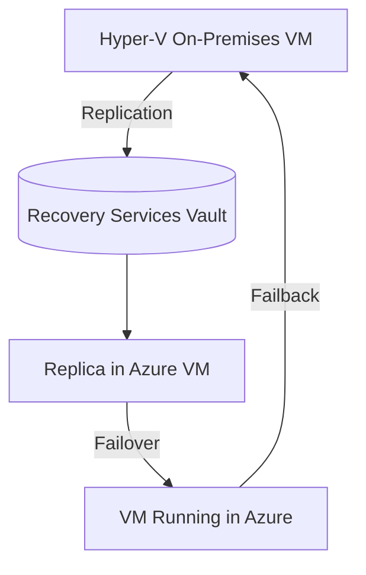

# 🧪 Lab 2 – Disaster Recovery for Hyper-V to Azure

This is the **classic on-prem → Azure DR scenario**, where you replicate Hyper-V VMs to Azure.

---

## ⚙️ Step 1 – Prepare Azure

1. **Create Recovery Services Vault** (same as Lab 1).
2. In Vault → **Site Recovery** → _Prepare Infrastructure_.

   - **Protection goal**: Replicate _On-Premises to Azure_.
   - **Workload type**: Hyper-V.
   - **Deployment**: _Without VMM_ (if using standalone Hyper-V) or _With VMM_ (if using System Center Virtual Machine Manager).

---

## ⚙️ Step 2 – Install Hyper-V Replication Provider

1. From Vault → _Site Recovery Infrastructure → Hyper-V Sites_.
2. Create new **Hyper-V Site** (`MyHyperVSite`).
3. Add **Hyper-V server** → Download **Azure Site Recovery Provider + Vault registration key**.
4. On Hyper-V host:

   - Install Provider MSI.
   - Register using downloaded Vault key.

---

## ⚙️ Step 3 – Configure Replication for Hyper-V VMs

**Portal:**

1. Vault → _Replicate Application_.
2. Source: `MyHyperVSite`.
3. Target: Azure Region (e.g., _East US_).
4. Choose Storage Account & VNet for replicas.
5. Select VMs → Define replication settings (frequency, RPO, retention).

**PowerShell (on Hyper-V host):**

```powershell
# Register Hyper-V with ASR
Register-AzRecoveryServicesAsrProvider `
   -VaultId (Get-AzRecoveryServicesVault -Name "MyRecoveryVault").ID `
   -Path "C:\ASRProvider"

# Enable protection for VM
Start-AzRecoveryServicesAsrProtection `
   -Name "MyOnPremVM" `
   -ProtectionContainerId "MyHyperVContainer" `
   -PolicyId "DefaultPolicy"
```

---

## ⚙️ Step 4 – Test Failover

1. Vault → _Replicated Items_ → Select VM → _Test Failover_.
2. Choose Recovery Point.
3. VM spins up in Azure test VNet.
4. Validate connectivity & functionality.

---

## ⚙️ Step 5 – Planned Failover

1. In real disaster → Trigger **Failover**.
2. VM is started in Azure.
3. End users switch to DR VM.

---

## ⚙️ Step 6 – Failback (After On-Prem is Healthy)

1. Once Hyper-V site is restored → Choose _Failback_.
2. Sync changes back to on-prem VMs.
3. Replication resumes from Azure → Hyper-V.

---

### 🔎 Visual Workflow



---

## 📝 Final Summary

- **Lab 2 (Hyper-V → Azure)**:

  - Install ASR Provider → Register Hyper-V → Replicate VMs → Test Failover → Failover → Failback.
  - Ideal for hybrid workloads & migration scenarios.
