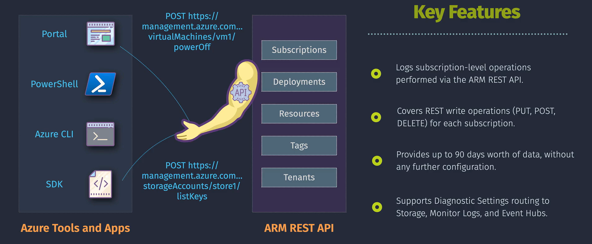
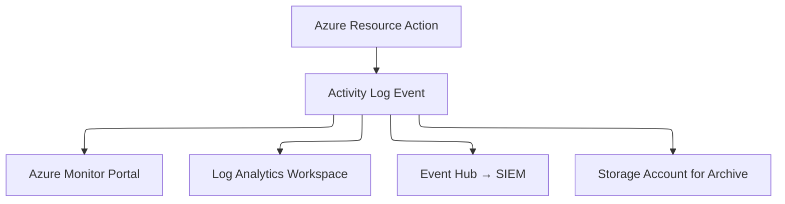

# 👮🏻‍♂️ Azure Activity Logs

> 📖 **Azure Activity Logs** (previously called _Operational Logs_ or _Audit Logs_) are a **central record of all control-plane events** that happen in your Azure subscription.

They answer: **“What happened, when, who did it, and where?”**

---

<div align="center">
  
</div>

---

## 🧩 **Key Concepts**

### 🔎 1. **Scope**

- Logs are tied to a **subscription**, not individual resources.
- They track **control-plane operations** (e.g., “Create VM”, “Delete Key Vault”), not data-plane (e.g., “Read blob”, “Query DB”).
- Example:

  - Activity Log = “VM was started by Alice at 2:30 PM”
  - Metrics/Diagnostic Log = “CPU usage of VM = 85%”

### ⌛ 2. **Retention**

- By default, Activity Logs are kept for **90 days**.
- They can be **exported** to:

  - **Azure Monitor Logs (Log Analytics)** → for queries/alerts.
  - **Event Hub** → stream to SIEM or 3rd-party tools.
  - **Storage Account** → long-term archival.

### 😺 3. **Categories**

Activity Log entries are grouped into categories:

- **Administrative** – resource changes (create, delete, update).
- **Service Health** – Azure service outages/incidents.
- **Resource Health** – availability status of your resources.
- **Security** – role assignments, policy changes.
- **Alerts** – triggered by configured alerts.
- **Autoscale** – scale-out/scale-in events.
- **Recommendations** – advisor recommendations applied.

---

## 🏛️ **Structure of an Activity Log Entry**

Each event has rich metadata. Example JSON snippet:

```json
{
  "eventTimestamp": "2025-08-19T14:30:00Z",
  "operationName": "Microsoft.Compute/virtualMachines/start/action",
  "status": "Succeeded",
  "eventCategory": "Administrative",
  "caller": "alice@contoso.com",
  "resourceId": "/subscriptions/xxxx/resourceGroups/MyRG/providers/Microsoft.Compute/virtualMachines/MyVM",
  "level": "Informational",
  "correlationId": "d3f1a0c7-1111-4b0f-aaaa-222222222222",
  "properties": {
    "statusCode": "Accepted"
  }
}
```

### Breakdown:

- **eventTimestamp** → when action happened.
- **operationName** → what was done (Start VM).
- **status** → success/failure.
- **caller** → who performed the action.
- **resourceId** → on which resource.
- **correlationId** → unique ID (trace across services).
- **properties** → extra info (e.g., API version, status codes).

---

## 🔧 **How to Access Activity Logs**

### 1. **Azure Portal**

- Navigate to **Monitor → Activity Log**.
- Filter by subscription, timespan, resource group, resource type, event category, or caller.
- Drill down into event details.
- Useful for **admins & auditors**.

### 2. **Azure CLI**

```bash
# List last 10 events
az monitor activity-log list --max-events 10

# Filter by resource group
az monitor activity-log list \
   --resource-group MyRG \
   --start-time 2025-08-18 \
   --end-time 2025-08-19
```

### 3. **PowerShell**

```powershell
# Get last 20 events
Get-AzActivityLog -MaxRecord 20

# Filter by date & caller
Get-AzActivityLog `
  -ResourceGroup "MyRG" `
  -StartTime (Get-Date).AddDays(-1) `
  -Caller "alice@contoso.com"
```

### 4. **Azure Monitor Logs (KQL)**

If exported to Log Analytics:

```kusto
AzureActivity
| where OperationName == "Create or Update Virtual Machine"
| where Caller == "alice@contoso.com"
| project TimeGenerated, ResourceGroup, Resource, ResultDescription
```

---

## 💭 **Typical Use Cases**

1. **Security & Compliance**

   - Who deleted a resource?
   - Who assigned themselves a privileged role?

2. **Operational Troubleshooting**

   - Why did my VM restart?
   - Who changed the NSG rules that blocked traffic?

3. **Change Tracking**

   - What deployments happened last week?
   - Which policies were modified?

4. **Integration with SIEM/Monitoring**

   - Stream logs to **Splunk, Sentinel, QRadar**.
   - Create **alerts**: e.g., Notify when anyone deletes a resource group.

---

## 🖼️ **Visual Flow**



---

## 🧪 **Mini Lab** – Viewing & Exporting Activity Logs

### 1️⃣ Step 1 – View Recent Activity

1. Azure Portal → **Monitor → Activity Log**.
2. Filter by _Administrative_ category.
3. Select a VM → Check events (Start/Stop/Restart).

### 2️⃣ Step 2 – Export Logs to Log Analytics

1. Go to **Activity Log → Diagnostic Settings → Add Diagnostic Setting**.
2. Choose destination: **Log Analytics workspace**.
3. Select categories (Administrative, Security, Resource Health).
4. Save → Logs now stream into Log Analytics.

### 3️⃣ Step 3 – Run KQL Query

```kusto
AzureActivity
| where Category == "Administrative"
| where OperationName contains "Delete"
| project TimeGenerated, Caller, ResourceGroup, Resource
```

→ Shows **who deleted what, and when**.

---

## ✅ **Summary**

- **Azure Activity Logs** = control-plane audit trail for all actions in a subscription.
- Cover **Administrative, Security, Service Health, Resource Health, Autoscale, Alerts, Recommendations**.
- Retained **90 days** natively → Export to **Log Analytics, Event Hub, Storage** for long-term.
- Essential for **security auditing, troubleshooting, and compliance**.
