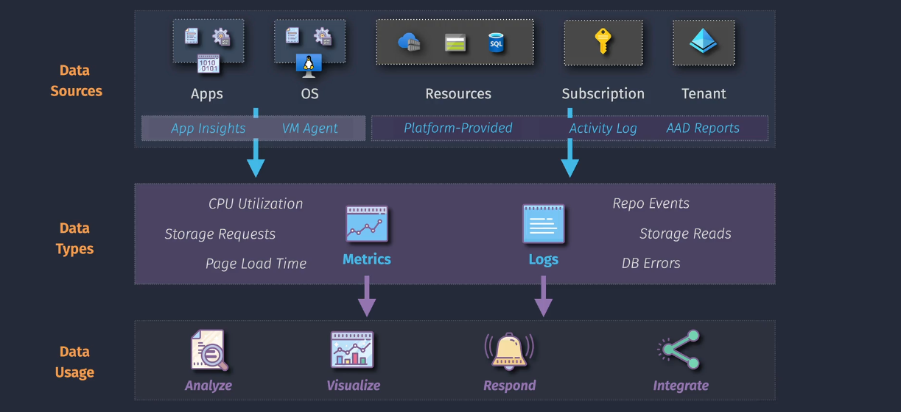
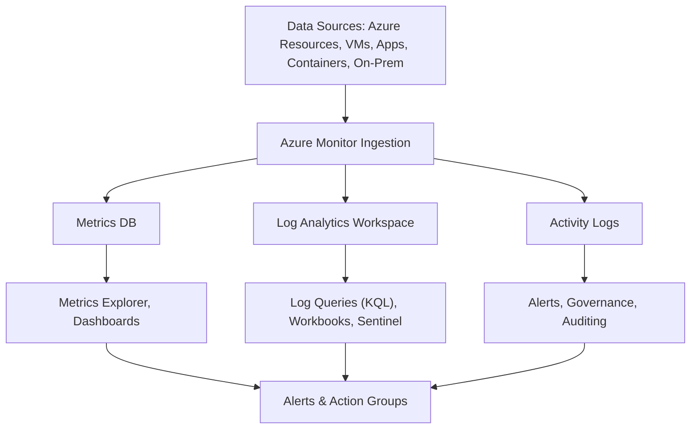
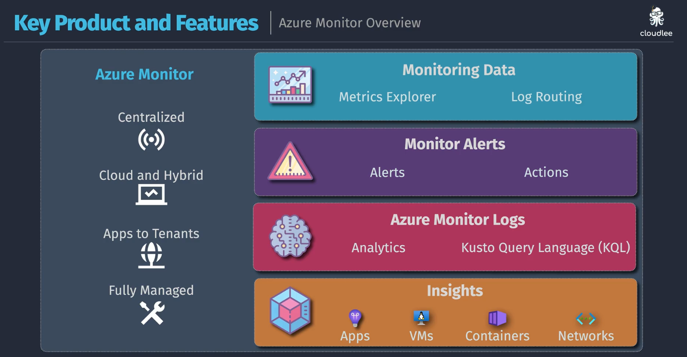

# 🔭 **Azure Monitor** – The Big Picture

**Azure Monitor** is Microsoft’s **end-to-end observability service**.
Its purpose: **Collect, analyze, and act on telemetry from your applications, infrastructure, and Azure resources.**

Think of it as the **umbrella service** that combines:

- **Metrics** (numerical performance data)
- **Logs** (event/trace data)
- **Alerts & Actions** (notifications and automation)
- **Insights & Visualizations** (dashboards, analytics, AI-powered insights)

---

  

---

## 🧩 **Azure Monitor Building Blocks**

Here are the **main parts** you’ll bump into:

### 1. 📊 **Metrics**

- Lightweight numbers, time-series (e.g., CPU %, Requests/sec, Disk I/O).
- Stored in **Azure Monitor Metrics DB**.
- Retention = 93 days (by default).
- Used for **dashboards, near real-time alerts**.

---

### 2. 📜 **Logs**

- Rich, verbose data (activity logs, resource logs, syslog, events, app logs).
- Stored in **Log Analytics Workspace**.
- Used for **deep queries (KQL), auditing, troubleshooting, SIEM-style analysis**.

---

### 3. 📖 **Activity Logs**

- The “audit trail” of control-plane operations in Azure.
- Example: _Who created a VM? Who deleted a Key Vault secret?_
- Global per-subscription → can route to Log Analytics, Storage, Event Hub.

---

### 4. 📦 **Application Insights**

- Special feature inside Azure Monitor focused on **apps**.
- Collects traces, requests, exceptions, dependency calls.
- Gives you application maps, performance tracking, user behavior insights.

---

### 5. ⚡ **Alerts & Actions**

- Rules that trigger on metrics, logs, or activity events.
- Example: _Alert if CPU > 80% for 5 minutes._
- Action Groups → email, SMS, webhook, runbook, ITSM, Teams, PagerDuty.

---

### 6. 📊 **Visualization & Analytics**

- **Metrics Explorer** → charts from metrics.
- **Workbooks** → fancy interactive dashboards mixing metrics + logs.
- **Grafana integration** → open-source dashboards.
- **Log Analytics** → KQL queries across all your log data.

---

### 7. 🛠️ **Data Collection**

This is where most people get confused. There are 3 overlapping things:

1. **Diagnostic Settings (Monitoring Agents (AMA, MMA, Diagnostic Extension))** → Resource-level config for sending logs/metrics out, Collect guest-level data.
2. **Data Collection Rules (DCRs)** → Central, modern way to define _what to collect_ and _where to send it_.

👉 Think of Diagnostic Settings as **“resource logs exporter”** and DCRs as **“VM/app telemetry manager”**.

---

## 🧩 **Azure Monitor Architecture** (Simplified)

---

## 🏷 **Azure Monitor "Products" / Sub-Services**

Here’s where confusion usually comes in 😅.
Let’s clarify the main **sub-services under Azure Monitor**:

---

  

---

### 🔹 **1. Application Insights**

- Focus: **Application Performance Monitoring (APM)**
- Collects telemetry from your **app code** (availability, dependencies, exceptions, requests).
- Use it to:

  - Detect slow response times
  - Find failing dependencies (e.g., DB, API)
  - Analyze usage patterns (which features users click most)

- Example: Monitor a web app’s response time and error rates.

---

### 🔹 **2. VM Insights**

- Focus: **Deep monitoring for Virtual Machines** (Windows/Linux).
- Shows **performance, processes, dependencies**.
- Works on top of **Log Analytics agent / AMA agent**.
- Example: Which processes consume most CPU on a VM?

---

### 🔹 **3. Container Insights**

- Focus: **Kubernetes (AKS) & containerized workloads**.
- Collects node, pod, and container performance + logs.
- Example: Monitor AKS cluster health and pod restarts.

---

### 🔹 **4. Network Insights**

- Focus: **Azure networking** (VNets, NSGs, Gateways, Load Balancers).
- Provides **topology maps, metrics, and diagnostic logs**.
- Example: Why is my traffic not reaching VM → see NSG flow logs.

---

### 🔹 **5. Azure Monitor Metrics**

- Lightweight, numeric values (CPU %, Disk IOPS, request/sec).
- Best for **near real-time monitoring** (1-min granularity).
- Example: Trigger alert if CPU > 80% for 10 mins.

---

### 🔹 **6. Azure Monitor Logs (Log Analytics)**

- Central **log repository + query engine (KQL)**.
- Can store data from any Azure/on-prem resource.
- Powerful for **troubleshooting, correlation, and compliance**.
- Example: Find which IPs made failed RDP attempts across all VMs.

---

### 🔹 **7. Azure Monitor Alerts**

- Define **conditions** on metrics/logs.
- Trigger **Action Groups** → Notify via email, SMS, Teams, webhook, etc.
- Example: Alert when more than 5 failed login attempts from same IP.

---

### 🔹 **8. Azure Monitor Workbooks**

- Interactive dashboards → combine **metrics, logs, and visualizations**.
- Use pre-built templates for apps, VMs, AKS, networks.
- Example: Show a dashboard of App Insights performance + CPU metrics + security alerts.

---

### 🔹 **9. Autoscale**

- Scale VMs or App Services automatically based on **metrics**.
- Example: Scale-out web app when CPU > 75% for 5 minutes.

---

## ✅ **How to Think About It**

- **Metrics** = quick, numbers, dashboards.
- **Logs** = deep, detailed, investigation.
- **Activity Logs** = audit trail.
- **Application Insights** = for apps specifically.
- **Diagnostic Settings** = tell Azure _where logs go_.
- **Data Collection Rules** = tell Agents _what to collect_.
- **Azure Monitor = the umbrella** that unifies all this.

---

## 🎯 Real-World Example

You run an **e-commerce app** in Azure:

1. **App Service** → emits CPU %, Requests/sec (Metrics)
2. **App Insights** → tracks page load times, failed requests (Traces, Logs)
3. **SQL DB** → emits query duration logs via Diagnostic Settings → Log Analytics
4. **VMs** (for backend APIs) → AMA agent + DCR to collect Event Logs → Log Analytics
5. **Alerts** → Trigger if CPU > 80% OR if error rate > 5%
6. **Workbooks** → Dashboard with sales trends + infrastructure health
