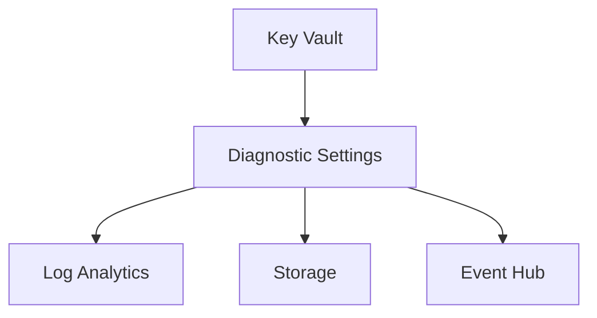
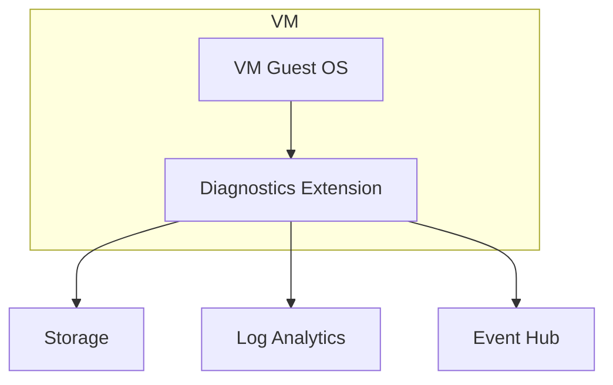
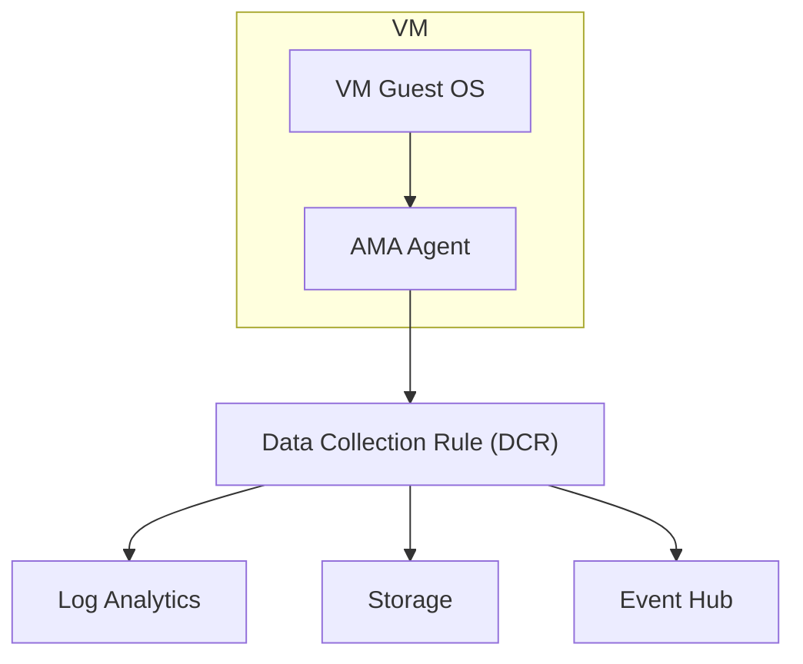

# 🧪 Azure Monitoring Data Collection — Lab Guide

## 🟢 **Lab 1: PaaS Resource with Diagnostic Settings (Agentless)**

### 🎯 Goal:

Send Key Vault diagnostic logs to Log Analytics workspace without installing any agent.

### 🔧 Steps:

1. Go to **Azure Portal → Key Vault → Monitoring → Diagnostic Settings**
2. Click **+ Add diagnostic setting**
3. Name it (e.g., `kv-diag-to-law`)
4. Choose the logs/metrics categories:

   - AuditEvent (common for Key Vault)
   - Any metrics if available

5. Choose destination:

   - Log Analytics Workspace (pick existing or create one)
   - (Optional) Storage or Event Hub

6. ✅ Save

### 📡 Flow:

---

---

### 📝 Notes:

- No agent needed.
- Great for compliance & auditing.
- Query in **Log Analytics** with KQL (example: `AzureDiagnostics | where ResourceType == "VAULTS"`)

---

## 🟡 **Lab 2: VM Guest Diagnostics using Legacy Extension (Old Way)**

### 🎯 Goal:

Collect Windows Event Logs + perf counters from inside a VM using the _classic_ Diagnostics Extension.

### 🔧 Steps:

1. Go to **Azure Portal → VM → Monitoring → Diagnostic Settings**
2. It prompts: _Install Diagnostics Extension → Choose Storage Account_.

   - Pick a **Storage account in same region** as VM.

3. Enable **Guest-level monitoring**.
4. Configure what to collect:

   - Windows Event Logs (System, Application, Security)
   - Performance counters (CPU, Memory, Disk)
   - Crash dumps if needed

5. ✅ Save

### 📡 Flow:

---

---

### 📝 Notes:

- Extension runs **inside the VM**.
- Each VM must be configured separately (not scalable).
- Still visible in portal (like in your screenshot).
- This is being **phased out** → replaced by AMA + DCR.

---

## 🔵 **Lab 3: VM Guest Diagnostics using Azure Monitor Agent (AMA) + DCR (Modern Way)**

### 🎯 Goal:

Collect syslog/Event Viewer + performance counters from multiple VMs centrally using **Data Collection Rules**.

### 🔧 Steps:

#### 🔹 Step 1: Prepare Log Analytics Workspace

1. Go to **Azure Portal → Log Analytics → Create**
2. Give it a name (e.g., `law-monitoring`)
3. Assign region + resource group

#### 🔹 Step 2: Install Azure Monitor Agent (AMA)

1. Go to **VM → Extensions + Applications → + Add**
2. Select **Azure Monitor Agent**
3. ✅ Install

#### 🔹 Step 3: Create a Data Collection Rule (DCR)

1. Portal → **Azure Monitor → Data Collection Rules → + Create**
2. Name it `vm-dcr-logs`
3. Scope: select your VM(s)
4. Data sources:

   - Performance counters (e.g., CPU, Memory, Disk)
   - Event logs (System, Security, Application)
   - Syslog (for Linux)

5. Destination:

   - Log Analytics Workspace (`law-monitoring`)

6. ✅ Save

#### 🔹 Step 4: Verify

- Go to **Logs (KQL)** in LAW
- Run query:

  - Windows Events: `Event`
  - Linux Syslog: `Syslog`
  - Perf counters: `Perf`

### 📡 Flow:

---

---

### 📝 Notes:

- Scalable: one DCR → many VMs.
- Centralized config (not per-VM like legacy).
- Supports multi-destination (LAW, Storage, Event Hub).
- AMA is the **future**. Microsoft is migrating everything here.

---

## 📊 Comparison Table

| Feature       | Diagnostic Settings (PaaS) | VM Diagnostic Extension (Old) | AMA + DCR (New)      |
| ------------- | -------------------------- | ----------------------------- | -------------------- |
| Agentless?    | ✅ Yes                     | ❌ Needs agent                | ❌ Needs agent       |
| Scope         | PaaS resources             | Per-VM                        | Multi-VM / scalable  |
| Config style  | Simple, per resource       | Extension UI, per VM          | Centralized with DCR |
| Destinations  | LAW, Storage, EH           | LAW, Storage, EH              | LAW, Storage, EH     |
| Future-proof? | ✅ Yes                     | ❌ Deprecated                 | ✅ Yes               |

---

## 🎯 Final Thoughts

- Use **Diagnostic Settings** for **PaaS**.
- Forget **Legacy Extension** unless forced.
- Use **AMA + DCR** for **VMs** & hybrid scenarios.
