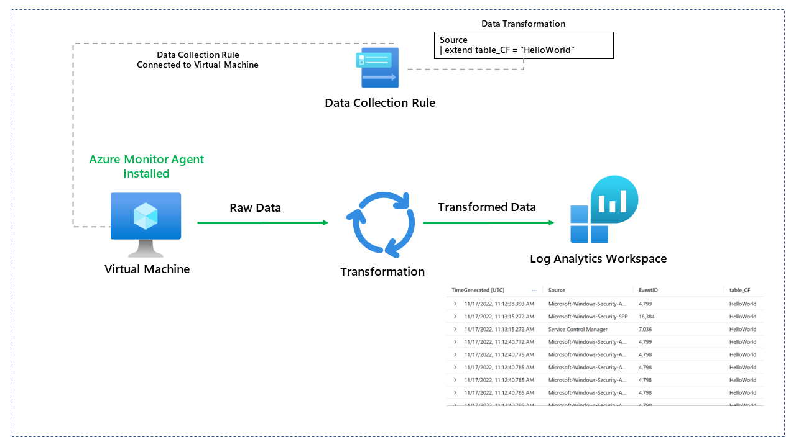
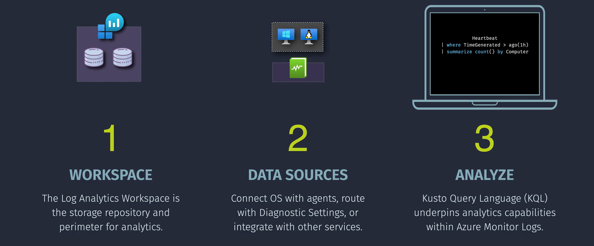

# 📒 **Azure Monitor Logs**

> 📖 **Azure Monitor Logs** is the part of Azure Monitor that lets you **collect, store, and analyze log + telemetry data** at scale.
>
> Unlike Metrics (fast, numeric, time-series), Logs are **rich text-based events** (structured or semi-structured).

---

They Are

- **Stored** in a **Log Analytics Workspace (LAW)**
- **Queried** using **Kusto Query Language (KQL)**.

Think of it like this:

- Metrics = “Temperature: 34°C” every 1 minute (light, numeric, fast).
- Logs = “VM restarted by user JohnDoe at 13:45 with exit code 0xC0000005” (heavy, contextual, searchable).

---

<div align="center">
  
</div>

---

## 🧩 **Key Components**

### 1. **🏪 Log Analytics Workspace (LAW)**

- Central container where log data lives.
- Similar to a database.
- Each LAW has:

  - **Tables** (Perf, Event, Heartbeat, SecurityEvent, etc.)
  - **Schemas** (columns: TimeGenerated, ResourceId, Computer, etc.)
  - **Retention** (default 30 days → can be extended up to 2 years).

---

### 2. **📡 Data Sources**

Data flows into LAW from many origins:

- **Azure Resources** (Diagnostic Settings → Logs → LAW).
- **VM Guest OS** (via AMA → DCR → LAW).
- **Application Insights** (telemetry, traces).
- **Microsoft 365, Defender for Cloud, Sentinel** → push security data into LAW.
- **Custom apps** → via API/agent.

---

### 3. **📝 Data Collection Rule (DCR)**

- Defines _what_ data to collect and _where_ to send it.
- Example: Collect **Windows Security Events**, send to LAW + Event Hub.
- Works as a **routing brain** between AMA and LAW.

---

### 4. **🔍 Kusto Query Language (KQL)**

- Query engine for Azure Monitor Logs.
- SQL-like but optimized for telemetry.
- Example: Show all VM reboots in last 24 hours:

  ```kql
  Event
  | where EventLevelName == "Information"
  | where EventID == 1074
  | where TimeGenerated > ago(1d)
  | project TimeGenerated, Computer, RenderedDescription
  ```

---

### 5. **📊 Solutions / Insights**

LAW can power higher-level services:

- **VM Insights**
- **Container Insights**
- **Network Insights**
- **Defender for Cloud / Sentinel (SIEM)**

---

## 🖼️ **Behind the Scenes**

<div align="center">
  
</div>

---

## 💭 **Use Cases**

1. **Troubleshooting VM performance**

   - Query `Perf` and `Heartbeat` tables for CPU, RAM, uptime.
   - Detect spikes or missing heartbeats.

2. **Security auditing**

   - Collect Windows Security Logs via AMA.
   - Use KQL to find failed login attempts or privilege escalations.

3. **Application telemetry**

   - Application Insights traces/errors.
   - Join with VM metrics for full picture.

---

## 📂 **Common Tables in LAW**

- **Heartbeat** → Shows VM is alive and connected.
- **Perf** → Perf counters (CPU, Memory, Disk).
- **Event** → Windows Event Logs.
- **Syslog** → Linux syslogs.
- **AzureActivity** → Control plane events (from Activity Logs).
- **SecurityEvent** → Security logs from Defender.

---

## ⚖️ **Retention & Cost**

- Data is **ingested** (charged per GB).
- Stored based on **retention** setting (default 30d, can go up to 2 years).
- Cold storage beyond retention via **Archive logs**.

---

## 🧑‍💻 **Example Lab** – Setup Azure Monitor Logs

<div align="center">
  
</div>

---

### 🔹 Step 1: Create a Log Analytics Workspace

1. Go to **Azure Portal → Log Analytics Workspaces → + Create**.
2. Select region (keep it same as resources for performance).
3. Name it `LAW-Monitoring`.

### 🔹 Step 2: Connect VM via AMA + DCR

1. Go to **VM → Extensions → + Add → Azure Monitor Agent**.
2. Create DCR → collect Event Logs + Performance counters.
3. Send to `LAW-Monitoring`.

### 🔹 Step 3: Verify Data

1. Go to **LAW → Logs**.
2. Run query:

   ```kql
   Heartbeat
   | summarize count() by Computer
   ```

   → Should show your VM listed.

### 🔹 Step 4: Explore Built-in Tables

Try queries on **Perf**, **Event**, **Syslog**.

---

## 🏁 **In Short:**

Azure Monitor Logs = **central telemetry brain** powered by **Log Analytics Workspace**.

- Collects logs from everywhere (via AMA, Diagnostic Settings, APIs).
- Stores them in structured tables.
- Queried via **KQL**.
- Powers advanced monitoring, security, and analytics solutions.
