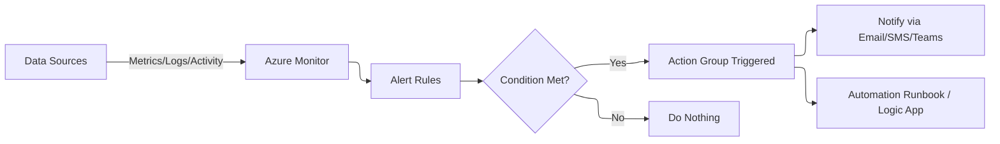

# 🚨 **Azure Monitor Alerts**

## 🏗️ **1. What Are Azure Monitor Alerts?**

**Definition (official-ish):**
Azure Monitor Alerts are **automated notifications** or **actions** triggered when a condition is met based on metrics, logs, or activity in Azure.

Think of it as your **watchdog** 🐕:

- If CPU > 90% for 10 minutes → Bark (email/SMS/Teams).
- If too many failed logins → Growl (send to SOC / block user).
- If storage account nearing 100% capacity → Scream (open ServiceNow ticket).

---

<div align="center">
  
</div>

---

## 🛠️ **2. Alert Building Blocks**

### 1️⃣ **Signal Source (What to Watch?)**

- **Metrics** (near real-time, fast, numeric)
- **Logs (KQL-based)** (rich, detailed, but slight delay \~2-5 min)
- **Activity Logs** (control plane events, e.g., VM deleted, NSG modified)
- **Prometheus Metrics** (AKS + Container Insights)

### 2️⃣ **Condition (When to Bark?)**

- For Metrics → “If CPU > 80% for 5 minutes”
- For Logs → “If failed logins > 50 in 10 minutes”
- For Activity Logs → “If someone disabled a firewall rule”

### 3️⃣ **Action Groups (Who to Tell? & What to Do?)**

- Email 📧
- SMS 📱
- Push notifications
- Teams/Slack webhook 💬
- Runbook automation ⚙️
- Logic App (custom workflows)
- ITSM integration (ServiceNow, etc.)

---

## 📊 **3. Alert Types in Azure Monitor**

### 🔹 **Metric Alerts**

- Near real-time (1-min granularity).
- Example: “CPU > 85% on VM for 10 mins.”

### 🔹 **Log Alerts**

- Run on **KQL queries** against Log Analytics.
- Example: “If >10 sign-in failures from same IP in 5 mins.”

### 🔹 **Activity Log Alerts**

- Triggered by **Azure Resource Manager (ARM) operations**.
- Example: “If VM is deleted OR NSG changed.”

### 🔹 **Smart Alerts (Preview/AI-enhanced)**

- Azure uses ML to detect anomalies (like unusual spikes in traffic).

---

## 📐 **4. How Alerts Work (Behind the Scenes)**

**Here’s the pipeline 🔽:**

---



---

**So:**

- Signals flow in →
- Rule checks condition →
- If TRUE → **Action Group** fires.

---

## 🧩 **5. Examples**

### Example 1: VM CPU High

- Signal: Metric = CPU %
- Condition: >80% for 10 mins
- Action: Email [ops@company.com](mailto:ops@company.com)

### Example 2: Security Alert

- Signal: Logs from `SigninLogs`
- KQL:

  ```kql
  SigninLogs
  | where ResultType != "0"
  | summarize FailedAttempts = count() by IPAddress, bin(TimeGenerated, 5m)
  | where FailedAttempts > 10
  ```

- Action: Trigger Logic App → disable account.

### Example 3: Resource Deleted

- Signal: Activity Log
- Condition: When "Delete VM" event occurs
- Action: PagerDuty call 🔔

---

## ⚙️ **6. Lab: Create an Alert Rule**

### 🔹 Step 1: Go to Azure Monitor → Alerts → + Create Alert Rule

### 🔹 Step 2: Select **Scope**

- Choose the resource (VM, Storage, Subscription).

### 🔹 Step 3: Add **Condition**

- Pick signal: Metric, Log, Activity.
- Example: CPU > 80% for 5 mins.

### 🔹 Step 4: Define **Action Group**

- Create or reuse (with notifications + automation).
- Example: Email + Teams webhook.

### 🔹 Step 5: Review + Create 🚀

---

## 🕵️ **7. Alert Lifecycle Management**

Alerts have states:

- **Fired** → condition met.
- **Acknowledged** → operator saw it.
- **Resolved** → condition cleared.

This helps avoid “alert storms” 🌪️.

---

## 💡 **8. Best Practices**

1. **Avoid Alert Fatigue**:

   - Don’t alert on _every_ CPU spike.
   - Use sustained thresholds (e.g., >80% for 15 mins).

2. **Group Alerts**:

   - Use **Dynamic Thresholds** (AI auto-adjusts baseline).

3. **Route Smartly**:

   - Critical → PagerDuty.
   - Medium → Email.
   - Low → Log-only.

4. **Always Test Your Alerts**:

   - Trigger them on purpose (e.g., CPU stress test).

---

## 📒 **Notes**

- Alert are throttled (1 SMS/Call every 5 minutes and 100 email per hour).

## 🏁 **in short:**

- **Metrics Alerts** = fast & numeric.
- **Log Alerts** = deep, flexible (KQL).
- **Activity Alerts** = control-plane watchdog.
- **Action Groups** = the “do something” layer.
