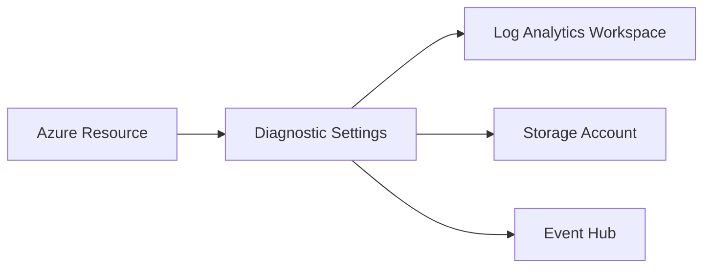

# 🩺 Azure Diagnostic Settings

> 📖 **Diagnostic Settings** in Azure allow you to **export resource-level logs and metrics** to other monitoring or storage services. By default, many Azure services generate logs/metrics, but they don’t persist for long unless you explicitly configure Diagnostic Settings.

---

## 📦 Where You Find It

- Diagnostic Settings are available in the **Azure Portal** under almost every resource (VMs, Key Vaults, Storage Accounts, SQL Databases, etc.).
- Path in portal:
  Resource → **Monitoring** → **Diagnostic Settings**

---

## 🎯 What You Can Do With Diagnostic Settings

You can configure **where the logs/metrics go**. Supported destinations:

1. **Log Analytics Workspace** (for advanced queries, alerts, dashboards in Azure Monitor).
2. **Storage Account** (for long-term archival).
3. **Event Hub** (for streaming to external SIEMs, Splunk, Datadog, etc.).
4. **Partner solutions** (if integrated).

👉 Example: You want to keep **Key Vault audit logs** for 2 years. You set a Diagnostic Setting to export logs to a Storage Account (cheap, long-term storage).

---

## ⚙️ What Can Be Collected?

Each resource type exposes different categories. For example:

- **Azure Key Vault** → Audit logs, requests, failures
- **Azure SQL Database** → Query execution, connection failures
- **Azure Storage** → Read, write, delete requests
- **VMs (via Azure Monitor Agent)** → Performance counters, guest OS metrics

You choose categories when setting up Diagnostic Settings.

---

## 🛠️ Example (Azure CLI)

```bash
az monitor diagnostic-settings create \
  --name MyDiagSetting \
  --resource "/subscriptions/<subId>/resourceGroups/<rgName>/providers/Microsoft.KeyVault/vaults/<vaultName>" \
  --workspace <logAnalyticsWorkspaceId> \
  --logs '[{"category": "AuditEvent","enabled": true}]'
```

This example sends **Key Vault Audit Logs** to a Log Analytics Workspace.

---

## 🔍 Diagram



---

## ⚠️ Key Notes

- **Not enabled by default** → You must configure Diagnostic Settings for each resource.
- **Resource-specific** → Different resources expose different logs/metrics categories.
- **Billing impact** → Sending logs/metrics to Log Analytics or Storage incurs costs.
- **Retention** → If you want compliance (e.g., 2 years of logs), Storage Account is cheapest.

---

## 🏁 **Summary**

Yes — **Diagnostic Settings** is an Azure feature that lets you **route logs/metrics from individual resources to monitoring/storage destinations** like Log Analytics, Event Hub, or Storage. It’s part of the **Azure Monitor ecosystem**.
