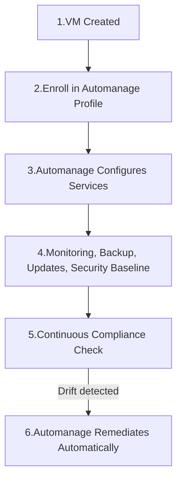

# 🤖 **Azure Automanage Service**

Azure **Automanage** is a service that helps you **automatically apply, configure, and monitor best practices** to your **Azure VMs** (Windows & Linux).
Think of it as:
👉 _“One-click autopilot for VM management.”_

Instead of manually setting up monitoring, patching, backup, and security policies, you tell Automanage:

> “This VM should follow the **Best Practices profile**.”
> And it configures + keeps it compliant **automatically**.

---

## 📌 **1. Why Automanage?**

### Without Automanage (manual) 🥵

- Create VM
- Configure update management
- Enable backup
- Set monitoring agents
- Apply security baseline
- Track drift (someone changes configs)

### With Automanage (automatic) 😎

- VM enrolled in Automanage
- Automanage applies:

  - Monitoring
  - Backup
  - Updates
  - Security baseline
  - Change tracking

- Keeps it compliant continuously

💡 Think of it as a **robo-admin** that ensures all your VMs stay aligned with best practices.

---

## 📌 **2. Automanage Profiles**

Automanage works with **profiles** (sets of best practices).

### 🔹 Built-in profiles

- **Azure Best Practices – Production**

  - Enables monitoring (Azure Monitor)
  - Security baseline
  - Backup
  - Auto-update

- **Azure Best Practices – Dev/Test**

  - Same as production but with lighter rules (no backup, less strict security)

### 🔹 Custom profiles

- You can create your **own profile**:

  - Decide which services to enable (Backup, Update, Defender, Monitor, etc.)
  - Apply them to groups of VMs

---

## 📌 **3. How Automanage Works**

<div align="center">



</div>

> 👉 Automanage is **continuous**:
>
> - If someone disables backup or uninstall monitoring agents → Automanage detects drift → re-applies settings.

---

## 📌 **4. Services Managed by Automanage**

When you enable Automanage, it configures **these services** automatically:

| Feature 🛠                                | What it does                                   |
| ---------------------------------------- | ---------------------------------------------- |
| **Azure Backup**                         | Backs up your VM disks & OS                    |
| **Update Management**                    | Installs patches & OS updates                  |
| **Azure Monitor**                        | Collects performance + log data                |
| **Change Tracking & Inventory**          | Records changes to files, registry, software   |
| **Azure Security Baseline**              | Applies Defender & hardening rules             |
| **AntiMalware (Windows Defender / MDE)** | Ensures security tools are installed & running |

---

## 📌 **5. Example Workflow**

### Step 1: Create a VM

```bash
az vm create \
  --name MyVM \
  --resource-group rg-demo \
  --image UbuntuLTS \
  --admin-username azureuser
```

### Step 2: Enable Automanage (Portal or CLI)

**Portal:**

- Go to VM → **Automanage** blade
- Select a profile (e.g., “Best Practices – Production”)
- Enroll

**CLI:**

```bash
az automanage account create --resource-group rg-demo --name MyVM-Automanage \
az automanage configuration profile assignment create \
  --resource-group rg-demo \
  --vm-name MyVM \
  --profile BestPractices-Production
```

---

## 📌 **6. Pricing**

- Automanage itself = **free** 🎉
- You **pay for the underlying services** it enables (e.g., Backup, Log Analytics, Defender).

---

## 📌 **7. Benefits**

- ✅ Save time — no manual setup of monitoring/backup
- ✅ Stay compliant with best practices
- ✅ Auto-remediation when drift occurs
- ✅ Works for both **Windows & Linux VMs**
- ✅ Easy for **Prod vs Dev/Test** scenarios

---

## 📌 **8. Limitations**

- Currently only for **Azure VMs** (not AKS, App Services, etc.)
- Requires supported OS versions
- Can’t manage **on-prem VMs** directly (unless in Azure Arc + enrolled)

---

## 🏁 **TL;DR**

- **Azure Automanage = autopilot for VMs**
- Attach a VM to a **profile** (Prod or Dev/Test, or custom).
- It auto-configures **Backup, Update Management, Monitor, Security**.
- Keeps VM compliant by **auto-remediating drift**.
- Free service — pay only for the underlying features (Backup, Log Analytics, Defender).
