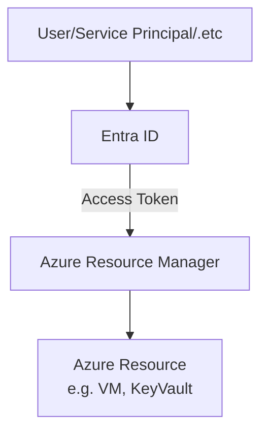
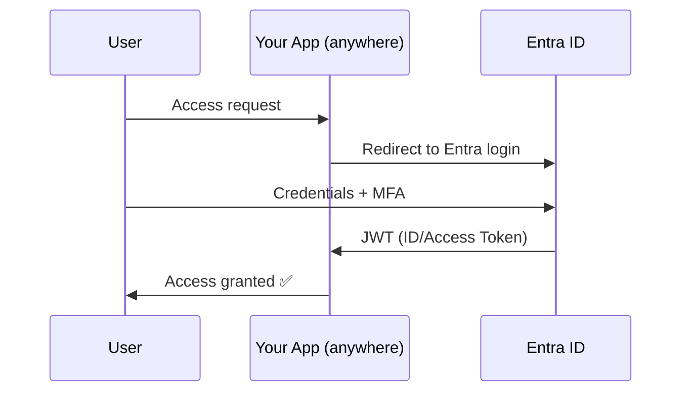

# 🪪 **Microsoft Entra ID (Formerly Azure AD)**

## 📌 **1. What is Entra ID?**

Microsoft **Entra ID** is Microsoft’s **cloud-based Identity and Access Management (IAM)** platform.
It works as **Identity as a Service (IDaaS)** that:

- Stores identities (**users, groups, apps, devices**)
- **Authenticates** them (sign-in, MFA, passwordless)
- **Authorizes** them (what resources they can access)
- Integrates with **Azure resources, SaaS, custom apps**

👉 Think of it as both:

- 🏢 **Directory** (like a secure HR system for accounts)
- 🪪 **Passport Office** (issues tokens so users/apps can prove who they are)

---

## 📌 **2. Two Authentication Modes**

Here’s the key distinction 👇

### 🔹 **Mode 1 – Authenticate Against Azure Resources (Management Plane)**

This is about **who can manage Azure itself**.

- You log in with Entra ID → it decides your **role (RBAC)** on Azure.
- Examples: deploy VM, read Key Vault secrets, manage storage account.
- Tokens issued → used against **Azure Resource Manager (ARM)** APIs.

💡 Flow:

---

---

### 🔹 **Mode 2 – Authenticate Against Your Apps (Any Hosting)**

This is about **end-user or service access to business apps**.

- App is **registered** in Entra.
- App trusts Entra to authenticate users (via OIDC/SAML).
- Apps can be:

  - Azure-hosted (App Service, AKS)
  - AWS-hosted (EC2, Lambda)
  - On-prem (IIS, legacy)

- Entra issues tokens (ID/Access/Refresh) that your app consumes.

💡 Flow:

---

---

## 📌 **3. Core Components**

| Component              | Description                                         |
| ---------------------- | --------------------------------------------------- |
| **Tenants**            | Your org’s isolated directory                       |
| **Users**              | Members, Guests, or External                        |
| **Groups**             | Collections for RBAC or app access                  |
| **Applications**       | Registered apps (SaaS/custom) with objects in Entra |
| **Service Principals** | App/automation identities (pipelines, Terraform)    |
| **Managed Identities** | Azure-managed SPs, no secrets needed                |
| **Devices**            | Registered devices (used in CA & compliance)        |
| **Roles & RBAC**       | Who can manage Azure or apps                        |

---

## 📌 **4. Entra as IDaaS**

As an Identity-as-a-Service, Entra supports:

- **Protocols** → OAuth2, OpenID Connect, SAML, SCIM
- **Federation** → Google, Facebook, other IdPs
- **Single Sign-On (SSO)** → 1000s of SaaS apps
- **Lifecycle mgmt** → Auto-provision via SCIM
- **Governance** → PIM, reviews, policy automation

👉 So it’s not just for Azure → it’s for **all apps, anywhere**.

---

## 📌 **5. Real Examples**

### Example A – Authenticate Against Azure Resource

- Alice (`alice@contoso.com`) logs into Azure Portal.
- Entra ID authenticates her + applies Conditional Access (require MFA).
- She’s a **Contributor** on “Dev Subscription”.
- She can deploy VMs and read Key Vault secrets, but not delete the subscription.

---

### Example B – Authenticate Against Your App

- Bob visits `app.contoso.com` (hosted on AWS).
- App is registered in Entra ID.
- Bob redirected to Entra → signs in with MFA.
- Entra issues ID + Access Token.
- Bob’s app validates the token → shows Bob’s dashboard.

---

## 📌 **6. Integration Points**

- **Azure Resource Management** → via ARM + RBAC (Mode 1)
- **SaaS Apps (Salesforce, GitHub, ServiceNow)** → SAML/OIDC (Mode 2)
- **Custom Apps** → Register in Entra, protect with scopes/roles (Mode 2)
- **On-prem AD** → Sync identities with Entra Connect

---

## 📌 **7. Quick Comparison – Azure vs Apps**

| Aspect           | Against Azure Resources 🛠️          | Against Your Apps 🌐            |
| ---------------- | ----------------------------------- | ------------------------------- |
| Token audience   | ARM APIs                            | Your App (OIDC/SAML endpoint)   |
| Example identity | Service Principal, Managed Identity | Human user or external customer |
| Role enforcement | Azure RBAC                          | App roles/claims/custom logic   |
| Hosting location | Only Azure resources                | Azure / AWS / On-Prem / SaaS    |

---

## 📌 **8. Licensing**

- **Free** → Basic identity + SSO
- **P1** → Conditional Access, hybrid identity
- **P2** → PIM, Identity Protection, advanced governance

---

## 🧠 **Key Takeaways**

- Entra ID = Microsoft’s **cloud directory + Identity-as-a-Service**.
- Two big authentication modes:

  1. **Against Azure resources** → who can manage cloud resources (via RBAC).
  2. **Against your apps** → who can sign in to business apps (any hosting).

- Provides SSO, MFA, Conditional Access, Governance.
- Works like a **passport office** for your org — issues tokens that both Azure and your apps trust.
