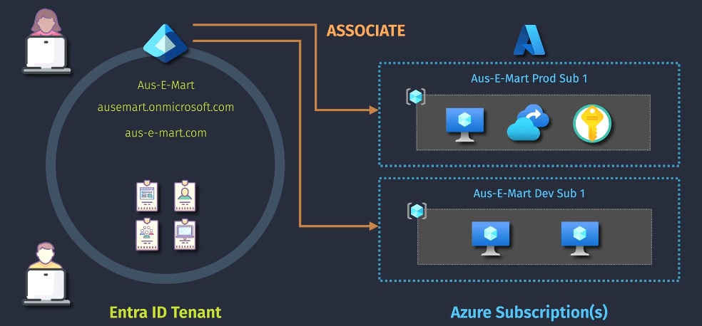
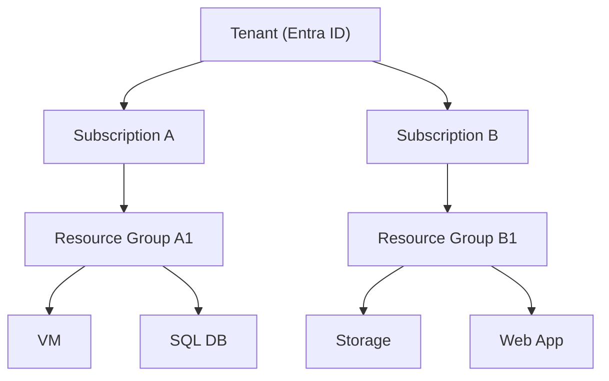

# 💳 Azure Subscriptions

> 📌 Official Definition:
> _A subscription in Azure is a logical unit of Azure services that is linked to an Azure account, used to provision and manage resources and track costs._

---

<div style="text-align:center;">
    
</div>

---

## 📘 What is an Azure Subscription?

An **Azure Subscription** is a **logical container** that links:

- **Azure services (VMs, databases, storage, etc.)**
- **Billing and usage tracking**
- **Access control (RBAC)**
- **Policy enforcement**

## 🧩 Azure vs AWS – Know the Difference

| Concept                   | Azure                                  | AWS                              |
| ------------------------- | -------------------------------------- | -------------------------------- |
| **Subscription**          | Billing + resource container           | **AWS Account**                  |
| **Tenant** (Directory)    | Identity boundary (Microsoft Entra ID) | AWS Org Root + Directory Service |
| **User Sign-in**          | Azure Account (email)                  | IAM/SSO Identity                 |
| **Role Assignment Scope** | MG → Subscription → RG → Resource      | Org → Account → Resource         |

> ✅ In Azure, **multiple subscriptions can live inside the same tenant**.
> In AWS, **each account is its own billing + security boundary**.

---

## 🎯 When to Use Multiple Subscriptions

| Use Case                   | Why Use Separate Subscriptions?                   |
| -------------------------- | ------------------------------------------------- |
| **Dev/Test vs Production** | Isolate environments and control who has access   |
| **Departmental Billing**   | Track usage per business unit                     |
| **Compliance or Security** | Apply different policies or regions per sub       |
| **Quota Separation**       | Avoid hitting limits on cores, IPs, storage, etc. |

---

## 🛠️ Key Capabilities of a Subscription

### 1. 🧾 **Billing Unit**

- Each subscription generates **its own invoice**.
- Azure Cost Management & Budgets are scoped per sub.

### 2. 🔐 **Access Management**

- Subscriptions are a scope for **RBAC**.
- Assign roles like `Reader`, `Contributor`, or `Owner`.

### 3. ⚖️ **Policy and Compliance**

- Azure Policy and Blueprints can be applied per sub.
- You can allow only certain VM sizes, tag requirements, regions, etc.

### 4. 📦 **Resource Group Container**

- Resources live in **Resource Groups**, which live in subscriptions.

---

<div align="center">



</div>

---

## 🧾 Types of Azure Subscriptions

Azure subscriptions can come from different Microsoft services. Let’s categorize:

---

### 🟦 1. **Azure Infrastructure Subscriptions**

| Subscription Type                 | Description                                                | Includes Entra ID? |
| --------------------------------- | ---------------------------------------------------------- | ------------------ |
| **Free Trial**                    | \$200 credit for 30 days, 12 months of free tier resources | ✅ Yes (Free Tier) |
| **Pay-As-You-Go**                 | Most common; pay for what you use                          | ✅ Yes (Free Tier) |
| **Enterprise Agreement (EA)**     | Volume pricing for large organizations                     | ✅ Yes (Free Tier) |
| **CSP (Partner)**                 | Managed by a Microsoft partner                             | ✅ Yes             |
| **Student, Sponsorship, DevTest** | Special limited use cases                                  | ✅ Yes (Free Tier) |

---

### 🟩 2. **Microsoft 365 / Productivity Subscriptions**

These subscriptions create an **Entra ID tenant** (Microsoft Entra ID), but don’t include access to Azure infrastructure unless linked manually.

| M365 Subscription        | What You Get                           | Entra ID Tier         |
| ------------------------ | -------------------------------------- | --------------------- |
| Microsoft 365 Business   | Email, Office, Teams, SharePoint       | ✅ Entra ID Free / P1 |
| Microsoft 365 Enterprise | Advanced security + analytics (E5)     | ✅ Entra ID P1 / P2   |
| Microsoft 365 Family     | Personal email, storage, collaboration | ✅ Entra ID Free      |

---

### 🟨 3. **Identity and Security Subscriptions (Entra)**

| Entra Subscription       | Features                                 | Where You Find It                     |
| ------------------------ | ---------------------------------------- | ------------------------------------- |
| **Microsoft Entra Free** | Basic sign-in, MFA, SSO, user mgmt       | All tenants get this by default       |
| **Entra ID P1**          | Conditional Access, dynamic groups, SSPR | Included in M365 E3, Business Premium |
| **Entra ID P2**          | Identity Protection + PIM                | Included in M365 E5                   |

---

### 🟪 4. **Developer and Business Platform Subscriptions**

| Service                     | What You Get                         | Includes Entra ID? |
| --------------------------- | ------------------------------------ | ------------------ |
| Visual Studio Subscriptions | Azure credits + developer tools      | ✅ Yes (Free Tier) |
| Dynamics 365                | Business apps (ERP + CRM)            | ✅ Yes             |
| Power Platform              | Power BI, Power Apps, Power Automate | ✅ Yes             |

---

### 🟥 5. **Consumer Subscriptions (Non-Azure)**

| Subscription        | Purpose                    | Entra ID?          |
| ------------------- | -------------------------- | ------------------ |
| Xbox Game Pass      | Games + online multiplayer | ❌ (Local-only)    |
| Microsoft Defender  | Personal device protection | ❌ (Consumer only) |
| OneDrive Standalone | Extra file storage only    | ❌                 |

---

## 💡 Tips and Best Practices

| ✅ Practice                      | 💬 Why It Helps                         |
| -------------------------------- | --------------------------------------- |
| Use naming conventions           | `company-dept-env` helps track usage    |
| Tag resources consistently       | Improves billing, reporting, automation |
| Limit RBAC at subscription level | Avoid giving `Owner` unless necessary   |
| Use budgets and cost alerts      | Stay ahead of surprise bills            |
| Don’t mix prod/dev/test in 1 sub | Avoid policy & access confusion         |
| Link billing accounts for EA/CSP | Enables enterprise-wide cost visibility |

---

## 🧠 Common Questions

### ❓Can I have multiple subscriptions in one tenant?

✅ Yes! It's common to use many subscriptions under a single tenant for isolation and scalability.

### ❓Can I move a subscription to another tenant?

✅ Yes — but you must meet certain requirements:

- Be a **Global Admin** in both tenants
- The sub must be **supported for transfer**
- Use the Azure Portal → "Change Directory" option

### ❓Can a subscription have multiple tenants?

❌ No. A subscription can only be linked to **one tenant at a time**.

---

## 📌 Summary

| Concept                | Description                                                |
| ---------------------- | ---------------------------------------------------------- |
| **Azure Subscription** | A billing + resource container scoped within one tenant    |
| **Managed By**         | Role assignments (RBAC), policies, and billing accounts    |
| **Common Use Cases**   | Isolate billing, access, and resources across environments |
| **Types**              | Free, PAYG, EA, CSP, DevTest, M365, Entra, Power Platform  |
| **Comparison**         | Equivalent to an **AWS Account** in most use cases         |

---

## 🧾 Quick Example: Enterprise Structure

```plaintext
Tenant: contoso.onmicrosoft.com
├── Subscription: Prod-App (Region: East US)
│   └── RG: WebApp-RG → App Services, SQL, VNet
├── Subscription: Dev-Test
│   └── RG: DevRG → Storage, App Dev Tools
├── Subscription: HR
│   └── RG: HR-RG → Internal HR Systems
```
