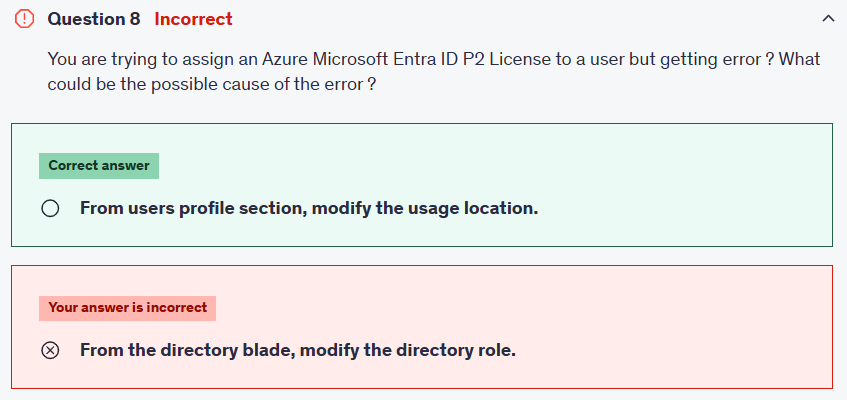

# 💳 **What is Microsoft Entra ID Licensing?**

- **Microsoft Entra ID (formerly Azure AD)** comes in **different editions** (Free, P1, P2).
- Each edition unlocks certain **identity and security features**.
- Licenses are assigned to **users**, not to groups of devices.
- Without the correct license, certain premium features won’t work for that user.

👉 Licensing is **per user**. If one user needs Conditional Access, that user must have at least **P1**.

---

  

---

## 📦 **Entra ID License Types**

| Edition                       | Cost                                             | Key Features                                                                                                                          | When to Use                                                    |
| ----------------------------- | ------------------------------------------------ | ------------------------------------------------------------------------------------------------------------------------------------- | -------------------------------------------------------------- |
| **Free**                      | Included with Azure subscription / Microsoft 365 | Basic identity services, user & group management, device registration, SSO for up to 10 apps                                          | Small businesses, test labs                                    |
| **Office/Microsoft 365 Apps** | Comes with M365 Business/E3/E5                   | Includes Free tier + self-service password reset for cloud users                                                                      | M365 orgs that don’t need full enterprise IAM                  |
| **P1 (Premium Plan 1)**       | \$\$                                             | Conditional Access, Group-based licensing, Hybrid identities (on-prem sync), MFA for conditional policies, Identity governance basics | Enterprises needing **access policies** and hybrid integration |
| **P2 (Premium Plan 2)**       | \$\$\$                                           | All P1 + Identity Protection (risk-based policies), Privileged Identity Management (PIM), Access Reviews, Entitlement Management      | Enterprises with **advanced security & governance** needs      |

---

| Feature                                                | Microsoft Entra ID Free - Security defaults (enabled for all users) | Microsoft Entra ID Free - Global Administrators only    | Office 365 | Microsoft Entra ID P1 | Microsoft Entra ID P2 |
| ------------------------------------------------------ | ------------------------------------------------------------------- | ------------------------------------------------------- | ---------- | --------------------- | --------------------- |
| Protect Microsoft Entra tenant admin accounts with MFA | ✅                                                                  | ✅ (Microsoft Entra Global Administrator accounts only) | ✅         | ✅                    | ✅                    |
| Mobile app as a second factor                          | ✅                                                                  | ✅                                                      | ✅         | ✅                    | ✅                    |
| Phone call as a second factor                          |                                                                     |                                                         | ✅         | ✅                    | ✅                    |
| SMS as a second factor                                 |                                                                     | ✅                                                      | ✅         | ✅                    | ✅                    |
| Admin control over verification methods                |                                                                     | ✅                                                      | ✅         | ✅                    | ✅                    |
| Fraud alert                                            |                                                                     |                                                         |            | ✅                    | ✅                    |
| MFA Reports                                            |                                                                     |                                                         |            | ✅                    | ✅                    |
| Custom greetings for phone calls                       |                                                                     |                                                         |            | ✅                    | ✅                    |
| Custom caller ID for phone calls                       |                                                                     |                                                         |            | ✅                    | ✅                    |
| Trusted IPs                                            |                                                                     |                                                         |            | ✅                    | ✅                    |
| Remember MFA for trusted devices                       |                                                                     | ✅                                                      | ✅         | ✅                    | ✅                    |
| MFA for on-premises applications                       |                                                                     |                                                         |            | ✅                    | ✅                    |
| Conditional Access                                     |                                                                     |                                                         |            | ✅                    | ✅                    |
| Risk-based Conditional Access                          |                                                                     |                                                         |            |                       | ✅                    |
| Self-service password reset (SSPR)                     | ✅                                                                  | ✅                                                      | ✅         | ✅                    | ✅                    |
| SSPR with writeback                                    |                                                                     |                                                         |            | ✅                    | ✅                    |

---

## 🧾 **How Entra ID Licensing Works**

- **Licenses are not shared across the tenant.**
- You **must assign a license to every user** that consumes a feature.
- Example: **Conditional Access = P1 feature.**

  - If you want 1,000 users protected by Conditional Access → you need **1,000 P1 licenses**.
  - Buying just 1 P1 license for the tenant does **not** unlock Conditional Access for everyone.

👉 Think of it like **Netflix accounts**:

- If you buy **1 Netflix subscription**, only you can watch.
- If 5 people want to watch at the same time → you need **5 licenses** (or a family plan).
  Same in Entra ID.

---

## 🔑 **Admin vs Users (Big Misconception)**

- Being a **Global Administrator** does not automatically give your tenant all features.
- Your **admin account needs a P1/P2 license too** if you want to use premium features (like configuring Conditional Access policies).
- Licenses must be assigned to **every user** who:

  - Needs Conditional Access evaluation.
  - Needs Identity Protection (P2).
  - Needs Privileged Identity Management (P2).
  - Needs SSPR with writeback (P1+).

---

## 💭 **Example**: Conditional Access for 1,000 Users

- Scenario: You want **all 1,000 employees** to be forced into MFA when accessing M365.
- **Licenses required:** 1,000 × Entra ID P1.
- Without a license assigned, the Conditional Access policy won’t apply to that user.
- If you only buy **100 licenses** → you can only cover **100 users** (and must decide who gets them).

---

## ⚖️ **Feature Comparison (Cheat Sheet)**

### ✅ **Free**

- Directory objects (users, groups, devices)
- Self-service password reset (**cloud-only users**)
- Basic security (no Conditional Access)
- SSO for 10 SaaS apps

### ✅ **P1**

- All Free features +
- **Conditional Access** (if user from location X → MFA required)
- Group-based licensing
- Hybrid identity with Microsoft Entra Connect (AD → Entra sync)
- Self-service password reset with writeback
- Dynamic groups
- Identity governance basics

### ✅ **P2**

- All P1 features +
- **Identity Protection** (risk-based sign-ins, leaked credentials detection)
- **Privileged Identity Management (PIM)** → Just-in-time admin access
- **Access Reviews** → Periodic access checkups
- **Entitlement Management** → Automate access packages & approvals

---

## 🛠️ **License Assignment Methods**

1. **Direct assignment** → assign license to each user individually.

   - Flexible, but hard to manage at scale.

2. **Group-based licensing (P1 or P2 required)** → assign license to a group, users inherit it.

   - Best for large orgs.

3. **Mixed assignment** → some licenses from group, some direct.

📌 Important: If a user belongs to multiple licensed groups, they just get **one license**.

---

## ⚠️ **Common Errors (Exam Traps)**

1. **Usage Location Not Set**

   - Must be set in user profile before license assignment.
   - Fix: Go to **User → Profile → Usage Location → set (e.g., United States)**.

2. **Not Enough Licenses Available**

   - If you only bought 100 P1 licenses and try to assign to 101 users → fails.

3. **Feature Misunderstanding**

   - E.g., You want Identity Protection → but that’s **P2 only**, not P1.

---

## 📊 **Example Scenarios (Exam-Style)**

**Q:** You want to enable **Conditional Access** for HR users. Which license is needed?  
👉 **P1**

**Q:** You want to require MFA only for risky sign-ins. Which license is needed?  
👉 **P2** (Identity Protection)

**Q:** You want just-in-time (JIT) admin roles. Which license is needed?  
👉 **P2** (PIM)

**Q:** You want to automate license assignment to all Finance department users.  
👉 Use **Group-based licensing (P1+)**

---

## ✅ Features Covered by Tenant (No Per-User License Needed)

There _are some exceptions_.

- **Free features** (basic directory, user management, SSO for 10 apps) apply tenant-wide.
- **Security Defaults** (enforce MFA for all admins) → available for everyone without P1/P2.
- But **premium features (Conditional Access, PIM, Identity Protection)** are **licensed per-user**.

---

## 🧠 Easy Rule to Memorize

- **Free features** = tenant-wide.
- **Premium features (P1/P2)** = **per user license**.
- If the feature **affects the user’s sign-in or permissions**, that user needs a license.

---

## 🚀 AWS vs Azure Analogy

- In **AWS IAM**, if you enable MFA or an SCP at the **account level**, it applies to **all users** immediately. ✅
- In **Azure Entra ID**, enabling Conditional Access is like saying: _“I’ll enforce MFA only for users who have the right ticket (license).”_ Each user must have their own ticket. 🎟️

---

## 📝 Notes to Memorize

- **Free = basics only** (no Conditional Access, no PIM).
- **P1 = Conditional Access + Hybrid identity** (most orgs use this).
- **P2 = advanced security (PIM, Identity Protection, Access Reviews)**.
- **Usage Location must be set** before assigning any license.
- **Licenses are per user** — features apply only if user has the license.
- **Group-based licensing requires P1 or P2**.

---

## 📚 Docs to Study

1. 🔗 [Microsoft Entra ID editions](https://learn.microsoft.com/en-us/entra/fundamentals/whatis#compare-editions)
2. 🔗 [License requirements for Conditional Access](https://learn.microsoft.com/en-us/entra/identity/conditional-access/licensing-conditional-access)
3. 🔗 [Assign or remove licenses in Entra ID](https://learn.microsoft.com/en-us/entra/fundamentals/license-users-groups)
4. 🔗 [Microsoft Entra licensing overview](https://learn.microsoft.com/en-us/entra/fundamentals/licensing)
5. 🔗 [PIM in Entra ID](https://learn.microsoft.com/en-us/entra/id-governance/privileged-identity-management/pim-configure)
6. 🔗 [Identity Protection in Entra ID](https://learn.microsoft.com/en-us/entra/id-protection/overview-identity-protection)

---

## ⚡ My advice for you:

- For **exam prep**, focus on differences between **Free, P1, P2**.
- For **real world**, practice assigning licenses in the portal:

  - Add a new user
  - Leave usage location blank → see error
  - Fix by setting usage location
  - Assign P1 → try Conditional Access
  - Assign P2 → try Identity Protection or PIM.

---

## ❓ Question Context

You try to assign a **Microsoft Entra ID P2 license** (e.g., Azure AD Premium P2) to a user. You get an **error**. Why?

---

  

---

### ✅ Correct Answer

👉 **From the user’s profile section, modify the usage location.**

---

### 🤔 Why This Happens

- Microsoft Entra ID (Azure AD) licensing depends on the **user’s usage location**, not just their country or tenant.
- By default, when you create a new user in Entra ID, their **Usage location field = “None”**.
- If that field is blank, you **cannot assign licenses** (like P1, P2, M365 E5, etc.) because Microsoft enforces licensing availability by region.
- Once you set the usage location (e.g., United States, Canada, etc.), the license assignment succeeds.

---

### ❌ Why the Other Option Is Wrong

- **From the directory blade, modify the directory role**

  - Directory roles (like _Global Administrator_, _User Administrator_) control **permissions**, not license assignment.
  - Even a Global Admin cannot bypass the **usage location requirement**.
  - So this has nothing to do with the error.

---

### 📝 Exam Tip

- Always check if the user has **Usage location set** before assigning a license.
- Without it, you’ll get errors like:
  _“License assignment failed. The user does not have a usage location specified.”_
