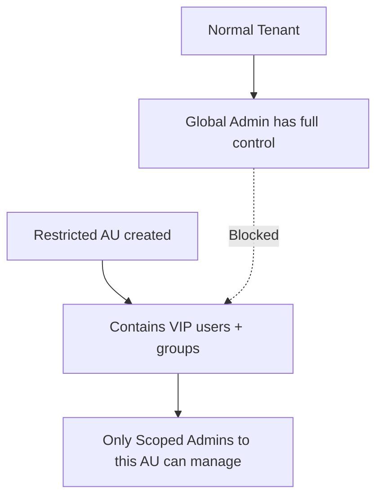

# 🚫 Restricted Management Administrative Units (RMAU)

## 📖 Official Definition

> _Restricted Management AUs (RMAUs) are a special type of Administrative Unit in Microsoft Entra ID that limit **global administrators** and other tenant-wide role holders from managing the objects inside them._

Translation: Normally, a **Global Admin is God Mode** 👑 in Entra ID → they can reset anyone’s password, delete any user, or mess with any group.
With **Restricted AUs**, you can carve out a “do not touch zone” 🛑 where even Global Admins can’t directly manage users/groups unless explicitly scoped.

---

## 🎯 Why Use Restricted AUs?

- **Security boundaries** → Protect highly sensitive accounts (executives, finance team, admins).
- **Compliance** → Limit who can touch certain identities, even if someone has global roles.
- **Delegation** → Ensure only a **designated admin team** can manage a subset of accounts.
- **Tenant isolation** → Useful for multi-division, government, or high-security scenarios.

👉 Basically, it’s “**admin RBAC on steroids**” → least privilege even against your own admins.

---

## 🛠️ How It Works

- You create a **Restricted AU**.
- Add sensitive **users/groups/devices** into it.
- Assign **AU-scoped admins** (e.g., HR Admin, Password Admin).
- Even **Global Admins** can’t directly manage those objects anymore.

---

## ⚡ Behavior Differences

| Feature                          | Normal AU                                   | Restricted AU                 |
| -------------------------------- | ------------------------------------------- | ----------------------------- |
| Can Global Admin manage objects? | ✅ Yes (always)                             | ❌ No (blocked unless scoped) |
| Scoped role works?               | ✅ Yes                                      | ✅ Yes                        |
| Protects sensitive accounts?     | ⚠️ Not fully (Global Admin still overrides) | ✅ Fully                      |
| Use case                         | Delegation at scale                         | Strong isolation / compliance |

---

## 🔑 Example Scenarios

### 1. Protect Executive Accounts

- Create Restricted AU: **Board Members**
- Add CEO, CFO, CIO accounts.
- Assign a **dedicated security admin** role scoped only to that AU.

👉 Even if a rogue Global Admin exists, they can’t reset the CEO’s password.

---

### 2. Government Compliance

- Law requires **separation of duties** (admins can’t access politician accounts).
- Put politician accounts in Restricted AU.
- Assign a **government-trusted admin group** to manage them.

---

### 3. Admin Protection

- Place **Global Admin accounts themselves** inside a Restricted AU.
- Assign a **break-glass admin team** to manage them.

👉 This protects admin accounts from each other (and insider threats).

---

## 🧑‍💻 How to Enable

1. Go to **Entra ID → Administrative Units**.
2. Click **+ New Administrative Unit**.
3. Choose **Restricted Management Administrative Unit** option.
4. Add **members** (users, groups, devices).
5. Assign **scoped roles** (only those admins will have access).

⚠️ Note: Requires **Microsoft Entra ID Premium P1/P2 license**.

---

## 📌 Key Notes

- RMAUs **do not block directory readers** → some metadata may still be visible.
- Global Admins can still **see** objects, but cannot **manage** them.
- Break-glass process is needed in case AU admins lose access.
- Only **certain roles** support scoping to Restricted AUs (e.g., User Administrator, Password Administrator, Groups Administrator).

---

## 📝 Summary

- **Normal AU** → delegates admin control, but Global Admins still override.
- **Restricted AU** → isolates objects so that **even Global Admins cannot manage them**, unless explicitly scoped.
- Ideal for **VIP accounts, high-security environments, or compliance isolation**.
- Requires **premium licensing** and careful planning (don’t lock yourself out 🔒).
