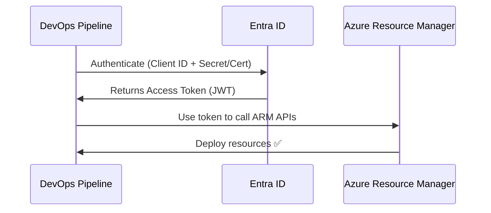

# 🤖 **Service Principal Identity in Microsoft Entra ID**

## 📌 **What is a Service Principal?**

A **Service Principal (SP)** is like a **user account for an application or automation**.

- But instead of a human logging in → it’s used by **apps, scripts, pipelines, or services**.
- It allows **non-human identities** to authenticate securely against **Entra ID** and access resources.

👉 Think:

- **User account** = Alice 👩
- **Service Principal** = Robot 🤖

---

## 📌 **Why Do We Need It?**

Without a Service Principal, apps/scripts would need:

- A **human account** + password 🤯 (bad practice, unsafe, expires)

With Service Principal:

- You create a dedicated **identity for the app**
- Assign it **least-privilege roles** (like Contributor, Reader, Key Vault Reader)
- Rotate/manage its secret or certificate separately
- Automate deployments safely (CI/CD, Terraform, etc.)

💡 **Best practice** → never use human creds for automation, always use SP.

---

## 📌 **Relationship with Application Object**

When you **register an app** in Entra ID:

- **Application Object** (global definition of the app, like a template)
- **Service Principal Object** (local identity inside your tenant for that app)

👉 Analogy:

- Application Object = 📄 **App Blueprint**
- Service Principal = 🏢 **Working copy of that app in your tenant**

---

### 1️⃣ **App Registration = Blueprint**

- Defines the app **globally** in Entra ID (name, redirect URIs, permissions).
- Stored in the **App registrations** blade.
- Think of it as the **“design document”** of an app.

---

### 2️⃣ **Service Principal = Local Identity**

- The **usable identity object** of that app inside a tenant.
- Lives in **Enterprise Applications**.
- It’s what actually **authenticates** and gets **tokens**.

---

### 🧬 **The Relationship**

- **Every Service Principal is born from an App Registration**.
- When you register an app → Entra automatically creates a Service Principal for it in that tenant.
- If you consent to a **third-party SaaS app** (e.g., Salesforce) → Entra copies the vendor’s App Registration into your tenant as a Service Principal.

👉 **So you cannot have a Service Principal without an App Registration existing somewhere.**

- If you create your own → you see it in **App Registrations**.
- If it’s external SaaS → the App Registration is global (owned by the vendor), and you just get the **Enterprise App + Service Principal** in your tenant.

---

### 🧑🏻‍💻 **CLI Behavior**

When you run:

```bash
az ad sp create-for-rbac --name my-sp
```

- Azure actually creates **both**:

  - An **App Registration** (if it didn’t exist already)
  - A **Service Principal** tied to it

- You may not see both right away in the portal (depends which blade you check), but they are **always paired**.

---

### 🤖 **Exception: Managed Identities**

The only time you don’t explicitly touch App Registrations is when you use **Managed Identity**:

- Azure creates & manages both the **App Registration + Service Principal** automatically for you.
- You never see the App Registration in the portal, but it still exists under the hood.

---

## 📌 **How Authentication Works**

Service Principal authenticates using:

- **Client ID** (like username)
- **Client Secret** (password) or **Certificate** (preferred)

Flow example (Azure DevOps pipeline deploying resources):

<div align="center">



</div>

---

## 📌 **Permissions**

- You assign **roles** to Service Principals via **Azure RBAC**.
- Example:

  - **Reader** → can view resources only
  - **Contributor** → can deploy/update resources
  - **Key Vault Secrets User** → read secrets only

👉 Always follow **least privilege** principle.

---

## 📌 **Where You’ll See Service Principals**

- **Azure DevOps Pipelines** (ARM service connection)
- **GitHub Actions** (OIDC login to Azure via SP)
- **Terraform** (authenticate to Azure)
- **Apps calling Azure APIs** (like Graph, Key Vault, Storage)

---

## 📌 **Best Practices**

✅ Use **Managed Identity** instead of Service Principal **when possible** (no secrets to manage).  
✅ If you must use SP:

- Prefer **certificate-based auth** over secrets.
- Store secrets in **Key Vault** (not in code).
- Rotate secrets regularly.
- Grant **least-privilege** RBAC roles.

✅ Monitor sign-ins & usage in **Entra sign-in logs**.

---

## 📌 **Real Example**

You have an **Azure DevOps pipeline** that deploys infrastructure to Azure:

1. Create **App Registration** → Entra creates Application Object + SP.
2. Give SP **Contributor role** on a subscription.
3. In DevOps pipeline: configure **Service Connection** with Client ID + Secret.
4. Pipeline authenticates → gets token → deploys ARM templates.

💡 Now pipeline is an **independent identity** → no need for Alice’s password.

---

## 🏁 **TL;DR**

- **Service Principal = Identity for apps/services (robot account)**
- Created when you **register an app** in Entra ID
- Auth with **Client ID + Secret/Certificate**
- Used in **pipelines, Terraform, apps calling APIs**
- Needs **RBAC roles** → always least privilege
- Prefer **Managed Identities** (no secret) when running inside Azure
