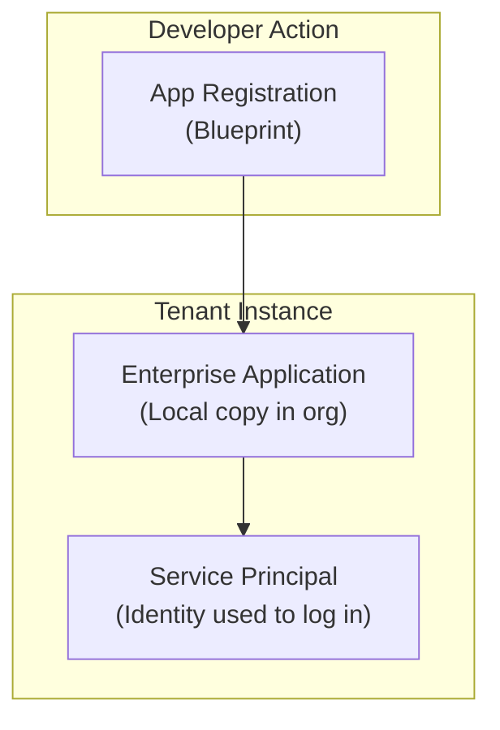

# 🛠️ **Creating & Using App Registration + Enterprise Application in Entra ID**

## 📌 **1. Create an App Registration (Developer Step)**

👉 This is done in **Entra ID → App registrations**.

Steps:

1. Go to **Azure Portal → Microsoft Entra ID → App registrations**
2. Click **New registration**
3. Fill details:

   - **Name**: `MyWebApp`
   - **Supported account types**:

     - Single tenant (only your org)
     - Multi-tenant (other orgs too)

   - **Redirect URI** (if it’s a web/app) → e.g., `https://localhost:5001/signin-oidc`

4. Click **Register** ✅

🔑 At this point:

- Entra creates an **Application Object** (blueprint).
- You get:

  - **Client ID** (App ID)
  - **Tenant ID**
  - **Directory permissions** (like Graph API scopes).

---

## 📌 **2. Enterprise Application (Admin Step)**

- When you create an **App Registration**, Entra automatically makes an **Enterprise Application** in the same tenant.
- You’ll see it in **Entra ID → Enterprise Applications**.

👉 Enterprise Application = **local instance** of the app in your org.

Here you can:

- Assign **users/groups** who can sign in.
- Apply **Conditional Access** policies (MFA, block risky logins).
- Control **who sees this app in MyApps portal**.

💡 If you connect a **third-party SaaS** (e.g., Salesforce, ServiceNow) → you don’t create an App Registration. Instead, the SaaS vendor provides it → your tenant only gets an **Enterprise Application**.

---

## 📌 **3. Service Principal (Behind the Scenes)**

When the Enterprise Application is created → Entra also creates a **Service Principal**.

- This is the **identity record** used by the app to authenticate.
- If your app needs to call Azure APIs (like Key Vault, Storage, Graph), you’ll generate:

  - A **Client Secret** (like a password)
  - Or a **Certificate** (safer 🔐)

---

## 📌 **4. Usage Scenarios**

### 🔹 **Scenario A: Custom App**

- You build an **Angular + .NET API app**.
- Register it in **App registrations**.
- Enterprise App auto-created → assign your employees.
- App uses **Client ID + Secret** to authenticate against Entra ID.
- Users log in → Entra issues JWT tokens.

---

### 🔹 **Scenario B: Automation (Pipeline, Terraform, CLI)**

- You create an **App Registration** named `AzurePipelineSP`.
- Enterprise App + Service Principal auto-created.
- Give it RBAC role (e.g., Contributor) on subscription.
- In your pipeline, use **Client ID + Secret** to authenticate → deploy resources.

---

### 🔹 **Scenario C: SaaS Integration (Salesforce)**

- Add Salesforce from **Enterprise Applications Gallery**.
- Only an **Enterprise Application** shows up (no custom App Registration).
- Assign users/groups to it.
- They now log in with their Microsoft Entra ID SSO.

---

## 📌 **5. Visual Flow**

---

## 📌 **6. Quick Checklist**

- ✅ **App Registration** → for developers (blueprint: Client ID, Redirect URI, Permissions).
- ✅ **Enterprise Application** → for admins (assign users, apply policies, monitor usage).
- ✅ **Service Principal** → the actual robot identity behind the app, used for auth.
- ✅ **Usage**:

  - Custom app → Register app
  - Automation → Create SP via registration
  - SaaS → Add from Enterprise Apps gallery

---

## 🏁 **TL;DR**

- **Create App Registration** → defines app globally (Client ID, permissions).
- **Enterprise Application auto-created** → local copy in your tenant for assigning users/policies.
- **Service Principal** → identity behind the Enterprise App used for authentication.
- **Usage depends**:

  - Build apps → register
  - Pipelines/scripts → use SP creds
  - SaaS apps → only Enterprise App needed
