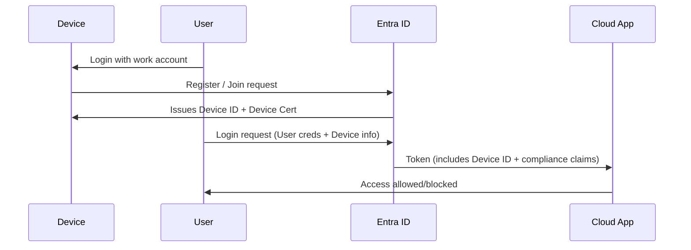

# 💻 **Device Identity in Microsoft Entra ID (Azure AD)**

## 📌 **1. What is Device Identity?**

A **Device Identity** = the **record of a computer/phone/tablet** in Microsoft Entra ID.

- Just like a **user identity** (Alice 👩) or **service principal identity** (Robot 🤖), a **device identity** represents a **machine**.
- Once registered, that device can be **authenticated** and **evaluated in Conditional Access policies**.

👉 It’s how Azure knows: _“Is this laptop corporate-owned and compliant, or is it a random unmanaged PC?”_

---

## 📌 **2. Why Do We Need It?**

Without device identities:

- Any machine can try to log in with valid credentials.
- Risky: stolen passwords could be used from an unknown device.

With device identities:

- Policies like **Conditional Access** can block access if the machine is **unmanaged or non-compliant**.
- Ensures sensitive apps (Outlook, Teams, SAP) are only accessed on trusted devices.

💡 Example:

- Alice’s corporate laptop (domain joined, compliant ✅) → access allowed.
- Alice’s home PC (not joined ❌) → blocked or forced to MFA.

---

## 📌 **3. Types of Device Identity in Azure**

### 🔹 **Azure AD Registered** (Bring Your Own Device – BYOD)

- Personal device (Windows, macOS, iOS, Android).
- Only registered in Entra (not joined).
- User logs in with work account → device gets identity.
- Limited control (can be used for SSO, but not full management).

👉 Example: Alice registers her iPhone in company portal app.

---

### 🔹 **Azure AD Joined** (Corporate-owned)

- Windows device is **directly joined to Entra ID**.
- No on-prem AD involved.
- Device is fully owned & managed by the org.
- Strongest integration → SSO, Conditional Access, Intune compliance.

👉 Example: New company laptop shipped to Alice → she signs in with Entra ID creds at setup → device is Azure AD joined.

---

### 🔹 **Hybrid Azure AD Joined** (On-prem + Cloud)

- Device is joined to **on-premises Active Directory** **AND** registered in Entra ID.
- Needed when orgs still have **on-prem AD + GPO** but also want cloud features.
- Requires **Azure AD Connect** to sync.

👉 Example: Company still runs AD DS + GPO. Laptops domain-joined → Entra sees them as hybrid devices.

---

### 🔹 **Intune Enrolled** (MDM/MAM)

- Device identity is enriched with **management & compliance policies** from Intune.
- Entra can check “Is device compliant?” in real time before granting access.

---

## 📌 **4. How It’s Created**

- When device is **joined or registered**, Entra creates a **device object** in the directory.
- Each device has:

  - **Object ID**
  - **Device ID (GUID)**
  - Owner (user who registered it)
  - Trust type (Registered / Joined / Hybrid)

Azure Portal:
**Entra ID → Devices → All devices** → list of registered/joined devices.

---

## 📌 **5. Authentication Flow with Device Identity**

---

## 📌 **6. Where It’s Used**

- **Conditional Access Policies**

  - Example: Require compliant device for accessing Outlook.

- **Intune Policies**

  - Enforce disk encryption, patching, antivirus.

- **SSO & Seamless Sign-in**

  - On Azure AD joined devices → users get seamless SSO into SaaS/M365 apps.

- **Risk & Monitoring**

  - See all devices tied to a user.
  - Disable/unregister suspicious devices.

---

## 📌 **7. Best Practices**

- ✅ Prefer **Azure AD Joined** for new, cloud-first orgs.
- ✅ Use **Hybrid AAD Join** if you still rely on on-prem AD + GPO.
- ✅ Require **Intune enrollment** + compliance check for Conditional Access.
- ✅ Periodically review **stale devices** in Entra (cleanup).
- ✅ Block legacy logins from unknown devices.

---

## 📌 **8. Example Real-life Flow**

Alice logs into Teams:

1. Teams app asks Entra for a token.
2. Entra sees Alice is on a **registered device**.
3. Conditional Access policy:

   - If _registered_ + _compliant_ → allow.
   - Else → block or require MFA.

---

## 🏁 **TL;DR**

- **Device Identity = identity object for machines** in Entra.
- Types:

  - Registered (personal BYOD)
  - Joined (cloud corp)
  - Hybrid (on-prem + cloud)
  - Intune enrolled (with compliance)

- Created automatically when device joins/registers.
- Used in **Conditional Access, Intune, SSO, compliance**.
- Portal path: _Entra ID → Devices_.
