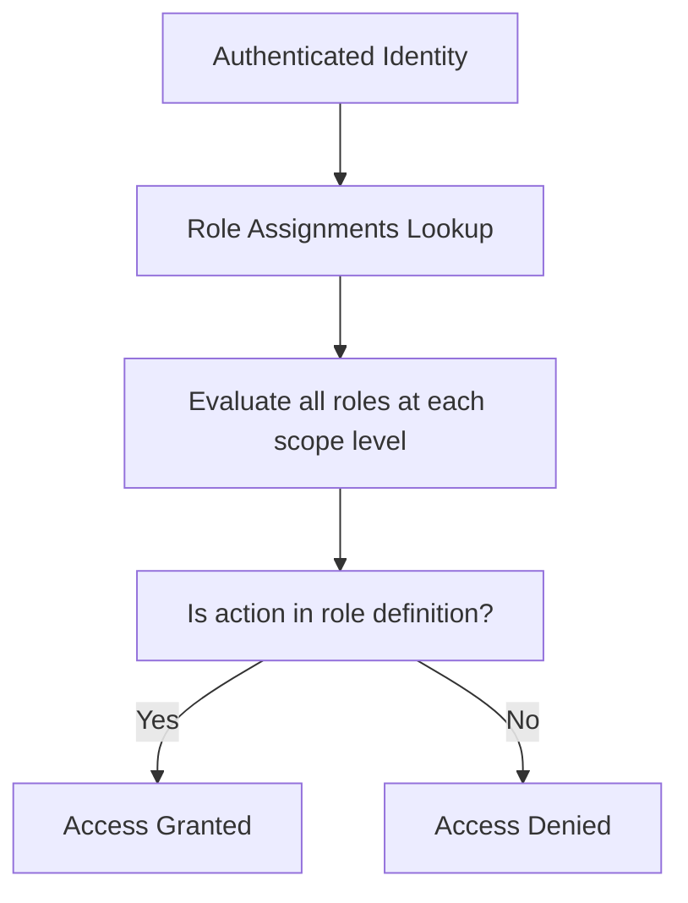

# 🔐 Azure RBAC

## 🧠 First — What Does "RBAC" Mean in Azure?

**RBAC = Role-Based Access Control**
In Azure, RBAC is how you grant access to **resources** — by assigning **roles** to **identities** at a specific **scope**.

But… 🤯 **Azure has two different RBAC systems**:

| RBAC Type                | Purpose                                    | Applies To                        |
| ------------------------ | ------------------------------------------ | --------------------------------- |
| **Microsoft Entra RBAC** | Control access to the **directory/tenant** | Entra ID users, roles, admin UX   |
| **Azure RBAC**           | Control access to **Azure resources**      | Subscriptions, VMs, Storage, etc. |

We’ll break down both, then connect the dots.

---

## 🎯 Azure RBAC Core Concept (applies to all resources)

> **Access = (Identity + Role + Scope)**

Every RBAC assignment in Azure is built from:

```ini
Role Assignment = Security Principal + Role Definition + Scope
```

| Term                   | Means...                     | Example                                |
| ---------------------- | ---------------------------- | -------------------------------------- |
| **Security Principal** | Who? (User, Group, SPN, MSI) | `john@company.com`                     |
| **Role Definition**    | What can they do?            | `Reader`, `Contributor`, `Custom Role` |
| **Scope**              | Where? Which resource(s)?    | Subscription, Resource Group, VM       |

### 💡 Important: There is no JSON policy like AWS

No explicit `Allow`/`Deny` statements — just assign a **role** at a **scope**.

---

## ⚙️ Azure RBAC Role Types

| Role Type    | Description                                                       |
| ------------ | ----------------------------------------------------------------- |
| **Built-in** | Predefined roles by Microsoft (e.g., Reader, Contributor)         |
| **Custom**   | Your own role with specific permissions                           |
| **Classic**  | Legacy roles from Azure Service Management (ignore unless needed) |

You assign roles using the Azure Portal, CLI, PowerShell, or ARM templates.

---

## 🧭 Azure RBAC Scope Hierarchy

Azure RBAC is **scope-aware**. Assigning a role at a higher level includes everything below:

```ini
Management Group
   └── Subscription
        └── Resource Group
             └── Resource
```

🧠 So if you assign `Reader` to a user at the **Subscription** level, they inherit it for all Resource Groups and resources underneath.

---

## 🧪 Example: John Gets Read-Only Access to a Resource Group

```yaml
- Identity: john@company.com
- Role: Reader
- Scope: /subscriptions/abc-123/resourceGroups/SalesRG
```

Now John can:

- View resources in SalesRG
- BUT NOT modify, delete, or create anything

---

## 🔥 Built-in Azure Roles (Most Common)

| Role                         | Description                                |
| ---------------------------- | ------------------------------------------ |
| **Owner**                    | Full access + manage access (like admin)   |
| **Contributor**              | Full access except managing IAM            |
| **Reader**                   | View only                                  |
| **User Access Admin**        | Can assign roles, but not modify resources |
| **Storage Blob Data Reader** | Read access to blobs in Storage Accounts   |

👉 Think of these like AWS `AdministratorAccess`, `ReadOnlyAccess`, etc.

---

## 🧱 What Is a Custom Role?

You can create your own role to allow exactly what you want:

```json
{
  "Name": "VirtualMachineStartOnly",
  "Actions": ["Microsoft.Compute/virtualMachines/start/action"],
  "NotActions": [],
  "AssignableScopes": ["/subscriptions/abc-123"]
}
```

💡 Custom roles in Azure RBAC are like fine-grained IAM JSON policies — **but limited to "Actions", not Conditions**.

---

## 🔄 Role Evaluation Logic

When a user or app makes a request:

<div align="center">



</div>

---

🧠 No inline "Deny" like AWS. The system is **deny-by-default** unless a role allows it.

---

## 🤔 What About Entra ID (Azure AD) Roles?

Entra RBAC is **separate** from Azure RBAC.

| Entra ID Role               | Used For...                     |
| --------------------------- | ------------------------------- |
| **Global Administrator**    | Full admin over Microsoft Entra |
| **User Administrator**      | Manage users, groups            |
| **Groups Administrator**    | Create and manage Entra groups  |
| **Cloud App Administrator** | Manage enterprise app access    |

These roles affect **identity plane**, not Azure resources.

For example:

- Global Admin can reset passwords, create tenants
- But can't delete a VM unless they also have Azure RBAC access

---

## 🔁 RBAC vs RBAC

| Feature      | Azure RBAC               | Entra ID (Directory) RBAC              |
| ------------ | ------------------------ | -------------------------------------- |
| Governs...   | Azure resources          | Tenant-wide settings and identity data |
| Example Role | `Reader`, `Contributor`  | `Global Administrator`, `User Admin`   |
| Scope        | Sub, RG, Resource        | Entire Tenant                          |
| Assigned To  | Users, Groups, SPNs, MSI | Users, Groups                          |

---

## 🔐 Bonus: Application RBAC (App Roles)

- App developers can **define custom roles** in their application (via manifest)
- Assigned to users/groups through **Enterprise Applications**
- Token contains claim like: `"roles": ["Admin"]`

> 🔥 This is not Azure RBAC — this is **RBAC inside the app**.

---

## ✅ Summary (TL;DR for IAM Pros)

- Azure **doesn't use JSON policies** like AWS
- Azure **RBAC = Role Definition + Principal + Scope**
- **Scopes** are hierarchical and applied downward
- Roles are assigned to **Users, Groups, SPNs, MSIs**
- Azure also has **Entra RBAC**, which governs the directory plane
- There is **no inline Deny** — it’s always **deny-by-default**
- You can **create custom roles** with specific "Actions"
- App Roles = application-level RBAC logic for SaaS
