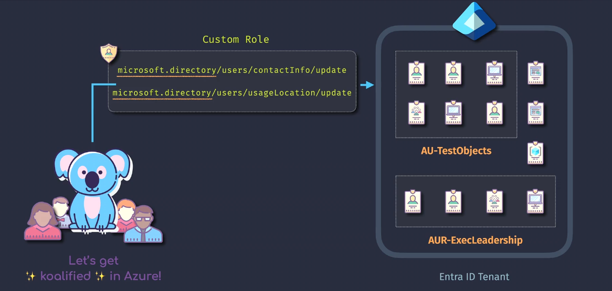

# 🧰 Microsoft Entra ID Custom Role – JSON Anatomy

> Entra ID custom roles are used to **control access to Entra ID directory features** like users, groups, devices, apps, etc., **not Azure resources like VMs or Storage** (that’s Azure RBAC).

---

<div align="center">
  
</div>

---

> 📒 Note: Entra ID Custom Roles require Entra ID P1 licensing at least.  
> 💡 Note: Using Powershell or MS Graph API provides more control over the role definition.

---

## 🧬 Full JSON Skeleton

```json
{
  "description": "Manage only security groups and read user info",
  "displayName": "Group Manager (Custom)",
  "isEnabled": true,
  "rolePermissions": [
    {
      "allowedResourceActions": ["microsoft.directory/groups.readWrite.all", "microsoft.directory/users.read.all"],
      "condition": null,
      "excludedResourceActions": []
    }
  ],
  "scope": "/"
}
```

---

## 🧱 JSON Components Explained

| Property                    | Type      | Description                                                                |
| --------------------------- | --------- | -------------------------------------------------------------------------- |
| `displayName`               | `string`  | The human-readable name of your role                                       |
| `description`               | `string`  | A summary of what this role allows                                         |
| `isEnabled`                 | `boolean` | Whether the role is enabled (true/false)                                   |
| `scope`                     | `string`  | Scope where the role applies — `/` = full tenant, or a specific Admin Unit |
| `rolePermissions`           | `array`   | List of permission sets (like AWS policy statements)                       |
| ┗ `allowedResourceActions`  | `array`   | Graph API permissions you want to allow (required)                         |
| ┗ `excludedResourceActions` | `array`   | Optional — Graph permissions to explicitly **deny**                        |
| ┗ `condition`               | `object`  | Reserved for future — leave null                                           |

---

## 🧪 Example 1: User Viewer Role (Read-only Access to Users)

```json
{
  "displayName": "User Viewer",
  "description": "Can view all user profiles",
  "isEnabled": true,
  "scope": "/",
  "rolePermissions": [
    {
      "allowedResourceActions": ["microsoft.directory/users.read.all"],
      "excludedResourceActions": [],
      "condition": null
    }
  ]
}
```

👀 **Use Case:** Assign this to HR or auditors who need to **view user data**, but not modify it.

---

## 🧪 Example 2: Password Reset Operator

```json
{
  "displayName": "Password Reset Operator",
  "description": "Can reset passwords for non-admin users",
  "isEnabled": true,
  "scope": "/",
  "rolePermissions": [
    {
      "allowedResourceActions": ["microsoft.directory/users/authenticationMethods/update"],
      "excludedResourceActions": [],
      "condition": null
    }
  ]
}
```

🔑 **Use Case:** Helpdesk team with ability to reset passwords but **not full user edit rights**.

---

## 🧪 Example 3: Group Admin + App Reader Combo Role

```json
{
  "displayName": "Group Manager with App Read Access",
  "description": "Can manage groups and view application details",
  "isEnabled": true,
  "scope": "/",
  "rolePermissions": [
    {
      "allowedResourceActions": ["microsoft.directory/groups/*", "microsoft.directory/applications/basic/read"],
      "excludedResourceActions": [],
      "condition": null
    }
  ]
}
```

👥 **Use Case:** Assign to someone managing Microsoft 365 or Entra security groups and needs to **view app registrations**.

---

## ⚠️ Important: Scope = `/` vs Admin Unit

| Scope Value                 | Meaning                            |
| --------------------------- | ---------------------------------- |
| `/`                         | Applies to **entire Entra tenant** |
| `/administrativeUnits/{id}` | Applies only to that specific unit |

🔐 Administrative Units are like **Active Directory OUs** — you can limit visibility of a custom role to a single department like `Sales` or `Engineering`.

---

## 🚫 What You _Can't_ Do (Differences from Azure RBAC)

| Feature                   | Azure RBAC (Yes) | Entra ID Custom Role (No)           |
| ------------------------- | ---------------- | ----------------------------------- |
| Use wildcards like `*`    | ✅ Yes           | ❌ No (must list each permission)   |
| Target resource groups    | ✅ Yes           | ❌ No (Entra doesn’t use RGs)       |
| Allow/deny network access | ✅ Yes           | ❌ Not applicable                   |
| Define complex conditions | ✅ (in preview)  | ❌ Only `condition: null` supported |
| Custom DataActions        | ✅ Yes           | ❌ No DataActions in Entra          |

---

## 🧠 Where to Find All Permissions?

You can use:

- [Microsoft Graph Permission Reference](https://learn.microsoft.com/en-us/graph/permissions-reference)
- Search for: `Directory.Read.All`, `Group.ReadWrite.All`, `Application.Read.All`, etc.

These Graph permissions are what you'll use in `allowedResourceActions`.

---

## 🧪 Bonus Example 4: Audit Role (Read Logs + View Users)

```json
{
  "displayName": "Audit Inspector",
  "description": "View sign-ins, logs, and users",
  "isEnabled": true,
  "scope": "/",
  "rolePermissions": [
    {
      "allowedResourceActions": [
        "microsoft.directory/signIns.read.all",
        "microsoft.directory/auditLogs.read.all",
        "microsoft.directory/users.read.all"
      ],
      "excludedResourceActions": [],
      "condition": null
    }
  ]
}
```

🧾 Useful for compliance or security audit teams needing **read-only** visibility into logs and users.

---

## 📦 Wrap-Up Summary

| Component                 | Description                                           |
| ------------------------- | ----------------------------------------------------- |
| `allowedResourceActions`  | List of Graph API permissions (must be exact)         |
| `excludedResourceActions` | Optional deny list (very rare in practice)            |
| `scope`                   | Entire tenant `/` or limited via Administrative Units |
| `displayName`             | Friendly name shown in the portal                     |
| `condition`               | Reserved (always set to null)                         |
