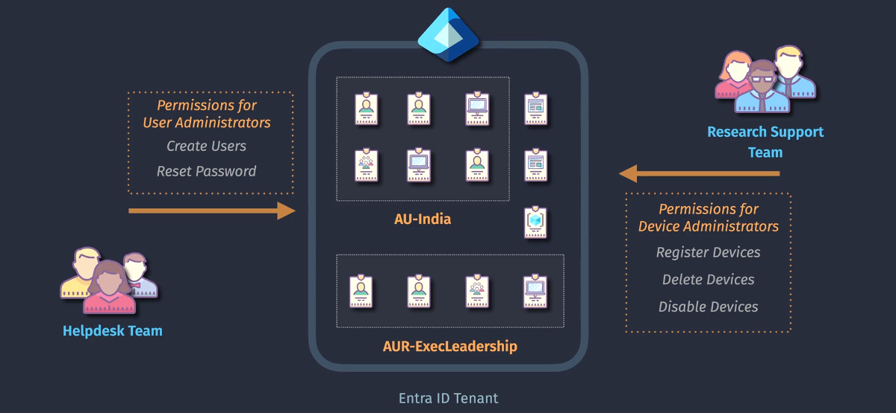

# 🧑‍✈️ Microsoft Entra ID RBAC

> **📖 Microsoft Entra ID RBAC** is the Role-Based Access Control system used to manage **access to identity-related resources** inside your **Microsoft Entra tenant** (formerly Azure AD).

💡 Think of this as **IAM for identity services** — managing users, groups, roles, apps, and policies, **not VMs or storage accounts**.

| Azure RBAC             | Entra ID RBAC                           |
| ---------------------- | --------------------------------------- |
| Controls **resources** | Controls **directory & identity tasks** |
| Used for VMs, Storage  | Used for Users, Groups, Apps, Policies  |
| Scopes: Subscription+  | Scope: Entire Tenant                    |

---

<div align="center">
  
</div>

---

## 🏢 Scope of Entra RBAC

Unlike Azure RBAC, which works at **multi-level scope** (Sub → RG → Resource), **Entra ID RBAC is flat** — it applies to the **entire tenant**.

You **can’t assign Entra roles per-resource** like Azure RBAC.

---

## 🧩 Key Concepts

| Concept                   | Description                                                                                                                                                        |
| ------------------------- | ------------------------------------------------------------------------------------------------------------------------------------------------------------------ |
| **1️⃣ Role Definition**    | A predefined set of directory-level, can be **built-in** or **custom** roles.                                                                                      |
| **2️⃣ Security Principal** | Supports the following: </br> 1. **User identity**</br> 2. **Security group ( requires P1 license)**</br> 3. **Application Identity**</br> 4. **Managed Identity** |
| **3️⃣ Scope**              | Supports the following: </br> 1. **Tenant/Directory** </br> 2. **Administrative Unit**                                                                             |

> 📌 **Assignment:** Binding between role and principal and can be:

---

## 🎭 Built-in Entra ID Roles (a few important ones)

| Role                        | What It Can Do                                            |
| --------------------------- | --------------------------------------------------------- |
| **Global Administrator**    | Full access to all Entra resources and Microsoft services |
| **User Administrator**      | Manage users and groups (create, delete, reset passwords) |
| **Groups Administrator**    | Create, update, delete groups                             |
| **Cloud App Administrator** | Manage enterprise apps and assign users                   |
| **Security Reader**         | Read-only access to security alerts and policies          |
| **Privileged Role Admin**   | Manage role assignments (PIM and others)                  |

🔐 These roles are not for resource access — they don’t grant access to Azure VMs or Storage.

---

## 🧪 Example: Helpdesk Needs to Reset Passwords

```yaml
- Identity: helpdesk@company.com
- Role: User Administrator
- Scope: Entire Tenant
```

✅ Can reset user passwords  
❌ Cannot delete a VM  
❌ Cannot view billing data unless given Azure RBAC permission

---

## 🧱 How Roles Are Assigned in Entra

### 👨‍💻 Via Microsoft Entra Admin Center:

1. Go to **entra.microsoft.com**
2. Navigate to **Identity > Roles & Administrators**
3. Pick a role (e.g., "User Administrator")
4. Click **+ Add assignment**
5. Choose a **user, group**, or **service principal**

---

### 🧑‍🤝‍🧑 Assign to Groups = Dynamic Delegation

✅ You can assign roles to **groups** so everyone in that group inherits the role  
🔄 Supports **dynamic groups** (e.g., all users in HR)

---

## 💎 Privileged Identity Management (PIM)

PIM allows you to make **Entra RBAC temporary** or **just-in-time**:

- 🔄 Require approval to activate role
- ⏱ Limit duration (e.g., 2 hours)
- 📬 Send alerts on activation
- ✅ Record audit trail

🛡 Great for **least privilege**, **zero standing access**, and **auditing compliance**

---

## 🧠 Entra Role Evaluation Workflow

```mermaid
flowchart TD
    A[User signs in] --> B[Token issued by Entra ID]
    B --> C[Evaluate role assignments]
    C -->|Yes| D[Add role claims to token]
    D --> E[Allow access to Entra feature (e.g. reset password)]
    C -->|No| F[Block access to admin portal]
```

💡 Role **claims are embedded in the token** at sign-in!

---

## 🧩 Service Principals & App Access

You can assign Entra roles to:

- Service Principals (App Registrations)
- Managed Identities (for directory access)

Example: App needs to read Entra users → assign `Directory Reader` to the app.

---

## 🚫 Entra Roles Do Not = Azure Permissions

| Role Name                      | Grants Azure Access? | Grants Tenant Access? | Notes                                 |
| ------------------------------ | -------------------- | --------------------- | ------------------------------------- |
| Global Administrator           | ❌ (Not by default)  | ✅                    | Can manage identity, not VMs          |
| Contributor (Azure RBAC)       | ✅                   | ❌                    | Can manage Azure resources, not users |
| User Access Admin (Azure RBAC) | ✅                   | ❌                    | Can manage Azure RBAC, not Entra      |

🧠 The only way to **manage Azure resources** is through **Azure RBAC**!

---

## 🆚 Entra RBAC vs Application RBAC vs Azure RBAC

| Type           | Scope          | Grants Access To            | Example                  |
| -------------- | -------------- | --------------------------- | ------------------------ |
| **Azure RBAC** | Resource Plane | Azure resources             | VMs, storage, networking |
| **Entra RBAC** | Identity Plane | Directory/identity features | Users, groups, roles     |
| **App RBAC**   | Application    | App-specific roles (custom) | "Admin" inside SaaS app  |

---

## 📌 Summary

- Microsoft Entra ID RBAC governs **identity-level actions**, not Azure resources.
- It’s scoped at the **tenant level**, not per subscription or resource.
- Use **built-in roles** for users, apps, and admins.
- Combine with **PIM** for secure, temporary elevation.
- For Azure resource access, use **Azure RBAC** (totally separate system).
