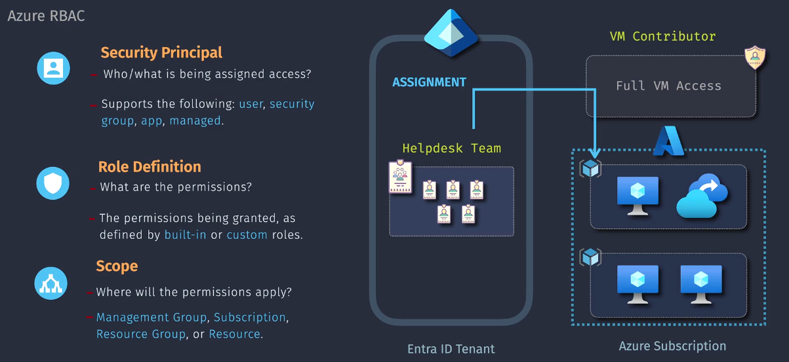
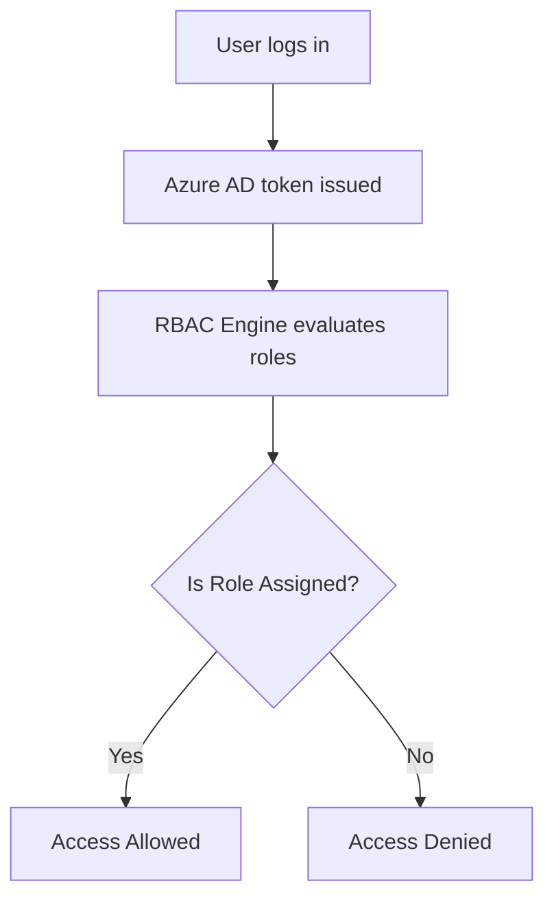

# 📦 Azure RBAC

> **📖 Azure RBAC** is the **authorization system** used to manage **who can access what** in your Azure environment.

It answers:

> “Can this identity do this action on this resource?”

Azure RBAC is based on **three ingredients**:

```plaintext
Access = Role Assignment = (Security Principal + Role + Scope)
```

| Term                      | Means...                                                                                                                                 | Example                       |
| ------------------------- | ---------------------------------------------------------------------------------------------------------------------------------------- | ----------------------------- |
| **1️⃣ Role Definition**               | What actions are allowed?                                                                                                                | `Reader`, `Contributor`, etc. |
| **2️⃣ Security Principal** | Who? </br> 1. `User Identity`</br> 2. `Security Group`</br> 3. `App Identity`</br> 4. `Managed Identity (System-assigned/User-assigned)` | `jane@contoso.com`            |
| **3️⃣ Scope**              | Where? (Hierarchy of Azure resources)                                                                                                    | Subscription → RG → VM        |

> 📌 **Assignment:** Binding between role and principal and can be:

---

<div align="center">
  
</div>

---

## 🧭 The Azure RBAC Scope Hierarchy

Azure RBAC is **scope-aware**. Roles can be applied at:

```text
Management Group
└── Subscription
    └── Resource Group
        └── Resource
```

📌 **The higher the level, the more it inherits**
Assign a role at Subscription = access to all Resource Groups and Resources within.

🧠 Like AWS Organizations + Service Control Policies + IAM, but simplified.

---

## 🧪 Example: Reader Role at Resource Group Level

```yaml
- User: alice@company.com
- Role: Reader
- Scope: /subscriptions/abc-123/resourceGroups/MarketingRG
```

✅ Alice can view all resources in `MarketingRG`
❌ But can't modify, delete, or create resources

---

## 🧱 Types of Azure Roles

| Role Type    | Description                                            |
| ------------ | ------------------------------------------------------ |
| **Built-in** | Provided by Microsoft (over 100 roles!)                |
| **Custom**   | Your own role with custom permissions                  |
| **Classic**  | Obsolete. Used only for ASM (Azure Service Management) |

### 🔥 Most Popular Built-in Roles

| Role                          | What It Can Do                                          |
| ----------------------------- | ------------------------------------------------------- |
| **Owner**                     | Full access + manage access (like admin)                |
| **Contributor**               | Create/update/delete everything, but can't assign roles |
| **Reader**                    | View-only permissions                                   |
| **User Access Administrator** | Can assign roles to other users                         |
| **Storage Blob Data Reader**  | Read access to blob storage                             |

---

## 🧠 How Role Assignment Works

```plaintext
User → assigned Contributor role → at Resource Group level
```

➡️ Azure checks if the user has the right **Action** in the **Role Definition** at that **Scope**.
If yes → ✅ Access
If no → ❌ Denied

---

## 🧪 Real-World Example: Dev App Can Restart VM Only

### Step 1: Define Custom Role

```json
{
  "Name": "VMRestarter",
  "Actions": ["Microsoft.Compute/virtualMachines/start/action", "Microsoft.Compute/virtualMachines/restart/action"],
  "AssignableScopes": ["/subscriptions/abc-123"]
}
```

### Step 2: Assign Role

- Assign `VMRestarter` to DevOps service principal at **RG or VM scope**

🔐 Now your app can **only start/restart VMs**, but not delete them!

---

## ⚙️ Where Roles Are Managed

| Interface        | Used For                        |
| ---------------- | ------------------------------- |
| **Azure Portal** | Clicky-click UI                 |
| **Azure CLI**    | `az role assignment create`     |
| **ARM Template** | Infrastructure-as-Code setups   |
| **Terraform**    | `azurerm_role_assignment` block |
| **REST API**     | Advanced automation             |

---

## 🔁 Azure RBAC Role Evaluation Flow

<div align="center">



</div>

> 💡 Unlike AWS, **Azure does not use inline policies or Deny rules.**  
> Everything is **deny-by-default**, and access is **only granted if role exists**.

---

## ⛔ No Conditions (Yet)

AWS IAM allows granular `Condition` blocks (e.g. IP, time, MFA).
Azure RBAC is simpler:

✅ Only "Actions", "NotActions", "DataActions", "NotDataActions"
❌ No Conditions like `IpAddress` or `StringEquals`

---

## 🔐 Azure RBAC vs Entra RBAC vs App RBAC

| Feature     | Azure RBAC        | Entra ID RBAC (Directory)    | App RBAC (SaaS Roles)         |
| ----------- | ----------------- | ---------------------------- | ----------------------------- |
| Governs...  | Azure resources   | Tenant users, groups, apps   | Roles inside your app         |
| Scope       | Subscription, RG  | Tenant-wide                  | App-defined scope             |
| Examples    | `Reader`, `Owner` | `User Admin`, `Global Admin` | `"roles": ["Admin"]` in token |
| Role Engine | Azure RBAC engine | Entra ID                     | Application code              |

🧠 Azure RBAC ≠ App RBAC ≠ Entra Roles — **totally separate systems!**

---

## 🔐 Bonus: Assigning Role to Managed Identity

```bash
az role assignment create \
  --assignee "<clientId-of-managed-identity>" \
  --role "Storage Blob Data Reader" \
  --scope "/subscriptions/xyz/resourceGroups/rg1/providers/Microsoft.Storage/storageAccounts/mystorage"
```

Now the Azure Function using that Managed Identity can read from Blob Storage.

---

## ✅ TL;DR for IAM Pros

- Azure RBAC uses **Role + Identity + Scope**
- It’s **deny-by-default**, no inline Deny
- You assign roles to **users, groups, service principals, and managed identities**
- There are **built-in**, **custom**, and **classic** roles
- Roles apply at **Management Group → Sub → RG → Resource**
- Custom roles can only filter on **Actions**, not Conditions
- No JSON IAM policy language like AWS — RBAC is simpler but more rigid
