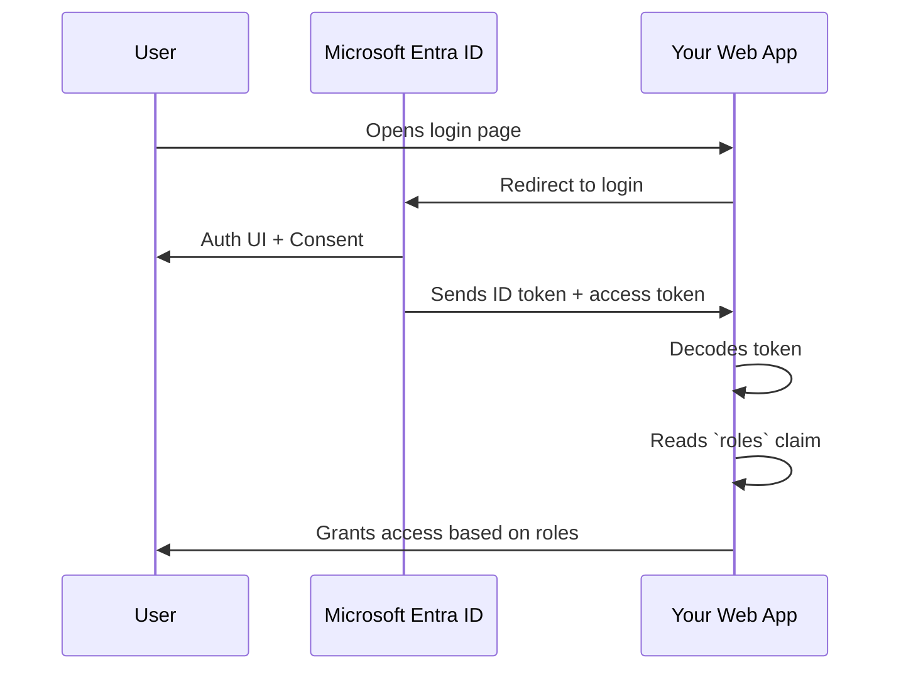

# 🧑‍💻 App RBAC

>📖 This is how your **application controls who can do what** using roles stored in **Entra ID**, and enforced by **your app logic** — not by Azure.

---

## 📦 What Is App RBAC?

App RBAC is a way to **define and manage roles for users inside your application** — using Entra ID as the source of truth.

Instead of:

- Giving users access to Azure resources (like Azure RBAC does),
- You assign users/groups **to app-specific roles** (like `Admin`, `Editor`, `Manager`)

And these roles appear in the **JWT token** issued to the app 👇

```json
{
  "roles": ["Admin", "Reviewer"]
}
```

✅ Your app reads this and shows/hides features accordingly.

---

## 🆚 App RBAC vs Azure RBAC

| Feature       | Azure RBAC                                | App RBAC                                    |
| ------------- | ----------------------------------------- | ------------------------------------------- |
| Used For      | Accessing Azure resources (VMs, SQL, etc) | Controlling app features/views (SaaS-style) |
| Roles Defined | In Azure Portal / ARM                     | In App Manifest or App Registration         |
| Evaluated By  | Azure resource provider engine            | **Your application logic**                  |
| Appears In    | Azure backend checks                      | **User’s JWT token**                        |
| Examples      | `Reader`, `Contributor`, `Storage Admin`  | `Admin`, `CustomerSupport`, `SalesManager`  |

---

## 🛠 How It Works



---

## 🔧 Step-by-Step: Define App RBAC Roles

### ✅ Step 1: Register the App in Entra ID

1. Go to `portal.azure.com`
2. Navigate to **Microsoft Entra ID → App registrations**
3. Click **New registration**
4. Name: `MyWebApp`
5. Platform: Web → Set redirect URI (e.g. `https://localhost:3000/signin-oidc`)
6. Click **Register**

---

### ✅ Step 2: Define App Roles (in Manifest)

Go to your app → Manifest tab → Add roles:

```json
"appRoles": [
  {
    "allowedMemberTypes": [ "User" ],
    "displayName": "Administrator",
    "id": "a1b2c3d4-1234-5678-9999-abcdefabcdef",
    "isEnabled": true,
    "description": "Admins can manage everything.",
    "value": "Admin"
  },
  {
    "allowedMemberTypes": [ "User" ],
    "displayName": "Reviewer",
    "id": "d4c3b2a1-4321-8888-7777-fedcbafedcba",
    "isEnabled": true,
    "description": "Reviewers can only read data.",
    "value": "Reviewer"
  }
]
```

- `value`: appears in token claim
- `id`: must be a **GUID**
- `allowedMemberTypes`: usually `"User"`, or `"Application"` for client credentials flows

---

### ✅ Step 3: Assign Users to App Roles

Go to **Enterprise Applications** → Find `MyWebApp`

- Click **Users and groups**
- Click **+ Add user/group**
- Select user(s)
- Assign role: `Admin`, `Reviewer`

💡 Think of this like a **user pool mapped to role access**.

---

### ✅ Step 4: Configure App to Read Roles

If you're using ASP.NET, Node.js, Python, or any web framework — you decode the token and check the `roles` claim.

#### ✅ Sample Token Payload:

```json
{
  "sub": "123456",
  "name": "Jane Admin",
  "roles": ["Admin"]
}
```

#### ✅ ASP.NET Example

```csharp
[Authorize(Roles = "Admin")]
public IActionResult AdminDashboard()
{
    return View();
}
```

#### ✅ Node.js Example

```js
const jwt = require("jsonwebtoken");
const decoded = jwt.decode(token);

if (decoded.roles.includes("Admin")) {
  // Show admin UI
}
```

---

## 🧪 Use Case Example: SaaS App with Admin Role

### 🎯 Scenario:

- App has 3 roles: `Admin`, `Manager`, `Viewer`
- Admins can access `/admin/dashboard`
- Others get 403

### ✅ Token:

```json
{
  "aud": "api://my-web-app-id",
  "roles": ["Admin"]
}
```

### ✅ Backend check:

```csharp
if (User.IsInRole("Admin")) {
   // Allow access
} else {
   return Forbid();
}
```

---

## 🔐 Where Are App Roles Stored?

- In the **Enterprise App** object (not the App Registration!)
- Roles are evaluated by **your app**, not Azure

---

## 🧠 Final Tips

✅ **App RBAC is for app logic**, not for controlling Azure
✅ **Enterprise Application = role assignments**
✅ Use `[Authorize(Roles = "RoleName")]` or similar in your backend
✅ Use **OIDC flow** to get `roles` in token
✅ You must assign users/groups **in Enterprise App**, or token will not contain `roles`

---

## 🔁 Related Concepts

| Feature                | Azure RBAC                | App RBAC                           |
| ---------------------- | ------------------------- | ---------------------------------- |
| Assigning to users     | Via Access Control (IAM)  | Via Enterprise App → Users & Roles |
| Token-based?           | ❌ No                     | ✅ Yes, role claim in token        |
| Used for               | Accessing Azure resources | Controlling app behavior           |
| Who defines the roles? | Azure                     | Developer (in manifest)            |
