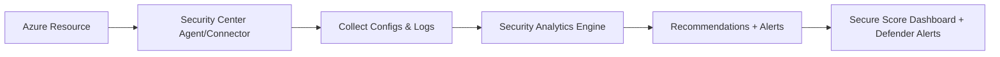

# 🛡️ **Azure Security Center** (Defender for Cloud)

## 📌 **What It Is**

- A **unified security management system** in Azure.
- Gives you **visibility, control, and recommendations** across:

  - Azure resources (VMs, storage, SQL, etc.)
  - Hybrid environments (on-prem + multi-cloud like AWS/GCP)

- **Two key modes**:

  - **Free tier** → Basic security posture (recommendations, Secure Score).
  - **Enhanced (Defender plans)** → Adds threat protection (VMs, SQL, Storage, Kubernetes, etc.).

---

  

---

## 📌 **What It Does**

### 🔎 a. **Posture Management** (Prevention)

- Scans resources → checks against **best practices & benchmarks** (CIS, ISO, NIST).
- Gives you a **Secure Score** (0–100):

  - Higher = more compliant, less risk.
  - Example: VM has no endpoint protection → Security Center recommends “Install Microsoft Defender for Endpoint.”

---

### 🕵️ b. **Threat Protection** (Detection)

- Continuously monitors workloads.
- Detects unusual activity → sends **alerts**.
- Example: A VM in Azure tries to connect to a known malicious IP → Security Center raises an alert.

---

### ⚙️ c. **Regulatory Compliance**

- Maps your Azure environment against standards:

  - ISO 27001, NIST, PCI DSS, GDPR, etc.

- Shows a compliance dashboard → which controls are met, which are failing.

---

### 📊 d. **Integration with DevOps & Multi-Cloud**

- Works with **Azure Policy** to enforce standards.
- Can integrate with **GitHub / Azure DevOps pipelines** to scan IaC templates.
- Extends to **AWS / GCP accounts** via connectors.

---

## 📌 **How It Works** (Simplified Flow)

---

## 📌 **Example in Real Life**

Imagine you have:

- 5 Azure VMs
- 2 SQL Databases
- 1 Storage Account

Security Center might report:

- ❌ 3 VMs don’t have endpoint protection → Recommendation: install anti-malware.
- ❌ SQL Database missing Transparent Data Encryption (TDE) → Recommendation: enable it.
- ⚠️ Storage account has public access enabled → Recommendation: disable.

Your **Secure Score** jumps when you fix these issues.

---

## 📌 **Key Features** for Exams

| Feature                                            | Free Tier | Defender Plan |
| -------------------------------------------------- | --------- | ------------- |
| **Secure Score**                                   | ✅        | ✅            |
| **Recommendations**                                | ✅        | ✅            |
| **Regulatory compliance**                          | ✅        | ✅            |
| **Threat protection (alerts, advanced detection)** | ❌        | ✅            |
| **Multi-cloud protection**                         | ❌        | ✅            |

---

## 📌 **Benefits**

- **Prevention** → Best practices & hardening.
- **Detection** → Threat alerts & anomaly detection.
- **Compliance** → Dashboards for ISO, PCI, etc.
- **Integration** → Works with Defender family (Endpoint, Identity, etc.).

---

## 🏁 **TL;DR**

- Azure Security Center = your **security command center** in Azure.
- Free = posture management + secure score.
- Paid (Defender plans) = adds **threat detection & multi-cloud coverage**.
- It tells you:

  - “How secure are you?” (Secure Score).
  - “What’s wrong?” (Recommendations).
  - “Are you under attack?” (Threat alerts).
