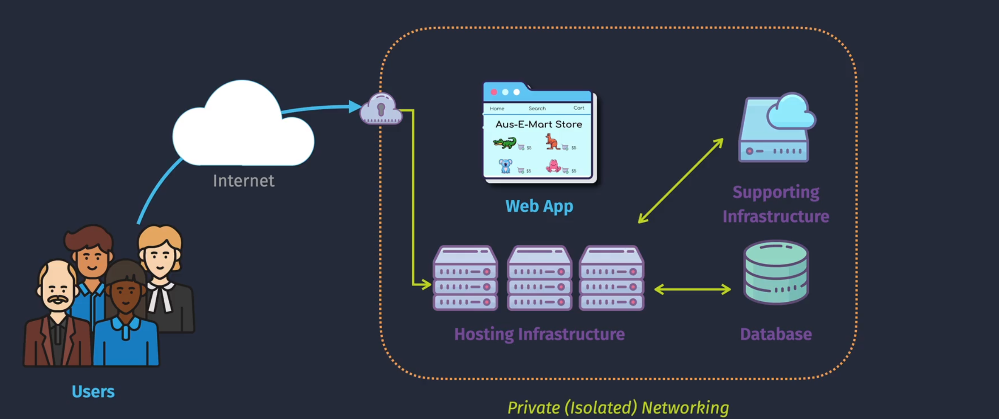
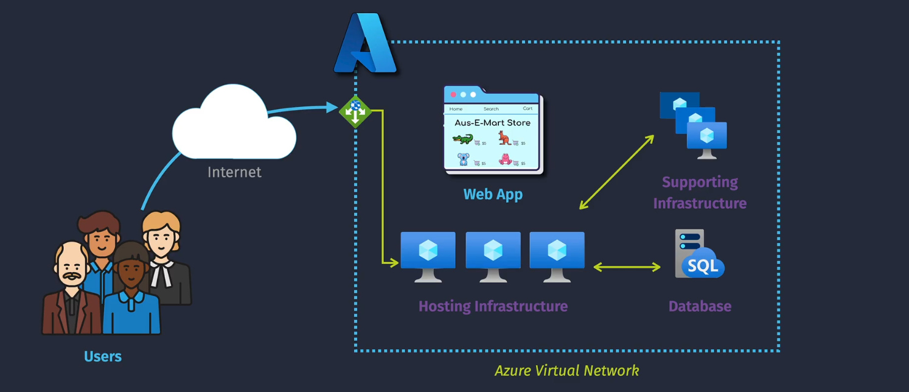
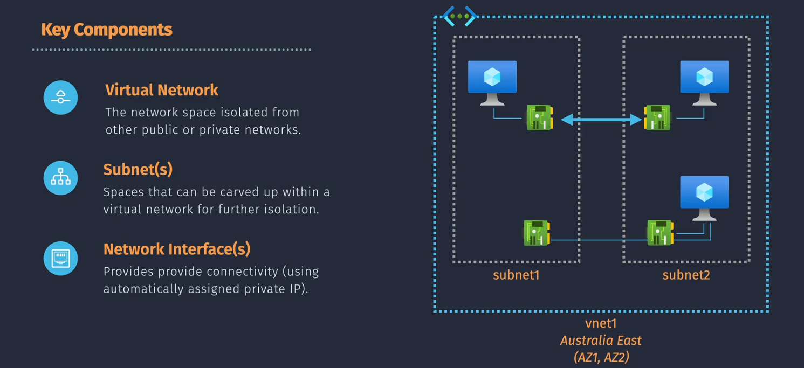
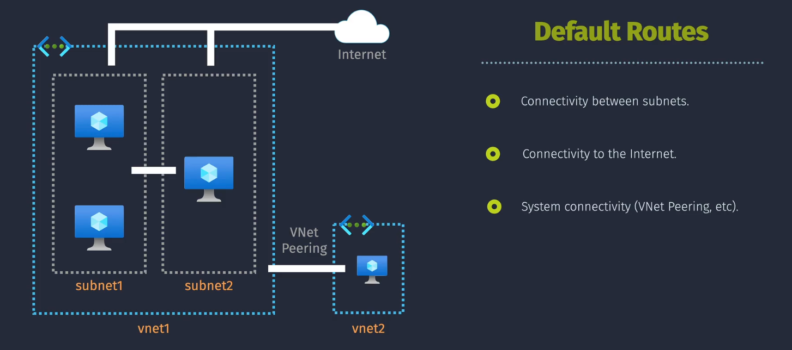

# 🌐 Azure Virtual Network (VNet)

An **Azure Virtual Network (VNet)** is the Azure equivalent of an **AWS VPC**. It provides a **logically isolated network** in the cloud where Azure resources (VMs, containers, databases) can securely communicate with:

- 🧑‍🤝‍🧑 Each other within the VNet
- 🌍 The internet (with Public IP or NAT Gateway)
- 🏢 On-premises networks (via VPN Gateway or ExpressRoute)

It’s your core building block for **routing, segmentation, security, and hybrid connectivity**.

---

<div align="center">
  
</div>

---

## 🧭 Core Components of VNet

<div align="center">
  
</div>

## 1️⃣ Virtual Network (VNet)

- Defines the IP address space (`10.0.0.0/16`)
- Bound to a single Azure region, but spans all **Availability Zones** inside that region
- Multiple subnets live inside one VNet

> 🧠 You can add more than **Address Space** in VNet.

---

## 2️⃣ Subnets

- Subnets divide the VNet into logical segments (e.g., web, app, db)
- Each subnet has:

  - Its own **address prefix**
  - Optionally attached **NSG**, **Route Table**, **NAT Gateway**

- Subnets are **zone-agnostic** by design

> 🧠 **Unlike AWS**, Azure **subnets are not AZ-specific**. You choose the AZ during VM deployment, not during subnet definition.

---

## 3️⃣ Network Interfaces (NICs)

- Every VM is attached to a **NIC**
- The NIC gets:

  - A **private IP** (always)
  - An optional **Public IP**
  - An attached **NSG**

- This is the Azure equivalent of an **ENI** in AWS

---

## 4️⃣ Network Security Groups (NSGs)

An NSG is like a **Security Group**, controlling **inbound/outbound traffic**.

| Feature                | Azure NSG                | AWS SG                        |
| ---------------------- | ------------------------ | ----------------------------- |
| Direction              | Inbound + Outbound rules | Same                          |
| Can attach to subnet?  | ✅ Yes                   | ❌ No (ENI only)              |
| Can attach to NIC?     | ✅ Yes                   | ✅ Yes                        |
| Refer to other groups? | ❌ No                    | ✅ Yes (SG-to-SG referencing) |
| Default behavior       | Deny all unless allowed  | Deny all unless allowed       |

> 🧠 Azure NSGs support **service tags**, **IP ranges**, and **application security groups** (ASGs) for grouping VMs.

---

<div align="center">
  
</div>

---

### 🌐 Subnet ↔ Internet — Inbound vs Outbound in Azure

<div align="center">
  
</div>

---

#### 🔁 Outbound (VM → Internet)

| Case                        | Azure Requirement                      | Behavior                         |
| --------------------------- | -------------------------------------- | -------------------------------- |
| VM needs internet (public)  | **Public IP** assigned to NIC or LB    | Direct internet via system route |
| VM needs internet (private) | **NAT Gateway** on subnet              | Egress through NAT IP            |
| No internet access          | No Public IP, No NAT Gateway, NSG deny | VM fully isolated                |

> 🔎 Azure has **no Internet Gateway (IGW)** concept. Outbound access is granted by the presence of a **Public IP** or a **NAT Gateway** with a system route (`0.0.0.0/0`).

#### 🔄 Inbound (Internet → VM)

| Case                       | Azure Requirement                      | Behavior                        |
| -------------------------- | -------------------------------------- | ------------------------------- |
| Public-facing workload     | **Public IP** on NIC or LB + NSG allow | Inbound traffic routed directly |
| No inbound traffic allowed | No Public IP + NSG denies all          | Fully private                   |

🧠 There is no IGW to “open the subnet.” Traffic hits the **Public IP directly**, then passes through the **NSG**.

---

## 5️⃣ Routing in Azure

| Type          | Component          | Purpose                                       |
| ------------- | ------------------ | --------------------------------------------- |
| Default Route | System Route       | Outbound to Internet / Intra-subnet comms     |
| Custom Route  | User Defined Route | Force tunneling, traffic shaping, NVA routing |
| To On-Prem    | VPN Gateway Route  | Routes to connected on-prem networks          |

You attach **route tables to subnets** (not to VMs/NICs), same as AWS.

---

## 6️⃣ VNet Peering

- Used to connect two VNets **privately**
- Can be **intra-region or global**
- Does not allow **transitive routing** (same as AWS)

```plaintext
VNet A ↔ VNet B ✅
VNet A ↔ VNet B ↔ VNet C ❌ (must explicitly peer A ↔ C)
```

---

## 🔒 Azure Firewall vs NSG

| Feature   | NSG                      | Azure Firewall                   |
| --------- | ------------------------ | -------------------------------- |
| Layer     | Layer 3/4 (IP, TCP, UDP) | Layer 3–7 (App control, FQDNs)   |
| Scope     | Subnet / NIC             | Central (deployed in a subnet)   |
| Logging   | Minimal logs             | Full diagnostics + threat alerts |
| DNAT/SNAT | ❌ Not supported         | ✅ Yes                           |
| Use Case  | Lightweight control      | Enterprise-scale inspection      |

👉 Use NSGs for **perimeter control**, and Azure Firewall for **deep inspection and central management**.

---

## 🧪 DNS in Azure

| Azure DNS Option   | AWS Equivalent         | Description                                         |
| ------------------ | ---------------------- | --------------------------------------------------- |
| Azure-provided DNS | AmazonProvidedDNS      | Built-in resolver: `*.internal.cloudapp.net`        |
| Custom DNS         | DHCP Option Set        | Forward to on-prem DNS / AD                         |
| Private DNS Zones  | Route 53 Private Zones | Custom domains for internal resolution across VNets |

---

## 🔁 Azure VNet vs AWS VPC – Component Mapping

| 🔹 Concept               | 🟦 Azure Name                           | 🟨 AWS Name                            |
| ------------------------ | --------------------------------------- | -------------------------------------- |
| Virtual network boundary | Virtual Network (**VNet**)              | Virtual Private Cloud (**VPC**)        |
| Logical segmentation     | **Subnet**                              | **Subnet**                             |
| Network attachment       | Network Interface (**NIC**)             | Elastic Network Interface (**ENI**)    |
| Security rules           | Network Security Group (**NSG**)        | Security Group (**SG**)                |
| Custom routes            | **User Defined Route** (**UDR**)        | **Route Table**                        |
| Internet access          | **Public IP** / **NAT Gateway**         | **Internet Gateway** / **NAT Gateway** |
| Private service access   | **Private Link** / **Service Endpoint** | **Interface** / **Gateway Endpoint**   |
| DNS resolution           | **Azure DNS** / **Custom DNS**          | **AmazonProvidedDNS** / **Route 53**   |
| Cross-VNet connection    | **VNet Peering**                        | **VPC Peering**                        |

---

## 🧠 Key AWS vs Azure Differences Recap

| Concept                   | Azure                           | AWS                            |
| ------------------------- | ------------------------------- | ------------------------------ |
| Internet Gateway          | ❌ No IGW (not needed)          | ✅ IGW is mandatory            |
| Subnet-AZ mapping         | ❌ Subnets are AZ-agnostic      | ✅ Subnets bound to AZs        |
| Public IP assignment      | Per NIC or Load Balancer        | Elastic IP (EIP) to ENI        |
| NSG attachment            | Subnet or NIC                   | Only ENI                       |
| IGW-style central control | ❌ Not available                | ✅ Route table controls access |
| Built-in DNS              | Azure-provided DNS              | AmazonProvidedDNS              |
| NAT Gateway               | Requires Standard SKU Public IP | Same behavior                  |

---

## ✅ Final Summary

- 🛠 Azure VNet is your **core networking unit** — just like a VPC.
- ❌ **No Internet Gateway** — outbound = Public IP or NAT Gateway only.
- ✅ Subnets are **zone-agnostic**, unlike AWS AZ-bound subnets.
- ✅ NSGs offer **flexible placement** (subnet or NIC), but can’t reference other NSGs.
- 🔒 Use **Azure Firewall** + **NSGs** together for layered security.
- 🧩 Peering, DNS zones, and routing work similarly, but with Azure-native simplicity.
