# 🔥 **Azure Firewall**

## 🛑 **Problem** – Why Azure Firewall Exists

When you deploy workloads in Azure, they often:

- Need **internet access** for updates, APIs, or external services.
- Must be protected from **malicious inbound traffic**.
- Need **controlled outbound traffic** so workloads don’t talk to random IPs or domains.

If you use only **NSGs (Network Security Groups)**:

- They’re **stateful** but rule management is manual and **per subnet/NIC**.
- They don’t have **centralized logging, FQDN filtering, or threat intelligence**.

---

## ✅ **Solution:** Azure Firewall

**Azure Firewall** — a **fully managed, cloud-native, stateful Layer 3–7 firewall** that centralizes and automates network traffic inspection and control.

**Key points:**

- **Layer 3–7** filtering (IP → FQDN).
- Fully managed by Microsoft (built-in high availability, autoscaling).
- Centralized control with **Firewall Policy**.
- Integrated with **Azure Monitor** for logging and analytics.

---

## 🧠 **Firewall Policy** (The Brain)

> In real-world deployments, you don’t manage rules directly on the firewall.Instead, you use **Firewall Policy**  
> a separate Azure resource that holds **all your rules, threat intel settings, and TLS inspection configs**.

**Benefits:**

- **Centralized**: One policy can be attached to multiple firewalls (multi-region, multi-hub).
- **Reusable**: Create **parent/child** policy hierarchies for global vs local rules.
- **Version Control**: Easier to manage, export, and replicate.

**Workflow:**

1. Create Firewall Policy.
2. Add **Rule Collections** (Network, Application, DNAT).
3. Configure advanced settings (**Threat Intelligence**, **TLS inspection**, **IDPS**).
4. Associate policy with Azure Firewall(s).

---

## 🧩 **Azure Firewall Components**

| Component                   | Description                               | Example                                     |
| --------------------------- | ----------------------------------------- | ------------------------------------------- |
| **Azure Firewall Resource** | The “muscle” that filters traffic.        | Firewall in hub VNet.                       |
| **Firewall Policy**         | The “brain” with rules/settings.          | Shared policy for all firewalls in the org. |
| **Public IP**               | Frontend IP for inbound internet traffic. | 52.123.45.67                                |
| **Private IP**              | Internal IP for VNet-to-VNet routing.     | 10.0.1.4                                    |
| **Rule Collections**        | Groups of rules by type.                  | Network, Application, DNAT.                 |
| **Threat Intelligence**     | Blocks known malicious IPs/domains.       | Stops botnet connections.                   |
| **Autoscaling**             | Scales automatically with load.           | Premium/Standard SKUs.                      |

---

## 📜 **Types of Rules** in Firewall Policy

### 1️⃣ Network Rules (Layer 3/4)

- Match **protocol**, **source/destination IP**, **port**.
- For non-HTTP/S traffic (SMB, RDP, SQL).

  ```plaintext
  Rule: Allow-RDP
  Source: 20.30.40.0/24
  Protocol: TCP
  Destination: 10.0.2.4
  Port: 3389
  Action: Allow
  ```

---

### 2️⃣ Application Rules (Layer 7)

- Match **FQDNs/domains** for HTTP/S traffic.
- Example: Allow only Microsoft domains.

  ```plaintext
  Rule: Allow-Microsoft
  Source: 10.0.0.0/16
  Protocol: HTTPS
  FQDNs: *.microsoft.com
  Action: Allow
  ```

---

### 3️⃣ NAT Rules

- Map **public IP\:port → private IP\:port** for inbound access.

  ```plaintext
  Rule: WebServer-DNAT
  Protocol: TCP
  Frontend IP: 52.123.45.67
  Frontend Port: 80
  Backend IP: 10.0.2.4
  Backend Port: 80
  Action: DNAT
  ```

---

## ⚡ **NAT Behavior**

- **SNAT (Source NAT)** – Automatic for outbound internet traffic; backend VMs see firewall’s IP instead of original client IP.
- **DNAT (Destination NAT)** – Configured manually for inbound traffic mapping public to private IP.

---

## 🚀 **Premium SKU Goodies**

| Feature                                 | Standard | Premium |
| --------------------------------------- | -------- | ------- |
| TLS Inspection                          | ❌       | ✅      |
| IDPS (Intrusion Detection & Prevention) | ❌       | ✅      |
| URL Filtering by category               | ❌       | ✅      |
| Web Categories                          | ❌       | ✅      |

**Example – TLS Inspection:** Decrypt/inspect HTTPS by uploading enterprise CA certificate, then re-encrypt before sending to destination.

---

## 🧠 **Threat Intelligence**

- Maintained by Microsoft threat feeds.
- Modes:

  - **Alert** – Logs suspicious connections.
  - **Alert & Deny** – Blocks and logs.

- Blocks known botnets, malware C2 servers, phishing sites.

---

## 📊 **Logging & Analytics**

- Send logs to **Log Analytics**, **Event Hub**, or **Storage Account**.
- Example KQL to find blocked traffic:

```kql
AzureDiagnostics
| where ResourceType == "AZUREFIREWALLS"
| where Action_s == "Deny"
| summarize count() by Fqdn_s, Protocol_s
```

---

## 🖼 **Traffic Flow**

```mermaid
flowchart TD
    A[Internet 🌍] -->|Inbound| B[Azure Firewall 🔥]
    B -->|Rule Check| C{Match?}
    C -->|Allow| D[Backend ✅]
    C -->|Deny| E[Blocked 🚫]

    F[Backend ✅] -->|Outbound| G[Azure Firewall 🔥]
    G -->|Rule Check| H{Match?}
    H -->|Allow| I[Internet 🌍]
    H -->|Deny| J[Blocked 🚫]
```



---

## 🌐 **Common Deployment Patterns**

### Hub-Spoke

```mermaid
graph LR
    Internet --> AF[Firewall in Hub 🔥]
    AF --> Spoke1[Spoke 1: Web]
    AF --> Spoke2[Spoke 2: App]
    Spoke1 --> AF
    Spoke2 --> AF
```



- Centralized outbound/inbound control.
- Cheaper than one firewall per VNet.

### Forced Tunneling from On-Prem

- Route all on-prem internet-bound traffic into Azure Firewall before exiting to internet.

---

## 🪜 **Step-by-Step Deployment**

### 1. **Deploy Azure Firewall**

1. Create **Hub VNet** with `AzureFirewallSubnet`.
2. Create **Public IP** for inbound.
3. Create **Azure Firewall** resource.

### 2. **Create Firewall Policy**

1. Add **Network/Application/DNAT** rule collections.
2. Enable **Threat Intelligence**, **TLS inspection** (Premium).
3. Associate policy with firewall.

### 3. **Route Traffic**

- Create **UDRs** in spoke VNets to send all traffic via firewall’s private IP.

### 4. **Enable Diagnostics**

- Log to **Log Analytics** for monitoring.

---

## ✍🏻 **Example – Restrict VM to Microsoft Update Only**

**Application Rule:**

```plaintext
Rule: Allow-MS-Update
Source: 10.0.1.0/24
Protocol: HTTPS
FQDNs: *.windowsupdate.com, *.microsoft.com
Action: Allow
```

**Network Rule:**

```plaintext
Rule: Block-All
Source: 10.0.1.0/24
Protocol: Any
Destination: Any
Port: Any
Action: Deny
```

**Route Table:**

- Default route → Firewall private IP.

---

## 🔍 **Comparison Table**

| Feature             | Azure Firewall | NSG | App Gateway WAF |
| ------------------- | -------------- | --- | --------------- |
| Layer               | 3–7            | 3/4 | 7               |
| Centralized Mgmt    | ✅ (Policy)    | ❌  | ❌              |
| FQDN Filtering      | ✅             | ❌  | ✅ (HTTP/S)     |
| NAT (SNAT/DNAT)     | ✅             | ❌  | ❌              |
| Threat Intelligence | ✅             | ❌  | ❌              |
| TLS Inspection      | ✅ (Premium)   | ❌  | ❌              |
